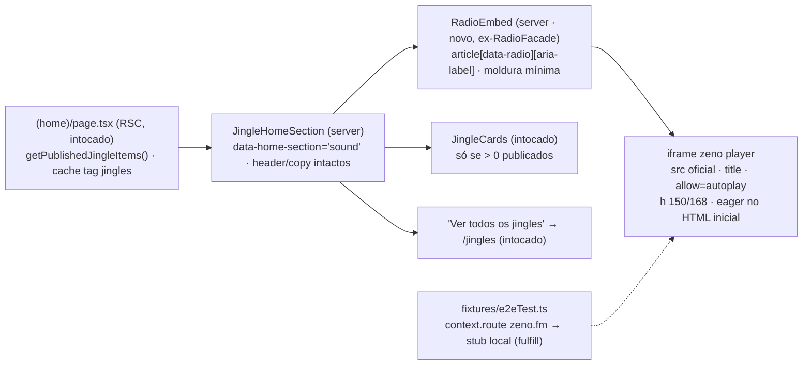

# Impl: Rádio 1313 na home — embed direto (S24)

Status: aprovado (modo `--auto`)
Atualizado em: 2026-09-20
Issue: #1235
Intenção: docs/plans/radio-embed-direto.md
Appetite restante: herdado (~0,5–1 dia eng) — sem corte adicional; a entrega é remoção + porte da moldura, cabe numa sessão.

## Leitura da intenção

- **Outcome:** a seção de som da home passa a mostrar o embed oficial do zeno.fm (`https://zeno.fm/player/jorge-solla-1313/`) já montado e tocável desde o carregamento da página, sem botão nem clique prévio; todo o wrapper/facade do S22 some (arte "Rádio online", eyebrow "Sintonize com a gente", textos, escudo, "Ouvir a rádio", "Abrir no Zeno", estados `loading/loaded` e aviso de terceiro); o header/copy da seção, a grade de jingles, o "Ver todos" e `/jingles` seguem exatamente como estão; kill switch e fail-closed valendo; sem salto vertical perceptível, sem overflow a 390px; o embed nunca toca sozinho com som.
- **O que NÃO negociar:** (1) embed direto carregado no pageview — trade-off aceito e registrado (o widget zeno traz GA `G-2T527NZWVM` + ads em toda home; sem PII nossa); (2) remoção integral da facade, sem linha/aviso/badge de transparência (decisão do gate); (3) variante compact preservada para 0 jingles (comportamento, não o card morto); (4) regra da seção: rádio sempre visível, grade/handoff fail-closed por publicação (kill switch do S21); (5) home estática: única leitura `getPublishedJingleItems()` (cache tag `jingles`), nenhum `payload.find` novo; (6) `/jingles`, `JingleCards`, `JinglePlayer` e `focusRing` intocados; (7) sem Consent/CSP/analytics/player próprio; identifiers em inglês, copy pt-BR inalterada.
- **O que reavaliar (hipóteses do explorador):** (a) o embed direto **não precisa de client component** — não há clique, estado nem `onLoad`; o iframe é server-renderável e monta no HTML inicial, então `'use client'`, `useState`, `useRef`, `useEffect` e o `onLoad` morrem com a facade; (b) o nome `RadioFacade` passa a descrever o que saiu — renomear é barato (D1); (c) `data-radio-state` fica sem máquina de estados — vira contrato morto se mantido (D5); (d) o `page.route` local do `frontendJingles` não basta: com o embed eager, **todo** spec que abre a home dispara zeno (10 specs hoje), então o stub é do fixture (D4); (e) `allow="autoplay"` continua o mínimo correto (playback só após gesto dentro do widget), sem a lista completa do YouTube e sem `autoplay=1`.

## Abordagem recomendada

**Opções consideradas:** A) manter `RadioFacade.tsx` e editar por dentro; B) `git mv` para `RadioEmbed.tsx` reescrito como server component e deletar a facade; C) inline no `JingleHomeSection`.
**Recomendação:** B — a superfície de rádio tem um dono só (o arquivo), o nome deixa de mentir ("facade" sai), o embed ganha um unit test isolado e a seção não incha; como não há interação, o componente é **server** (zero JS de cliente para o embed).
**Rejeitadas:** A porque perpetua um nome que descreve comportamento removido e polui greps futuros; C porque esconde o contrato do iframe (`src`/`title`/altura/eager) dentro da seção e acopla o teste unitário do embed à lógica de jingles.

### Decisões de engenharia

**D1 — Componente do embed (caro: fronteira de módulo + rename)**
Opções: A) editar `RadioFacade.tsx` mantendo o nome; B) `git mv src/components/jingles/RadioFacade.tsx src/components/jingles/RadioEmbed.tsx` + reescrever como server component (moldura + iframe), atualizando o import em `JingleHomeSection.tsx:7,62`; C) inline no `JingleHomeSection`.
Recomendação: B — edita o dono (sem twin), nome fiel, teste isolado próprio, e é o mais barato de reverter: o revert do PR devolve o arquivo antigo (git detecta o rename; nenhum caminho paralelo fica no repo). A facade morre inteira: `RadioArt`, `ExternalLink`, `ShieldIcon`, `FacadePlayButton`, `FacadePanel`, `LoadingPanel`, `LoadedPanel`, `RadioPanel`, `RADIO_PAGE_URL`, `RadioState` e `JINGLE_FOCUS_RING` (o anel continua vivo para `JingleCards`/handoff).
Alternativas rejeitadas: A porque `RadioFacade` sem facade é dívida de nomenclatura imediata; C porque centraliza no arquivo que já tem a regra de jingles e tira do unit o contrato do iframe.
Props mantidas: `{ compact?: boolean }` — a seção continua passando `compact={!hasJingles}` (`JingleHomeSection.tsx:62`); o prop volta a significar só a largura/margem da moldura, sem copy/arte/botões.

**D2 — Altura/CLS (caro: aceite de layout)**
Opções: A) reservar o footprint com o próprio iframe, server-rendered, fixo `h-[150px] md:h-[168px]` sobre `bg-(--campaign-band)`; B) deixar o iframe ditar a altura; C) placeholder separado trocado por client `onLoad`.
Recomendação: A — o iframe existe desde o primeiro paint, então a caixa 150/168 já faz parte do layout inicial; o `bg-(--campaign-band)` mantém a reserva visível enquanto o widget pinta; nenhum placeholder de troca (o `widget-placeholder` do artefato é NEEDS ASSET do protótipo, UI que não embarca).
Alternativas rejeitadas: B porque depende da altura intrínseca do vendor e não pina a reserva (mudança futura da zeno move a página); C porque reintroduz exatamente o estado/loading que a intenção remove — a troca é a origem do salto.

**D3 — `loading` do iframe (caro: aceite explícito do humano)**
Opções: A) eager — sem atributo `loading`, server-rendered no HTML inicial; B) `loading="lazy"`; C) `loading="eager"` explícito.
Recomendação: A — o aceite pede o embed "carregado automaticamente desde o início do carregamento da página"; um iframe server-rendered sem `loading` começa a buscar durante o parse inicial, que é a decisão literal do humano, e a altura reservada garante CLS zero. `allow="autoplay"` permanece (playback após gesto dentro do widget) e **não** se acrescenta `autoplay=1` nem parâmetro algum ao `src` — o embed nunca toca sozinho com som. `title="Player da Rádio Jorge Solla 1313 no zeno.fm"` permanece como rótulo acessível do frame, e o `article` ganha `aria-label="Player da Rádio Jorge Solla 1313"` (contrato do design aprovado).
Alternativas rejeitadas: B porque adiar para perto do viewport contradiz a decisão registrada e atrasa o player justo quando o visitante chega na seção; C porque é o default do browser com ruído.

**D4 — Hermetismo e2e (caro: guard de console + paralelismo)**
Opções: A) stub zeno no fixture `tests/e2e/fixtures/e2eTest.ts` via `context.route('https://zeno.fm/**', fulfill)` junto de `youtube-nocookie`/`facebook.net` (`:105-116`), removendo o `page.route` local de `frontendJingles.e2e.spec.ts:265-267`; B) manter `page.route` por spec e adicionar um em cada spec que abre a home; C) `route.abort()`.
Recomendação: A — com o embed eager, **todo** spec que renderiza a home pública dispara request zeno (10 specs, vários em paralelo, inclusive `campaignHomePixel`/`frontendShareLink`); o fixture é o dono único que torna a suíte hermética e preserva o guard de erro externo com sentido. `fulfill` (nunca `abort`): um frame abortado loga "Failed to load resource" e o guard rejeita console de origem externa (`e2eTest.ts:48-66` — a origem externa nunca é permitida); fulfill do stub `< !doctype html><title>zeno stub</title>` já é o padrão do S22. Com `route.fulfill`, o evento `request` continua disparando, então o spec consegue provar o load eager (requests > 0 **sem clique**). Remover o `page.route` local elimina dois donos do mesmo stub (page route tem precedência sobre context route — duplicar convida drift).
Alternativas rejeitadas: B porque replica o stub em N specs e um esquecimento = GA/ads reais no CI + flake do guard; C porque quebra o guard (achado 10a do explorador).

**D5 — Kill switch / varredura de testes (caro: contrato pinado em 4 arquivos)**
Opções: A) manter `[data-radio]` como hook estável e **remover** `data-radio-state` (não há mais máquina de estados; o e2e pina `[data-radio]` + `iframe` com `src`/`title`); B) manter `data-radio-state="embed"` estático; C) remover os dois data-attrs e localizar por `aria-label`.
Recomendação: A — um atributo de estado estático seria uma mentira semântica que convida drift; `[data-radio]` continua como hook de teste (mesmo papel de `data-home-section`/`data-jingle`) e é ele que sustenta a asserção de kill switch ("com 0 publicados a rádio permanece"). A a11y fica com `aria-label` no `article` + `title` no iframe.
Alternativas rejeitadas: B porque codifica um estado que não existe; C porque não ganha nada sobre o hook e perde o seletor barato de escopo da seção.
Varredura decidida:

- `tests/unit/radioFacade.unit.spec.tsx` → `git mv` para `tests/unit/radioEmbed.unit.spec.tsx` e reescrever: no primeiro render existe 1 iframe com `src` official, `title`, `allow="autoplay"`, **sem** `loading`; não existem "Ouvir a rádio", "Abrir no Zeno" nem as copies da facade; o `article` tem `data-radio` e `aria-label`.
- `tests/unit/jingleHomeSection.unit.spec.tsx:46` — trocar `[data-radio][data-radio-state="facade"]` por `[data-radio]` + `iframe` presente no caso 0 jingles; manter as asserções fail-closed (sem cards, sem "Jingles oficiais", sem "Ver todos").
- `tests/unit/campaignHome.unit.spec.tsx:74` — intocado (só heading; o iframe em jsdom não faz rede).
- `tests/e2e/frontend.e2e.spec.ts:560-604` — reescrever o teste: remover as asserções de facade (estado, botão, link, iframe count 0) e pinar o embed (1 iframe visível, `src`, `title`); manter ordem (`sound` entre `story` e `cards`) e overflow 390.
- `tests/e2e/frontendJingles.e2e.spec.ts:202-207` — kill switch: `[data-radio]` + `iframe` visíveis com 0 publicados; demais contagens seguem.
- `tests/e2e/frontendJingles.e2e.spec.ts:247-303` — reescrever: após `goto('/?e2e=<ts>')`, 1 iframe com `src`, `zenoRequests.length > 0` sem nenhum clique (prova do eager), `audioRequests` segue 0 (`preload="none"` dos cards), 3 cards, sem "Ver todos", overflow 390; remover o fluxo de clique e o `page.route` local.
- Pós-edição: grep de `data-radio-state`, `RadioFacade` e das copies da facade — "Ouvir a rádio", "Abrir no Zeno", "O player do zeno.fm" — deve voltar vazio em `src/`; em `tests/` sobra só `tests/unit/radioEmbed.unit.spec.tsx` (asserções negativas intencionais, o contrato da remoção). Planos históricos não contam.

**D6 — CSS órfão (caro: superfície morta)**
Opções: A) remover só os blocos comprovadamente órfãos e manter `.campaign-sound-title`; B) remover todos os `campaign-radio-*`; C) deixar como está.
Recomendação: A — saem `.campaign-radio-art` (`styles.css:1168-1199`), `.campaign-radio-wave` (`:1201-1216`), `@keyframes campaign-radio-wave-pulse` (`:1218-1223`), `.campaign-radio-spinner` (`:1225-1233`), `@keyframes campaign-radio-spin` (`:1234-1238`) e o bloco `prefers-reduced-motion` (`:1240-1244`, cujos dois seletores são os removidos); o comentário S22 (`:1158-1161`) é reescrito para descrever só o título. `.campaign-sound-title` (`:1162-1166`) **fica** — é usado por `JingleHomeSection.tsx:44` (40/34px).
Alternativas rejeitadas: B porque derruba a escala do título da seção; C porque é CSS de uma superfície removida (knip não vê CSS).

**D7 — Decisões de produto (fechamento das questões em aberto)**
Adotadas as recomendações da intenção, sem reabrir: **compact mantido** (A) — com 0 publicados o embed fica centralizado em `max-w-[880px]`, sem copy/arte/botões internos; **"Abrir no Zeno" some** (A) — o embed tem os próprios links; **sem linha de transparência** (decisão do gate) — widget nu.
`numero-negativo.png`: **fica no `public/campaign-kit/`** — é asset do kit compartilhado de marca (como `jorge-solla-negativo.png` etc.), não é bundle e a limpeza de binários do kit é fora de escopo; fica registrado que o S24 removeu o único consumidor em código.

### Componentes / mudanças

- **`RadioEmbed`** (`src/components/jingles/RadioEmbed.tsx`, renomeado de `RadioFacade.tsx`; server component, sem `'use client'`): `article` com `data-radio` e `aria-label="Player da Rádio Jorge Solla 1313"`; moldura portada classe-a-classe do design aprovado (Cenas 01/02/03) traduzida para os utilitários/tokens do app — `overflow-hidden rounded-[14px] border border-(--campaign-line) bg-white shadow-[0_10px_28px_rgb(71_19_14/7%)] p-3 md:p-4` + `compact ? 'mx-auto mt-8 max-w-[880px]' : 'mt-9'`; dentro, só o iframe `src="https://zeno.fm/player/jorge-solla-1313/"`, `title="Player da Rádio Jorge Solla 1313 no zeno.fm"`, `allow="autoplay"`, sem `loading`, `className="h-[150px] w-full rounded-xl border-0 bg-(--campaign-band) md:h-[168px]"`. Sem placeholder, sem aviso, sem link, sem botão. As classes do protótipo (`player-frame`, `widget-placeholder`) não existem em `styles.css` — não importar; a tradução acima é o port.
- **`JingleHomeSection`** (`src/components/jingles/JingleHomeSection.tsx`): troca o import (`RadioFacade` → `RadioEmbed`) e atualiza o comentário S22→S24 (a seção passa a montar o embed direto; grid/handoff inalterados). Nada mais muda: header/copy condicional por `hasJingles`, `data-home-section="sound"`, `aria-labelledby="sound-title"`, `JingleCards`, "Ver todos" e o `compact={!hasJingles}` continuam idênticos.
- **`src/app/(frontend)/styles.css`**: remoções do D6 + comentário reescrito.
- **`src/app/(frontend)/(home)/page.tsx`**: **intocado** — a leitura cacheada, o `slice(0,3)` e o rodapé não mudam.
- **`tests/e2e/fixtures/e2eTest.ts`**: novo `context.route` do zeno (D4) junto dos stubs existentes, com comentário S24 explicando que o embed é eager e o fulfill evita o guard de console externo.
- **Migration:** nenhuma (item puramente frontend; sem schema, sem `generate:types`).
- **Access / Consent:** N/A — leitura pública, sem formulário, sem PII, sem chave de `Consent`; nenhum write path.
- **UI:** Impeccable B — a estrutura visual é a do design aprovado (`docs/plans/radio-embed-direto-ui-design.html`), portada sem improviso (Cenas 01 compacta desktop 1280, 02 compacta mobile 390, 03 cheia com jingles); classes do protótipo não existem no app e são traduzidas para `border-(--campaign-line)` (12%), `rounded-[14px]`, `shadow-[0_10px_28px_rgb(71_19_14/7%)]`, `p-3 md:p-4`, `h-[150px] md:h-[168px]`; footprint reservado e widget nu.

### Dados → forma (se aplicável)

- **N/A** — a intenção declara "Vou apresentar dados? Não": sem agregação, sem PII, sem pergunta de data-presentation; a superfície é um player de terceiro.

## Fases verificáveis

1. **Fase 1 — RadioEmbed + seção (~1,5 h):** `git mv RadioFacade.tsx RadioEmbed.tsx`; reescrever como server component (D1–D3); atualizar `JingleHomeSection` (import + comentário); `git mv tests/unit/radioFacade.unit.spec.tsx tests/unit/radioEmbed.unit.spec.tsx` e reescrever; ajustar `jingleHomeSection.unit.spec.tsx:46`. Checkpoint: `pnpm test:unit -- radioEmbed jingleHomeSection campaignHome` verde.
2. **Fase 2 — CSS órfão (~0,5 h):** remoções do D6; reescrever o comentário; grep de confirmação (`campaign-radio-art|wave|spinner` = 0 em `src/`). Checkpoint: `pnpm lint` e build local da home com a seção renderizando o iframe.
3. **Fase 3 — e2e hermetismo + reescritas (~1,5 h):** stub zeno no fixture (remover o local do `frontendJingles`); reescrever o teste da seção no `frontend` e os dois testes do `frontendJingles` (D5); varredura greps do D5. Checkpoint: `pnpm test:e2e -- frontend frontendJingles` verde (home com embed, sem clique, kill switch e overflow 390).
4. **Gates (~0,5 h):** `pnpm gate:fast`; registro em `docs/changelog/2026-09-20-s24.md` (uma entrada, incluindo o trade-off GA/ads assumido); push via `pnpm push` (a CI seleciona `frontend` por `src/app/(frontend)` — o CSS — e `frontendJingles` por `src/components/jingles`, ambos já mapeados, sem mudança no manifest; o restante roda no gate:ci).

## Rabbit holes / Não escopo (engenharia)

- Consent/CSP/banner de terceiro, sandbox do iframe, `referrerPolicy` ou lista de `allow` do YouTube: embed oficial nu, decidido no gate.
- Analytics de reprodução, contador de ouvintes, "no ar", player custom/proxy/stream próprio.
- Tocar `JingleCards`/`JinglePlayer`/`JinglePageHeader`/`focusRing.ts`/`/jingles` ou a grade da home: intocados; nenhum rename ali.
- Mexer em `(home)/page.tsx`, criar leitura nova, ou duplicar tag/cache: a seção continua recebendo props.
- Reintroduzir estado/`'use client'` para "melhorar" o embed (fade-in, skeleton, onLoad): a ausência de estado é o ponto.
- Toggle/A-B facade↔embed, feature flag, parâmetro de URL: produto decidiu; não fica caminho latente.
- Aspect-ratio, largura fixa ou `loading="lazy"` para "economizar": contraria o aceite.
- Limpar `numero-negativo.png` do kit, ou redesenhar header/copy da seção.
- Novo spec e2e ou entrada nova no manifest (prefixos atuais cobrem); unit/int novos além dos reescritos.

## Riscos e mitigação

- **Terceiro eager em todo pageview (GA + ads):** risco assumido por decisão do humano; mitigação é não coletar PII (nada muda) e registrar no changelog; não há gate de consent no repo (fora de escopo por decisão).
- **Rede real/guard de console em ~10 specs que abrem a home:** stub zeno no fixture com `fulfill` (D4); um dono só, removendo o `page.route` local; o guard continua pegando erro de console de origem externa em qualquer request não roteado.
- **CLS/"salto":** iframe server-rendered com 150/168 fixos + `bg-(--campaign-band)`; unit pina a ausência de `loading`; e2e mede a altura do box a 390 (150) e desktop (168) — desvio acende o alarme.
- **Overflow horizontal a 390:** iframe `w-full` dentro de moldura `p-3` no container `px-5`; o e2e mantém a asserção de `scrollWidth - clientWidth ≤ 1` nos dois specs.
- **Kill switch perdido na varredura:** `frontendJingles:202-207` reescrito (não removido) segue afirmando rádio visível + 0 cards + 0 "Ver todos"; grep de `data-radio-state` em `src/` = 0 (em `tests/`, só as asserções negativas do `radioEmbed`).
- **Contrato de teste obsoleto esquecido:** a varredura do D5 lista os 6 pontos exatos (3 unit, 3 e2e) + greps; qualquer sobra falha no `gate:fast`/`gate:ci`.
- **Rename com atrito:** manifest é por prefixo (`src/components/jingles` → `frontendJingles`, `:99-108`) e não referencia nome de arquivo; sem entrada nova; knip/ciclos/import map cobertos pelo gate.
- **ISR/cache heurístico:** inalterado; specs navegam `/?e2e=<ts>` como hoje; nenhuma mudança de revalidação.
- **Vendor mudar a altura do widget:** a reserva 150/168 é pinada pelo e2e; se a zeno mudar, o ajuste é consciente (não silencioso). _Débito deferido (triagem S24): o layout-shift real do widget não é medido — gatilho: a zeno mudar a altura do widget ou relato real de salto → medir com `PerformanceObserver` no e2e._

## Aceite de engenharia

- [ ] Aceite de produto da intenção ainda coberto — embed montado no load sem clique (e2e `frontend`/`frontendJingles`: iframe visível + requests zeno > 0 sem gesto); facade removida (greps + unit `radioEmbed`); regra da seção preservada (unit `jingleHomeSection` 0 jingles; e2e kill switch); sem salto (altura fixa + pin do box); 390 sem overflow; `/jingles` intocado (nenhum arquivo seu tocado).
- [ ] Invariantes AGENTS/engineering-standards — home estática via `getPublishedJingleItems()` (tag `jingles`), sem `payload.find` novo; sem PII/Consent; sem schema/migration (`push: false` intocado); sem mudança de URL pública; dono editado (rename), sem twin; identificadores em inglês, copy pt-BR preservada.
- [ ] Testes de domínio previstos (unit/int) onde access/write paths mudam — N/A (nenhum access/write path; a mudança é de apresentação): cobertura unit (`radioEmbed`, `jingleHomeSection`) e e2e (`frontend`, `frontendJingles`) listada no D5; `campaignHome.unit.spec.tsx` segue como está.

## Self-score — decision-quality: 4/5

Todas as seis decisões forçadas têm opções/recomendação/rejeitadas com critério verificável (dono do arquivo, aceite literal do eager, guard de console, semântica dos data-attrs, orfandade comprovada por grep), e o plano fecha as questões de produto herdadas sem reabri-las. Perde 1 ponto por duas incertezas fora do nosso controle: a altura do widget zeno pode variar no futuro (mitigada por pin de e2e, mas não eliminada) e a medição de "sem salto" é estrutural (altura reservada desde o primeiro paint) mais pin de box, não uma medição de CLS real no browser; se o gate humano quiser, um `PerformanceObserver` de layout-shift no e2e cobre, mas isso adiciona superfície que a entrega não pede.
