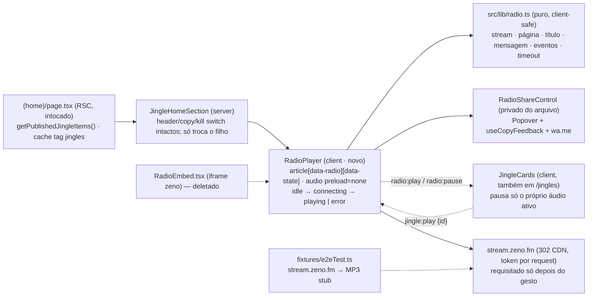

# Impl: Player próprio da Rádio 1313 na home

Status: aprovado (modo `--auto`)
Atualizado em: 2026-09-21
Issue: #1239
Intenção: docs/plans/radio-player-proprio.md
Appetite restante: herdado (~1 dia eng) — sem corte; a entrega é um componente novo + reescrita de contratos de teste, cabe em uma sessão.

## Leitura da intenção

- **Outcome:** o iframe do zeno.fm sai da home e a seção de som passa a mostrar um player próprio `<audio preload="none">` sobre `https://stream.zeno.fm/hys86kx6k16tv`, discreto, com a cara da campanha: título fixo "Rádio Jorge Solla 1313", indicador "Ao vivo", CTA de compartilhar (WhatsApp com a mensagem literal + copiar com feedback), estados `idle/connecting/playing/error` fail-soft (erro → "Tentar novamente" + "Ouvir no Zeno" + compartilhar; nunca spinner infinito) e exclusividade rádio↔jingle na seção. `preload="none"` garante zero request ao stream ou a terceiros antes do gesto de play; kill switch preservado (0 jingles → rádio sozinha compacta; com jingles → grade + "Ver todos" abaixo); `/jingles` e o player dos jingles comportamentalmente intocados além do listener/dispatch de exclusividade; home estática (cache tag `jingles`) intocada; sem migration/schema/Consent/PII; MetaPixel da home intocado.
- **O que NÃO negociar:** (1) player próprio é a **única** superfície de rádio da seção — nenhum iframe, nenhuma marca zeno visível; (2) `preload="none"` e play só por gesto (nada de autoplay com som); (3) um áudio por vez na seção (rádio pausa jingle e vice-versa); (4) mensagem de compartilhamento literal `Ouça a Rádio Jorge Solla 1313 — https://zeno.fm/radio/jorge-solla-1313/`; (5) fail-soft com timeout — spinner nunca infinito; (6) kill switch e variante compact preservados; (7) `/jingles` fica intocado além da exclusividade; (8) sem Consent/CSP/analytics/migration; (9) port classe-a-classe do design gate (o designer é dono da estrutura visual), com a estrela oficial do kit como arte assumida (NEEDS ASSET).
- **O que reavaliar (hipóteses do explorador):** (a) o embed server do S24 morre inteiro — o player é client (estado de mídia, evento, popover); (b) `RadioEmbed.tsx` não é editado, é **deletado** (o iframe era 100% do arquivo) e o spec do iframe morre com ele; (c) a mensagem literal não encaixa em `ContentShareKind` (`article|video|instagram`) — não criar `kind` novo, a mensagem é fixa em `src/lib/radio.ts`; (d) `JingleCards` é compartilhado com `/jingles`, então o listener de `radio:play` tem de ser inócuo fora da home (pausa só o próprio áudio ativo, sem estado global); (e) o repo não tem `onError` de mídia em lugar nenhum — a detecção de erro precisa de promise + evento + timeout manual; (f) o stub `zeno.fm/player/**` do fixture fica morto e o stub novo é do **stream** (`stream.zeno.fm/**`), só requisitado após o gesto.

## Abordagem recomendada

**Opções consideradas:** A) `RadioPlayer.tsx` novo ao lado da seção + `src/lib/radio.ts` puro, deletando `RadioEmbed.tsx`; B) estender `RadioEmbed.tsx` in-place; C) mover para um diretório novo `src/components/radio/`.
**Recomendação:** A — o concern "rádio" ganha um dono só (o arquivo novo), o iframe sai sem deixar código morto para o knip, o contrato puro (URLs/literais/eventos/timeout) fica testável fora do React, e a seção muda uma linha (`<RadioEmbed compact/>` → `<RadioPlayer compact/>`). D2 detalha.
**Rejeitadas:** B porque o arquivo do iframe não tem uma linha aproveitável (o nome "Embed" mentiria e o contrato antigo ficaria ao lado do novo); C porque cria topologia nova para um componente que pertence à seção de jingles já existente (o manifest cobre `src/components/jingles`), sem ganho.

### Componentes / mudanças

- **`src/lib/radio.ts` (novo; puro, client-safe):** dono do contrato da rádio — `RADIO_STREAM_URL = 'https://stream.zeno.fm/hys86kx6k16tv'`, `RADIO_PAGE_URL = 'https://zeno.fm/radio/jorge-solla-1313/'`, `RADIO_TITLE = 'Rádio Jorge Solla 1313'`, `RADIO_SHARE_MESSAGE = 'Ouça a Rádio Jorge Solla 1313 — https://zeno.fm/radio/jorge-solla-1313/'`, `RADIO_CONNECT_TIMEOUT_MS = 12_000`, `buildRadioShareWhatsAppUrl()` (reusa `buildWhatsAppTextShareUrl` de `src/lib/phone.ts`) e as constantes de broadcast `RADIO_PLAY_EVENT='radio:play'`, `RADIO_PAUSE_EVENT='radio:pause'`, `JINGLE_PLAY_EVENT='jingle:play'` + `type AudioExclusivityDetail = { source: 'radio' } | { source: 'jingle'; id: number }`. Nenhum import de React/DOM (testável em unit puro).
- **`src/components/jingles/RadioPlayer.tsx` (novo; `'use client'`):** props `{ compact?: boolean }` (mesmo contrato do `RadioEmbed`, a seção não reaprende nada). Dono do estado (`idle|connecting|playing|error`), do `<audio preload="none" src={RADIO_STREAM_URL}>`, do timeout de conexão, do listener de `jingle:play` e do dispatch de `radio:play`/`radio:pause`; renderiza o port do design (D6) com `data-radio`, `data-state={status}` e `aria-label="Player da Rádio Jorge Solla 1313"`. `RadioShareControl` é um subcomponente **privado do mesmo arquivo** (3 usos internos: ações desktop, linha inferior mobile, linha compact) — nada exportado.
- **`src/components/jingles/JingleCards.tsx`:** adiciona (1) o dispatch de `JINGLE_PLAY_EVENT` com `{ source: 'jingle', id }` no `toggle` ao iniciar um card e (2) um efeito com listener de `RADIO_PLAY_EVENT` que pausa **somente** o próprio áudio ativo (ref do `activeId`, sem estado global) e limpa o `activeId`. Fora da home (em `/jingles`) o listener é inócuo: nenhum `radio:play` acontece na página e o `jingle:play` emitido não tem consumidor — comportamento idêntico ao de hoje. Reusa os refs/mocks já existentes.
- **`src/components/jingles/JingleHomeSection.tsx`:** troca import/uso (`<RadioEmbed compact={!hasJingles}/>` → `<RadioPlayer compact={!hasJingles}/>`) e atualiza o comentário S22→S25. Header/copy condicional por `hasJingles`, `data-home-section="sound"`, `aria-labelledby`, grid, "Ver todos" e `compact` intactos.
- **`src/components/jingles/RadioEmbed.tsx`:** deletado (iframe inteiro sai; sem código morto para o knip).
- **`src/app/(frontend)/styles.css`:** só o comentário de `:1158-1161` (hoje cita RadioEmbed/zeno) passa a descrever o `RadioPlayer`; `.campaign-sound-title`, tokens `--campaign-line/--campaign-band/--pt-red/--pt-yellow/--campaign-muted` e utilitários existentes bastam — nenhuma regra nova.
- **`src/app/(frontend)/(home)/page.tsx`:** intocado (leitura cacheada, `slice(0,3)`, cache tag `jingles`, MetaPixel).
- **Testes:** `tests/unit/radio.unit.spec.ts` + `tests/unit/radioPlayer.unit.spec.tsx` (novos), `tests/unit/radioEmbed.unit.spec.tsx` (deletado), ajustes em `jinglePlayer.unit.spec.tsx`/`jingleHomeSection.unit.spec.tsx`, reescrita dos dois e2e, fixture `tests/e2e/fixtures/e2eTest.ts` e `scripts/lib/e2e-affected-manifest.mjs` (D5).
- **Migration:** sem migration — nada em `src/collections`/`src/globals`; `push: false`; sem `generate:types`/`generate:importmap`.
- **Access / Consent:** n/a — superfície pública read-only, sem PII nova, sem formulário, sem write path, sem chave de `Consent`.
- **UI:** Impeccable C — port classe-a-classe do design gate (`docs/plans/radio-player-proprio-ui-design.html`, Cenas 01–05), traduzido para utilitários/tokens do app (as classes do protótipo `.radio-player/.radio-art/.play-button/.share-button/.live-dot/.spinner` não existem no app); `JINGLE_FOCUS_RING` como anel de foco; nenhuma estrutura visual inventada (D6 registra as combinações não desenhadas e a regra de reuso).

### Dados → forma (se aplicável) — N/A

A intenção declara "Vou apresentar dados? Não": sem agregação, sem PII, sem contador/analytics/"tocando agora". A superfície é um player de áudio e um atalho de compartilhamento.

## Decisões de engenharia

**D1 — Contrato de exclusividade rádio↔jingle (caro: acoplamento entre componentes clientes irmãos + fronteira com `/jingles`)**
**Opções:** A) broadcast em `window` via `CustomEvent` com constantes exportadas (padrão do repo: `SIGNATURE_CREATED_EVENT` em `SignatureCounter.tsx:10,98`; `SPEECH_EXCERPT_REQUEST_EVENT` em `speechExcerptSelection.ts:15`); B) contexto React; C) elevar o estado da rádio/jingles para um client wrapper da seção; D) ref global de módulo.
**Recomendação:** A. `src/lib/radio.ts` exporta `RADIO_PLAY_EVENT`, `RADIO_PAUSE_EVENT`, `JINGLE_PLAY_EVENT` e `AudioExclusivityDetail`. A rádio dispara `radio:play` no clique do play (antes de conectar — o jingle para no gesto, garantindo "um áudio por vez" mesmo se o stream falhar) e `radio:pause` em toda saída de `playing|connecting` (toggle, jingle, erro); escuta `jingle:play` e, se estiver `playing|connecting`, pausa/cancela o timeout e volta a `idle`. `JingleCards` dispara `jingle:play` com `{ source: 'jingle', id }` ao iniciar um card e escuta `radio:play` num efeito com `activeIdRef` (pausa apenas o áudio ativo do próprio componente e limpa o `activeId`); sem estado global, sem storage, sem subscription cruzada. Em `/jingles` o listener nunca recebe `radio:play` (não há rádio na página) e o `jingle:play` emitido não tem consumidor: zero mudança de comportamento. O detail é ignorado pelos listeners (mínimo), mas o `id` fica assertável nos testes.
**Rejeitadas:** B porque `JingleHomeSection` é server e os dois players são clientes irmãos — um provider exigiria um wrapper client novo por cima da seção (toca o kill switch) e moveria a barreira de hidratação; C pela mesma razão mais o custo de trocar o dono do estado de `JingleCards` (afeta `/jingles`); D por colidir entre bundles/SSR (estado compartilhado por request no servidor) e não ter precedente no repo.

**D2 — Onde vive o player (caro: fronteira de módulo + delete)**
**Opções:** A) `src/components/jingles/RadioPlayer.tsx` novo + `src/lib/radio.ts` puro, deletando `RadioEmbed.tsx`; B) editar `RadioEmbed.tsx` in-place; C) mover para `src/components/radio/`.
**Recomendação:** A — dono único do concern "rádio" (como `JinglePlayer` é o da página de jingles, sem colisão de nome), contrato puro testável fora do React, `JingleHomeSection` troca uma linha. `RadioEmbed.tsx` é deletado (não é rename: o iframe era o arquivo inteiro) e `tests/unit/radioEmbed.unit.spec.tsx` é substituído por `radioPlayer.unit.spec.tsx` — sem referência órfã para o knip. `focusRing.ts` continua o dono do anel.
**Rejeitadas:** B porque perpetua um nome que descreve o que saiu e manteria dois contratos no mesmo arquivo (iframe vs. player), sem uma linha aproveitável; C porque duplica a topologia e o manifest (`src/components/jingles` já mapeia `frontendJingles`) sem ganho.

**D3 — Estados e detecção de erro (caro-ish: aceite "nunca spinner infinito")**
**Opções:** A) `idle|connecting|playing|error` com `play()` promise + evento `error` + **timeout de conexão** nomeado; B) só promise/`error`, sem timeout; C) `waiting/stalled` como sinal de erro.
**Recomendação:** A. `play()` resolve → `playing` (junto do evento `playing`, que é o sinal audível); rejeição do `play()` ou evento `error` → `error`; `RADIO_CONNECT_TIMEOUT_MS = 12_000` armado por efeito enquanto `status === 'connecting'` e limpo em qualquer saída (pausa do usuário, `playing`, erro, unmount) — se estourar, `pause()` + `error`. Um token de tentativa (`attemptRef`) invalida promises superseded (pausar durante `connecting` ou pedir retry não pode deixar o estado antigo vencer) — mesma preocupação que `JingleCards.tsx:136-139` resolve com o check de `id`. Retry a partir de `error` chama `audio.load()` e `play()` de novo: como o stream responde 302 com token por request, o retry precisa de uma requisição nova (não dá para reaproveitar a URL/tentativa falha).
**Rejeitadas:** B porque o modo de falha real é a conexão que "aceita" e nunca entrega áudio — sem timeout o spinner fica infinito, violando o aceite; C porque `waiting`/`stalled` disparam em re-buffer normal de stream ao vivo e acenderiam o erro em reprodução saudável. `ended` também é ignorado neste player (rádio é ao vivo; diferente do jingle finito, que usa `onEnded`).

**D4 — Compartilhar (barato: reuso)**
**Opções:** A) popover próprio dentro do `RadioPlayer` (privado `RadioShareControl`) reusando `Popover`, `useCopyFeedback` e `buildWhatsAppTextShareUrl`, com o literal de `radio.ts`; B) reusar `ContentShareButton` inteiro; C) reusar `SpeechExcerptShare` como está.
**Recomendação:** A. `buildRadioShareWhatsAppUrl()` = `buildWhatsAppTextShareUrl(RADIO_SHARE_MESSAGE)` (abre no WhatsApp do próprio remetente, sem destinatário, `target="_blank" rel="noopener noreferrer"`). Conteúdo do popover = Cena 05: título "Compartilhar a rádio", caixa com a mensagem literal, botão WhatsApp (primário) e "Copiar link" com o feedback de `useCopyFeedback` (+ live region `sr-only`), alinhado `align="end"`. **Copiar copia a mensagem literal** (com o link dentro), mantendo o rótulo do gate via `copyFeedbackLabels` — mesmo precedente do `SpeechExcerptShare` (copia a mensagem, rotula "Copiar link"); trigger com `JINGLE_FOCUS_RING` em duas variantes do design: `outline` (Cena 01, ações inline) e `link` (Cena 02, linha inferior). Sem `Sheet` de ponteiro coarse: o gate desenha popover e o precedente `ContentShareButton` usa popover no mobile (Radix portaliza, não é clipado).
**Rejeitadas:** B porque o trigger circular absoluto/labels fixos/posição de canto não servem ao layout do player e o `kind` de `contentShare.ts` (prefixos pinados em `tests/unit/contentShare.unit.spec.ts:27-32`) não modela mensagem literal — criar um `kind` novo mudaria um contrato pinado por nada; C porque as props/shape de fala (`videoId/offsetSeconds/startSeconds/...`) e a mensagem derivada de `speechShare.ts` não têm tradução para a rádio — adaptar seria reescrever o componente, e o gate pede outro conteúdo (título, caixa do literal, dois botões).
**Alternativa avaliada (copiar só a URL):** rejeitada — o literal é o que circula e é o texto exibido na caixa do gate; a paridade com o WhatsApp é o ponto.

**D5 — Testes (caro: contrato pinado em unit + e2e + fixture + manifest)**
**Opções:** A) reescrever os contratos (deletar o spec do iframe, novos specs da lib/player, adaptar os compartilhados, reescrever os dois e2e, trocar o stub do fixture e mapear `src/lib/radio`); B) manter o spec do iframe como histórico e só adicionar novos; C) não tocar a fixture (deixar o stub do player, não stubbear o stream).
**Recomendação:** A, com o contrato novo exatamente assim:

- `tests/unit/radioEmbed.unit.spec.tsx` → **deletado**. `tests/unit/radio.unit.spec.ts` (novo): literais exatos (`RADIO_STREAM_URL`, `RADIO_PAGE_URL`, `RADIO_TITLE`, `RADIO_SHARE_MESSAGE`, `RADIO_CONNECT_TIMEOUT_MS`), `buildRadioShareWhatsAppUrl()` conferido contra `buildWhatsAppTextShareUrl` (oráculo) e nomes das três constantes de evento.
- `tests/unit/radioPlayer.unit.spec.tsx` (novo; mock de `HTMLMediaElement.prototype.play/pause/load` como `jinglePlayer.unit.spec.tsx:38-53` + `vi.mock('next/image')` como `jingleHomeSection.unit.spec.tsx:12-17`): idle (`audio[preload="none"]`, `src` do stream, título, "Ao vivo", rótulos acessíveis de play/share); connecting→playing (evento `playing` e resolução da promise); toggle pausa + `radio:pause`; erro por rejeição do `play()`; erro por timeout com fake timers (avançar 12s sem resolver → "A rádio não conectou" + "Tentar novamente" + link "Ouvir no Zeno" com `RADIO_PAGE_URL` + compartilhar); retry chama `load()`+`play()` e volta a connecting; `jingle:play` pausa a rádio; `aria-pressed`/`aria-busy`/`aria-label` por estado; `data-state`.
- `tests/unit/jinglePlayer.unit.spec.tsx` (adaptar): novos casos "emite `jingle:play` com o id ao tocar" e "`radio:play` pausa o card ativo"; e "sem card ativo, `radio:play` não chama `pause`".
- `tests/unit/jingleHomeSection.unit.spec.tsx` (adaptar): onde hoje lê `[data-radio] iframe` passa a exigir `[data-radio]` com `audio[preload="none"]` e **nenhum** `iframe`; `max-w-[880px]` só no caso 0 jingles; asserções fail-closed ("Jingles oficiais"/"Ver todos"/cards) inalteradas.
- `tests/e2e/fixtures/e2eTest.ts`: **remover** `https://zeno.fm/player/**` (o iframe morreu — request sobrante passa a falhar o guard, virando rede de regressão) e **adicionar** `https://stream.zeno.fm/**` com `route.fulfill({ path: tests/fixtures/jingle-tone.mp3, contentType: 'audio/mpeg' })` (o stream só é requisitado depois do gesto; o stub mantém a suíte hermética e o evento `request` continua disparando para a asserção "só depois do play"; o MP3 curto já existe e é usado pelo upload de jingles); ignorar `ended` no player (D3) mantém o estado "Em reprodução" estável no stub, como num stream ao vivo.
- `tests/e2e/frontend.e2e.spec.ts:560-616` (reescrever; manter ordem `story < sound < cards` e overflow 390): `[data-radio]` visível; `iframe` count **0**; `audio` count 1 com `preload="none"` e `src === RADIO_STREAM_URL`; "Rádio Jorge Solla 1313" e "Ao vivo" visíveis; `zenoRequests` (matcher `zeno.fm`) **0** no load; play pelo nome acessível (`Ouvir Rádio Jorge Solla 1313`) → poll `zenoRequests.length > 0`, `aria-pressed="true"` e "Em reprodução"; a 390 sem overflow; o pin de altura 168/150px **sai** (não há frame reservado) e entra o tamanho do play (56px desktop / 48px no 390).
- `tests/e2e/frontendJingles.e2e.spec.ts:202-207` (kill switch): `[data-radio]` visível, `iframe` 0, `audio` 1 (`preload="none"`), 0 cards, sem "Ver todos" e heading "Sintonize com a Rádio 1313".
- `tests/e2e/frontendJingles.e2e.spec.ts:248-291` (com jingles): 3 cards, `iframe` 0, `zenoRequests === 0` e `audioRequests === 0` antes de gesto; play na rádio → stream request > 0 + "Em reprodução"; play no 1º card → rádio `aria-pressed="false"`/"Pronta para tocar" e card `data-state="playing"`; play na rádio de novo → card `data-state="stopped"` (exclusividade nos dois sentidos); overflow 390.
- `scripts/lib/e2e-affected-manifest.mjs:99-108`: adicionar `src/lib/radio` ao entry do S21 (junto de `src/lib/jingle`), para o diff da lib acordar `frontendJingles`; o CSS comentado já acorda `frontend` via `src/app/(frontend)`.
- Greps de fechamento: `RadioEmbed`, `zeno.fm/player`, `iframe` em `src/components/jingles` e `src/lib` = 0; menções a `data-radio-state` = 0.
  **Rejeitadas:** B porque spec morto de iframe vira ruído e o gate rodaria um contrato inexistente; C porque o stub do player sem consumidor é peso morto e, sem stub do stream, o clique de play no e2e bateria na rede real/CI (guard de console externo quebra) ou ficaria flaky.

**D6 — Composição responsiva do port (barato-ish: fidelidade ao gate sem inventar)** _(decisão extra porque o gate não desenha todas as combinações)_
**Opções:** A) `compact` = Cena 02 em qualquer largura (cartão centralizado em `max-w-[880px]`); `full` = Cena 01 no `md+` e o arranjo de linha da Cena 02 no mobile; B) `compact` = só geometria do S24 e layout por viewport; C) desenhar uma terceira composição para desktop compacto.
**Recomendação:** A — é a leitura que usa só as duas composições aprovadas: a Cena 02 é rotulada "0 jingles" (o estado compacto) e o mobile do `full` herda o arranjo mobile da Cena 02. Mapeamento bloco a bloco:

- **Cena 01 (full, md+):** `article` `overflow-hidden rounded-[14px] border border-(--campaign-line) bg-white shadow-[0_10px_28px_rgb(71_19_14/7%)] mt-9 p-3 md:p-4`; grid `md:grid md:grid-cols-[112px_1fr_auto] md:items-center md:gap-5`; `radio-art` `size-[76px] md:size-28` com disco = `` `absolute inset-[13%] rounded-full border border-black/8 bg-white shadow-[0_7px_18px_rgb(71_19_14/10%)]` + `<Image src="/campaign-kit/radio/radio-jorge-solla-1313-logo.png" ... className="relative z-[1] aspect-square w-[74%] rounded-full object-cover" />` (logo oficial da rádio, C208 — corte circular como o zeno exibe); badge "Ao vivo" `text-[10px] md:rounded-full md:bg-(--pt-red)/8 md:px-3 md:py-1 md:text-[11px]` com live-dot `size-2 ... shadow-[0_0_0_4px_rgb(162_28_28/11%)]`; "Rádio online" `hidden text-xs text-(--campaign-muted) md:inline`; título `font-[family-name:var(--font-exo2)] text-lg leading-tight font-black tracking-[-0.025em] md:text-[28px] md:leading-none`; status `text-sm` (muted idle / `font-bold text-(--pt-red)` com dot em reprodução; spinner em connecting); ações `flex items-center gap-4 pr-2` com share `outline` + play `size-12 md:size-14` (`bg-(--pt-yellow)`, `text-(--pt-yellow-ink)`, `shadow-[0_6px_0_#cfb900,0_10px_22px_rgb(0_0_0/15%)]`, ícone 21/25px, `motion-reduce` como `JingleCards`).
- **Cena 02 (compact):** `mx-auto mt-8 max-w-[880px] p-3`; linha `flex items-center gap-3` (art 76, título `text-lg`, play `size-12` com pause e `aria-pressed`); status `text-xs`; share `link` na linha inferior `mt-3 flex justify-end border-t border-(--campaign-line) pt-2`. No `full` mobile valem os mesmos valores mobile (o share outline inline só aparece em `md+`).
- **Cena 03 (connecting):** mesmo footprint; spinner `size-5 rounded-full border-2 border-(--pt-red)/18 border-t-(--pt-red) animate-spin [animation-duration:0.8s] motion-reduce:animate-none` + "Conectando à rádio…" (`role="status"`); play `opacity-60` `aria-busy="true"` `aria-label="Conectando"`.
- **Cena 04 (error):** branch próprio sem arte/badge — ícone `grid size-10 place-items-center rounded-full bg-(--pt-red)/10 text-(--pt-red)` (lucide `InfoIcon`), título "A rádio não conectou", copy "Tente de novo ou ouça na página da rádio.", ações `flex flex-wrap items-center gap-2`: "Tentar novamente" (`bg-(--pt-red) text-white min-h-11 rounded-lg`), "Ouvir no Zeno" (link sublinhado `RADIO_PAGE_URL`) e share `outline ml-auto`.
- **Cena 05 (popover):** descrito em D4.
  **Rejeitadas:** B porque a Cena 02 difere estruturalmente (flex, tamanhos, share na linha inferior) — tratá-la como pura geometria não portaria o gate; C porque inventa composição que o designer não aprovou.

## Fases verificáveis

1. **Tracer — lib + player + troca (≈3–4 h):** criar `src/lib/radio.ts`; criar `RadioPlayer.tsx` com estados, áudio `preload="none"`, timeout (`RADIO_CONNECT_TIMEOUT_MS`), dispatch/listener de eventos e o port das Cenas 01–05 (D6); trocar o filho em `JingleHomeSection.tsx`; deletar `RadioEmbed.tsx` e `tests/unit/radioEmbed.unit.spec.tsx`; escrever `tests/unit/radio.unit.spec.ts` e `tests/unit/radioPlayer.unit.spec.tsx`; adaptar `tests/unit/jingleHomeSection.unit.spec.tsx`; reescrever o comentário de `styles.css`. Checkpoint: `pnpm test:unit tests/unit/radio.unit.spec.ts tests/unit/radioPlayer.unit.spec.tsx tests/unit/jingleHomeSection.unit.spec.tsx tests/unit/campaignHome.unit.spec.tsx` verde + `pnpm typecheck`; conferência visual no dev server do worktree (1280 e 390) contra as cenas.
2. **Coordenação rádio↔jingle (≈1–2 h):** listener/dispatch em `JingleCards.tsx` (D1) e os dois casos novos em `tests/unit/jinglePlayer.unit.spec.tsx`. Checkpoint: `pnpm test:unit tests/unit/jinglePlayer.unit.spec.tsx tests/unit/radioPlayer.unit.spec.tsx` verde; conferir no dev server que tocar um jingle para a rádio e vice-versa (e que `/jingles` segue igual).
3. **Testes e2e + gates (≈2–3 h):** trocar o stub no fixture (D5), reescrever os dois e2e, adicionar `src/lib/radio` ao manifest, greps de fechamento; rodar `pnpm test:e2e -- frontend frontendJingles` (ou `pnpm test:e2e:affected`, que passa a selecionar os dois specs por `src/components/jingles`/`src/app/(frontend)`/`src/lib/radio`). Fechamento: `pnpm gate:fast`; entrada `docs/changelog/2026-09-21-s25.md` (uma entrada curta, registrando a remoção do embed S24 e o ganho de zero terceiros antes do gesto); push via `pnpm push` (a CI roda o gate:ci; o PR arma auto-merge só com `checks` verde).

## Rabbit holes / Não escopo (engenharia)

- Refatorar `ContentShareButton`/`SpeechExcerptShare`/`copyFeedback`/`contentShare` para "unificar": o dono do compartilhamento da rádio é o `RadioPlayer` (via `radio.ts` + `buildWhatsAppTextShareUrl`); os existentes ficam como estão, o `kind` de `contentShare.ts` não ganha valor novo e as labels pinadas seguem intactas.
- Proxy/stream próprio, CDN, cache de áudio, troca de provedor: o `<audio>` aponta direto para `stream.zeno.fm`; nada de infra de streaming.
- Web Audio/`AnalyserNode`/visualizador: o stream não manda CORS — impossível, fora de escopo.
- "Tocando agora", API do Zeno, polling de metadados, duração/timeline, barra de progresso, volume: rádio ao vivo não promete programação nem duração; nome fixo + "Ao vivo".
- Analytics de reprodução/contador de ouvintes, GA, pixel novo: nenhum dado nosso é coletado; MetaPixel da home intocado.
- Consent/CSP/banner de terceiro: nenhum request de terceiro antes do gesto; nada a consentir.
- Redesenhar a seção de som, header/copy, grade ou `/jingles`; tocar `JingleIntro`/`JinglePageHeader`/`JingleEmptyState`/`JinglePlayer`; mexer em `(home)/page.tsx`, `getPublishedJingleItems` ou na tag `jingles`.
- Abstrair estilos compartilhados (módulo de "play control", wrapper de share genérico): <3 call sites; `RadioPlayer` usa constantes locais + `JINGLE_FOCUS_RING`, como `JingleCards` faz com `PLAY_CONTROL`/`DOWNLOAD_CONTROL`.
- Reintroduzir iframe, fallback embed ou link "abrir o player do Zeno" fora do estado de erro (o link "Ouvir no Zeno" existe **só** no erro, decisão de produto).
- Feature flag/A-B embed↔player, rota nova, query param: produto decidiu; não fica caminho latente.
- Tocar no manifest além de adicionar `src/lib/radio` ao entry do S21; novos specs e2e, novos specs unit além dos listados, ou teste int (não há access/write path).
- Renomear `JinglePlayer`/mover para `src/components/radio/`: churn de topologia e de manifest sem ganho.

## Riscos e mitigação

- **Interceptação do áudio no e2e:** `route.fulfill` de mídia no Chromium do Playwright é o ponto frágil do stub. Primário: `stream.zeno.fm/**` → `tests/fixtures/jingle-tone.mp3` (`audio/mpeg`); se a versão pinada não interceptar mídia, o fallback documentado é reduzir a asserção e2e a "connecting + request > 0 após o gesto" (o `playing`/`erro`/retry já estão cobertos no unit com mocks) — nunca deixar o spec flaky.
- **Timeout falso positivo:** `RADIO_CONNECT_TIMEOUT_MS = 12_000` é folgado para 302 + CDN (normal < 2 s); estouro vira erro fail-soft com "Tentar novamente", não beco sem saída. A constante exportada dá o dial sem mexer no componente.
- **Promise superseded:** token de tentativa (`attemptRef`) impede que um `play()`/timeout antigo sobrescreva o estado após pausa/retry — mesmo cuidado que `JingleCards.tsx:136-139`; coberto por unit.
- **Dois triggers de share no layout responsivo:** só um fica visível por breakpoint (`hidden` = `display:none`, fora da árvore de acessibilidade); o estado do popover é local a cada instância — sem conflito. Teste de teclado no unit (Tab alcança um trigger por viewport lógico).
- **Safari/iOS `play()`:** rejeição (gesto, codec ou política) cai no estado de erro com alternativas; sem autoplay, sem `autoPlay`, sem som antes do clique.
- **302 com token por request:** o retry sempre passa por `audio.load()` + `play()` (requisição nova); nada de reaproveitar tentativa falha nem cachear URL assinada.
- **`ended` ignorado:** a rádio é ao vivo e não termina; o stub curto do e2e depende disso para manter "Em reprodução" estável. Se um dia o comportamento importar, é um evento defensivo novo — débito consciente, documentado no comentário do player.
- **Stub antigo removido como rede de regressão:** qualquer request residual a `zeno.fm/player/**` deixa de ser stubbado e derruba o guard de console/erro externo do fixture — prova ativa de que o iframe morreu.
- **`JingleCards` compartilhado com `/jingles`:** listener sempre ativo, mas pausa apenas o áudio ativo do próprio componente e não cria estado global; unit cobre "sem card ativo, `radio:play` não chama `pause`" e o e2e de `/jingles`/kill switch segue afirmando a página intocada.
- **Regressão de a11y/estado:** `data-state`, `aria-pressed`, `aria-busy`, `aria-label` e `role="status"` pinados em `radioPlayer.unit.spec.tsx`; `JINGLE_FOCUS_RING` em todos os controles (play, share, retry, link).
- **Arte resolvida (NEEDS ASSET fechado pelo C208):** a logo oficial da rádio entrou em `public/campaign-kit/radio/radio-jorge-solla-1313-logo.png` (C208, 2026-09-21); o player a exibe em corte circular (o contrato do zeno), no mesmo quadrado do gate — troca de uma única `<Image src>`/`alt`, sem tocar em layout. A estrela do kit segue sendo o ativo da campanha, não da rádio.
- **CSS/comentário órfão:** a varredura de fechamento (`RadioEmbed|zeno.fm/player|iframe` em `src/` = 0) mais o comentário de `styles.css:1158-1161` reescrito evitam documentação mentirosa; knip/ciclos cobrem o delete no gate.
- **Cache/ISR:** inalterado; os specs navegam `/?e2e=<ts>` como hoje e a home continua lendo uma única vez `getPublishedJingleItems()`.

## Aceite de engenharia

- [ ] Aceite de produto da intenção ainda coberto — player próprio único (e2e: `[data-radio]` + `audio preload="none"`, `iframe` 0; unit: `src`/título/rótulos), zero request antes do gesto (e2e: `zenoRequests === 0` no load e > 0 após o play), exclusividade rádio↔jingle nos dois sentidos (unit `jinglePlayer`/`radioPlayer` + e2e `frontendJingles`), mensagem literal no WhatsApp e ao copiar (unit `radio` + `radioPlayer`), fail-soft com "Tentar novamente"/"Ouvir no Zeno" e timeout de 12 s (unit com fake timers), kill switch/compact preservados (unit `jingleHomeSection` + e2e kill switch), 390 sem overflow (e2e nos dois specs), `/jingles` e MetaPixel intocados (nenhum arquivo seu tocado).
- [ ] Invariantes AGENTS/engineering-standards — home estática via `getPublishedJingleItems()`/tag `jingles` sem leitura ou cache novo; sem PII/Consent/`Consent` novo; sem schema/migration (`push: false` intocado); sem mudança de URL pública (o link do Zeno é conteúdo, não rota); dono editado sem twin (`RadioEmbed` deletado, `RadioPlayer` único) e sem abstração <3 call sites; identificadores em inglês, copy pt-BR preservada; `preload="none"` mantém a postura de não carregar terceiros antes do gesto.
- [ ] Testes de domínio previstos (unit/int) onde access/write paths mudam — N/A (nenhum access/write path; a entrega é apresentação). Cobertura prevista: unit `radio`/`radioPlayer`/`jinglePlayer`/`jingleHomeSection` (reescritos/novos, `radioEmbed` deletado) e e2e `frontend`/`frontendJingles` reescritos com o stub de stream no fixture e `src/lib/radio` no manifest; `campaignHome.unit.spec.tsx` segue como está; `pnpm gate:fast` + `pnpm test:e2e -- frontend frontendJingles` são o gate da entrega.

## Self-score decision-quality (0–5, gate ≥4)

**4/5.** As seis decisões (exclusividade, fronteira de módulo, estados/timeout, compartilhar, testes, port responsivo) têm opções, recomendação com critério verificável e rejeitadas nomeadas; os rabbit holes estão cortados com o dono certo e o depth check reusa `buildWhatsAppTextShareUrl`, `useCopyFeedback`, `Popover`, `JINGLE_FOCUS_RING`, tokens e o precedente de CustomEvent. Perde 1 ponto por duas incertezas reais: (a) o gate não desenha as combinações "full no mobile" e "compact no desktop" — D6 resolve por reuso explícito das duas composições aprovadas, mas é inferência, não desenho; (b) o stub de áudio do e2e depende da interceptação de mídia do Chromium do Playwright, mitigada com fallback documentado, porém não eliminada. Nenhuma das duas muda o outcome de produto.

## Simplify + débitos (triage)

- **Já resolvido no simplify (não reabrir):** `RADIO_PAUSE_EVENT` (broadcast sem consumidor) e `AudioExclusivityDetail` (detail nunca lido) removidos; lógica de parada do card extraída em `stopActiveCard` e reusada pelo listener de `radio:play` e pelo `toggle`; `ended` ignorado documentado no comentário do `<audio>` (rádio ao vivo); unit do branch `onError` e da variante `compact` adicionados; asserção espelhada do `radio.unit.spec.ts` removida.
- **Explicitamente fora (defer com gatilho):** unificar os SVGs de play/pause do `RadioPlayer` com os do `JingleCards` — DRY prematuro (2 call sites) e port literal do design gate; revisitar quando surgir a **3ª superfície com controle de play** (ou se o projeto adotar os ícones lucide).
