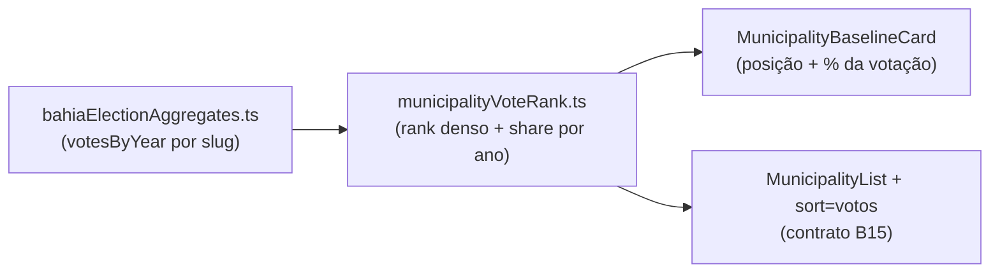

# A11 — Posição em votos do município (rank + % da própria votação) e ordenação por votação

Status: rascunho
Atualizado em: 2026-07-24
Item do roadmap: [docs/roadmap.md](../roadmap.md) (Demais itens abertos, A11; E9 absorve como coluna/ordenação da fila)
Impeccable: B — encaixes em superfícies existentes (detalhe do município + lista), sem rota nova
Appetite: ~0,5–1 dia eng; sem migration, sem collection, sem server action nova
Responsável: —

## Design (Impeccable)

Âncoras: `PRODUCT.md` (princípio 6 — métricas relativas e locais) / `DESIGN.md` (register `product`) · `MunicipalityBaselineCard` e `MunicipalityList` existentes.

Na implementação: craft compacto → critique → polish.

- **Persona / contexto:** a mesa prioriza por **% do voto do próprio deputado** (sessão 2026-07-23 — o coordenador manteve o critério mesmo desafiado com o % do eleitorado local). Hoje essa lente não existe no produto: nem rank, nem share, nem ordenação por votação.
- **Job principal:** abrir um município e saber na hora "que fatia da nossa votação ele é e em que posição está"; abrir a lista e vê-la na ordem da mesa.
- **Estratégia de cor:** Restrained — rank/share são texto/badge neutros, sem heat.
- **Anti-goals:** ranking gamificado; % do eleitorado local como âncora (é a lente que a mesa rejeitou); KPI estadual absoluto.

## Contexto

A leitura "posição em votos absolutos + % da própria votação" é a **concentração da própria votação** do compêndio (§8.1 — Carvalho 2003; "de onde vem meu voto?"), e é exatamente o critério rígido de prioridade da coordenação (CUSTOMER.md, surpresa da sessão: prioridade por % do voto do deputado, não % local). O artefato commitado `bahiaElectionAggregates.ts` já tem a série Solla + válidos federais 2014/2018/2022 por slug do catálogo (435 unidades; Salvador por zona, Camaçari inteiro) — rank e share são deriváveis em memória, sem query. Este item entrega a lente da mesa **antes** de E8/E9; a fila (E9) depois absorve a coluna/ordenação como uma das suas.

## Objetivos

- **Detalhe do município:** no `MunicipalityBaselineCard` (ou card irmão compacto), por ano da série (default 2022): posição em votos absolutos (rank denso entre as 435 unidades do catálogo, ex.: "12º de 435") e **% da própria votação estadual** (votos no município ÷ Σ votos do candidato no ano, ex.: "3,1% da votação").
- **Lista de municípios:** chave de ordenação nova `?sort=votos` (ano default 2022) no contrato URL de **B15** ([ordenacao-colunas-lista-municipios.md](ordenacao-colunas-lista-municipios.md) — `sort`/`dir` + header clicável); preservar filtros/paginação; coluna/linha secundária com votos 2022 + % da própria votação.
- **Helper puro** `src/utilities/municipalityVoteRank.ts`: computa uma vez por request (rank map + shares por ano sobre `federalBaselineMunicipalitySlugs()`), testável em unit; consumido pelo detalhe, pela lista e depois por E9/E17.
- Access: superfícies staff (coordinator/advisor/candidate); leader segue em lockdown (sem páginas de município) — nada muda.

## Decisões travadas

- **Rank sobre as 435 unidades do catálogo** (zonas de Salvador ranqueiam individualmente — é a malha operacional; a soma de Salvador aparece em E17/TI, não aqui). **Rejeitado:** rank sobre 417 municípios IBGE (mistura malhas e não bate com a lista).
- **Denominador do share = Σ votos do candidato no ano no artefato** (recorte BA). É a concentração da própria votação — não % dos válidos locais (dominância, outra métrica, já existe no mapa) nem % do eleitorado. **Rejeitado:** % do eleitorado local como âncora (a mesa rejeitou explicitamente).
- **Rank denso** (empates dividem posição) e formatação pt-BR compacta. **Rejeitado:** rank ordinal com desempate arbitrário.
- **Sem persistência** — derivado do artefato em memória (435 chaves; O(n log n) por ano, cacheável por request). **Rejeitado:** coluna materializada/migration (dado imutável já commitado).
- **i18n e naming:** `municipalityVoteRank.ts`, `computeVoteRankByYear`, `voteShareOfCandidate`, key `votos` no contrato B15 (`?sort=votos&dir=…`); labels pt-BR ("Posição em votos", "% da votação").

## Questões em aberto

- **Ano na URL da ordenação (`?sort=votos&ano=2018`)?** **Recomendação:** v1 só 2022 (ano da lente atual da mesa); seletor de ano entra se a mesa pedir série na lista (o detalhe já mostra a série).
- **Mostrar variação de rank 2018→2022 no detalhe?** **Recomendação:** não na v1 — tendência já existe (`politicalTrend` + série do card); rank delta é açúcar que pode confundir com a classificação (E10).

## Abordagem proposta

Componentes tocados: `src/utilities/municipalityVoteRank.ts` (novo, puro + unit tests), `municipalityUi.ts` (nova key `votos` no allowlist B15), `MunicipalityList.tsx` (header `votos` + linha com votos/%), `MunicipalityBaselineCard.tsx` (posição/share por ano), `municipalityPageData.ts` (apply da key `votos` sobre o filtrado — mesmo path in-memory do B15). **Não** reinventar select "Ordenar por" no desktop se B15 já entregou header + select mobile.

## Dependências

- Nenhuma dura de schema (artefato em produção desde o hardening 2026-07-23). **Suave:** **B15** ([ordenacao-colunas-lista-municipios.md](ordenacao-colunas-lista-municipios.md)) — se B15 ainda não estiver entregue, A11 pode introduzir `sort`/`dir` mínimos só para `votos`+`name`, mas o padrão canônico é reusar B15. Relação: **E9** absorve `sort`/coluna como parte da fila (E9 adiciona `deficit`/`risco-frescor`); **E17** reusa o helper para o rollup por TI; **E4R** deixa `priority` real para o cruzamento visual.

## Não escopo

- Fila de decisão completa (E9); classificação/âncoras relativas (E10 — LQ/captura ficam lá); mudanças no mapa (B13); rank por TI (E17).

## Rabbit holes

- **Virar "tabela de ranking" gamificada.** Rank é atributo do município, não leaderboard: sem página própria, sem medalhas, sem delta de posição na v1.
- **Recalcular share com denominadores alternativos** (válidos locais, eleitorado, campo). Cada um é outra métrica com outro dono (mapa/E8/E10); aqui é só concentração da própria votação.

## Adiado com gatilho

- **Seletor de ano na ordenação da lista.** Gatilho: pedido da mesa por leitura de série na lista.
- **Coluna de rank na fila do E9.** Entra junto com E9 (a fila referencia este helper).

## Referências

- `docs/roadmap.md` (A11) · [ordenacao-colunas-lista-municipios.md](ordenacao-colunas-lista-municipios.md) (B15 — contrato sort) · [fila-de-alocacao.md](fila-de-alocacao.md) (E9 — absorve) · [tabela-ti-inicio.md](tabela-ti-inicio.md) (E17 — reusa helper)
- `docs/CUSTOMER.md` — surpresa da sessão 2026-07-23 (prioridade por % do voto do deputado)
- `docs/research/literatura-campanha-deputado-federal-ba.md` §8.1 (concentração da própria votação)
- `src/lib/bahiaElectionAggregates.ts`, `src/utilities/municipalityUi.ts`, `src/utilities/campaignListUrl.ts`, `src/components/campaign/MunicipalityBaselineCard.tsx`, `src/components/campaign/MunicipalityList.tsx`, `src/components/campaign/MunicipalityFilters.tsx`
- AGENTS.md — naming (identificadores em inglês, URL keys em inglês com valores pt onde forem dado)
