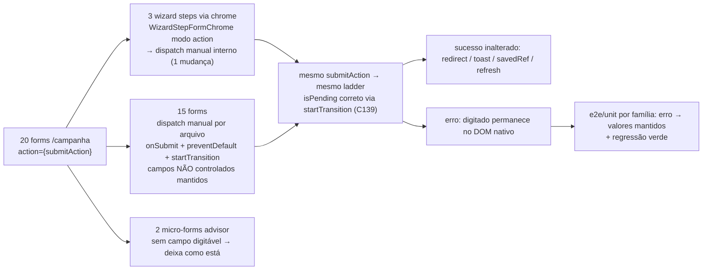

# Impl: C140 — Formulários de campanha apagam o digitado em erro de validação (React 19 form reset)

Status: rascunho
Atualizado em: 2026-08-23
Issue: #740
Intenção: docs/plans/react-19-form-reset-campanha.md
Appetite restante: herdado (~1 dia eng)

## Leitura da intenção

- **Outcome:** nenhum form com `useActionState` em `/campanha` apaga o digitado quando a action retorna erro (fieldErrors ou message); o fix segue o precedente C139 (controlado **ou** dispatch manual, decidido por form); cobertura e2e/unit do form mais representativo por família; specs existentes das famílias tocadas seguem verdes sem alteração.
- **O que NÃO negociar:** sem mudança de comportamento de sucesso (redirect, toast, refresh, `onSaved`); sem mudança de schemas/`FormData`/ladders; forms do domínio `contacts` já resolvidos no C139 ficam como estão; forms fora de `/campanha` fora de escopo.
- **O que reavaliar:** o grep acusou 22 hits mas 2 são comentários — são **20 forms** reais com `action={submitAction}` (18 a mudar + 2 micro-forms de advisor). `WizardLeadershipForm` **não** usa `WizardStepFormChrome` (é `<form>` próprio, sucesso via `savedRef`), então entra na fila de dispatch manual, não no fix do chrome.

## Abordagem recomendada

### Decisão 1 — padrão do fix (cara de reverter)

- **Opções:**
  - **A) Dispatch manual puro** por arquivo: `onSubmit` + `event.preventDefault()` + `startTransition(() => submitAction(new FormData(event.currentTarget)))`, campos permanecem não controlados. Exatamente o que o C139 fez em `ContactCreateRow.tsx:63-70`.
  - **B) Extrair hook compartilhado** `useCampaignFormAction(submitAction)` que encapsula o dispatch (e possivelmente o `useActionState`).
  - **C) Campos controlados em massa**.
- **Recomendação: A** — mecânico, diff mínimo por arquivo, risco de acoplamento zero (cada form é independente), precedente já aprovado e coberto por e2e no C139. O snippet é literalmente 3 linhas constantes; padroniza-se pelo **comentário** (mesmo texto do C139), não por módulo novo.
- **Rejeitadas:**
  - **B** porque o "helper" é raso (pass-through de 3 linhas sem volatilidade). Depth check (`decision-quality.md`): "Pass-through raso → não criar"; o valor duplicado é um snippet fixo, não conhecimento que muda junto. O trio `state`/`submitAction`/`isPending` é consumido de formas diferentes por site (alguns passam `submitAction` como prop pra filho; o chrome do wizard consome `action` como prop; outros nem renderizam `state`), então o hook retornaria `{ state, submitAction, isPending, onSubmit }` — reduziria 0 superfície e adicionaria indireção. O que vale padronizar é o comentário, como o C139 já fez. **Gatilho de revisitação:** se o padrão reaparecer em volume fora de `/campanha`, extrair o hook então.
  - **C** porque é invasivo, alto risco de regressão (dezenas de campos `defaultValue` → `value`+`onChange`), estoura o appetite de ~1 dia. Só se aplica onde os campos **já** são controlados (PhonesFieldEditor, RelationMultiSelect, StrictCombobox, polarity hidden) — e aí nem precisa de mudança.

### Decisão 2 — `WizardStepFormChrome` (um lugar cobre 3 forms)

- **Opções:**
  - **A) Mudar o chrome**: no modo `action`, renderizar `<form onSubmit>` em vez de `<form action>`, com o dispatch manual **interno** (`preventDefault` + `startTransition` + `props.action(new FormData(...))`). Os 3 steps (trend-note, update-body, register-demand) não mudam nada; a prop `action` continua aceita (backward-compatible). `WizardExpectedVotesStep` usa o modo `onCtaClick` (não-form) e fica intocado.
  - **B) Fix por step**: cada step monta seu próprio `<form>` — duplica o chrome.
  - **C) Criar modo novo** (`mode: 'manual'`) — mais superfície que o necessário.
- **Recomendação: A** — o chrome **é** o dono do elemento `<form>` no modo action; é o módulo profundo que já encapsula pending/announcement/submit-bar. Uma mudança, 3 forms, zero diff nos steps. `onSubmit` captura o submit nativo antes do plumbing do form action (mesma mecânica C139).
- **Rejeitadas:** **B** (duplica chrome e espalha a decisão em 3 arquivos) e **C** (enum novo sem ganho; um handler opcional interno basta).

### Decisão 3 — `AdvisorPasswordResetButton` (2 micro-forms)

- **Decisão: deixar como está** (`action={submitAction}` nas linhas 45 e 68), documentado como exceção deliberada. Justificativa: só há `<input type="hidden" name="advisorId">` + botão — **nenhum campo digitável**. O reset do React 19 só apaga valores de campos não controlados; o hidden é constante e re-renderiza idêntico, então zero perda de dado visível. Alterar agrega diff sem efeito observável e mexe em sucesso (toast de erro) sem ganho. **Escape hatch barato:** se o aceite for lido estritamente como "nenhum form", o custo é 6 linhas (dispatch manual nos 2) e pode ser incluído na Fase 3 sem reabrir decisão.

### Decisões por família (fix aplica em todas — o reset é visível porque TODOS os forms ficam na tela em erro; o redirect/savedRef só ocorre no sucesso)

| Família                 | Forms                                                                                                                                                                                                            | Padrão                                                                                                                                                                                                                  |
| ----------------------- | ---------------------------------------------------------------------------------------------------------------------------------------------------------------------------------------------------------------- | ----------------------------------------------------------------------------------------------------------------------------------------------------------------------------------------------------------------------- |
| Wizard chrome (3)       | `WizardTrendNoteStep`, `WizardUpdateBodyStep`, `WizardRegisterDemandStep`                                                                                                                                        | Decisão 2 — chrome muda, steps intactos                                                                                                                                                                                 |
| Wizard step próprio (1) | `WizardLeadershipForm` (`savedRef`→`onSaved`)                                                                                                                                                                    | Decisão 1 (A) — dispatch manual; campos não controlados mantidos                                                                                                                                                        |
| Página sem redirect (1) | `MunicipalityAdvisorsForm` (`/municipios/[slug]/editar`, fica aberto)                                                                                                                                            | Decisão 1 (A) — checkboxes `defaultChecked` permanecem                                                                                                                                                                  |
| Página com redirect (5) | `DemandForm`, `LeadershipForm`, `OrganizationForm`, `StateDeputyForm`, `TourComposerForm`                                                                                                                        | Decisão 1 (A) — redirect só no sucesso; em erro o form fica e o reset seria visível                                                                                                                                     |
| Cards inline (8)        | `DemandDescriptionEditor`, `DemandResponsiblesCard`, `LeadershipInternalForm`, `MunicipalityUpdateForm`, `MunicipalityListUpdateControl`, `CampaignUpdatesCreateModal`, `DeclareVotesForm`, `PledgeEstimateForm` | Decisão 1 (A) — controles já controlados (RelationMultiSelect, StrictCombobox, polarity hidden, `stopsJson`) são imunes e não mudam; inputs numéricos de VotePledge **continuam não controlados** (sem formatação nova) |
| Já imunes (0 mudança)   | `PhonesFieldEditor` FORM mode (rows em `useState`), contacts C139                                                                                                                                                | conferir por call site que está em FORM mode (`name={name}`), sem `saveAction`                                                                                                                                          |

Total: **18 forms mudam** (1 mudança de chrome + 15 dispatch manual + `WizardLeadershipForm`) e **2 ficam** (advisor).

### Componentes / mudanças

- **`WizardStepFormChrome`** (`src/components/campaign/shared/WizardStepFormChrome.tsx:80-83`): no branch `action`, trocar `<form action={props.action}>` por `<form onSubmit={handleSubmit}>`, com `handleSubmit` = `preventDefault` + `startTransition(() => props.action(new FormData(event.currentTarget)))`. Importa `startTransition` e `type FormEvent` de `react`. Nada muda nos 3 steps nem no modo `onCtaClick`.
- **15 forms com dispatch manual** (3 linhas cada, mesmo comentário do C139): `DemandForm`, `LeadershipForm`, `OrganizationForm`, `StateDeputyForm`, `TourComposerForm`, `MunicipalityAdvisorsForm`, `WizardLeadershipForm`, `DemandDescriptionEditor`, `DemandResponsiblesCard`, `LeadershipInternalForm`, `MunicipalityUpdateForm`, `MunicipalityListUpdateControl`, `CampaignUpdatesCreateModal`, `DeclareVotesForm`, `PledgeEstimateForm`. Cada um: adicionar `startTransition` (e `type FormEvent` quando não houver) ao import de `react`, trocar `action={submitAction}` por `onSubmit={handleSubmit}`, definir o handler. Sucesso (toast/redirect/`savedRef`/`formRef.reset()`/remount por `formKey`) fica intocado.
- **Helpers reusados (nenhum novo):** `campaignFormActionError.ts` (ladders `runCampaignFormAction`/`runCampaignRedirectFormAction` intactos), `campaignFormFields.ts` (`fieldError`/`firstFormActionMessage`/`errorProps` intactos), `useCampaignFormSuccessToast` intacto.
- **Migration:** sem migration — nenhuma mudança de schema.
- **Access / Consent:** nenhum — forms e ladders existentes; RBAC intacto.
- **UI:** Impeccable B já coberto na intenção (perda de dado em erro); nenhuma mudança de layout/craft.

### Dados → forma (se aplicável)

Não se aplica — nenhuma mudança de dados. O contrato `FormData` e os ladders são idênticos; o reset é fenômeno de UI. A "forma" dos campos é decisão de engenharia por form: **não controlado + dispatch manual** (padrão dominante, o DOM nativo preserva o digitado) ou **controlado onde já é** (PhonesFieldEditor e comboboxes, imunes). Nenhum `defaultValue` é convertido em `value` a menos que o form já o faça.

## Fases verificáveis

1. **Tracer + chrome do wizard** — mudar `WizardStepFormChrome` (cobre 3 steps de uma vez); fix 1 card inline (`DemandDescriptionEditor`) e 1 página (`DemandForm`) como prova do padrão. **Verificação:** unit spec novo `campaignWizardStepFormChrome.unit.spec.tsx` (render modo action, stub action que resolve erro → type no textarea → submit → assert valor persiste + `aria-busy` durante pending); `pnpm gate:fast` (unit) verde; wizard e2e existente (`campaignHomeActions.e2e.spec.ts:337-361` e `:435`) verde.
2. **Cards inline restantes (mecânico)** — `DemandResponsiblesCard`, `LeadershipInternalForm`, `MunicipalityUpdateForm`, `MunicipalityListUpdateControl`, `CampaignUpdatesCreateModal`, `DeclareVotesForm`, `PledgeEstimateForm`. **Verificação:** estender asserções "erro → valores mantidos" nos cenários já existentes de `campaignMunicipalities.e2e.spec.ts` (`:115-141` assessores, `:591-633` list update control, `:638-709` declare+estimate) e `campaignDemandVisibility.e2e.spec.ts:62-95` (responsáveis); suíte e2e afetada verde.
3. **Páginas restantes + micro-forms (mecânico)** — `LeadershipForm`, `OrganizationForm`, `StateDeputyForm`, `TourComposerForm`, `MunicipalityAdvisorsForm`, `WizardLeadershipForm`. Advisor fica (Decisão 3). **Verificação:** regressão de `campaignLeaderships.e2e.spec.ts`; **e2e novo `campaignTours.e2e.spec.ts`** cobrindo `TourComposerForm` (o único form grande com redirect sem cobertura hoje — gap): erro de validação (ex. nome do giro) → valores digitados mantidos → corrige → sucesso redireciona; unit opcional `campaignDemandDescriptionEditor.unit.spec.tsx` (form puro inline com stub action) se o appetite permitir.
4. **Cobertura por família + regressão** — auditar que cada família tem ≥1 spec: contacts (C139, só regressão), wizard (unit chrome + `campaignHomeActions`), página demand (`campaignRegisterDemand.e2e.spec.ts:12` + estender com asserção de erro), municípios (extensões da Fase 2), votes (declare/estimate), giros (e2e novo), org/deputy (padrão idêntico ao DemandForm, coberto por regressão existente). Rodar a suíte e2e selecionada/afetada.
5. **Gates** — `pnpm gate:fast` (guards → lint → format → typecheck → knip → cycles → unit → int → build → e2e selecionado) e `pnpm push`.

## Rabbit holes / Não escopo (engenharia)

- Extrair hook/helper compartilhado — rejeitado na Decisão 1 (depth check: pass-through raso); o comentário padronizado C139 é o suficiente.
- Controlar campos em massa — rejeitado na Decisão 1.
- Formatação/validação nova de inputs numéricos (VotePledge) — ficam não controlados; a ação já valida e ecoa fieldErrors.
- Forms fora de `/campanha` (frontend público) — fora do escopo da intenção.
- Refactor dos ladders `campaignFormActionError`/`campaignFormFields` ou do echo de `values` — intactos.
- Comportamento de sucesso (toasts, redirects, `savedRef`, `formRef.reset()`, remount por `formKey`) — nenhum toque; o dispatch manual não impede reset manual.
- `WizardExpectedVotesStep` — já usa `useTransition` + fetch (não-form), fora do problema.
- "Consertar" controles já controlados (PhonesFieldEditor, RelationMultiSelect, StrictCombobox) — são imunes; mexer é desperdício.
- `AdvisorPasswordResetButton` — deixa como está (Decisão 3), com escape hatch de 6 linhas.

## Riscos e mitigação

- **Chrome compartilhado afeta 3 steps de uma vez** — mitigado: mudança backward-compatible (prop `action` mantida, só o mecanismo de submit muda), unit spec do chrome na Fase 1, e2e de wizard existente como regressão.
- **`isPending` incorreto sem `startTransition`** — o dispatch manual SÓ funciona com `startTransition` (provado C139); garantir o import em cada arquivo. Erro de compilação/typecheck pega omissão.
- **Regressão de sucesso** — mesmas actions/ladders/`FormData`; as specs de sucesso existentes das famílias tocadas precisam ficar verdes **sem alteração** (aceite). Rodar e2e afetado por família antes do push.
- **Enter/submit nativo** — `onSubmit` captura o submit antes do plumbing; `preventDefault` é obrigatório em todo handler novo.
- **Dupla submissão** — botões mantêm `disabled={isPending}`; nenhum handler novo adiciona guard próprio (o `isPending` já cobre).
- **Inputs numéricos (VotePledge)** — com `defaultValue`, o DOM nativo preserva o digitado após o dispatch manual; sem mudança de `inputMode`/máscara.
- **Forms que ecoam `values` para repopular** — nenhum form alvo controla campos pelo echo; com não-controlado + dispatch manual o repopulo é nativo (melhor que o echo). Não alterar ladders.
- **Reset intencional no sucesso** — `ContactCreateRow`-style `formRef.reset()` e remount por `formKey` continuam válidos com `onSubmit` manual; nenhum handler novo remove reset.

## Aceite de engenharia

- [ ] Aceite de produto da intenção ainda coberto — 18 forms em `/campanha` com `useActionState` não apagam o digitado em erro; cobertura por família (unit chrome + e2e estendidos + e2e novo de giros); regressão das famílias tocadas verde sem alteração; advisor documentado como exceção sem campo digitável.
- [ ] Invariantes AGENTS/engineering-standards — padrão C139 seguido (dispatch manual + comentário; controlado só onde já é); sem migration, schema, access/consent novos; identificadores em inglês; pt só em strings de UI; ladders `campaignFormActionError`/`campaignFormFields` intactos.
- [ ] Testes de domínio previstos — unit spec do `WizardStepFormChrome`; asserções "erro → valores mantidos" nos e2e representativos por família (municípios, demand, wizard, votes); e2e novo `campaignTours.e2e.spec.ts`; regressão e2e completa das famílias tocadas.

Self-score decision-quality: **5/5** — decisão central (A/B/C) com rejeitadas fundamentadas no depth check; decisões por família e do chrome deliberadas; cabe no appetite (~1 dia, mecânico); rabbit holes nomeados; reusa helpers e o precedente C139 sem abstração nova; intenção preservada (nenhuma mudança de sucesso/schema).
