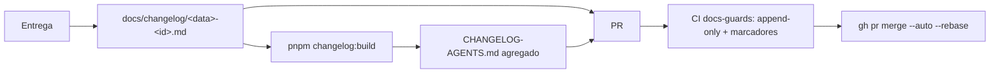

# Impl: OPS44 — Reduzir conflitos de merge em arquivos compartilhados

Status: aprovado
Atualizado em: 2026-08-13
Issue: #713
Intenção: docs/plans/redesenhar-fluxo-reduzir-conflitos.md
Appetite restante: herdado (~1–2 dias eng; processo + guards, sem UI)

## Leitura da intenção

- **Outcome:** cada entrega grava sua entrada de changelog em arquivo próprio (imune a conflito) e o agregado legível "Recently resolved" continua gerado por script; CI barra remoção de linhas existentes do agregado e barra marcadores de conflito em diffs de `docs/`; merges das PRs passam a ser por rebase; Issues que tocam registries compartilhados declaram `serializes`.
- **O que NÃO negociar:** nada de migrar entradas históricas; `docs/plans/*` intocado; sem mapa de contenção commitado; sem UI; sem virar gerenciador de merge; a legibilidade do histórico "Recently resolved" permanece.
- **O que reavaliar:** a hipótese de "guard de append-only" como parser de diff — parser de diff é ruidoso com linhas movidas; semântica honesta é inclusão de multiset sobre os blobs (abaixo). A hipótese de tocar só `ci-pr.yml` — o `agent-pr-ready-automerge.yml` re-arma `--merge` em PRs `cursor/*` e sobrescreveria o `--rebase`; precisa mudar junto. O gap que motiva o guard de marcadores: PR docs-only tem `code_mode: none` → a suíte unit (onde mora o guard OPS41) **não roda** — o guard precisa ser job dedicado de CI.

## Abordagem recomendada

**Opções consideradas:** A (arquivos por entrega + script agregador + guards de CI + rebase) | B (lock/fila de escrita por arquivo) | C (guard de marcadores só na suíte unit existente) | D (parser de diff para o guard append-only) | E (agregador em TS com DB)
**Recomendação:** **A** — ataca a causa (anchor único) no formato, como decidiu o gate; guards baratos no CI; rebase transfere o conflito ao autor.
**Rejeitadas:** B (rabbit hole da intenção — resolve no formato, não no merge); C (PR docs-only pula a suíte unit por `code_mode: none` — o incidente OPS41 era exatamente um PR de docs; guard precisa de job próprio sempre-executado); D (algoritmo de diff reordena hunk em movimentos de linha — falso positivo; comparação multiset de blobs é determinística e honesta); E (nada de DB — mjs é o padrão dos scripts de guard do repo, precedente `plansOnlyClosesGuard`).

### Componentes / mudanças

- **`scripts/lib/changelog.mjs`** (novo, puro, unit-testado): três superfícies —
  1. `listChangelogEntries(files)`: filtra `docs/changelog/<data>-<id>.md` (`^\d{4}-\d{2}-\d{2}-[a-z0-9-]+\.md$`), ordena data desc → id asc; `.md` fora do padrão → erro fail-closed;
  2. `buildChangelog(entries, header)`: header (linhas até o primeiro `---` do agregado atual) + `\n\n` + entradas (`\n\n`-separadas) + newline final;
  3. `assertChangelogAppendOnly({ oldContent, newContent, changelogDiff })`: **multiset** — toda linha do agregado antigo presente no novo com contagem ≥ (`docs/CHANGELOG-AGENTS.md`) e `docs/changelog/*` com `A`-only no `--name-status`; escape documentado: PR body com `changelog-rewrite: <motivo>` (padrão D8); retorna `{ ok } | { ok:false, message }`.
- **`scripts/lib/conflictMarkers.mjs`** (novo, puro): regex do OPS41 **extraída** do unit spec (`<<<<<<<`/`>>>>>>>` tolerante a indentação + forma corrompida `^\s*(> ){7}`) + `findConflictMarkerLines(content)` — o spec passa a importar daqui (don't twin; o scan repo-wide da suíte unit permanece).
- **CLIs** (padrão `check-plans-only-pr-closes.mjs` — wrapper fino, git plumbing): `scripts/build-changelog.mjs` (`pnpm changelog:build` — escreve o agregado; verifica `git ls-files` do changelog dir? não — só gera), `scripts/check-changelog-append-only.mjs` (blobs via `git show <merge-base>:<path>` / `HEAD:<path>`, PR body via `PR_BODY`/`gh pr view`), `scripts/check-docs-conflict-markers.mjs` (`git diff --name-only merge-base...HEAD -- docs/` → `git show HEAD:<path>` → scan).
- **`.github/workflows/ci-pr.yml`**: job novo `docs-guards` (cheap, sempre roda, sem Postgres — espelha `plans-only-closes`) rodando os dois checks; entra no `needs` do rollup `checks`.
- **Merge por rebase** (mudança mecânica em 7 pontos): `execution-pipeline.md:34`, `scripts/lib/agent-pool-prompt.mjs:41`, `plan-issue/SKILL.md:153`, `.agents/rules/agent-pr-workflow.mdc` (32/54/87), **`agent-pr-ready-automerge.yml:37`** (safety net — sem isso ele re-arma `--merge` por cima do `--rebase` em PRs `cursor/*`), `docs/AGENT-OPS.md` "Contrato de PR" item 3.
- **`serializes` documentado**: `plan-issue/SKILL.md` (linha 97 — nomear os registries C2: `tests/unit/codebaseConventions.unit.spec.ts`, `src/utilities/ai/tools/index.ts` + `systemPrompt.ts`, `tests/e2e/fixtures/campaignE2EFixtures.ts`, `AGENTS.md`, `.agents/shell/worktree.sh`) e `docs/AGENT-OPS.md` (seção nova "Registries compartilhados"). Sem mudança no pool (só `migrations` é predica vel; intenção pede visibilidade, não serialização do pool).
- **Docs**: `docs/AGENT-OPS.md` (seção "Changelog": escrever `docs/changelog/<data>-<id>.md` → `pnpm changelog:build` → guard + escape `changelog-rewrite:`), `AGENTS.md` bullet "Histórico de entregas" (uma linha), header do agregado (o parágrafo "Itens novos …" descreve o fluxo novo), `execution-pipeline.md` (passo de registro), `.github/pull_request_template.md:14` (referência ao fluxo novo).
- **Entrega própria (dogfooding)**: `docs/changelog/2026-08-13-ops44.md` + agregado regenerado; o header do agregado muda nesta entrega → **escape `changelog-rewrite:` no body do PR** (primeiro uso real do escape, testado ao vivo).
- **Migration:** nenhuma. **Access/Consent:** nenhum. **UI:** Impeccable A.

### Dados → forma

- N/A (sem dados de produto). Forma dos artefatos: arquivo por entrega (imune a conflito por construção — mesmo padrão que já funciona em `docs/plans/*`) + agregado gerado (leitura estabelecida mantida — decisão A do gate).

## Fases verificáveis

1. **Libs puras + unit tests** — `changelog.mjs` (build/sort/fail-closed + append-only multiset: adição ok, remoção falha, linha movida ok, duplicata, escape) e `conflictMarkers.mjs` (casos do spec OPS41 movidos). `pnpm test:unit`.
2. **CLIs + CI** — 3 scripts; `pnpm changelog:build` gera o agregado idêntico ao atual (verificação: `git diff` vazio com o estado atual); job `docs-guards` no ci-pr.yml + rollup. Verificação local dos checks com git.
3. **Processo/merge** — rebase nos 7 pontos (grep pós: zero `--auto --merge` fora de histórico de workflows/skills — migrations/frozen não contam); docs (AGENT-OPS, AGENTS.md, PR template, header do agregado, execution-pipeline).
4. **Entrega própria** — `docs/changelog/2026-08-13-ops44.md`, regenerar, commit, PR com `changelog-rewrite:` no body.
5. **Gates** — `pnpm gate:fast`, `pnpm check:cycles`, `pnpm exec knip`, `format:check`; build não é afetado (sem `src/`), mas rodar `pnpm build` contra DB local por paridade.

## Rabbit holes / Não escopo (engenharia)

- Validar data do filename contra o `**Recently resolved (data):**` da entrada — v1 sem cross-validation (nota no doc do formato).
- Guard de presença de entradas históricas por id (D8 processo manual) — não automatizar.
- Serialização do pool para registries C2 — só documentação nesta entrega.
- Migrar entradas históricas para `docs/changelog/` — fora de escopo (intenção).

## Riscos e mitigação

- **Settings do repo: "Rebase and merge" precisa estar habilitado** para o auto-merge rebase; verificação read-only via `gh api repos/fsolla/teqo --jq .allow_rebase_merge` antes de fechar; se desligado → habilitar via API (ou pedir ao humano) como parte da entrega.
- **PRs `cursor/*` já armadas com `--merge`**: janela até o deploy da mudança — pequena; o safety-net re-arma com o método do workflow (a partir desta entrega, rebase).
- **Falso positivo do guard com reordenação**: eliminado pela semântica multiset (linha movida continua presente).
- **Duas entregas paralelas regeneram o agregado**: rebase conflita no agregado → autor regenera com `pnpm changelog:build` (resolução natural, diff conhecido — exatamente o fluxo desejado); guard valida o resultado.
- **Prettier/format:check sobre o agregado gerado**: entradas existentes já passam; gerador preserva o formato (proseWrap preserve).

## Aceite de engenharia

- [x] Aceite de produto da intenção ainda coberto (formato novo + agregado legível + 2 guards + rebase + `serializes` doc)
- [x] Invariantes AGENTS/engineering-standards (sem `src/` de app; scripts mjs no padrão dos guards existentes; zero DB; zero UI)
- [x] Testes de domínio previstos: unit das libs puras (builder + append-only multiset + marcadores); guards exercitados localmente contra diffs sintéticos
