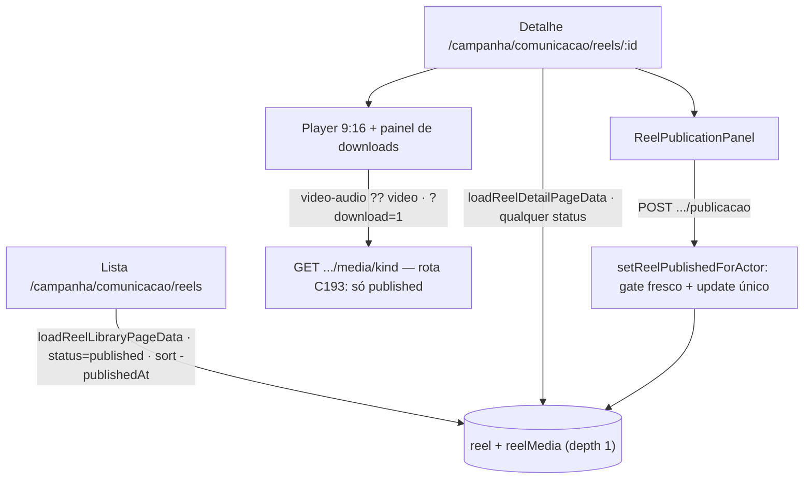

# Impl: Biblioteca de reels na vertical Comunicação

Status: aprovado
Atualizado em: 2026-09-18
Issue: #1153
Intenção: docs/plans/reels-biblioteca.md
Appetite restante: herdado (~1–2 dias eng; lista + detalhe + kill switch verificáveis com fixtures)

## Leitura da intenção

- **Outcome:** `/campanha/comunicacao/reels` lista os reels **publicados** (capa 9:16 + título), o detalhe abre o reel em 9:16 e oferece os arquivos disponíveis (vídeo sem áudio primário, vídeo com áudio, mp3, `.srt`, transcrição) para a assessoria trabalhar fora do site; despublicar tira da lista sem apagar e republicar reativa; acesso só a `communicator`/`coordinator`/`candidate`, fail-closed.
- **O que NÃO negociar:** arquivos privados (rota C193 é a única porta; `Media.read` intocado); nada de publicação/edição de vídeo na UI; nenhum reel some por acidente (kill switch reversível); sem busca/filtros no MVP (`-publishedAt`); sem `Consent` novo; sem migração (C193 fechou o modelo).
- **O que reavaliar:** a recomendação A da intenção para o link direto do despublicado **conflita com o C193 (decisão B, mergeada)** — vale B: `draft`/`unpublished` não servem mídia; o detalhe interno continua abrindo, mas sem player/downloads. Verifiquei que o regex `/acervo/[^/]+` do chrome (`campaignPageChrome.ts:297`) **não** engole `/reels` (só falta a rule da lista). O conflito C184 (#1106) **não foi mergeado** (commit docs-only) — prosseguir. Os defers do C193 (`reelMediaPath`/`isReelStatus`) têm gatilho explícito neste item.

## Abordagem recomendada

**D1 — Dados da página. Opções: A | B | C — Recomendação: A.** Loader em `src/utilities/reels/reelPageData.ts` (`server-only`, `overrideAccess: false, user`, select enxuto), view models puros no dono do vocabulário `src/lib/reel.ts` (como `lib/speechCut.ts` faz) e URL curta em `src/utilities/reels/reelListUrl.ts` (só `page`, reusando `campaignListUrl`). Rejeitadas: **B** query inline nos `page.tsx` (espalha o where do kill switch e mata o int sem HTTP); **C** top-level `src/utilities/reelPageData.ts` (top-level é pinado por `codebaseConventions.unit.spec.ts`; a subpasta `utilities/reels/` já é o dono criado no C193).

**D2 — Render da lista. Opções: A | B | C — Recomendação: A.** Grid RSC de capas 9:16, todo o card é um `<Link>` (sem ilha cliente), com os shells de lista (`CampaignPageShell`, `CampaignListPendingBoundary/Results`, `CampaignListEmptyState`, `CampaignListFooter`). Rejeitadas: **B** `CampaignTable` (o sistema de listas é de tabela; o design é capa-led e o job é varrer por capa/título); **C** busca/filtro/sort toggle no MVP (produto recomenda A; ordem fixa `-publishedAt`).

**D3 — Transporte do kill switch. Opções: A | B | C — Recomendação: A.** `POST .../reels/[id]/publicacao` com `campaignJsonMutationRoute` + `setReelPublishedForActor` em `src/app/(campaign)/campanha/actions/reels.ts` (gate fresco `canReadCommunicationCatalog`, find ator-escopado, **um** `payload.update`); painel cliente com `useState` pending + `postCampaignJson` + `router.refresh()` (precedente `SpeechCutPublicationPanel.tsx:42-65`, regra `campanha-action-feedback`). Rejeitadas: **B** server action + `<form>` (a superfície é botão com AlertDialog, não form; o wrapper JSON é convenção estrutural — `codebaseConventions` recusa `POST` fora dele); **C** REST direto `/api/reel/:id` (pula o gate fresco do ator e a mensagem de domínio; wire divergente).

**D4 — Detalhe de reel não publicado. Opções: A | B | C — Recomendação: A.** Detalhe abre para `draft`/`unpublished` (leitura permitida), **sem** player/downloads e sem nenhum href de mídia; aviso "fora da lista" com copy adaptada (arquivos guardados, sem acesso até republicar) e painel com "Publicar" (draft) / "Republicar" (unpublished). Rejeitadas: **B** detalhe 404 para não publicado (mataria o kill switch reversível da própria tela, contra o aceite); **C** player mesmo despublicado (contraria o C193 B mergeado — tocar prometeria arquivo que o servidor nega; link morto).

### Componentes / mudanças

- **`src/lib/reel.ts`** (editar): `ReelLibraryItemViewModel`/`ReelDetailViewModel` + `toReelLibraryItemViewModel`/`toReelDetailViewModel` (labels de `reelStatusLabels`/`reelFeatureLabels`, `publishedAtLabel`, disponibilidade por artefato, `coverAlt`); passa a consumir `reelMediaPath` (player/capa/downloads). **Cleanup do defer C193:** se ao merge `isReelStatus` seguir sem call site de produção, apagá-lo + o pino em `tests/unit/reel.unit.spec.ts`.
- **`src/lib/campaignPaths.ts`** (editar): `CAMPAIGN_COMMUNICATION_REELS`, `campaignReelDetailHref(id)`, `campaignReelPublicationHref(id)`.
- **`src/lib/schemas/reel.ts`** (novo): `reelPublicationRequestSchema` (`reelId: positiveRelationshipId`, `published: z.boolean()`) e `REEL_FORBIDDEN_MESSAGE` ('Você não tem acesso à biblioteca de reels.' — literal próprio do domínio; NÃO reusar o "acervo de falas"), `REEL_NOT_FOUND_MESSAGE`, `REEL_GENERIC_ERROR_MESSAGE`.
- **`src/utilities/reels/reelListUrl.ts`** (novo): `parse/serialize/resolve` só de `page` (canônico via `resolveListUrl`), `buildReelListHref`, `REEL_PAGE_SIZE = 24`.
- **`src/utilities/reels/reelPageData.ts`** (novo): `loadReelLibraryPageData` (where fixo `{ status: { equals: 'published' } }`, `sort: '-publishedAt'`, depth 1, select título/feature/status/cover/publishedAt) e `loadReelDetailPageData` (qualquer status; `ReelNotFoundError` → `notFound()` na página; depth 1).
- **`src/utilities/campaignPageActor.ts`** (editar): rename mecânico do gate `'speechCatalog'` → `'communicationCatalog'` (tipo + doc + condição). **Verificado:** 7 chamadas em 6 páginas (`comunicacao/page.tsx:12`, `acervo/page.tsx:34`, `acervo/[id]/page.tsx:36,52`, `cortes/page.tsx:35`, `cortes/[id]/page.tsx:37,57`) + comentários (`actions/speech.ts:265`, `tests/e2e/fixtures/campaignHttpTest.ts:125`).
- **`src/app/(campaign)/campanha/actions/reels.ts`** (novo): `setReelPublishedForActor` — schema parse, `getCampaignActionContext`, gate fresco por role, `payload.find` ator-escopado (não encontrado → `REEL_NOT_FOUND_MESSAGE`), `payload.update({ status: published ? 'published' : 'unpublished' })`. **Sem transação** (uma coleção/um documento; o hook `stampReelPublishedAt` re-carimba `publishedAt` — `Reel.ts:51-59`); mesmo precedente `speech.ts:297-320`.
- **Rotas novas** em `src/app/(campaign)/campanha/(app)/comunicacao/reels/`: `page.tsx` (lista; `campaignPageMetadataFromCatalog('reels')`; `requireCampaignPageActor({ gate: 'communicationCatalog' })`), `[id]/page.tsx` (detalhe: chrome próprio, `ReelStatusBadge`, `ReelPlayer`, `ReelDownloadPanel`, `ReelTranscriptCard`, `ReelPublicationPanel`), `[id]/publicacao/route.ts` (`POST` via `campaignJsonMutationRoute` + `safeMessages`), `[id]/types.ts` (`ReelPublicationResponse`).
- **`src/components/campaign/reels/`** (novos): `ReelLibraryList.tsx`, `ReelLibraryCard.tsx` (capa via `` apontando à rota C193 — **não** usar `next/image` otimizado: o otimizador busca a fonte server-side sem o cookie `campaign-token` e receberia 404), `ReelStatusBadge.tsx`, `ReelPlayer.tsx` (`<video controls playsInline preload="metadata">`, fonte `video-audio ?? video`, poster cover; barra custom do artefato, se mantida, é decisão do designer no port), `ReelDownloadPanel.tsx` (primário `?download=1`; secundários disponíveis viram `<a>`; indisponíveis, texto desabilitado — cena 06), `ReelTranscriptCard.tsx` (+ botão de copiar reusando o dono `src/lib/copyFeedback.ts`, parametrizado com `subject: 'link' | 'text'`, default preserva os call sites), `ReelPublicationPanel.tsx`.
- **`src/components/campaign/shell/nav.ts`** (editar): 3º sub-item `{ title: 'Reels', href: CAMPAIGN_COMMUNICATION_REELS }`; atualizar comentário "dois destinations".
- **`src/lib/campaignPageChrome.ts`** (editar): catalog `reels: { title: 'Reels', subtitle: 'Tutoriais prontos para a assessoria baixar e publicar fora do site.' }` + rule exata da lista (antes do regex de `/acervo/[^/]+` por vizinhança; detalhe resolve `null` sem rule nova — regex verificada).
- **Migration:** nenhuma. **Access/Consent:** nenhum helper novo; leituras `overrideAccess: false` + `user`; sem `Consent` (mídia de staff, sem PII). A rota de mídia C193 fica intocada.
- **UI:** Impeccable **C**. Fonte visual: `docs/plans/reels-biblioteca-ui-design.html`. O `designer` está adaptando em paralelo: (1) cena 07 sem prometer acesso ao arquivo (remove "acessíveis por este link" — C193 B); (2) sem duração (não há campo; o `00:28` sai); (3) kill switch por qualquer um dos 3 papéis. Portar só o artefato adaptado; mudar estrutura visual sem o designer é defeito.

### Dados → forma (se aplicável)

N/A — a intenção declara "não vou apresentar dados": inventário operacional (capa/título/status), sem métrica/gráfico. A forma é a lista ordenada por `-publishedAt` com paginação.

## Fases verificáveis

1. **Contrato puro + fiação (unit).** ~0.5 dia: VMs e paths; `reelListUrl`; chrome; nav; rename do gate. Unit: `tests/unit/reel.unit.spec.ts` (editar), `reelListUrl.unit.spec.ts` (novo), `campaignPageChrome.unit.spec.ts` (editar: lista 'Reels', detalhe `null`), `campaignNav.unit.spec.ts` (editar: pin exato dos 3 sub-itens em `:100-127`), `campaignPageActorGate.unit.spec.ts` (editar: `communicationCatalog` passa communicator/coordinator/candidate; advisor → `/campanha`, leader → `/campanha/meus-contatos`). Verde: `pnpm test:unit`.
2. **Dados + lista + detalhe (port do artefato).** ~0.5 dia: `reelPageData.ts`, páginas e componentes. Int novo `tests/int/reelLibrary.int.spec.ts` (mock `next/cache` + `getCampaignActionContext` como `speechCut.int.spec.ts:22-31`): lista só `published` e ordenada, canonicalização de `page`, matriz de papéis do loader, detalhe em qualquer status, `ReelNotFoundError`. Aceite visual contra o artefato adaptado.
3. **Kill switch.** ~0.25 dia: schema, action, route, painel, types; int do action/rota (unpublish some da lista, republish re-carimba `publishedAt` via hook, negado → mensagem de domínio, inexistente → não encontrado). Sem `revalidatePath`: páginas de `/campanha` são dinâmicas e o reel não tem `unstable_cache` (C193 dispensou `revalidateDocumentById`); o painel faz `router.refresh()` como o de cortes.
4. **E2E + gates.** ~0.5 dia: `tests/e2e/campaignReel.e2e.spec.ts` espelhando `campaignSpeechCut.e2e.spec.ts:257-355` — lista/detalhe 200 com título e hrefs `?download=1`, GET do download com `Content-Disposition: attachment`, unpublish some da lista + detalhe em estado despublicado com "Republicar", republish volta, advisor/leader redirecionados e rota 400; manifest `scripts/lib/e2e-affected-manifest.mjs` (entry `${CAMPAIGN_APP}/comunicacao`: prefixes `src/components/campaign/reels`, `src/utilities/reels`, `src/lib/reel` e spec `campaignReel`; entry `src/lib/schemas` + `campaignReel`). **Curated intocado:** C194 não toca path `isHighRisk` (sem migração/collection/global/harness) e o PR roda `selected` com o spec novo mapeado; o full fica no verify do deploy. Changelog `docs/changelog/2026-09-18-c194.md`; `pnpm gate:fast`; e2e local (`pnpm test:e2e:affected` + spec novo); `pnpm push`; PR `Closes #1153`.

## Rabbit holes / Não escopo (engenharia)

- Upload/edição/substituição de mídia ou retry na UI (C195 é o ingest; trocar = substituir via admin).
- Busca, filtros, sort toggle, "baixar tudo" em zip; thumbnails/duration derivados (não há campo).
- Cache (`unstable_cache`) do reel ou revalidação por hook — C193 dispensou com trigger de revisitação.
- Tocar a rota de mídia C193, `Media.read`, `reelMedia`, `Consent` ou migração.
- Melhorar chrome/nav além dos 3 pontos; qualquer estrutura visual sem o `designer`.

## Riscos e mitigação

- **C184 (#1106) no mesmo diff de nav/teste.** Não mergeado (docs-only); se mergear antes, rebase — a colisão é só o pin dos sub-itens.
- **Rename do gate com superfície ampla.** Mecânico (6 arquivos, só strings de tipo/condição/comentário) + unit novo cobrindo a decisão; manifest da vertical acorda os specs de comunicação.
- **Lista vazar não publicado ou detalhe prometer arquivo morto.** Where fixo no loader + int da matriz; VM só expõe URL de artefato quando `status === 'published' && disponível`; a rota C193 já responde 404.
- **Kill switch mentir por cache.** Sem cache no caminho; resposta da rota de mídia é `private, no-store`; `router.refresh()` do painel.
- **E2E novo não ser selecionado no PR.** Prefixos mapeados + nome pinado por `tests/unit/e2eAffectedManifest.unit.spec.ts:24-32`; execução local explícita antes do push.
- **Copy errada no negado.** Literal do domínio ("biblioteca de reels"), não o de acervo de falas.

## Hard-stops (aprovação humana explícita)

1. **Schema/migração:** este item não toca o modelo; se algo exigir campo novo, parar e reabrir (C193 fechou).
2. **Semântica do arquivo (C193 B):** `draft`/`unpublished` → 404 no serving; se o produto quiser link direto do despublicado, reabrir — não mudar a rota.
3. **Design:** só portar o artefato adaptado; mudança de estrutura visual sem o `designer` é defeito (fail-closed).
4. **Entrega:** `pnpm push` canônico e PR `Closes #1153`; sem push direto.

## Aceite de engenharia

- [ ] Aceite de produto da intenção coberto: lista só publicados; detalhe 9:16 + downloads condicionais (primário sem áudio, com áudio, mp3, `.srt`, transcrição); despublicar some e não apaga, republicar reativa; só os 3 papéis (fail-closed); sem publicação em rede; site público/cards idênticos.
- [ ] Invariantes AGENTS/engineering-standards: `overrideAccess: false` + `user`; single-collection write sem transação (justificado); sem `revalidatePath` (justificado); sem `Consent`/migração; `Media.read` e rota C193 intocados; "edit the owner, don't twin" (chrome/nav/actor/copyFeedback/paths estendidos); identificadores em inglês, copy pt-BR; sem top-level novo em `utilities/`.
- [ ] Testes: unit (VMs, URL, chrome, nav, gate), int (loader + kill switch + despublicado), e2e (`campaignReel`) listados verdes; manifest atualizado; `pnpm gate:fast` e `pnpm push` limpos.

## Explicitamente fora (skips, descartes e defers deste triage)

- **Defer (fixtures int):** `tests/int/reelLibrary.int.spec.ts` duplica `createMedia`/`createReel` de `tests/int/reel.int.spec.ts` (2 call sites, shapes distintos — C193 devolve `{reel, video}`+captions, C194 devolve `Reel`+transcript). Gatilho: 3ª suíte/call site de fixtures de reel.
- **Defer (prewarm e2e):** as rotas novas de reels ficam fora da lista de prewarm do `tests/e2e/setup.e2e.spec.ts` (as irmãs do acervo/cortes também estão; CI em prod mode compila). Gatilho: flake recorrente de cold-compile em dev nas rotas de reels.
- **Defer (copy do vazio):** o artefato `docs/plans/reels-biblioteca-ui-design.html` ainda mostra o jargão "Sem CTA…" que a entrega trocou por copy de usuário; a crítica final do `designer` decide a copy canônica do artefato.
- **Descarte:** `ReelPlayer`/`ReelDownloadPanel` recebendo o VM inteiro (precedente `SpeechCutPlayer`); `src/lib/reel.ts` misturando vocabulário e VMs (precedente `speechCut.ts`).

## Self-score de decision-quality

**4.5/5.** (1) As quatro decisões caras têm alternativas honestas com rejeição ancorada em file:line; (2) cabe no appetite herdado (~1.75 dia, sem migração, reuso máximo de shells/precedente); (3) rabbit holes nomeados; (4) depth check: loader do dono `utilities/reels/`, action espelhando `speech.ts`, wrapper `campaignJsonMutationRoute`, `copyFeedback` como dono, chrome/nav/paths/actor estendidos; (5) o aceite de produto permanece intacto — inclusive a decisão B do C193 e o kill switch reversível. Perde 0,5 porque o port depende do artefato do designer já adaptado (copy do despublicado, sem duração) — registrado como dependência/gate, não como lacuna.
