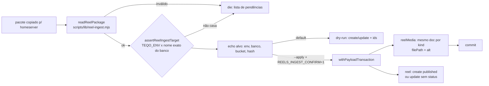

# Impl: Ingestão do pacote do reel na biblioteca privada do /campanha

Status: aprovado
Atualizado em: 2026-09-18
Issue: #1154
Intenção: docs/plans/reels-ingestao.md
Appetite restante: herdado (~1 dia eng; um comando que publica o pacote uma vez, sem duplicata, com conferência)

## Leitura da intenção

- **Outcome:** `pnpm reels:ingest <diretório>` roda no homeserver, valida o pacote e cria/atualiza UMA entrada na biblioteca privada com vídeo, capa, legenda, narração/áudio e roteiro ligados à mesma entrada; re-ingerir o mesmo reel (mesmo hash de shot list) atualiza a mesma linha; sem confirmação nada é escrito e o alvo errado é recusado.
- **O que NÃO negociar:** escrita só pela Local API no homeserver (nunca SQL cru nem credencial de campanha na workstation); idempotência pelo hash do shot list gravado no `metadata.json`; dry-run por padrão; fail-closed de ambiente; pacote incompleto não gera meia-escrita; sem processamento de mídia; access/privacidade do C193 intocados (`Reel.ts:74-79`, `ReelMedia.ts:26-31`).
- **O que reavaliar:** a hipótese de "pacote completo" (o C196 sozinho só produz `reel.mp4`+`capa.png`+`metadata.json`; `.srt`/`.md`/áudio são do C197); persistir `duração`/`data` do metadata (não persistir sem consumidor); formato exato do hash com o produtor.

## Abordagem recomendada

**Opções consideradas:** A (contrato em `src/lib/reel.ts` + puros em `scripts/lib/` + writer Local API em `src/utilities/reels/` + CLI fino) | B (tudo inline no script) | C (SQL cru)
**Recomendação:** A — reusa o dono do vocabulário (`src/lib/reel.ts`), os helpers de `scripts/lib/cli.mjs` e a transação (`withPayloadTransaction`, `payloadTransaction.ts:86-96`); o writer fica testável contra `teqo_test` como o upsert de `scripts/lib/staging-test-account.mjs:143-169`.
**Rejeitadas:** B — duplicaria guard/validador e não teria unit dos puros; C — fura o caminho oficial, o access e a transação.

### Decisões de engenharia

1. **Idempotência — campo `sourceHash` no `reel` (caro).**
   **Opções:** A) campo `text` `unique: true, index: true`, `admin.readOnly`, nullable, + migration `add_reel_source_hash`; B) collection de mapping hash→reel; C) lookup por título+feature.
   **Recomendação:** A — a chave travada é o hash; campo no dono com índice único dá lookup direto sem modelo paralelo; NULL convive com reels manuais (Postgres aceita múltiplos NULL num índice único). Forma do `Speech.sourceKey` (`Speech.ts:96-107` — o adapter gera um único `CREATE UNIQUE INDEX`).
   **Rejeitadas:** B — um doc por reel é o twin do modelo (mais migração, mais access, mais escrita para o mesmo fato); C — título colide e não é a chave travada.

2. **Contrato do pacote (caro).**
   **Opções:** A) constantes em `src/lib/reel.ts` + validador puro em `scripts/lib/reel-ingest.mjs`; B) schema zod em `src/lib/schemas/`; C) validar inline no CLI.
   **Recomendação:** A. `metadata.json`: `title` (≤ `REEL_TITLE_MAX_LENGTH`, `Reel.ts:89`), `feature ∈ REEL_FEATURES` (`src/lib/reel.ts:30`), `shotListHash` (sha256 hex de 64), `coverAlt` não vazio; `durationSeconds`/`createdAt` opcionais, validados e **não persistidos**; chaves extras ignoradas (forward-compat com C197). Artefatos: obrigatórios `reel.mp4`→`video`, `capa.png`→`cover`, `narracao.srt`→`captions`; opcionais `reel-audio.mp4`→`video-audio`, `narracao.mp3`→`narration`, `roteiro.md`→`transcript` (textarea). Reusa `REEL_MEDIA_KINDS`/`reelMediaFieldByKind` (`src/lib/reel.ts:41-52`).
   **Rejeitadas:** B — zod é dono de entrada de superfície HTTP, não de pacote de CLI; C — reescreveria o vocabulário em `scripts/`.
   **Tensão registrada:** o pacote do C196 sozinho (sem `.srt`) será recusado até o C197 — fail-closed listando os faltantes; **não é defeito do ingest**.
   **Revisitação:** C196/C197 pedirem campo novo (voz, duração persistida) → adicionar no dono.

3. **Guard de alvo (caro).**
   **Opções:** A) helper puro próprio (molde `assertStagingTestAccountTarget`, `staging-test-account.mjs:77-127`); B) `assertLocalDatabase`; C) confiar no host.
   **Recomendação:** A — fora de test o `TEQO_ENV` é obrigatório (`staging|production`) e o **nome exato** do banco é o discriminador (`staging`↔`teqo_staging`, `production`↔`teqo_1313`); protocolo `postgresql:`; host no allowlist local (defesa em profundidade); recusa `ALLOW_REMOTE_DB`; `NODE_ENV=test`/`VITEST` só aceita `TEST_DATABASE_NAME_RE` (`cli.mjs:123`); confirmação sempre exigida para escrever.
   **Rejeitadas:** B — no homeserver `assertLocalDatabase` PASSA contra produção (`LOCAL_HOSTS` inclui `postgres`/`127.0.0.1`, `cli.mjs:66-74`); C — o socat reescreve o host para `127.0.0.1`, host não distingue.

4. **Confirmação e modo (caro).**
   **Opções:** A) dry-run default; escrita com `--apply` **e** `REELS_INGEST_CONFIRM=1` (molde `migrate-signature-orphan.mjs:48-60`); B) sem flag, só env (molde `recover-media.mjs:79-85`); C) `--confirm` na linha.
   **Recomendação:** A — o default nunca grava; o dry-run ecoa alvo (env+banco+bucket), pacote, hash, create×update e id, e a validação termina antes de qualquer escrita.
   **Rejeitadas:** B — a invocação sem flag viraria escrita; C — confirmação por linha é fácil de repetir por acidente e foge do molde do repo.

5. **Caminho de escrita (caro).**
   **Opções:** A) Local API `overrideAccess: true` sem `user` (precedentes `staging-test-account.mjs`, `seed-posts.mjs:419-424`) + `withPayloadTransaction` com `req:{transactionID}`; B) usuário de sistema; C) SQL cru.
   **Recomendação:** A. `createdBy` fica nulo — o hook `stampCampaignCreatedBy` só carimba com `req.user` de campanha (`campaignAuditFields.ts:56-61`); registrado, não é defeito. Primeira ingestão cria `status: 'published'` (o hook carimba `publishedAt`, `Reel.ts:51-59`); re-ingest **omite `status`** → preserva o kill switch (nunca ressuscita `unpublished`). Upload via `filePath`; re-ingest **atualiza o mesmo doc `reelMedia`** por kind (nunca duplica); artefato opcional ausente **não apaga** o existente; mesma regra para `transcript`. Nome do objeto determinístico por hash (`reel-<hash8>-<kind>.<ext>`) — dois reels nunca colidem no mesmo `reel.mp4` e o re-run sobrescreve o mesmo key. Falha no meio → rollback (nada visível); objeto órfão no bucket é custo aceito (chave determinística torna o re-run auto-curativo; cleanup é opcional, não inflar).
   **Rejeitadas:** B — credencial/identidade fake e `createdBy` mentiroso; C — fura o access e a transação.

6. **alt dos artefatos (barato).** Capa usa `coverAlt` do metadata; os demais derivam pt-BR determinístico do título (`Vídeo do reel "<título>"`, `Vídeo com áudio do reel "<título>"`, `Narração do reel "<título>"`, `Legendas do reel "<título>"`). Rejeitado: exigir alt de cada arquivo no metadata (infla o contrato; só a capa é superfície de acessibilidade).

7. **CLI (barato).** `pnpm reels:ingest <dir> [--apply]`; parser posicional puro novo em `scripts/lib/reel-ingest.mjs` (não há parser posicional em `cli.mjs`, só `parseEqualsFlags:34-48`); `dieWithLabel('reels:ingest')`; exit 1 em recusa/erro e 0 no sucesso; sem S3 completo (`resolveS3StorageEnv`, `mediaStorage.ts:39-53`) o comando falha fechado quando o alvo é staging/produção (senão o container gravaria em disco efêmero); dev/test caem em disco. Rejeitado: `--confirm` (decisão 4).

8. **UI/testes (barato).** Impeccable **A — sem UI**; sem e2e novo (o manifest só mapeia `src/`; diff de `scripts/` não acorda e2e). Unit dos puros + int do fluxo real no `teqo_test` com pacote de fixture.

9. **Operação (barato).** Sem mudança de compose; runbook em `docs/ops/teqo-1313-deploy.md` (staging primeiro, depois produção, via serviço de manutenção `teqo-staging-migrate`/`teqo-1313-migrate`, `deploy-homeserver.sh:249-254`; precedente manual `docs/ops/teqo-1313-deploy.md:319`) + changelog `docs/changelog/2026-09-18-c195.md`.

### Componentes / mudanças

- **`src/lib/reel.ts`** (editar): `REEL_PACKAGE_METADATA_FILENAME`, `REEL_PACKAGE_TRANSCRIPT_FILENAME`, `REEL_PACKAGE_ARTIFACTS` (kind+filename+required) — dono único do vocabulário do pacote (C196/C197 leem daqui). Não tocar `reelMediaPath` (defer do C193; gatilho é o C194, não o C195).
- **`scripts/lib/reel-ingest.mjs`** (novo, puro): `parseReelIngestArgs`, `assertReelIngestTarget`, `readReelPackage`, `reelArtifactStorageFilename`, `reelArtifactAlt`; reusa `dieWithLabel`/`databaseName`/`databaseHostname`/`isLocalDatabaseUrl`/`isTruthyEnv`/`TEST_DATABASE_NAME_RE` de `cli.mjs`.
- **`src/utilities/reels/reelPackageIngest.ts`** (novo, `import 'server-only'`): `ingestReelPackage(payload, plan, { dryRun })` — lookup por `sourceHash`, create/update de `reelMedia` e `reel` na MESMA transação; importado pelo CLI (tsx) e pelo int spec (precedente `tests/int/campaignStagingTestAccount.int.spec.ts:9-14`).
- **`scripts/reels-ingest.mjs`** (novo): args → confirmação → guard → check S3 → validação do pacote → boot Payload (`seed-loader`, molde `package.json:30-36`) → echo → dry-run/escrita.
- **`src/collections/Reel.ts`** (editar): campo `sourceHash` (`text`, `unique`, `index`, nullable, `admin.readOnly`, `description` pt-BR "Hash do shot list do pacote; identifica o reel na ingestão") — sem `revalidate` (não há leitura cacheada, `reels-reel-privado-impl.md:60`).
- **`package.json`**: script `reels:ingest` com `--import=tsx/esm --import=./scripts/seed-loader.mjs`.
- **`scripts/lib/test-affected-core.mjs`**: inserir `scripts/lib/reel-ingest.mjs` em `SCRIPTS_SPEC_PINNED` (o invariante `ciSkipInvariants.unit.spec.ts:192-216` recomputa a closure e falha se faltar/stale).
- **Migration:** `add_reel_source_hash` (coluna + índice único; tabela minúscula, sem backfill) — **HARD-STOP** abaixo.
- **Access/Consent:** intocados; escrita `overrideAccess: true` sem `user` (CLI); sem `Consent` (mídia interna, sem PII).
- **UI:** Impeccable A — N/A.
- **Testes:** `tests/unit/reelIngest.unit.spec.ts` (puros + guard + parser); `tests/int/reelIngest.int.spec.ts` (fluxo real); fixture `tests/fixtures/reel-package/` (arquivos mínimos com magic bytes reais p/ MP4/PNG, sem PII; cópia em temp nos casos mutantes).

### Dados → forma (se aplicável)

N/A — sem tela. O "dado" é o pacote no disco e o registro criado/atualizado na biblioteca (o C194 consome).

## Fases verificáveis

1. **Puros + contrato (~0,3 dia):** estender `src/lib/reel.ts`; criar `scripts/lib/reel-ingest.mjs` + `tests/unit/reelIngest.unit.spec.ts`; pin em `SCRIPTS_SPEC_PINNED`; `pnpm gate:fast`.
2. **Schema + migration — HARD-STOP (~0,2 dia):** `sourceHash` em `Reel.ts`; `pnpm generate:types`; `pnpm migrate:create add_reel_source_hash`; revisar SQL; **aprovação humana explícita pendente (mesmo em `--auto`)**; `pnpm migrate` só local.
3. **Escrita + CLI + int (~0,4 dia):** `reelPackageIngest.ts`, `scripts/reels-ingest.mjs`, `package.json`, fixture, `tests/int/reelIngest.int.spec.ts` (create→published; re-ingest mesmo id/documentos; status preservado; incompleto sem escrita; dry-run sem escrita); `pnpm test`.
4. **Operação + gates (~0,1 dia):** runbook + changelog; `pnpm gate:fast`; e2e da superfície (nenhum novo — os curados do CI bastam); push via `pnpm push`.

## Rabbit holes / Não escopo (engenharia)

- ffmpeg/transcode/thumb/poster; watcher/daemon; edição de metadados no dry-run; UI (C194) e `reelMediaPath`.
- Cleanup de objetos órfãos no bucket (best-effort opcional; não inflar).
- Skip de PUT por hash de bytes; ingest em lote; `--force`/`--status`/`--dry-run` explícito.
- Versionamento/auditoria por ingestão; `Consent`/PII (não existem).

## Riscos e mitigação

- **Migration em produção:** aditiva e aplicada pelo deploy (`pnpm build` → `payload migrate`); SQL revisado no hard-stop; tabela minúscula, sem backfill.
- **Hash divergente entre C196 e C195 → duplicata:** formato pinado no contrato; o C196 implementa contra este plano (revisitar no C196 se o cálculo mudar).
- **Pacote do C196 sem `.srt` recusado até o C197:** mensagem lista os faltantes; documentado como tensão, não defeito.
- **Colisão de filename no S3:** nome determinístico por hash+kind; re-run sobrescreve o mesmo key.
- **Rollback após PUT:** objeto pode ficar com bytes novos e DB antigo (mesmo key); a rota lê o tamanho do `HeadObject` (`reelMediaResponse.ts:80-86`) — stream consistente; re-run re-sobrescreve.
- **Alvo errado:** guard por nome exato + `TEQO_ENV` + confirmação + echo antes da escrita.
- **S3 ausente:** `resolveS3StorageEnv` fail-closed + check no CLI antes do boot.
- **CI mais caro (high-risk):** `package.json`/`src/collections`/`payload-types.ts` forçam unit/int full + e2e curado; esperado.

## Hard-stops (aprovação humana explícita)

1. **Migração (Fase 2):** `pnpm migrate:create add_reel_source_hash` e qualquer aplicação exigem aprovação humana registrada — `--auto` aprova o plano, **não** o schema. **Aprovada na sessão `--auto` (2026-09-18)** para criar/aplicar só no banco local do worktree (`teqo_wt195`/`teqo_wt195_test`); nunca apontar para banco remoto fora do deploy.
2. **Primeira escrita em produção (Fase 4):** operação humana via runbook, staging validado antes; o comando nunca é automatizado.

## Simplify — defers deste triage

- **Defer (contrato no reader `.mjs`).** O shape `ReelPackage` vive em `src/lib/reel.ts`, mas o leitor o descreve só em JSDoc (tsconfig sem `checkJs`) e o int spec faz a ponte com `as Promise<ReelPackage>`. Gatilho: C196/C197 tocarem o contrato ou um 2º consumidor do reader → mover o reader para `.ts` e apagar o cast.
- **Defer (processo do CLI).** O caminho `--apply` completo de `pnpm reels:ingest` não é spawnado em teste; o gate de confirmação e o parser têm unit e o writer tem int. Gatilho: primeira ingestão real do C196/C197 em staging (a operação é a prova) ou um 2º modo no CLI → smoke do dry-run no int contra `teqo_test`.
- **Descartado:** literais do metadata duplicados em `ReelPackage` (mapped type cerimonioso), comentários de bypass repetidos (exigidos pelo guard de `codebaseConventions` a ≤10 linhas), re-checagem de mídia obrigatória no writer (defesa barata na fronteira da escrita).

## Aceite de engenharia

- [ ] Aceite de produto: comando único publica o pacote na biblioteca; re-ingest atualiza a mesma entrada; dry-run default com alvo e create×update; alvo errado recusado; staging antes de produção; pacote incompleto recusado; nada parcial visível; sem credencial na workstation.
- [ ] Invariantes: Local API `overrideAccess: true` só sem user (CLI, precedente) e registrado; multi-collection em transação com `req`; sem `Consent`/PII; mensagens pt-BR / identificadores em inglês; migração nova sem editar antigas; `pnpm push` como entrega.
- [ ] Testes de domínio: unit dos puros/guard/parser; int do fluxo no `teqo_test` (create→published, re-ingest idempotente, status preservado, dry-run sem escrita, incompleto sem meia-escrita).

## Self-score de decision-quality

**4.5/5.** As decisões caras (campo de identidade, contrato do pacote, guard de alvo, confirmação, writer Local API) têm rejeitadas ancoradas em file:line e reusam donos/helpers existentes; o appetite de ~1 dia cabe. Perde 0,5 porque o formato exato do hash e os nomes do pacote são ratificados pelo C196 (produtor ainda rascunho) — o contrato fica pinado aqui, com gatilho de revisitação.
