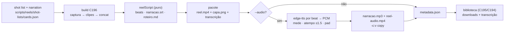

# Impl: Skill de reels: narração rascunho (TTS pt-BR) + transcrição sempre

Status: aprovado
Atualizado em: 2026-09-18
Issue: #1156
Intenção: docs/plans/reels-narracao.md
Appetite restante: ~1 dia eng (herdado). Transcrição sempre + áudio `--audio` de ponta a ponta; se estourar, corta `voice` no metadata e o override de voz — nunca a transcrição sempre nem o fit fail-closed da fala na cena.

## Leitura da intenção

- **Outcome:** todo pacote do motor C196 sai com transcrição do roteiro (`narracao.srt` + `roteiro.md`) para a assessoria regravar, e, quando o gate pedir, sai também `narracao.mp3` (TTS pt-BR de rascunho) + `reel-audio.mp4` (mesma trilha de vídeo com áudio muxado); a decisão da voz final é humana.
- **O que NÃO negociar:** nada de clonagem de voz/áudio do Solla; sem música licenciada; sem publicação automática/`is_ai_generated`; o texto falado é o roteiro aprovado no gate (a skill não parafraseia); a trilha de vídeo de `reel.mp4` e `reel-audio.mp4` é idêntica; o áudio é rascunho e cabe na duração do vídeo; o `.srt`/`roteiro.md` saem **sempre**.
- **O que reavaliar:** (1) a costura real é maior que "produzir arquivos" — o pacote C196 hoje **não** tem `coverAlt`/`durationSeconds`/`narracao.srt`/`roteiro.md`, então o ingest C195 o recusaria; fechar essa lacuna é a fase 1; (2) adicionar `narration`/`coverAlt` normalizados **muda o hash** do `cards` (nova versão C197 do reel, registrada); (3) o binário ffmpeg empacotado não tem `ffprobe` — a medição de fala tem de ser por PCM decodificado (verificado: o 4.1 empacotado tem `libmp3lame`, `atempo`, `aresample` e muxer `mp3`).

## Abordagem recomendada

**Opções consideradas:** 8 decisões caras (texto narrado | provider/instalação do TTS | encaixe na duração | SRT e roteiro | mux | metadata | flag/gate | módulos) — cada uma com recomendação ancorada e rejeitadas abaixo.

**Recomendação:** fechar primeiro a costura de transcrição (sempre, sem TTS) — tracer que já entrega o aceite duro e torna o pacote ingerível pelo C195 — e só então plugar o TTS atrás de `--audio`, com resolução fail-closed antes da captura e fit por cena com teto.

### Decisão 1 — Texto narrado

Opções: A) `narration` opcional por cena, com fallback: capture = `caption.parts` concatenados (o `accent` é só estilo), graphic = silêncio | B) `narration` obrigatório em toda cena | C) sem campo novo, narração = caption sempre (hook/CTA mudas).
Recomendação: **A** — o campo é copiado explicitamente na normalização (`normalizeCaptureScene`/`normalizeGraphicScene` em `scripts/lib/reelShotList.mjs:137-180`), entra no hash e mantém o shot list C196 válido (as capturas seguem falando exatamente a legenda aprovada); o `cards.json` ganha `narration` explícita no `hook` e no `cta`, cuja copy vive no template HTML (`reelTemplates.mjs`) e não no shot list — sem isso o roteiro teria buracos no começo e no fim. `narration` ausente/`null` → fallback; string não vazia (trim, ≤600 chars) → fala.
Rejeitadas: B porque obriga a duplicar a legenda em todas as cenas sem ganho de produto e atrasa o tracer; C porque hook/CTA nunca teriam fala e a assessoria não poderia ajustar a fala independente da legenda.

### Decisão 2 — Provider TTS, instalação e descoberta

Opções: A) `edge-tts` (Microsoft, grátis, sem key) em venv dedicado `scripts/reels/.venv`, com setup por `pnpm reels:tts:setup` e descoberta `EDGE_TTS_PATH` → venv → PATH, fail-closed | B) cloud com key (Google/Azure) | C) `edge-tts` global (`pip --user`/`pipx`/sistema) | D) OpenAI TTS.
Recomendação: **A** — a máquina tem Python 3.12 e `venv`+`ensurepip` (pip 24.0) funcionam sem `pip`/`pipx` de sistema; o venv isola o provider do deploy (`pnpm install --frozen-lockfile` intacto, nenhuma dep npm nova; TTS é script local) e não exige credencial. `pnpm reels:tts:setup` cria o venv e instala/atualiza o `edge-tts`; a build resolve e faz probe (`--version`, exit 0) com mensagem pt-BR acionável; voz default `pt-BR-AntonioNeural` (masculina, institucional/rascunho), override `--voice=`/`REELS_TTS_VOICE`.
Rejeitadas: B porque exige credencial, billing e manda o roteiro para a nuvem por um rascunho (upgrade futuro se a qualidade incomodar); C porque não há `pip`/`pipx` de sistema e instalação global contamina a workstation; D porque a OPS123 reserva `openai/*` ao design.

### Decisão 3 — Encaixe do áudio na duração do vídeo

Opções: A) sintetizar **por beat** (cena), medir a duração exata do PCM decodificado, aplicar `atempo` local com teto 1.5, preencher com silêncio até a duração exata da cena e concatenar o PCM = duração do vídeo | B) sintetizar o roteiro inteiro de uma vez e muxar com `-shortest` | C) esticar sem teto ou truncar.
Recomendação: **A** — cada beat fica preso à janela da cena (`plan.durationMs`, cuja soma já é o `totalDurationMs`); decodificar para PCM `s16le` 24 kHz mono e medir por `bytes / (24000 × 2)` dispensa `ffprobe` (ausente no binário empacotado) e é matemática pura unit-testável; o padding em Node (`Buffer.alloc`) fecha a trilha no tamanho exato; `atempo` só acelera (nunca desacelera: fala curta é pad), e estourar 1.5 vira erro com cena, falado e disponível — fala inteligível em vez de robotizada.
Rejeitadas: B porque o drift acumula cena a cena e o `-shortest` corta fala ou vídeo em silêncio (exatamente o "corta cedo demais"); C porque além de 1.5 perde a inteligibilidade e truncar joga fora o roteiro aprovado.

### Decisão 4 — `narracao.srt` e `roteiro.md` (puros)

Opções: A) um bloco por cena com fala, timecodes cumulativos na ordem de `shotList.scenes`, derivados dos planos; `roteiro.md` com duração/hash e cada cena com janela e fala (cenas mudas marcadas); UTF-8, LF, sem quebra interna | B) SRT por palavra via `--write-subtitles` do edge-tts | C) transcrição só no `roteiro.md`.
Recomendação: **A** — casa com o aceite "um bloco por beat" e com o corte declarado ("timestamps perfeitos: um bloco por beat, simples"); nada de heurística de fala, e a transcrição é gerada pelo mesmo caminho com ou sem áudio (o `.srt` nunca depende de rede/TTS). Formatação `HH:MM:SS,mmm --> HH:MM:SS,mmm`, índice crescente, cenas sem fala fora do `.srt`.
Rejeitadas: B porque acopla a transcrição (aceite duro, sempre) ao provider/rede e produz timestamps de fala, não de cena; C porque a intenção e o contrato C195 pedem `.srt` (kind `captions`).

### Decisão 5 — Mux de `reel-audio.mp4`

Opções: A) `-i reel.mp4 -i narracao.mp3 -map 0:v -map 1:a -c:v copy -c:a aac -b:a 128k -shortest -movflags +faststart` | B) re-encodar o vídeo junto | C) só `narracao.mp3`, sem variante de vídeo.
Recomendação: **A** — `-c:v copy` garante a trilha de vídeo **idêntica** entre as duas variantes (aceite literal); AAC 128 kbps mono basta para rascunho; `-shortest` é cinto sobre o padding exato (a granularidade de frame do MP3 pode somar ~26 ms de priming). Roda imediatamente depois do concat, quando `reel.mp4` já está no pacote.
Rejeitadas: B porque quebra o aceite da trilha idêntica e custa minutos de CPU; C porque o contrato C195 já define `reel-audio.mp4` (kind `video-audio`).

### Decisão 6 — Metadata/manifesto

Opções: A) manter o metadata C196 e acrescentar `coverAlt`, `durationSeconds`, `audio`, `voice` (quando houver) e `artifacts` com os nomes escritos | B) mínimo: só `coverAlt` + `durationSeconds` (o que o ingest valida) | C) derivar a lista de `REEL_PACKAGE_ARTIFACTS` de `src/lib/reel.ts`.
Recomendação: **A** — fecha a lacuna que hoje recusaria o pacote (`coverAlt` é obrigatório no ingest, `scripts/lib/reel-ingest.mjs:216-219`) e cumpre o "manifesto lista todos os arquivos gerados" da intenção; `artifacts` é derivado do que o build **escreveu** (`reel.mp4`, `capa.png`, `narracao.srt`, `roteiro.md`, + `narracao.mp3`/`reel-audio.mp4` com áudio), e chaves extras são ignoradas pelo ingest (forward-compat, `reelPackageIssues`). `coverAlt` vem de campo top-level opcional do shot list com fallback `title`; `durationSeconds = seconds(durationMs)`.
Rejeitadas: B porque não cumpre o manifesto da intenção; C porque `build-reel.mjs` roda em `node` puro (sem loader tsx) e não importa o `.ts` — listar o que foi escrito é mais honesto que o catálogo do servidor (que é lido, não editado).

### Decisão 7 — Flag e gate

Opções: A) `--audio` bare, default sem áudio, com a skill perguntando "com ou sem áudio?" no gate **antes** de gerar | B) `--with-audio` | C) `--no-audio` (default com áudio).
Recomendação: **A** — o padrão é sem áudio (a legenda queimada é o formato primário) e o flag marca o desvio; `parseEqualsFlags` (`scripts/lib/cli.mjs:34-48`) devolve `true` no bare e a build **rejeita** `--audio=<valor>` (nada de `--audio=false` truthy) e `--audio` + `--capture-only` (erro explícito). Mudar de ideia depois do gate = re-rodar com `--audio` (recaptura aceita; revisitar se doer).
Rejeitadas: B por ser o mesmo flag com nome maior; C porque contraria a intenção (áudio draft não é o padrão) e encareceria todo build.

### Decisão 8 — Estrutura de módulos

Opções: A) `scripts/lib/reelScript.mjs` (puro: fala/fallback, beats, SRT, roteiro, fator de tempo e samples) + `scripts/lib/reelTts.mjs` (resolução/setup/síntese/trilha), com os args de áudio e mux no `reelFfmpeg.mjs` (dono do ffmpeg) | B) um módulo só `reelNarration.mjs` | C) espalhar nos módulos C196 existentes.
Recomendação: **A** — separa matemática pura (unit sem processo) de provider/rede (`run` injetável como em `probeFfmpeg`), espelhando a divisão `reelTimeline` (puro) / `reelFfmpeg` (I/O); os comandos de áudio ficam no dono do ffmpeg em vez de um segundo montador de args; `build-reel.mjs` só orquestra; `--dry-run` usa só o `reelScript` (imprime a fala por cena sem tocar em TTS).
Rejeitadas: B porque mistura pureza com rede e obriga mock de processo nos testes de formatação; C porque transcrição pura e provider TTS não pertencem a timeline/captura/ffmpeg.

### Componentes / mudanças

- **`scripts/lib/reelScript.mjs`** (novo, puro): `resolveSceneNarration` (fallback da Decisão 1), `buildScriptBeats({ shotList, plans })`, `formatSrtTime`, `buildReelSrt`, `buildReelRoteiro`, `fitBeat` (fator `tempo` com teto e flag de estouro) e `padPcmToSamples`; sem I/O.
- **`scripts/lib/reelTts.mjs`** (novo, I/O com `run` injetável): `TTS_VENV_DIR` (`scripts/reels/.venv`), `DEFAULT_TTS_VOICE`, `resolveEdgeTts` (`EDGE_TTS_PATH` estrito → venv → PATH, probe `--version`), `setupEdgeTts` (`python3 -m venv` + `pip install --upgrade edge-tts`), `synthesizeBeat` (texto por **arquivo**, `--file`, nunca no argv) e `buildNarrationTrack` (por beat: decodifica → mede PCM → `atempo`/pad → concat em Node → um encode `narracao.mp3`); reusa `runFfmpeg`, `sha256Hex`, `dieWithLabel`.
- **`scripts/reels-tts-setup.mjs`** (novo, entry fino): chama `setupEdgeTts` e imprime caminho/versão; exposto como `pnpm reels:tts:setup`.
- **`scripts/lib/reelFfmpeg.mjs`** (edição no dono): `probeFfmpeg(bin, { run, audio })` — com `audio: true` exige também encoder `libmp3lame` e filtro `atempo` (fail-closed pt-BR); `resolveFfmpeg({ …, audio })` repassa; `buildAudioDecodeArgs` (mp3 → `s16le` 24k mono, `atempo` opcional), `buildNarrationEncodeArgs` (PCM → mp3 `-b:a 128k`) e `buildMuxAudioVideoArgs` (Decisão 5).
- **`scripts/lib/reelShotList.mjs`** (edição no dono): normaliza `narration` (capture/gráfica) e `coverAlt` top-level (fallback `title`); único dono do schema/hash.
- **`scripts/lib/reelPackage.mjs`** (edição no dono): `buildReelMetadata({ …, audio = false, voice, artifacts })` com `coverAlt`, `durationSeconds`, `audio`, `artifacts`.
- **`scripts/build-reel.mjs`** (orquestração): flags `--audio`/`--voice=`; resolve TTS **antes** do browser quando `--audio` (falha cedo); escreve `narracao.srt`/`roteiro.md` em todo build; com áudio, gera trilha + mux + metadata completo.
- **`scripts/reels/shot-lists/cards.json`**: `coverAlt` + `narration` no hook/CTA; capturas usam o fallback da legenda. **Hash muda** — nova versão C197 do reel (registrado).
- **`.agents/skills/reels-tutoriais/SKILL.md`**: gate pergunta "com ou sem áudio?" (default sem), pacote com transcrição sempre (+ mp3/mp4 com áudio), pré-requisitos/setup do TTS (`pnpm reels:tts:setup`, `EDGE_TTS_PATH`), troubleshooting (rede/probe/atempo) e áudio fora do "Fora de escopo" (clonagem/música/publicação seguem fora).
- **`.gitignore`**: `scripts/reels/.venv/`. **`package.json`**: só o script `reels:tts:setup` (nenhuma dep npm nova).
- **Testes**: novos `tests/unit/reelScript.unit.spec.ts` e `reelTts.unit.spec.ts`; extensão de `reelShotList.unit.spec.ts`, `reelFfmpeg.unit.spec.ts` e atualização do pin exato de metadata/skill em `reelsTutoriaisSkill.unit.spec.ts:15-76`; `tests/fixtures/fake-ffmpeg.mjs` e runners injetados como molde.
- **`docs/changelog/2026-09-18-c197.md`**: entrega + mudança de hash.
- **Migration:** sem migration. **Access/Consent:** não se aplica (script local; o site é visitado anônimo; nada escreve no banco). **UI:** sem UI nova — a superfície gráfica do reel é do C196 e a transcrição/áudio não mudam layout; declarar **non-trigger** do designer (decisão registrada).

### Dados → forma (se aplicável)

Não se aplica: a intenção declara "não vou apresentar dados"; aqui só áudio/texto derivados do shot list.

## Fases verificáveis

1. **Tracer — transcrição sempre (fecha a costura C195, sem TTS):** `narration`/`coverAlt` no `reelShotList`; `reelScript.mjs`; build escreve `narracao.srt` + `roteiro.md`; `reelPackage` com `coverAlt`/`durationSeconds`/`artifacts`; `cards.json` com fala no hook/CTA; units. Verificação real: `pnpm reels:build cards` gera o pacote e `pnpm reels:ingest data/reels/cards` (sem `--apply`, alvo local) **aceita** — a lacuna da intenção fecha aqui, antes de qualquer TTS.
2. **Áudio TTS (`--audio`):** setup + `reelTts.mjs` + probe/args de áudio no `reelFfmpeg` + fluxo no build + metadata `audio`/`voice`; units com `run` injetado e fake-ffmpeg. Verificação: `pnpm reels:tts:setup`; `pnpm reels:build cards --audio`; `narracao.mp3` com duração = vídeo; `reel-audio.mp4` com stream de vídeo copiado e áudio AAC; estouro de `atempo` falha com mensagem acionável.
3. **Skill/gate + docs:** `SKILL.md`, pins do teste de skill/command, `.gitignore`, script do `package.json`, changelog.
4. **Gates:** `pnpm gate:fast` na iteração; entrega via `pnpm push` (CI/deploy cuidam do resto; sem schema, o deploy não muda comportamento).

## Rabbit holes / Não escopo (engenharia)

- Clonagem de voz/áudio do Solla; música/trilha; publicação e `is_ai_generated` (humano).
- Loudness/limiter/mixagem, efeitos e "naturalidade" além do rascunho inteligível.
- STT/legenda automática; SRT por palavra; quebra de linha perfeita.
- Múltiplas takes, voz por cena, editar a fala no gate (edita-se o shot list).
- `--audio-only`/reuso da captura via `plans.json` — recaptura é o caminho (revisitar se o custo no gate doer).
- Waveform/player/preview de áudio na biblioteca (C194) ou no gate.
- Providers cloud (Google/Azure/OpenAI TTS) — revisável se a qualidade incomodar.
- Tocar schema/servidor/site público: o contrato C195/C194 é consumido como está (nenhuma edição em `src/lib/reel.ts`).

## Débitos da triage do simplify (não reabrir)

- **S1 `RunFn` local no `reelTts`** — defer: gatilho na próxima edição do módulo (typedef JSDoc local não muda contrato nem runtime).
- **S2 `createdAt` sem produtor / `artifacts` write-only no contrato C195** — defer cross-item: gatilho no 2º consumidor do metadata (o ingest ignora chaves extras de propósito).
- **S3 cast redundante em teste / S5 `atempo` só em beat que estoura** — descartados (pureza de teste / comportamento intencional).
- **S4 decode de 0 bytes viraria beat mudo** — defer teórico: o ffmpeg falha fechado numa síntese vazia; gatilho na primeira ocorrência real.

## Riscos e mitigação

- **edge-tts indisponível/offline:** resolução + probe **antes** da captura quando `--audio`; falha fechada com `pnpm reels:tts:setup`/`EDGE_TTS_PATH`; rede cai no meio → erro com stderr e re-run (pacote anterior não é declarado válido).
- **Fala estoura a cena:** `atempo` ≤1.5 + erro com cena, falado e disponível; acima disso a saída é encurtar a fala no shot list ou dividir a cena — nunca esticar mais.
- **Hash muda:** `cards` vira nova versão; C195 identifica por `shotListHash` (reel C196 já ingerido ficaria como versão antiga; não há reel C196 ingerido hoje); registrar no changelog.
- **venv/deploy:** nenhuma dep npm; `scripts/reels/.venv` gitignored; Docker/`--frozen-lockfile` intocados; knip não varre o venv (project glob é `scripts/**/*.mjs`).
- **Tmp de áudio:** `data/reels/.work/<slug>/audio/` (já coberto por `/data/reels/`).
- **Aspas/emoji/newline na fala:** texto vai por arquivo (`--file`), argv só tem caminho; `execFile` com array; unit cobre string com aspas e emoji.
- **Duração sem ffprobe:** PCM `s16le` 24 kHz mono medido por bytes; puro e unit-testado; fake-ffmpeg/runner injetado cobre a orquestração.
- **Pin exato do metadata quebra:** atualização intencional do `toEqual` de `reelsTutoriaisSkill.unit.spec.ts` com as chaves novas listadas.
- **Binário empacotado antigo (4.1):** verificado localmente que tem `libmp3lame`, `atempo`, `aresample` e muxer `mp3`; o probe de áudio falha fechado em qualquer binário que não tenha.
- **Priming do MP3 (~26 ms):** `-shortest` no mux; o mp3 standalone pode exceder o vídeo em milissegundos — aceito no rascunho.

## Aceite de engenharia

- [ ] Aceite de produto da intenção ainda coberto (transcrição sempre; áudio opcional; trilha idêntica; TTS pt-BR draft sem clonagem/música/publicação; downloads e transcrição na biblioteca já servidos pelo C195/C194).
- [ ] Invariantes AGENTS/engineering-standards: identificadores em inglês/strings pt-BR; `scripts/**` em `.mjs`; knip `exports:error` sem export órfão; command/skill prettier-formatados; zero schema/migration/site público; nenhuma dep npm nova; `src/lib/reel.ts` intocado.
- [ ] Testes de domínio previstos: unit de `reelScript` (fallback/beats/SRT/roteiro/fit/pad), `reelShotList` (narration/coverAlt e rejeições), `reelFfmpeg` (probe de áudio e args de decode/encode/mux) e `reelTts` (ordem de resolução/setup com run injetado), pin de skill/command atualizado; sem int/e2e novos; verificação real no gate (build + `reels:ingest` dry).
- [ ] `pnpm gate:fast` verde e entrega por `pnpm push`.

## Self-score decision-quality

| #   | Critério                      | Nota | Por quê                                                                                                                          |
| --- | ----------------------------- | ---- | -------------------------------------------------------------------------------------------------------------------------------- |
| 1   | Decisões caras com rejeitadas | 5    | As 8 decisões caras têm opções, recomendação ancorada em verificação local (venv, endpoint, capacidades do ffmpeg) e rejeitadas. |
| 2   | Cabe no appetite              | 5    | ~1 dia; tracer fecha o aceite duro sem TTS; cortes declarados (`voice`/override).                                                |
| 3   | Rabbit holes nomeados         | 5    | Clonagem, música, loudness, STT, takes, preview, `--audio-only`, providers cloud.                                                |
| 4   | Depth check                   | 4    | Reusa `cli.mjs`, `runFfmpeg`, probe injetável e fake-ffmpeg; módulos novos separam puro de I/O; nada gêmeo.                      |
| 5   | Intenção preservada           | 5    | Outcome, gate, anti-goals e "roteiro aprovado" intactos; engenharia não reescreveu o produto.                                    |

Média: **4,8** (gate ≥4 satisfeito).
