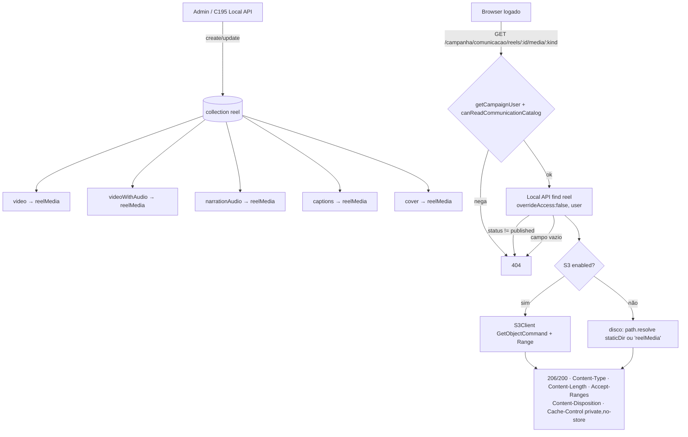

# Impl: Reel privado no CMS

Status: aprovado
Atualizado em: 2026-09-18
Issue: #1152
Intenção: docs/plans/reels-reel-privado.md
Appetite restante: herdado (~1 dia eng; um reel registrável de ponta a ponta com arquivos privados e kill switch)

## Leitura da intenção

- **Outcome:** uma collection `reel` na vertical de Comunicação registra título, funcionalidade-alvo (`cards`) e os artefatos do reel (vídeo sem áudio primário, variante com áudio, mp3 da narração, `.srt`, transcrição e capa), com `status` `draft | published | unpublished` funcionando como kill switch. Os arquivos são privados: só abrem com login de campanha; `unpublished` deixa de servi-los. O site público e os cards não mudam. C194 (biblioteca) consome o modelo e o caminho autenticado de mídia; C195 (ingestão Local API) escreve no mesmo modelo.
- **O que NÃO negociar:**
  - Privacidade do arquivo: anônimo e navegador sem sessão recebem não; `Media.read` público intocado (`src/collections/Media.ts:16-21`, pino em `tests/int/collectionAccessLockdown.int.spec.ts:224-249`).
  - Site público e `#cards` idênticos; nenhuma URL pública nova.
  - Sem publicação automática no Instagram, sem segundo cadastro de pessoa, sem clone de voz, sem `Consent` novo (mídia interna de staff, sem PII).
  - Papéis da comunicação (`communicator`/`coordinator`/`candidate`); `advisor`/`leader` negados fail-closed.
  - Arquivos aceitos como enviados: sem transcode, compressão, thumb derivada ou versionamento.
- **O que reavaliar:**
  - `revalidateDocumentById` no `afterChange`/`afterDelete` do `reel`: não há cache público nem `unstable_cache` do reel. Dispersável; documentado abaixo (mantido apenas se houver leitura cacheada — não há no C193).
  - e2e: sem UI no C193; a cobertura de fluxo fica para o C194. Registrado como decisão, não como lacuna.
  - A questão de produto "`unpublished` esconde só da listagem ou invalida o arquivo?" conflita com a recomendação do C194. O C193 **adota B (invalidar o arquivo)** e marca como decisão assumida a confirmar no gate.

## Abordagem recomendada

**Opções consideradas:** A | B | C

- **Serving privado — A (recomendada):** rota Next `GET /campanha/comunicacao/reels/[id]/media/[kind]/route.ts`; gate por `getCampaignUser()` + `canReadCommunicationCatalog`; carrega o `reel` com Local API `overrideAccess: false, user`; streama o objeto direto (S3 `GetObjectCommand` com `Range`, ou disco local). Reusa `parseRangeHeader`/`getRangeRequestInfo` de `payload/internal` (os mesmos helpers do handler local/S3, `node_modules/payload/dist/uploads/endpoints/getFile.js:19,51-53`). O cookie `campaign-token` tem `path='/campanha'` (`src/utilities/campaignAuth.ts:12-13`), e a rota vive sob `/campanha` — o cookie chega; `<video>`/`` não mandam header, mas a rota é gated por sessão, não por `Authorization`.
  - **B — URL assinada S3 (rejeitada):** `signedDownloads` aponta para o endpoint interno (`host.docker.internal:3900`), inalcançável pelo browser.
  - **C — self-fetch para `/api/reelMedia/file/...` com `Authorization: JWT` (rejeitada, mantida como revisitação):** reusaria o streaming do plugin, mas exige request HTTP do processo a si mesmo pela URL pública (túnel Cloudflare), com risco de latência/loop. Preterida.
- **Modelo — A (recomendada):** collection `reel` (group `'Comunicação'`) + collection de upload privada `reelMedia`, separada de `media`. Justificativa: `media` é o contrato de leitura pública (`Media.ts:16-21`), pino de lockdown; colocá-la atrás de login quebraria o site. Rejeitadas: **reusar `media`** (quebra leitura anônima) e **um único campo upload com arquivos mistos** (perde discriminação de artefato, tipo e downloads por `kind` que o C194 consome).
- **RBAC — A (recomendada):** renomear `canReadSpeechCatalog` → `canReadCommunicationCatalog` em `src/lib/campaignRoles.ts:25` (o predicado é da vertical de comunicação inteira; reels usam o mesmo conjunto) e atualizar ~23 referências em 7 arquivos (`actions/speech.ts`, `campaignPageActor.ts`, `findSpeechExcerpts.ts`, `poster/route.ts`, `nav.ts`, `access/speeches.ts`, `schemas/speechVod.ts`) + barrel. Rejeitada: criar um twin `canReadReelCatalog` (duplicaria o predicado — fere "edit the owner, don't twin").
- **Feature — A (recomendada):** lista fechada em `src/lib/reel.ts`, começando por `cards`; rejeitada texto livre (variação de grafia, sem agrupamento).
- **Aprovação (`draft → published`) — A (recomendada, assumida):** qualquer um dos três papéis da comunicação; rejeitada restringir a coordinator/candidate (a assessoria produz e aprova; coordinator/candidate mantêm o kill switch).

**Recomendação:** modelo `reel` + `reelMedia`, access em `src/utilities/access/reels.ts`, rename do predicado, serving por rota autenticada sob `/campanha` streamando direto do S3/disco. Sem UI.

### Componentes / mudanças

- **`Reel`** (`src/collections/Reel.ts`, novo): slug `reel`; labels singular `Reel`, plural `Reels`; `admin.group: 'Comunicação'`; `useAsTitle: 'title'`; `defaultColumns: ['title', 'feature', 'status', 'publishedAt']`; `admin.description` explicando que os arquivos são privados e que despublicar tira do ar. Campos: `title` (text, required, `maxLength` de `src/lib/reel.ts`); `feature` (select, required, options de `REEL_FEATURES`); `status` (select, required, default `draft`, index, options de `REEL_STATUSES`, `admin.description` do kill switch); `video` (upload → `reelMedia`, required — primário sem áudio); `videoWithAudio` (upload → `reelMedia`, opcional); `narrationAudio` (upload → `reelMedia`, opcional); `captions` (upload → `reelMedia`, opcional); `transcript` (textarea, opcional — roteiro/transcrição); `cover` (upload → `reelMedia`, required); `publishedAt` (date, readOnly); `systemStampedActorField({ setAccess: canSetCampaignSystemField })`. Access: `create`/`update`/`read` = `canReadReel`, `delete` = `canDeleteReel` (predicado próprio, forma de `canDeleteSpeechCut` em `src/utilities/access/speeches.ts:39-44`). Hooks: `beforeChange: [stampCampaignCreatedBy]`. **Dispensa de `revalidateDocumentById`:** o `reel` não é lido por `getCachedDocumentById`/`unstable_cache` nem renderizado em RSC público; não há tag a bustar. Reavaliar se o C194 introduzir leitura cacheada.
- **`ReelMedia`** (`src/collections/ReelMedia.ts`, novo): slug `reelMedia`; labels singular `Mídia de reel`, plural `Mídias de reel`; `admin.group: 'Comunicação'`; `upload: true`; campo `alt` (text, required); access `read`/`create`/`update` = `canReadReel`, `delete` = `canDeleteReel`. **Não** entra em nenhuma superfície pública (sem rota `/api/reelMedia/file` consumida pelo site). Justificativa da separação versus `media`: o bucket é privado via proxy, mas o access de `media` é `read: () => true`; reusá-la entregaria os arquivos a qualquer um que descubra o filename.
- **`src/lib/reel.ts`** (novo): constantes puras e client-safe — `REEL_STATUSES` (`draft|published|unpublished`), `REEL_FEATURES` (`['cards']`), `REEL_TITLE_MAX_LENGTH`, `REEL_MEDIA_SLUG`, labels pt-BR (`reelStatusLabels`, `reelFeatureLabels`) e o mapa `kind → campo` (`REEL_MEDIA_KINDS`/`reelMediaFieldByKind`). **`src/lib/reelMedia.ts`** (novo): regras puras da resposta HTTP (content type allowlisted, content disposition, headers de range/cache). Fonte única consumida pela collection, pela rota e pelos unit tests.
- **`src/lib/campaignRoles.ts`** (editar): renomear `canReadSpeechCatalog` → `canReadCommunicationCatalog` e atualizar o comentário; nenhuma mudança de comportamento.
- **`src/utilities/access/reels.ts`** (novo): `canReadReel` e `canDeleteReel`, forma de `speeches.ts` — `isPayloadAdmin(req.user)` → `true`; `getFreshCampaignUser(req)` → `canReadCommunicationCatalog(role)`; senão `false`. `canDeleteReel` é predicado próprio (nunca alias de `canReadReel`), para que ampliar leitura não conceda delete. Reexport no barrel `src/utilities/campaignAccess.ts` (bloco após `speeches`, linhas ~172-177).
- **`src/utilities/reels/reelMediaResponse.ts`** (novo, subpasta de domínio — o top-level de `src/utilities/` é pinado por `tests/unit/codebaseConventions.unit.spec.ts:405-533`): responsabilidade única de montar a resposta de streaming, separando o puro do I/O — parser dos headers (`Range`, `?download=1` → `Content-Disposition: attachment`, `Cache-Control: private, no-store`, `Content-Type`, `Content-Length`, `Accept-Ranges`) testável sem rede, e a resolução do objeto (`resolveS3StorageEnv().enabled` → `S3Client` + `GetObjectCommand`; senão `path.resolve(staticDir || 'reelMedia', filename)`), com `parseRangeHeader`/`getRangeRequestInfo` para 206/416. `@aws-sdk/client-s3` já é dependência direta (`package.json`), usada em `scripts/recover-media.mjs`.
- **`route.ts`** (`src/app/(campaign)/campanha/(app)/comunicacao/reels/[id]/media/[kind]/route.ts`, novo): `export const dynamic = 'force-dynamic'`; `getCampaignUser()` + `canReadCommunicationCatalog` (senão 404); valida `id` inteiro e `kind ∈ REEL_MEDIA_KINDS`; Local API `find` do `reel` com `overrideAccess: false, user`, `depth: 0`; **kill switch** → só serve quando `status === 'published'` (`draft`/`unpublished` → 404); resolve o upload do campo do `kind` (vazio → 404); delega ao `reelMediaResponse`. Espelha o formato do precedente `.../acervo/[id]/poster/route.ts:53-89` (rota interna, 404 silencioso para não vazar existência).
- **`payload.config.ts`** (editar): importar `Reel`/`ReelMedia`, registrar em `collections` (junto de `Media`, linhas 100-133) e adicionar `reelMedia: true` ao `s3Storage({ collections: { media: true, reelMedia: true } })` (linhas 160-178). Sem isso, `reelMedia` cai em disco local mesmo com S3 ligado — inaceitável em prod. O plugin é condicionado a `mediaStorage.enabled` (`resolveS3StorageEnv`, fail-closed).
- **Migration:** `pnpm migrate:create add_reel` — cria `reel`, `reel_media`, enums (`enum_reel_status`, `enum_reel_feature`), colunas de FK para `reel_media`/`campaign_user`, `payload_locked_documents_rels`, índices (`status`). Referência de forma: `src/migrations/20260915_122356_add_speech_cut.ts`. Registrar `.ts`+`.json`+`index.ts`. **Nunca editar migrações antigas.**
- **Access / Consent:** `src/utilities/access/reels.ts` (novo) reexportado pelo barrel; leituras sempre `overrideAccess: false` + `user`; `Media.read` intocado. **Sem `Consent`** — mídia interna de staff, sem PII; nenhum fluxo de opt-in nasce aqui.
- **UI:** Impeccable **A — N/A sem UI**. Nenhum componente, shell ou tela neste item. A rota de mídia não é tela; o C194 monta a lista/detalhe e o painel de downloads consumindo o contrato.

### Dados → forma (se aplicável)

O C194 consome o contrato; o C193 fixa a forma. Cada artefato é um `upload` 1:1 com `reelMedia`; o `kind` da URL mapeia para o campo e para o content type:

| `kind`        | Campo            | Obrigatório | Content-Type típico        |
| ------------- | ---------------- | ----------- | -------------------------- |
| `video`       | `video`          | sim         | `video/mp4`                |
| `video-audio` | `videoWithAudio` | não         | `video/mp4`                |
| `narration`   | `narrationAudio` | não         | `audio/mpeg`               |
| `captions`    | `captions`       | não         | `application/x-subrip`     |
| `cover`       | `cover`          | sim         | `image/png` / `image/jpeg` |

- Leitura de lista/detalhe para o C194: `reel` filtrado por `status: published` (a biblioteca) e o detalhe com os `kind`s disponíveis; nenhuma projeção nova no C193 além do que o access/admin já expõe.
- Sem agregação, sem métrica, sem gráfico. Nada a apresentar.

## Fases verificáveis

1. **Puro + RBAC (unit).** Criar `src/lib/reel.ts` (constantes, labels, mapa `kind → campo`, content types) e renomear `canReadSpeechCatalog` → `canReadCommunicationCatalog` com todas as referências e o barrel. Unit: boundary das listas, mapa `kind → campo`, parser puro de headers (`Range`/`download`/`Cache-Control`), comportamento do predicado renomeado.
2. **Collections + access + storage.** Criar `Reel`/`ReelMedia`, `src/utilities/access/reels.ts` + reexport, registrar em `payload.config.ts` e no `s3Storage.collections`. Editar `campaignAccess.ts`. `pnpm generate:types`.
3. **Migration (HARD-STOP de aprovação humana).** `pnpm migrate:create add_reel` → revisar SQL (tabelas, enums, FKs, rels, índices) → aprovação registrada → `pnpm migrate` local. Nunca editar migrações antigas.
4. **Serving privado.** Criar `src/utilities/reels/reelMediaResponse.ts` e a rota `.../reels/[id]/media/[kind]/route.ts`. Unit do parser e do mapa; int de integração da rota (matriz de papéis + kill switch).
5. **Testes int + e2e (decisão).** `tests/int/reel.int.spec.ts` e `tests/int/reelMedia.int.spec.ts` seguindo `tests/int/speechCut.int.spec.ts` (mock de `next/cache` conforme :22-26). Registrar que e2e de fluxo fica no C194 (sem UI); a mudança em `src/utilities/access` e em `src/lib/campaignRoles` já acorda os specs curados de RBAC/comunicação pelo manifest (`scripts/lib/e2e-affected-manifest.mjs:254,310-313`).
6. **Gates** — `pnpm gate:fast`; push via `pnpm push`.

## Hard-stops (aprovação humana explícita)

1. **Migração de schema** (Fase 3): aprovada na sessão `--auto` (2026-09-18) para criar/aplicar `add_reel` **só no banco local** do worktree; nunca editar migrações antigas, nunca tocar banco remoto/prod.
2. **`unpublished` invalida o acesso ao arquivo** (recomendação B do C193): **decidido B** (2026-09-18) — `draft`/`unpublished` → 404 no serving. Se o C194 quiser link direto para despublicado, reabrir produto.
3. **Feature como lista fechada** (`cards`) e **aprovação por qualquer um dos três papéis**: **confirmadas** as recomendações A (2026-09-18).

## Rabbit holes / Não escopo (engenharia)

- Transcode, compressão, extração de thumb/frame, normalização de áudio, mux de vídeo+áudio.
- Versionamento/revisão de artefatos: um artefato por formato; trocar = substituir.
- STT/geração de `.srt`/legenda automática ou clone de voz.
- Galeria pública, embed no site, publicação/agendamento no Instagram, métricas sociais.
- CRUD de catálogo de funcionalidades (o vocabulário começa fixo).
- UI de biblioteca, player 9:16, painel de downloads e rotas autenticadas de página — C194.
- Upload/ingestão automática de pacote e watcher do homeserver — C195.
- Renomear `Media` ou mudar seu access; rota pública nova; `Consent` novo.

## Riscos e mitigação

- **Vazamento de arquivo privado por `media`/rota pública.** Mitigação: `reelMedia` separada, sem superfície pública; `Media.read` intocado e pinado no lockdown; rota sempre gated + Local API `overrideAccess: false`.
- **S3 ausente/parcial.** Mitigação: `resolveS3StorageEnv` fail-closed; dev/test caem em disco local. Risco residual: esquecer `reelMedia: true` no plugin — coberto no aceite e por inspeção de config.
- **Cookie não chega à rota.** Mitigação: rota sob `/campanha` (path do cookie) e gate por `getCampaignUser()`; sem depender de header em `<video>`.
- **Streaming incorreto (Range/206/416/Content-Length).** Mitigação: reusar `parseRangeHeader`/`getRangeRequestInfo` do `payload/internal` (mesma semântica do plugin) e isolar o cálculo puro em unit com `Range` inválido/aberto/fechado.
- **Kill switch com cache.** Mitigação: `Cache-Control: private, no-store` em toda resposta; sem `unstable_cache` do reel. Se o C194 introduzir cache, o hook de revalidação volta ao dono.
- **Rename do predicado tocar superfície ampla.** Mitigação: rename mecânico com unit do predicado e o manifest acordando `campaignSpeechAcervo`/`campaignSpeechCut`.
- **e2e não cobre o fluxo novo.** Mitigação: decisão registrada (C194); a superfície de risco (`src/utilities/access`, `src/lib/campaignRoles`, `${CAMPAIGN_APP}/comunicacao`) continua mapeada e roda o conjunto curado.

## Já resolvido no simplify/critique (não reabrir)

- `REEL_MEDIA_INLINE_MIME_TYPES` exportado sem consumidor (quebrava `pnpm knip`) → não exportado.
- `mimeType as string` redundante em `reelMediaContentType` → `isInlineSafe` virou type predicate.
- Spread `...(required ? { required: true } : {})` no campo de upload → `required` direto.
- Literal `'reelMedia'` duplicado (slug/staticDir/rota) → `REEL_MEDIA_SLUG` em `src/lib/reel.ts`.
- 404 da rota e do utilitário com `Cache-Control` divergentes → `REEL_MEDIA_CACHE_CONTROL` único.
- `isMissingObject` checava `httpStatusCode` (inexistente no AWS SDK v3) → `$metadata.httpStatusCode`.
- Objeto S3 de 0 byte virava 500 enquanto o disco servia 200 → alinhado (só `ContentLength` nulo falha).
- Comentário desatualizado em `nav.ts`; variável de fixture `narration` guardando `.srt`; drift de nomes no impl plan.

## Explicitamente fora (skips, descartes e defers deste triage)

- **Registrado:** ramo S3 sem teste → C198 (#1162), `docs/plans/reels-privado-hardening.md` (score 4, expensive_lock; `depends: [C193]`).
- **Defer (contrato `src/lib/reel.ts`):** `reelMediaPath` e `isReelStatus` sem call site de produção. Gatilho: primeiro consumidor no C194 (#1153)/C195 (#1154) — se sobrar sem uso no merge do C194, apagar.
- **Defer (mapa kind→campo):** `ReelMediaField` reescreve os nomes dos uploads em vez de derivar `keyof Reel` de `@/payload-types`. Gatilho: rename de campo do `Reel` ou o C194 passando a ler `reelMediaFieldByKind` — então tipar o mapa contra `keyof Reel`.
- **Descarte:** gate key `'speechCatalog'` em `campaignPageActor.ts` (rename de pureza; se o C194 tocar o gate, renomeia de carona).
- **Descarte:** corpos idênticos de `canReadReel`/`canDeleteReel` (duplicação deliberada, precedente `canDeleteSpeechCut` — nunca alias de leitura).
- **Descarte:** fallback defensivo de `staticDir` na rota (guard exigido pelo tipo do Payload; fallback sem custo).

## Aceite de engenharia

- [ ] Aceite de produto da intenção ainda coberto: registro com título/feature/status; artefatos anexáveis com vídeo sem áudio primário; nenhum arquivo abre sem login; aprovar não dispara ação externa; `unpublished` some da biblioteca e deixa de ser servido; só papéis da comunicação; site público e cards idênticos.
- [ ] Invariantes AGENTS/engineering-standards: `overrideAccess: false` + `user` em toda leitura; sem `Consent` novo; `Media.read` intocado; identificadores em inglês, copy/labels em pt-BR; "edit the owner, don't twin" (rename do predicado, sem twin); módulo novo em subpasta de domínio (`src/utilities/reels/`), sem top-level novo; migração nova sem editar antigas; `pnpm push` como caminho de entrega.
- [ ] Testes de domínio previstos (unit/int) onde access/write paths mudam: unit do predicado/mapa `kind → campo`/parser de Range; int de access (communicator/coordinator/candidate passam; advisor/leader e anônimo negados), kill switch (`draft`/`unpublished` → 404) e stamping de ator/transação.

## Self-score de decision-quality

**4.5/5.** As três decisões estruturais (collection privada separada, serving por rota autenticada streamando direto, rename do predicado) têm alternativas honestas registradas e rejeições com motivo ancorado em file:line (endpoint S3 interno, `Media.read` público, top-level pin). Perde 0,5 porque a decisão de produto sobre `unpublished` fica em conflito conhecido com o C194 e só se fecha no gate — o plano adota B e explicita o custo de reverter, mas a qualidade final depende dessa confirmação humana.
