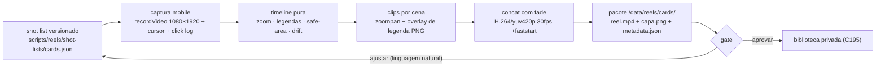

# Impl: Skill de geração de reels: captura + composição do vídeo

Status: aprovado
Atualizado em: 2026-09-18
Issue: #1155
Intenção: docs/plans/reels-tutoriais.md
Appetite restante: ~3–4 dias (herdado). Um reel `cards` publicável de ponta a ponta; se estourar, corta refino de encoding e cenas extras — nunca o tracer.

## Leitura da intenção

- **Outcome:** `/reels-tutoriais cards` entrega, a um operador não-técnico, um pacote publicável — `reel.mp4` (1080×1920, 30fps, H.264, mudo), `capa.png` e `metadata.json` com o hash do shot list — com legenda queimada, zoom/cursor nos cliques e safe zone do Instagram; o gate mostra o render e aceita "aprovar" ou ajuste em linguagem natural (que edita o shot list e regenera).
- **O que NÃO negociar:** shot list é a fonte única da verdade (ajuste só nele; o MP4 é re-executável); nada é publicado em rede social nem no Instagram (biblioteca via C195 é outro item); sem áudio (C197); sem PII real — fixture fictícia versionada; artefatos de mídia gitignored; zero mudança no site público/Payload (sem schema/migration).
- **O que reavaliar:** (1) a hipótese "ffmpeg real é pré-requisito de ambiente" cai — a workstation não tem ffmpeg no PATH e o do Playwright é stripped, então a dep empacotada do registry é fallback obrigatório (desvio registrado abaixo); (2) "recordVideo.size = viewport" da intenção é falso na prática — size 1080×1920 + viewport CSS 360×640 + `deviceScaleFactor:3` + `--force-device-scale-factor=3`; (3) "templates de legenda/capa" não existem prontos — portam o hi-fi aprovado para HTML renderizado por Playwright.

## Abordagem recomendada

**Decisão 1 — Captura.**
Opções: A) `recordVideo` do contexto com `viewport 360×640` + `deviceScaleFactor:3` + `--force-device-scale-factor=3` | B) recorder próprio via CDP `Page.startScreencast` → pipe ffmpeg com `-use_wallclock_as_timestamps` (mesmo viewport/force-dsf) | C) upscalar CSS/sequência de screenshots.
Recomendação: **B (revisada na execução)** — o spike provou que A grava frames nativos 1080×1920 **mas em CFR 25 fixo ignorando o relógio de parede** (1,2s de parede → 0,96s de vídeo; trecho estático no fim é descartado), o que desalinha zoom/cursor (derivados do log de paredes) das cenas. B usa o mesmo screencast nativo do force-dsf, preserva o tempo real (buraco estático vira frame duplicado) e entrega os frames como JPEG 90 para um H.264 intermediário ultrafast; o frame final é forçado via `page.screenshot` para não truncar a espera final. Validado: 3,05s de parede → 2,80s de timeline contínua (offset do 1º frame), sem drift.
Rejeitadas: A pela perda de sincronia (acima); C porque perde o movimento contínuo e o cursor injetado.

**Decisão 2 — Binário ffmpeg.**
Opções: A) ordem `FFMPEG_PATH` → `ffmpeg` do PATH → `@ffmpeg-installer/ffmpeg` (nova devDependency) | B) `ffmpeg-static` | C) exigir ffmpeg instalado pelo operador.
Recomendação: A — pacotes de plataforma vêm do registry npm (validado com pnpm); probe fail-closed de `libx264` + filtros usados.
Rejeitadas: B porque baixa de GitHub releases (`objects.githubusercontent.com`), host que o homeserver não alcança — mesmo motivo do override `sharp` em `pnpm-workspace.yaml:6-11`; quebraria o `pnpm install --frozen-lockfile` do deploy. C porque a persona é não-técnica e a workstation não tem ffmpeg no PATH — o fluxo tem de funcionar na primeira invocação.

**Decisão 3 — Zoom/câmera.**
Opções: A) `zoompan` em pós-processo, `d=1, s=1080x1920, fps=30`, z com easing do click log | B) `sendcmd` alterando `crop` | C) `transform` no DOM durante a captura.
Recomendação: A — comprovado no binário escolhido (H.264 High 1080×1920 30fps); manter B como fallback documentado (o crop só avalia w/h no init; x/y por frame).
Rejeitadas: C porque apps Next com portais ignoram o transform e o cursor sintético desalinha (rabbit hole já cortado na intenção); B porque a semântica de w/h fixos no init torna o zoom (escala) limitado — fica só se o zoompan regredir.

**Decisão 4 — Legenda.**
Opções: A) overlay de PNGs transparentes 1080×1920 (um por legenda, `omitBackground`) com `overlay ... enable='between(t,a,b)'` | B) `drawtext` | C) faixa de legenda em HTML sobreposta no DOM.
Recomendação: A — reproduz o estilo do design (arredondado, bicolor branco/amarelo, Brexter) e o spike confirmou o overlay do binário.
Rejeitadas: B porque o binário tem `drawtext` mas não reproduz o bicolor/peso do design (sem rico styling por palavra); C porque queimaria a legenda na captura e impediria re-render só do shot list.

**Decisão 5 — Layout de arquivos.**
Opções: A) shot list versionado em `scripts/reels/shot-lists/<slug>.json` + saídas em `/data/reels/` gitignored | B) tudo gitignored | C) tudo versionado.
Recomendação: A — o shot list é o roteiro (determinismo/revisão) e deve ser commitado; o pacote de mídia é regenerável e pode carregar imagem do mandato → gitignored, seguindo o padrão dos blocos `/data/*` em `.gitignore:78-97`.
Rejeitadas: B porque perderia a fonte da verdade e o hash; C porque `.mp4`/`.png` são artefatos e o repo é público. **Não** usar `/docs/research/reels/` — não há saída de pesquisa.

**Decisão 6 — Granularidade da composição.**
Opções: A) grafo único de filtros por cena com `concat`/`fade` num passe | B) clip H.264 intermediário por cena + concat final | C) passe único com demuxer concat.
Recomendação: B — cada cena tem timestamp local (t=0), o que isola o drift do relógio e o easing do zoompan; re-render de uma cena não recaptura o resto, e o `fade` in/out substitui o `xfade` ausente no binário 4.1.
Rejeitadas: A porque um erro de expressão numa cena derruba o render inteiro e mistura relógios; C porque o demuxer não aplica `fade` sem reencode e complica o overlay de legenda.

### Componentes / mudanças

- **`scripts/build-reel.mjs`** (novo, entrada `pnpm reels:build <slug>`): orquestra shot list → captura → clipes → concat → capa → pacote; usa `dieWithLabel`/`parseEqualsFlags`/`loadCliEnv`/`sha256Hex` (`scripts/lib/cli.mjs:18-55,23`); flags `--base-url=`, `--out-dir=`, `--work-dir=`, `--dry-run`, `--capture-only`.
- **`scripts/lib/reelShotList.mjs`** (novo): parse/normalização/validação fail-closed do shot list (cenas, steps, legendas com janelas, alvos, fixture, hook/CTA) + hash determinístico. Unit-testável sem browser.
- **`scripts/lib/reelCapture.mjs`** (novo): driver Playwright; `chromium.launch({ args: ['--force-device-scale-factor=3'] })` (precedente `launchPdfBrowser`, `scripts/lib/buildPdf.mjs:22`), context `{viewport, deviceScaleFactor:3, isMobile, hasTouch, recordVideo}`; injeta cursor SVG + halo via `addInitScript`; `page.mouse` move-antes-de-clicar; grava `click-log.json` `{t,x,y,kind,scene}`.
- **`scripts/lib/reelTimeline.mjs`** (novo, puro): deriva z/easing do click log, janelas de `overlay enable`, mapeamento de relógio (t0/clamp), matemática de safe-area (~250/672/6%) e do recorte central da capa (1080×1350). Coração testável.
- **`scripts/lib/reelFfmpeg.mjs`** (novo): resolve binário (ordem da Decisão 2, precedente `FFMPEG_PATH` em `src/utilities/speech/speechMediaPipeline.ts:17-18`); `probeFfmpeg` fail-closed (libx264 + scale,crop,zoompan,overlay,fade,concat) com erro acionável pt-BR; `buildSceneClip` e `concatScenes`.
- **`scripts/lib/reelRender.mjs`** + **`reelTemplates.mjs`** (novos): portam as seções legenda/cursor/safe zone/capa do hi-fi para HTML puro e renderizam via Playwright (`omitBackground` p/ legenda; `capa.png` com crop-guard); as fontes de marca vêm dos `@font-face` do próprio site (embutidas em base64, fail-closed se ausentes); marca rasterizada de `public/LOGO_SOLLA_BRANCO.svg` com o recorte de viewBox do design.
- **`scripts/lib/reelPackage.mjs`** (novo, puro): monta `metadata.json` (slug, shotListHash, resolução/fps/codec, versão do ffmpeg, timings).
- **`scripts/reels/shot-lists/cards.json`** (novo, versionado): roteiro real do e2e (`tests/e2e/frontend.e2e.spec.ts:1694-1767`) — `goto('/')` → `section#cards` → `[data-card-model-tile="eu-sou-solla"]` (aria-label "Card com seu nome", `CardModelGallery.tsx:33-34`) → dialog → "Seu nome" (`CardComposer.tsx:318`) → "Criar meu card" (`:479`) → pronto → "Baixar meu card" (`:493`); fixture fictícia.
- **`.agents/skills/reels-tutoriais/SKILL.md`** (novo; molde `dossie-solla-cidade/SKILL.md`): pipeline, contrato do shot list, gate, ajustes e troubleshooting.
- **`.opencode/commands/reels-tutoriais.md`** (novo; fina, referencia a skill pelo nome exato e passa `$ARGUMENTS`, formatação prettier).
- **`tests/unit/reels*.unit.spec.ts`** (novos) + pin `'reels-tutoriais'` na lista de `tests/unit/opencodeCommands.unit.spec.ts:13-22`.
- **`package.json`** (script `reels:build` + devDependency `@ffmpeg-installer/ffmpeg`); **`.gitignore`** (bloco `/data/reels/` com comentário C196); **`docs/changelog/2026-09-18-c196.md`**.
- **Migration:** sem migration. **Access/Consent:** não se aplica — script local, site visitado como anônimo, download client-side, zero escrita no servidor (nenhum `Consent`/PII). **UI:** sem UI de app; a superfície gráfica do reel é o produto e é port do design aprovado (shape→craft pelo pipeline, sem `DEGRADED`).

### Dados → forma (se aplicável)

Não se aplica: a intenção declara "não vou apresentar dados" — sem gráfico/KPI; aqui só forma de vídeo.

## Fases verificáveis

1. **Tracer bullet (shot list mínimo → captura):** `reelShotList.mjs` + `cards.json` mínimo (hook + passo 1) + `reelCapture.mjs`; verificação: units do schema/hash + execução real imprime webm nativo 1080×1920 e `click-log.json`.
2. **Composição base:** `reelFfmpeg.mjs` (resolução/probe) + `reelRender.mjs` (legendas) + clipes por cena + concat com fade; verificação: MP4 H.264/yuv420p 30fps faststart com legenda legível no mudo.
3. **Câmera, hook/CTA e capa:** `reelTimeline.mjs` (zoompan do log) + cena hook/CTA + `reelRender.mjs` (capa) + `reelPackage.mjs`; verificação: zoom sem cortar o alvo, capa sobrevive ao recorte 1080×1350, `metadata.json` com hash.
4. **Skill/command/pins:** `SKILL.md`, command, pin unit, script/gitignore/changelog; `pnpm gate:fast` na iteração e entrega via `pnpm push` (CI/deploy cuidam do resto).

## Rabbit holes / Não escopo (engenharia)

- Áudio, narração, trilha e sync (C197) — o binário só precisa de `-an`/mudo.
- Publicação Instagram/biblioteca (C195) — o gate termina no disco.
- `xfade` (não existe no binário 4.1): usar `fade` + concat, nunca tentar instalar ffmpeg novo.
- `ffmpeg-static`/qualquer install que baixe de GitHub releases (quebra o deploy).
- Determinismo bit-a-bit entre máquinas (assumido A na intenção).
- Segunda funcionalidade além de `cards`; editor de vídeo; editar o MP4 renderizado.
- Tocar UI/site público, schema, migration, int/e2e novos (captura depende do site real; não roda em CI).

## Riscos e mitigação

- **Drift do relógio do vídeo vs click log:** gravar um marcador de t0 no primeiro frame (atributo do cursor) e clampar janelas por cena em `reelTimeline` (units cobrem o clamp; cena B isola o erro).
- **Jitter do zoompan:** `d=1`, s/fps fixos, easing monotônico, janela mínima por clique; clips por cena reduzem re-render.
- **Brexter ausente no HTML:** o TTF está versionado (`fonts/Brexter-Bold.ttf`); embutir base64 e falhar fechado com mensagem pt-BR se ausente — sem fallback silencioso (a superfície é o produto).
- **Download assistant durante a gravação:** `acceptDownloads` + `page.waitForEvent('download')`; o alvo visual é o estado do botão, não o arquivo; log do evento.
- **Site fora do ar/seletor mudou:** preflight antes de gravar (HTTP 200 + presença de `section#cards`/tile) falha fechado em pt-BR; `REELS_BASE_URL` para local/staging (default prod).
- **Dep nova quebrar deploy:** `@ffmpeg-installer/ffmpeg` é registry-only (validado); lockfile commitado; `knip.json:24` já ignora o binário `ffmpeg`.
- **Safe zone violada pelo zoom:** zoom ≤122% e clamp do alvo dentro do miolo (matemática pura testada).
- **Logo branco só funciona sobre vermelho** (o único asset oficial é `LOGO_SOLLA_BRANCO.svg`; cena CTA é creme): usar sobre painel vermelho ou disparar o trigger (b) do `designer` — se o design aprovado não puder ser seguido como está, registrar e consultar antes de improvisar.
- **PII/commit acidental:** fixture fictícia no shot list versionado; `/data/reels/` gitignored; unit do hash garante reprodutibilidade sem mídia.

## Aceite de engenharia

- [ ] Aceite de produto da intenção ainda coberto (pacote + gate + ajuste via shot list).
- [ ] Invariantes AGENTS/engineering-standards: identificadores em inglês/strings pt-BR; `scripts/**` em `.mjs`; knip `exports: error` sem export órfão; command prettier-formatado; zero PII/schema/site público.
- [ ] Testes de domínio previstos: unit para shot list/parse/hash, zoom por log, timing de legendas, safe-area/cover, resolução+probe do ffmpeg com runner stub; sem int/e2e novo; pin do command em `opencodeCommands.unit.spec.ts`.

## Decisões assumidas (auto-aprovadas)

Sob `work-issue --auto`, as decisões em aberto do design e da intenção ficam **assumidas e registradas** (sem novo gate):

- **Capa por composição própria (recomendação B da intenção)** — não frame do vídeo; título sobrevive ao recorte central 1080×1350.
- **Hook "Seu apoio vira card em segundos"** — aprovado como copy do design; o rodapé do hi-fi tem 2 itens em aberto que estas duas cobrem.
- **Determinismo na mesma máquina** (A da intenção) — o hash do shot list identifica a versão; reprodutibilidade bit-a-bit não é exigida.
- **Ajuste sempre via shot list**, mesmo quando o operador descrever "corta 1s do fim" — a skill traduz e mostra o shot list resultante.

## Self-score decision-quality

| #   | Critério                      | Nota | Por quê                                                                                                                |
| --- | ----------------------------- | ---- | ---------------------------------------------------------------------------------------------------------------------- |
| 1   | Decisões caras com rejeitadas | 5    | As 6 decisões caras têm opções, recomendação ancorada em spike e rejeitadas explícitas.                                |
| 2   | Cabe no appetite              | 5    | ~3–4 dias; tracer cedo; cortes declarados (encoding fino/cenas extras).                                                |
| 3   | Rabbit holes nomeados         | 5    | Áudio, C195, `xfade`, `ffmpeg-static`, bit-exact, segunda feature.                                                     |
| 4   | Depth check                   | 4    | Reusa `scripts/lib/cli.mjs`, `buildPdf.mjs`/chromium, precedente `FFMPEG_PATH`; nada gêmeo; só o módulo de reel nasce. |
| 5   | Intenção preservada           | 5    | Outcome, gate e anti-goals intactos; engenharia não reescreveu produto.                                                |

Média: **4,8** (gate ≥4 satisfeito).
