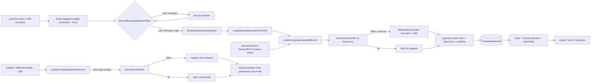

# Impl: Finalizar o wizard "Registrar pedido" (A5)

Status: aprovado
Atualizado em: 2026-08-10
Issue: #591
Intenção: docs/plans/registrar-pedido-wizard.md
Appetite restante: herdado (~1,5–2 dias eng) — sem corte necessário

## Leitura da intenção

- **Outcome:** "Registrar pedido" (Início e FAB do município) termina em formulário funcional no wizard — nunca no placeholder "em breve". Passo final: município no header do app (chrome `municipalityLabel`), **sem** título grande de passo, **sem** seletor de município; Tipo → Atividade (opcional) → **um único campo de texto** ("O que você precisa?"). A demanda nasce com **título derivado por IA** (DeepSeek server-side, mesmo caminho do Sollinha) com **fallback = texto truncado** no create; ao salvar, confirmação (toast) + retorno à origem (`returnPath`). Campo único vale também em `/demandas/nova` (que mantém o seletor de município). Launchers de lista/detalhe permanecem no form (decisão de gate Q3-B).
- **O que NÃO negociar:** leader lockdown intacto (staff-only na criação e no wizard); criar a demanda **nunca falha nem espera indefinidamente por causa da IA**; slug **só nasce no create** (URLs/listas existentes intocadas); copy pt-BR / identificadores em inglês; invariantes do engineering-brief (Local API `overrideAccess: false`; escrita multi-collection em transação — aqui a escrita é single-collection).
- **O que reavaliar:**
  - _Onde derivar o título_ — a intenção deixa a forma com o executor; decido: no shared record action, **fora** da transação (não segurar lock durante a IA).
  - _"A descrição (campo único) é editável"_ — hoje **não existe** superfície de edição de demanda no app de campanha (nem descrição, nem título): o detalhe B85 é read-only (só workflow/custo/comprovante). O aceite pede edição com recálculo de título por IA + slug preservado → decisão abaixo.
  - _Colisão de slugs_ — com títulos derivados por IA, títulos idênticos em municípios diferentes ficam prováveis; o `unique: true` atual viraria erro de criação (viola "nunca falhar"). Preciso de unicidade defensiva no create.

## Abordagem recomendada

**Opções consideradas:**

1. **Onde deriva o título** — A) dentro de `createCampaignDemandRecord` (um dono, ambas as formas ganham automaticamente, IA fora da transação) | B) nas duas form actions (2 call sites duplicados) | C) hook `beforeChange` da collection (cobre admin, mas AI em hook = latência/estado invisível no save do admin + risco de falha no meio de um fluxo sem UI de erro — rejeitada).
2. **Fallback no create** — truncamento puro do campo único a ≤160 chars (respeita `title.maxLength`), com guarda de slugificabilidade. Política do fallback **no caller** (create → truncar; update → manter anterior), módulo de IA devolve `string | null`.
3. **Colisão de slug** — A) unicidade defensiva no create: hook `beforeValidate` consulta o slug candidato (`payload.find`, `limit: 1`) e sufixa `-2`, `-3`… (capa ~20); cobre **todos** os caminhos de create (ações + admin) | B) manter erro de duplicata atual — com IA vira falha provável de criação | C) uniquify só na action — admin continua quebrando. Recomendação: **A**.
4. **"Descrição editável"** — A) affordance mínima de edição no detalhe (staff): botão "Editar" na seção de descrição + `updateCampaignDemandRecord` (recalc de título por IA quando a descrição muda; falha → mantém título anterior; slug preservado — invariante já existe no hook `setCanonicalDemandSlug`) | B) sem UI de edição no app (edição só no admin Payload, título digitado manualmente) — deixa o aceite sem caminho verificável de ponta a ponta. Recomendação: **A** — é o único jeito de o aceite "descrição é editável + título recalculado na edição" ser real; superfície mínima, sem redesenhar a vertical.
5. **Passo do wizard** — componente novo no padrão `WizardUpdateBodyStep` (`useActionState` + `runCampaignFormAction` + `useCampaignFormSuccessToast` → `recordLastActedMunicipality` + `router.push(wizardReturnHref(returnPath))`); `stepTitle={null}` + `contentFocus="none"` (form começa direto, município no header).
6. **Stub** — `WizardMunicipalitySelectedStub` fica morto depois do branch novo (os 5 slugs ficam todos roteados) → remover, junto de `wizardNextStepPlaceholder`/`WIZARD_NEXT_STEP_GENERIC_PLACEHOLDER` (knip não tolera mortos).

**Rejeitadas:** hook de IA na collection (opção 1C); título assíncrono (gate já descartou); campo título mantido como input do usuário (rabbit hole do plano); edição no detalhe via redirecionamento para form novo (custo/UI maiores, sem ganho).

### Componentes / mudanças

- **`src/utilities/ai/campaignDemandTitle.ts`** (novo, server-only): `deriveDemandTitle(description, kind?) → Promise<string | null>` — `generateText` (`@ai-sdk/deepseek`, `deepSeek('deepseek-v4-flash')` — mesmo modelo do chat Sollinha), prompt pt-BR curto (título ≤80 chars, sem pontuação final, com o rótulo do tipo), `maxOutputTokens` ~100, `AbortSignal.timeout(4000)`; sem `DEEPSEEK_API_KEY` → `null` imediato; qualquer erro → `null`; valida 1..160 + slugificável. `fallbackDemandTitle(description) → string` — puro, truncado ≤160, exportado para unit test.
- **`src/lib/schemas/campaignDemandInput.ts`**: `title` → `optional` no `campaignDemandCreateSchema` (derivado pelo record); novo `campaignDemandUpdateSchema` (`{ id, description }`).
- **`src/app/(campaign)/campanha/actions/demand.ts`**: `createCampaignDemandRecord` resolve o título antes de abrir a transação (`derive ?? fallback`, com guarda de slugificabilidade → cai no fallback); novo `updateCampaignDemandRecord`/`updateCampaignDemand` (recalc só se `description` mudou; transação + `acquireTextAdvisoryLocks('campaign-demand:<id>')` — mesmo padrão dos outros updates do arquivo).
- **`src/collections/CampaignDemand.ts`**: novo `beforeValidate` `ensureUniqueDemandSlug` (create-only; consulta `payload.find` por slug candidato e sufixa `-2`… até cap; preserva `unique: true`). `title` permanece required (sempre preenchido pelo record) — **sem migration** (nenhum campo novo; dados existentes já têm títulos descritivos válidos).
- **`src/app/(campaign)/campanha/(app)/demandas/nova/formActions.ts`**: para de ler `title` do FormData (schema opcional; record deriva). Redirect para `/demandas/<slug-descritivo>` continua (decisão de gate).
- **`src/components/campaign/demand/DemandForm.tsx`**: remove o input de título; campo único "O que você precisa?" (Textarea, required, min 2, max 4000) **após** Tipo e Atividade (Tipo | Município grid → Atividade → campo único); mantém seletor de município (necessário lá).
- **`src/app/(campaign)/campanha/(app)/acoes/formActions.ts`** (novo): `createWizardDemandFormAction` — `runCampaignFormAction` (sem redirect), parseia kind/municipalityId/activityId/description, chama `createCampaignDemand`, retorna `{ status: 'success', message: WIZARD_DEMAND_SAVED_MESSAGE }`.
- **`src/components/campaign/shared/WizardRegisterDemandStep.tsx`** (novo, client): `CampaignWizardShell` com `flowTitle`, `stepTitle={null}`, `contentFocus="none"`, `municipalityLabel`, `previousHref` via `wizardPreviousHref({ stepKind: 'register-demand' })` (adicionar `'register-demand'` a `WizardStepKind` em `campaignActionRoutes.ts` — back = busca do próprio fluxo, padrão dos demais), `dismissHref`; hidden `municipalityId`/`municipalitySlug`; Tipo (NativeSelect), Atividade (`AsyncSearchCombobox` + `searchDemandActivityOptions` reusado), campo único; botão "Abrir demanda" com spinner; aria-live de salvando; `useCampaignFormSuccessToast` → `recordLastActedMunicipality` + retorno.
- **`src/app/(campaign)/campanha/(app)/acoes/[slug]/page.tsx`**: branch `register-demand` **antes** do fallback — staff-gate (`isStaffCampaignRole`, senão `notFound()` — leader lockdown defensivo; o access já negaria, mas não renderizar form para leader) → `<WizardRegisterDemandStep municipalityId/Name/Slug …>`. Remove o stub.
- **`src/lib/campaignWizardCopy.ts`**: remove `wizardNextStepPlaceholder` + placeholder genérico; adiciona copy do passo (`WIZARD_DEMAND_SAVED_MESSAGE`, `WIZARD_DEMAND_FINAL_CTA_LABEL`, labels do campo único/atividade, mensagens aria).
- **Edição (decisão 4A):** `src/components/campaign/demand/DemandDescriptionEditor.tsx` (client, staff-only; textarea + Salvar/Cancelar; `useActionState(updateDemandFormAction)` + toast/refresh) + seção "Editar" no detalhe (`demandas/[slug]/page.tsx`) + `updateDemandFormAction` em `demandas/[slug]/formActions.ts` (revalidatePath do detalhe).
- **Migration:** nenhuma.

### Dados → forma (se aplicável)

N/A — formulário de entrada, sem dados de apresentação (nenhum KPI/mapa/série).

## Fases verificáveis

1. **Tracer / schema+server** — módulo de IA + fallback puro, schemas, actions (create derive + update), hook de unicidade, copy; unit tests do fallback; int tests (create com description → título truncado sem chave AI + slug único; colisão → `-2`; update → título anterior mantido sem chave AI + slug preservado; staff-gate). _Quota do appetite: ~40%._
2. **UI** — `DemandForm` campo único; `WizardRegisterDemandStep`; branch na página; remoção do stub; editor de descrição no detalhe. Impeccable B: shape → craft → critique → polish. _~35%._
3. **Gates** — e2e do fluxo do wizard (busca → passo → salvar → retorno à origem; e sem título grande de passo) + `pnpm gate:fast`; `pnpm push` → PR. _~25%._

## Rabbit holes / Não escopo (engenharia)

- Não criar "segundo campo invisível" de título na UI; não tocar launchers de lista/detalhe (`demandCreateHref`); não redesenhar lista/detalhe além da seção de edição; não mexer nos outros 4 wizards; não adicionar rate-limit próprio para o título (1 chamada por save; o chat tem o dele); não revalidar cache (`/campanha` é dinâmico); não adicionar `title` como campo admin readOnly (admin pode corrigir título ruim manualmente — slug preservado pelo hook).
- Barato adiado: prompt do título com contexto de município (exigiria lookup extra no record) — gatilho: títulos genéricos demais relatados em campo; e2e mobile do passo (coberto pelo e2e desktop + chrome existente).

## Riscos e mitigação

- **IA lenta/instável no save** → timeout 4s + fallback truncado; spinner no botão; nunca bloqueia a criação. Sem chave (dev/test) → derive devolve `null` imediato, int tests exercitam o caminho do fallback.
- **Colisão de slug por títulos de IA** → unicidade defensiva no create; cap de tentativas → erro claro.
- **Admin com título manual + descrição vazia** → permitido (descrição não é required na collection; wizard/form exigem o campo único).
- **Quebrar B85** → `/demandas/nova` segue com redirect ao detalhe; slug/URLs existentes intocados (hook preserva slug no update — invariante canônico).
- **Leader reachando o passo por deep-link** → staff-gate no branch + access já nega criação (defesa em camadas).
- **Mudança de comportamento do hook de slug (admin)** → duplicata deixa de dar erro e vira `-2`; aceitável e testado.

## Aceite de engenharia

- [x] Aceite de produto da intenção ainda coberto (wizard funcional, campo único nos dois cadastros, título IA + fallback, retorno à origem, launchers intactos, leader lockdown)
- [x] Invariantes AGENTS/engineering-standards (overrideAccess false, copy pt-BR, identificadores EN, sem migration, gates no fechamento)
- [x] Testes de domínio previstos (unit do fallback; int de create/update/unicidade/access; e2e do fluxo do wizard)
