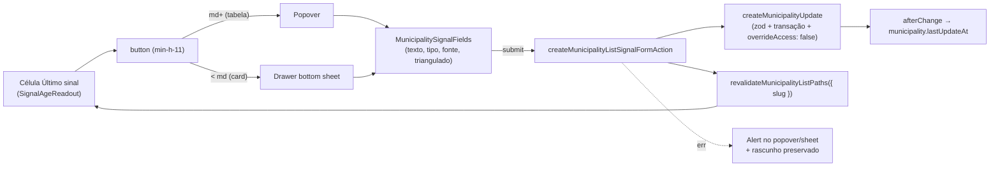

# Registrar sinal a partir da célula "Último sinal" da lista de municípios

Status: entregue (2026-07-25)
Atualizado em: 2026-07-25
Item do roadmap: [docs/roadmap.md](../roadmap.md) (Trilha B, item B26)
Impeccable: B — encaixe na célula `lastSignal` de `/campanha/municipios` (tabela desktop + card mobile); sem rota nova de UI
Appetite: ~0,75 dia eng; 1 controle novo + 1 form action + fields compartilhados; sem migration, sem collection, sem endpoint JSON
Responsável: —

## Revisão de entrega (2026-07-25)

Entregue: `MunicipalitySignalFields` + `MunicipalityListSignalControl` (Popover desktop / Drawer mobile) na coluna "Último sinal"; `createMunicipalityListSignalFormAction` em `municipalityStaffFormActions.ts`; wiring em `MunicipalityList` + `municipios/page.tsx`; e2e dedicado. Correções da auditoria aplicadas: (1) form action no padrão try/catch das irmãs do arquivo — **não** `runCampaignFormAction` (esse arquivo ainda é hand-rolled); (2) sem novo teste int (access já coberto em `campaignMunicipalityUpdate.int.spec.ts`); (3) Drawer controlado sem `DrawerTrigger`. Gate: tsc/lint/format/knip/cycles/unit+int verdes; e2e do fluxo B26 verde; build verde. Aikido: 0 findings nos arquivos novos/editados.

## Design (Impeccable)

Âncoras: `PRODUCT.md` (princípio 2 **Clarity under pressure**, princípio 3 **Edit where you see**, princípio 4 **Auto-save, no Save button** — e a **exceção** nomeada nele para escrita atômica multi-campo, princípio 8 **Feel the action**) / `DESIGN.md` (register `product` — Field Desk) · tema `data-theme='campaign'` · regras `.agents/rules/campanha-edit-where-you-see.mdc` (item 4: submit explícito continua válido para fluxo multi-campo) e `.agents/rules/campanha-action-feedback.mdc` · precedentes vivos: [`MunicipalityListTrendControl.tsx`](../../src/components/campaign/municipality/MunicipalityListTrendControl.tsx) (Popover na célula) e [`MunicipalityUpdateForm.tsx`](../../src/components/campaign/municipality/MunicipalityUpdateForm.tsx) (campos do sinal tipado do C12).

Na implementação (`implement-roadmap-item`): craft compacto → critique → polish. Sem shape completo: a célula, o Popover de lista e o formulário de sinal já existem no produto; o que é novo é a **combinação** e a apresentação mobile (primeira vez que um controle de célula abre em bottom sheet).

Brief compacto:

- **Persona / contexto:** Alex (Coordenador Geral) e Casey (Assessor) varrendo a fila de alocação — a lista está ordenada por déficit (default do E9) ou por frescor, e a coluna "Último sinal" é justamente onde o município grita "ninguém encosta aqui há 34 dias". No celular, em campo, logo depois de uma ligação ou de uma conversa no ZAP.
- **Job principal:** transformar a leitura "está frio" em registro no mesmo gesto — anotar o sinal ali, sem abrir o município, sem trocar de tela, sem perder o lugar na varredura.
- **Estratégia de cor:** Restrained (inalterada) — a única cor da célula continua sendo o âmbar `text-estimate-pending-foreground` do estado frio (E9). O gatilho não ganha cor própria.
- **Edit where you see:** sim — hoje a célula é o único readout puramente morto da faixa staff da linha (assessores, tendência e votos estimados já são editáveis desde B9/B19). O dado por trás dela, porém, não é um campo do município: é uma **criação** de `municipalityUpdate`, o que muda o contrato (ver Decisões travadas).
- **Anti-goals:** virar o formulário longo de atualizações dentro de um Popover (as 3 textareas do relatório semanal); spreadsheet/data-grid mode; segundo sistema genérico de célula editável; Popover ancorado espremido sob o teclado do celular; criar registro vazio "rascunho" só para ter o que auto-salvar.

## Dados → decisão → apresentação

- **Vou apresentar dados?** Não. `Dados: N/A` — o item é affordance de **escrita**. A leitura da célula (frescor E9: `max(lastUpdateAt, lastPledgeAt)`, rótulo "há N dias", limiar frio de 21 dias) continua idêntica, e nenhuma métrica, série, ranking ou mapa novo entra.
- **Efeito de leitura a vigiar:** depois de gravar, o próprio número muda (o município passa a "hoje"). Isso é o ponto — e é o motivo de a gravação **revalidar** em vez de fingir otimismo (ver Decisões travadas): o rótulo é resultado derivado, não valor de controle.

## Contexto

Em `/campanha/municipios`, a coluna staff **"Último sinal"** nasceu no **E9** ([fila-de-alocacao.md](fila-de-alocacao.md)): [`SignalAgeReadout`](../../src/components/campaign/municipality/MunicipalityList.tsx) renderiza `municipality.lastSignalAt` como "hoje" / "há N dias" / "Sem sinal", em âmbar com ícone quando passa de `MUNICIPALITY_COLD_SIGNAL_DAYS` (21). A coluna também é a chave de ordenação `frescor`. É um readout: para registrar qualquer coisa, o usuário precisa abrir `/campanha/municipios/[slug]?tab=updates` (ou `?newUpdate=1`) e usar o [`MunicipalityUpdateForm`](../../src/components/campaign/municipality/MunicipalityUpdateForm.tsx), depois voltar e reencontrar o lugar na lista.

Os sinais tipados vieram do **C12** ([registro-fundacao.md](registro-fundacao.md)): `municipalityUpdate` com `kind: 'sinal'` exige `body`, `signalType` (invasão / esfriamento / visita adversária / proposta a broker / outro) e `signalSource`, mais o checkbox staff-only `triangulated`. O registro é **imutável** para o staff (`canMutateMunicipalityUpdate` = só admin Payload), e o `afterChange` recomputa `municipality.lastUpdateAt`, que alimenta o frescor.

Pedido de produto em **2026-07-25** (mesma leva de B22/B23/B24): clicar na célula de sinal deve abrir um popover para criar um sinal novo; no celular, um bottom sheet ("dialog daqueles que vem de baixo"). O item fecha o laço da fila de alocação: hoje o E9 diz **onde** está frio e o produto obriga a sair da fila para fazer algo a respeito.

## Objetivos

- Clicar na célula "Último sinal" (tabela desktop) abre um **Popover** com o formulário curto de sinal; no card mobile, um **bottom sheet** (`Drawer`) com os mesmos campos.
- O formulário grava um `municipalityUpdate` com `kind: 'sinal'` reusando `createMunicipalityUpdate` — mesma validação (zod + hook da collection) e o mesmo access do formulário longo.
- Depois de gravar: célula atualizada pelo servidor (o município vira "hoje"), popover/sheet fechado, confirmação visível, e pendente honesto durante a revalidação (princípio 8).
- Erro (inclusive assessor fora da carteira) aparece **dentro** do popover/sheet, com o rascunho preservado — nada de fechar engolindo o texto.
- Toque confortável: gatilho e campos com `min-h-11`; o sheet mobile respeita o teclado virtual.
- Access inalterado (`canCreateMunicipalityUpdate`: unrestricted vê tudo, assessor só a carteira, `leader` não tem a coluna nem a lista). Sem migration, sem collection, sem `Consent` novo, sem endpoint JSON novo.
- Ordenação/`aria` do header `frescor` (B15) e o tooltip de coluna intactos.

## Decisões travadas

- **O submit continua explícito ("Registrar sinal") — este popover é a exceção do princípio 4, não uma regressão do B24.** É uma **criação multi-campo atômica**: `body` + `signalType` + `signalSource` são obrigatórios pelo `municipalityUpdateCreateSchema` e pelo `validateMunicipalityUpdateKind`, e o registro é imutável para o staff depois de criado. **Rejeitado:** auto-save por campo (cada debounce tentaria criar um registro inválido e, se algum passasse, viraria linha permanente no feed — o staff não pode editar nem apagar); criar registro vazio ao abrir e ir preenchendo (lixo no feed do município, no dossiê E16 e no frescor, já que qualquer update carimba `lastUpdateAt`). O `PRODUCT.md` princípio 4 e a regra `campanha-edit-where-you-see.mdc` item 4 preveem exatamente isso ("write must be atomic across several fields"); o B24 ([autosave-tendencia-lista-municipios.md](autosave-tendencia-lista-municipios.md)) tira o "Salvar" de uma edição de **campo único** na mesma linha — os dois contratos convivem porque a natureza da escrita é diferente, e a diferença precisa estar visível na copy do botão ("Registrar sinal", não "Salvar").
- **Só `kind: 'sinal'` a partir da lista.** A coluna se chama "Último sinal" e o C12 já dá ao sinal um vocabulário fechado (tipo + fonte + triangulado). **Rejeitado:** seletor dos 4 `kind` no popover — `semanal` sozinho traz três textareas de 3000 caracteres mais dois números e transformaria o popover no formulário de detalhe (anti-goal do brief); `nota`/`urgente` continuam a um clique no `?tab=updates`, que segue sendo o lugar do registro completo.
- **Gravação por server action + `revalidateMunicipalityListPaths({ slug })`, não por endpoint JSON com otimismo local.** O que a célula mostra é **resultado derivado** (`max(lastUpdateAt, lastPledgeAt)`), e inventar "hoje" no cliente é o anti-goal literal do princípio 3 ("optimistic writes of list/aggregate results that skip server refresh"); além disso o novo sinal precisa aparecer no feed do detalhe e no dossiê E16 sem depender de sorte de cache. O custo é aceitável porque a escrita é **um submit deliberado**, não um debounce de digitação — diferente do B24 e do controle de votos estimados, que gravam várias vezes por minuto. **Rejeitado:** `POST /campanha/municipios/signal` espelhando `expected-votes/route.ts` (mais código, dado derivado mentiroso e detalhe/dossiê defasados); `router.refresh()` no cliente (mesmo custo de RSC, sem a revalidação do detalhe).
- **Popover no desktop, `Drawer` (bottom sheet) no mobile, escolhidos pela divisão de breakpoint que a lista já tem — não por `useIsMobile()`.** `MunicipalityList` já renderiza dois ramos: cards `md:hidden` e tabela `hidden md:block`; cada ramo monta a sua variante e ambos compartilham um único componente de campos. **Rejeitado:** `useIsMobile()` (o hook existe em `src/hooks/use-mobile.ts`, mas hoje só o `Sidebar` usa; num controle por linha ele adiciona hidratação em duas fases e um segundo critério de breakpoint concorrendo com o CSS que já decide o layout); `Sheet side="bottom"` (é Radix Dialog sem swipe; o `Drawer` do `@base-ui/react` já é o idioma de "vem de baixo" do produto, usado no `InstallPwaToast`); manter Popover ancorado no mobile (o pedido de produto nasceu disso — popover ancorado num card estreito fica espremido e o teclado virtual cobre os campos).
- **O gatilho é a própria leitura de frescor, não um ícone extra.** A célula vira um `button` cujo rótulo acessível é "Registrar sinal em {município} — {rótulo de frescor}", preservando cor/ícone do estado frio. **Rejeitado:** botão "+" separado ao lado do texto (dois alvos numa célula densa, e o alvo útil vira o menor dos dois); coluna nova de ação (densidade morta — o fill-in de remover a coluna "Tipo" está indo na direção contrária).
- **i18n e naming** (AGENTS.md): identificadores em inglês — `MunicipalityListSignalControl`, `MunicipalitySignalFields`, `createMunicipalityListSignalFormAction`; strings visíveis em pt-BR ("Registrar sinal", "Tipo do sinal", "Fonte", "Triangulado", "Sinal registrado.").

## Questões em aberto

- **Ordenado por `frescor`, a linha salta ao gravar. Revalidar mesmo assim?** **Opções:** A) sempre revalidar (a linha se move); B) nunca revalidar (célula mente); C) revalidar sempre, mas nomear o município na confirmação para reancorar quem estava varrendo. **Recomendação:** C — mover a linha é o comportamento **honesto** (o município deixou de estar frio, que é o objetivo da fila), e o custo real é perder o lugar visual; a confirmação "Sinal registrado em Vitória da Conquista." resolve isso por ~zero. Sob o default `deficit` nada se move.
- **As cinco descrições dos tipos de sinal (que o formulário longo lista embaixo do select) cabem no popover?** **Opções:** A) não, só o select; B) lista completa como no detalhe; C) descrição do tipo **selecionado**, em uma linha, abaixo do select. **Recomendação:** C — mantém o popover curto e ainda ensina o vocabulário do C12 a quem está aprendendo (mesmo problema do débito O3/glossário); B ocuparia mais altura que o resto do formulário inteiro.
- **`triangulated` entra no popover?** **Opções:** A) sim, checkbox; B) não, só no detalhe. **Recomendação:** A — é um checkbox, é campo staff-only com access próprio já resolvido, e "confirmado por mais de uma fonte" é justamente o que se sabe na hora de registrar.
- **Confirmação: `Alert` dentro do popover antes de fechar, ou toast depois de fechar?** **Opções:** A) toast (padrão do `MunicipalityListTrendControl`); B) `Alert` de sucesso e o usuário fecha. **Recomendação:** A, para não deixar um popover aberto sobre uma lista que está revalidando — com a mensagem nomeando o município (ver primeira questão).

## Abordagem proposta

Componentes:

- **`MunicipalitySignalFields`** (novo, `src/components/campaign/municipality/MunicipalitySignalFields.tsx`): só os campos do sinal (`body` textarea 2 linhas, `signalType` `NativeSelect` + descrição do tipo escolhido, `signalSource` `Input`, `triangulated` checkbox) mais os `fieldErrors` do estado da action. Reusa `municipalitySignalTypes` / `municipalitySignalTypeLabels` / `municipalitySignalTypeDescriptions` de `src/lib/schemas/municipalityUpdate.ts` e os shells `Field`/`FieldLabel`/`FieldError`. Consumido pelas duas variantes (Popover e Drawer) — e é a peça que o `MunicipalityUpdateForm` do detalhe pode passar a reusar depois (ver Adiado com gatilho).
- **`MunicipalityListSignalControl`** (novo, `src/components/campaign/municipality/MunicipalityListSignalControl.tsx`): client component com prop `variant: 'popover' | 'sheet'`, `useActionState` sobre a form action, `Spinner` + `disabled` no submit, `Alert` de erro, live region `sr-only`, `setOpen(false)` + toast só no sucesso. O gatilho recebe o `SignalAgeReadout` como children — a leitura E9 não é reimplementada.
- **`MunicipalityList`** (`src/components/campaign/municipality/MunicipalityList.tsx`): a célula `lastSignal` (coluna staff) passa a envolver `SignalAgeReadout` no controle com `variant="popover"`; o card mobile usa `variant="sheet"`. Nova prop `signalFormAction` no mesmo formato das existentes (`MunicipalityStaffFormAction`).
- **`createMunicipalityListSignalFormAction`** (`src/app/(campaign)/campanha/(app)/municipios/municipalityStaffFormActions.ts`): casca no padrão try/catch + `mapCampaignFormActionError` das irmãs do arquivo — **não** `runCampaignFormAction` (esse arquivo ainda é hand-rolled; a troca do detalhe/`runCampaignFormAction` continua fill-in de higiene). Lê `municipalityId`, `body`, `signalType`, `signalSource`, `triangulated` e o `municipalitySlug` do `FormData` (helpers `requiredRelationshipFormValue` / `optionalFormText` / `checkboxFormValue` / `optionalMunicipalitySlugFromForm` + `parseMunicipalitySignalType`), chama `createMunicipalityUpdate({ kind: 'sinal', … })` e `revalidateMunicipalityListPaths({ slug })`.
- **`municipios/page.tsx`**: passa a nova form action para `MunicipalityList`, ao lado de `trendFormAction`/`advisorsFormAction`.
- **Migration:** nenhuma. `municipalityUpdate` e todos os campos do sinal existem desde o C12; `lastUpdateAt` já é derivado por hook.
- **Testes:** int cobrindo o access da nova form action (assessor fora da carteira recebe erro e nada é criado; assessor da carteira cria e `lastUpdateAt` muda) em `tests/int/campaignMunicipalityUpdate.int.spec.ts`; e2e em `tests/e2e/campaignMunicipalities.e2e.spec.ts` — abrir a célula na tabela, preencher, submeter, ver a célula virar "hoje".

## Dependências

- **Nenhuma dura em aberto.** Precisa de **E9 ✓** (a coluna e `lastSignalAt`) e **C12 ✓** (sinal tipado + imutabilidade), ambos entregues.
- Reusa: `createMunicipalityUpdate` (`src/app/(campaign)/campanha/actions/municipalityUpdate.ts`), `municipalityUpdateCreateSchema` (`src/lib/schemas/municipalityUpdate.ts`), `canCreateMunicipalityUpdate` (`src/utilities/access/municipalityUpdates.ts`), `revalidateMunicipalityListPaths` (`src/utilities/municipalityRevalidation.ts`), `runCampaignFormAction`, `Drawer`/`Popover` de `src/components/ui`.
- **Suave:** **B24** (o popover vizinho na mesma linha; a diferença de contrato precisa ser deliberada, não acidental — quem chegar depois cita o outro na copy do botão), **B23** (se o `cellTooltip` for estendido à coluna "Último sinal", vale o mesmo cuidado registrado lá: `openOnTouch={false}` + `disabled={open}` para o tooltip não roubar o tap nem sobreviver atrás do Popover), **E9 ✓** (a fila que este item torna acionável).

## Não escopo

- **Registrar `semanal` / `nota` / `urgente` pela lista** → continua no detalhe (`?tab=updates`, deep link `?newUpdate=1`).
- **Ler o texto do último sinal na célula** → hover de conteúdo é **B23** ([tooltip-celulas-listas.md](tooltip-celulas-listas.md)); o feed completo é o detalhe / o dossiê **E16 ✓**.
- **Tirar o "Salvar" do popover de Assessores** → fill-in próprio já registrado no B24.
- **Editar/apagar um sinal registrado** → fora por decisão do C12 (registro imutável; correção é novo sinal).
- **Migrar `createMunicipalityUpdateFormAction` (detalhe) para `runCampaignFormAction`** → higiene, fill-in.

## Rabbit holes

- **"Já que abriu um formulário na célula, deixa registrar qualquer atualização."** Entram o seletor de `kind`, três textareas de 3000 caracteres e dois campos numéricos; o popover vira o formulário do detalhe e a lista vira tela de edição. **Mitigação neste item:** só `kind: 'sinal'`, campos fixos, nada de seletor de tipo de registro.
- **"São dois controles com Popover/Drawer, extrai um `ResponsiveQuickEdit` genérico."** Com B9/B19/B24 na mesma linha, a tentação é um `EditableCell` que acomode select, número por cenário, textarea, criação e edição — design system paralelo (anti-goal do princípio 3). **Mitigação:** controle nomeado; shell responsivo compartilhado só no **3º** call site (ver Adiado com gatilho).
- **"Mostra o último sinal dentro do popover para dar contexto."** Exige carregar o último `municipalityUpdate` de cada linha da página (query por linha ou novo agregado), justo na lista que o Pass 2 otimizou para uma passada. **Mitigação:** adiado com gatilho abaixo.
- **"Aproveita e faz a linha não se mexer depois de gravar."** Leva a congelar ordenação no cliente, a keys estáveis artificiais e a uma lista que mente sobre o próprio critério de ordem. **Mitigação:** revalidar e reancorar por copy (questão em aberto, opção C).
- **Bottom sheet e teclado virtual.** Sheet com altura fixa + teclado aberto esconde o submit; a correção "rápida" costuma virar cálculo de `visualViewport` à mão. **Mitigação:** usar o `Drawer` como ele já está configurado (`max-height` por `dvh`, conteúdo rolável) e testar no iOS antes de inventar layout.

## Adiado com gatilho

- **Shell responsivo compartilhado (Popover ↔ Drawer) para controles de célula.** Revisitar quando: existir o **3º** controle de lista que precise das duas variantes.
- **Reuso de `MunicipalitySignalFields` dentro do `MunicipalityUpdateForm` do detalhe.** Revisitar quando: este item estiver em produção e os dois blocos de campos tiverem divergido em algum detalhe visível (hoje seriam dois consumidores no mesmo dia — extrair é barato, unificar copy/erros no mesmo passe é que estoura o appetite).
- **Lazy-mount de `Popover`/`Drawer` até o primeiro open** (custo idle do ramo CSS-oculto). Revisitar quando: perfilar a lista com vários controles dual-branch montados e o idle cost aparecer no trace — aplicar em lote nos controles da linha, não só neste.

## Referências

- `docs/roadmap.md` (Trilha B, B26; grafo; Janela 1–2; cortes seguros)
- `src/components/campaign/municipality/MunicipalityList.tsx` — coluna `lastSignal`, `SignalAgeReadout`, card mobile, `signalHint`
- `src/components/campaign/municipality/MunicipalityListTrendControl.tsx` — precedente de Popover na célula com `useActionState`
- `src/components/campaign/municipality/MunicipalityUpdateForm.tsx` — campos do sinal tipado a fatiar
- `src/app/(campaign)/campanha/actions/municipalityUpdate.ts` — `createMunicipalityUpdate` (transação + `overrideAccess: false`)
- `src/collections/MunicipalityUpdate.ts` — `validateMunicipalityUpdateKind`, imutabilidade, recomputo de `lastUpdateAt`
- `src/utilities/access/municipalityUpdates.ts` — `canCreateMunicipalityUpdate`
- `src/app/(campaign)/campanha/(app)/municipios/municipalityStaffFormActions.ts` — onde a nova form action entra
- `src/components/ui/Drawer.tsx` / `src/components/ui/Popover.tsx` — primitivos
- `docs/plans/fila-de-alocacao.md` (E9) e `docs/plans/registro-fundacao.md` (C12) — origem da coluna e do sinal tipado
- `docs/plans/autosave-tendencia-lista-municipios.md` (B24) — contrato vizinho, deliberadamente diferente
- AGENTS.md — Campaign auth, naming pt-BR/inglês, `overrideAccess: false`, transações
- `PRODUCT.md` / `DESIGN.md` — princípios 2, 3, 4 e 8; Field Desk · regras `campanha-edit-where-you-see.mdc`, `campanha-action-feedback.mdc`
