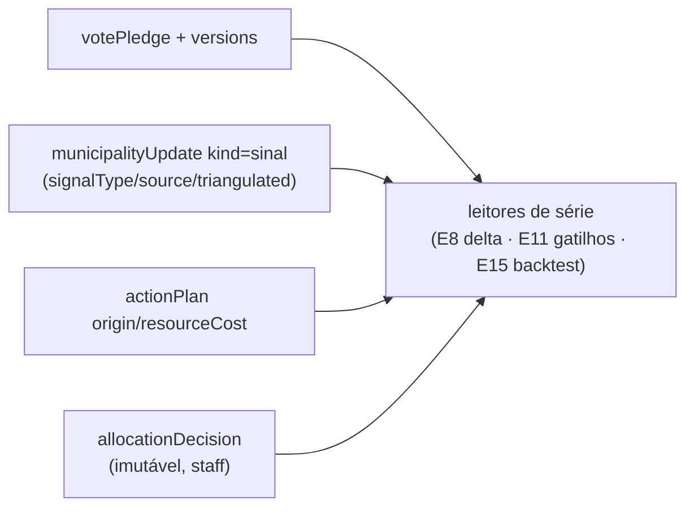

# C12 — Registro-fundação (trajetória, sinais tipados, origem de visita, decisões ex-ante)

Status: rascunho
Atualizado em: 2026-07-24 (refs sincronizadas pós-remodelagem Municípios + hardening)
Item do roadmap: [docs/roadmap.md](../roadmap.md) (seção "Inteligência de campanha", C12; plano-mestre [inteligencia-campanha.md](inteligencia-campanha.md))
Impeccable: B — sem rota nova; campos novos em forms existentes (`municipalityUpdate`, `actionPlan`) + collection admin-hidden
Appetite: ~2 dias eng; 1 migration consolidada
Responsável: —

## Design (Impeccable)

Âncoras: `PRODUCT.md` (princípio 1 — registros próprios como fonte de verdade; princípio 7 — feel the action) / `DESIGN.md` (register `product`).

Na implementação: craft compacto → critique → polish (as superfícies são forms existentes; a collection `allocationDecision` não tem UI própria neste item — é escrita por actions e lida pelo E11/E15).

- **Persona / contexto:** assessor registrando "vereador esfriou" em 15 segundos no celular; coordenador registrando por que descartou uma sugestão.
- **Job principal:** transformar sinal oral em série datada sem virar formulário de 10 campos (anti-goal E1 do relatório: extração sem devolução).
- **Estratégia de cor:** Restrained.
- **Edit where you see:** sim — o log de 1 linha nasce do mesmo form de atualização já usado no detalhe do município.
- **Anti-goals:** formulário longo obrigatório; sobrescrita silenciosa de valores; segundo feed paralelo ao `municipalityUpdate`.

## Contexto

FU4 do relatório: backtest compara o que se sabia antes com o que aconteceu depois — "se o valor novo apaga o velho, o 'antes' deixa de existir". Hoje: `votePledge` guarda só o valor corrente (declarado/estimado sobrescrevem); `municipalityUpdate` é imutável mas sem semântica de sinal (kinds `semanal|urgente|nota`); `actionPlan` não registra origem da visita (pedida × justificada — J-B) nem custo; e não existe registro de decisão (sugestão dada, aceita/descartada, leitura alternativa). Este item fecha os gaps G1–G4 do plano-mestre e é pré-requisito do motor (E11) e do backtest (E15). "O TSE estará lá em novembro; o lado da campanha não é reconstruível retroativamente."

## Objetivos

- **G1 — trajetória de pledge:** `versions: true` (sem drafts) em `votePledge`; leitura da série por município/liderança para o delta semanal (E8) e o backtest (E15).
- **G2 — sinais tipados:** `municipalityUpdate.kind` ganha `sinal`; campos condicionais `signalType` (`invasao | esfriamento | visita_adversario | proposta_broker | outro`), `signalSource` (texto curto), `triangulated` (checkbox staff-only). Continua imutável e mantendo `municipality.lastUpdateAt`.
- **G3 — origem/custo de plano:** `actionPlan.origin` (`dado | pedido_broker | obrigacao_politica`, default `dado`, staff-only) + `resourceCost` (number, staff-only, opcional).
- **G4 — decisões ex-ante:** collection `allocationDecision` (admin group `Campanha`, `admin.hidden` como `supporterImportBatch`): `municipality`, `patternId` (texto — P1…K-C ou `manual`), `suggestion` (texto), `decision` (`aceita | descartada | adiada`), `alternativeReading` (obrigatório ao descartar), `snapshot` (json — classificação/números no momento), `decidedBy` (derivado), `note`. Imutável após criação.
- Access: tudo staff; `leader` não lê sinais staff-only (`triangulated`), não lê `allocationDecision`, não lê `origin`/`resourceCost` — mesmo padrão `canReadCampaignStaffField`.
- Garantia transversal: nenhuma action nova sobrescreve histórico; escritas multi-collection com `withPayloadTransaction` + `req`.
- **Aceite de campo (O7/O4 — [CUSTOMER.md](../CUSTOMER.md)):** registrar o delta do dia (ex.: "Cairu: ex-prefeito ligou, 1.000 → 300–500") em **≤30 segundos no celular**, a partir do detalhe/lista — o pledge atualizado vira versão (G1) e/ou sinal de 1 linha (G2). É o momento Orolândia da sessão de 2026-07-23: ele edita o mapa em viagem; se o registro custar mais que a edição da planilha, o dado continua morrendo no ZAP.

## Decisões travadas

- **Histórico via Payload `versions`, não collection de snapshots.** Menos código, admin de graça, migration gerada. **Rejeitado:** `pledgeSnapshot` própria (duplica access/hooks); campo `history` json (não consultável, cresce sem índice).
- **Decisão registrada é collection própria e imutável** — é o dado que o backtest paga caro para ter; mudanças de nível N0–N4 (E14) também gravam aqui, um mecanismo só. **Rejeitado:** log em `municipalityUpdate` (semântica de feed de campo, autoria de liderança possível — decisão é de coordenação); campo no `municipality` (sobrescreve).
- **Sinal nasce no form existente de atualização** (custo de digitação mínimo; "o campo dita, a sede registra" continua possível por quem tiver acesso). **Rejeitado:** collection nova de sinais (segundo feed; FU1 pede agregação, não outra caixa).
- **i18n e naming:** `signalType`, `signalSource`, `triangulated`, `origin`, `resourceCost`, `allocationDecision`, `patternId`, `alternativeReading`; enums como valores de dado em pt (`invasao`, `pedido_broker`, `aceita`) por paridade com enums existentes (`semanal`, `alta`); labels pt-BR.

## Questões em aberto

- **`versions` também em `municipality` (para foto da classificação)?** Opções: sim | não — snapshot vai no `allocationDecision.snapshot`. **Recomendação:** não; o snapshot por decisão cobre o "ex-ante" com custo menor que versionar 435 municípios a cada edição.
- **Retenção de versions de `votePledge`?** **Recomendação:** `maxPerDoc: 0` (ilimitado) até a eleição; avaliar poda pós-E15.

## Abordagem proposta

Componentes:

- **`src/collections/VotePledge.ts`**: `versions: true`; sem mudança de campos.
- **`src/collections/MunicipalityUpdate.ts`**: opção `sinal` no kind + 3 campos condicionais (`admin.condition` como os campos de `semanal`); access staff no `triangulated`.
- **`src/collections/ActionPlan.ts`**: `origin` + `resourceCost` com `canReadCampaignStaffField`.
- **`src/collections/AllocationDecision.ts`** (nova): imutável (update/delete admin-only), `createdBy` derivado no hook (padrão `Supporter.createdBy`).
- **`src/utilities/pledgeHistory.ts`**: leitura da série de versions por município (consumida por E8/E15).
- **Actions:** `recordAllocationDecision` em `src/app/(campaign)/campanha/actions/` (usada por E11; utilizável manualmente antes disso), com `withPayloadTransaction`.
- **Migration**: `pnpm migrate:create add_intel_foundation` — tabelas de versions do `votePledge`, campos novos, collection `allocationDecision`.

## Dependências

- Dura: nenhuma pendente — deploy da remodelagem aplicado em produção (2026-07-23). Nenhuma de outro plano do programa (é a fundação; E8 usa se existir).
- Reusa: `withPayloadTransaction` (`payloadTransaction.ts`), `campaignAccess.ts`, padrão `createdBy` de `Supporter.ts`, `municipalityUpdatePageData.ts` (feed).

## Não escopo

- Computar gatilhos sobre os sinais (E11); UI de leitura da trajetória (E8 delta/E15); nível N0–N4 em si (E14 — só o registro da mudança mora aqui); notificações de sinal (D2).

## Rabbit holes

- **"Já que estamos", versionar tudo.** Versions em `municipality`/`leadership` multiplica tabelas e ruído de admin. **Mitigação:** só `votePledge` neste item; demais têm gatilho abaixo.
- **Sinal virar formulário de inteligência.** 3 campos, um deles opcional; qualquer campo além disso é feature do E11, não do registro.
- **`snapshot` virar dump gigante.** Limitar ao objeto pequeno (classe, cobertura, nível, números-chave) — não serializar o bundle do município.

## Adiado com gatilho

- **Versions em `municipality` (histórico de estratégia).** Gatilho: E15 precisar de foto além do `allocationDecision.snapshot` em caso real.
- **Import de sinais via WhatsApp/copy-paste estruturado.** Gatilho: volume real de sinais >20/semana com reclamação de digitação.

## Referências

- `docs/roadmap.md` (Inteligência de campanha, C12) · [plano-mestre](inteligencia-campanha.md) (gaps G1–G4)
- `docs/research/relatorio-entrevista-persona-campanha.md` FU4 (5 registros; nunca sobrescrever), FU1 (anedota estrutural), §6.4 (falso positivo de registro), J-B (origem da visita)
- `src/collections/VotePledge.ts`, `src/collections/MunicipalityUpdate.ts`, `src/collections/ActionPlan.ts`, `src/collections/Supporter.ts` (padrão createdBy/access), `src/collections/SupporterImportBatch.ts` (padrão admin-hidden)
- `src/utilities/payloadTransaction.ts`, `src/utilities/campaignAccess.ts`
- AGENTS.md — migrations, transações com `req`, access fail-closed
