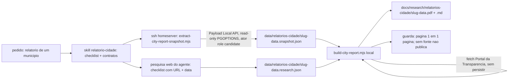

# Impl: Relatório de cidade pré-viagem (agente + skill → PDF A4)

Status: executado
Atualizado em: 2026-09-15
Issue: #1007
Intenção: docs/plans/relatorio-cidade-viagem.md
Appetite restante: herdado — ~2–3 dias eng. Cortes explícitos se estourar: (a) emendas oficiais viram lacuna explícita; (b) página 1 fecha nos caps do E16 (8 lideranças / 5 sinais / 3+2 visitas); (c) skill-first: o subagente pode shipar como wrapper fino depois, sem bloquear o script→PDF.

## Leitura da intenção

- **Outcome:** chamar o agente/skill com um município e sair um **PDF A4 datado** (+ companion `.md` com números e proveniência), lendo a base de produção **read-only** no estado do momento; página 1 = resumo de uma olhada (conta eleitoral 2022, quem é quem, o que foi entregue, anunciar × não anunciar, riscos); páginas 2+ = aprofundamento com fonte por item e lacuna explícita onde não há dado.
- **O que NÃO negociar:**
  - "Sem fonte, não publica" — afirmação não trivial sem origem (base Teqo com data de leitura; web/fonte oficial com data + URL) não entra; ausência vira lacuna explícita, nunca inferência.
  - Leitura **relativa** (% do próprio voto, rank, LQ/captura) — nunca % estadual absoluto.
  - Empenho ≠ pagamento; bloco "anunciar × NÃO anunciar" com defeso/ano eleitoral.
  - PII mínima: contatos completos (telefone/e-mail) fora; conteúdo completo para o candidato **dentro do PDF** (estimativas e nível N0–N4 entram, sem marca de restrição).
  - Emendas lidas da fonte oficial **em tempo de geração, sem persistir**; nenhuma collection/migration/Consent novo; nenhum `db:pull`/snapshot de banco.
- **O que reavaliar (hipóteses da intenção que a execução deve confrontar):**
  - **Visibilidade da entrega.** A intenção resolveu "PDF + `.md` commitados em `docs/research/`"; o repositório é **público** (`gh repo view`: `visibility: PUBLIC`) e o relatório carrega dados internos de campanha (nomes de lideranças, pledges, estimativas staff-only, conjuntura). A entrega mantém o caminho `docs/research/relatorios-cidade/`, mas **gitignored** (decisão D6); publicar exigiria um renderer sanitizado, fora do appetite.
  - "Notícias internas" não existe como entidade no codebase: `Post` não tem relação com município; o que existe é `municipalityUpdate` (sinais). A seção vira "Sinais internos + imprensa local (web)".
  - Os caps do E16 (`DOSSIER_LEADERSHIP_LIMIT = 8`, `DOSSIER_SIGNAL_LIMIT = 5`, 3+2 atividades, `municipalityDossierData.ts:38-43`) são o corte natural contra o rabbit hole "relatório de 40 páginas" — o relatório usa os caps e mostra `totalCount`.
  - A fonte oficial de emendas é decisão de implementação (ver D5): Portal da Transparência `/api-de-dados/emendas`, com lacuna explícita como fallback.
  - O acervo de falas não tem loader "falas do município"; a query é do extrator, compondo o dono `buildSpeechListWhere`.

## Abordagem recomendada



**Opções consideradas:** A (recomendada) extração **no homeserver** read-only + snapshot JSON + render local; B túnel SSH (`ssh -L 5433:127.0.0.1:5433`) e roda tudo na workstation; C roda tudo no homeserver, inclusive Chromium; D rota `/campanha` com print CSS (como no E16).

**Recomendação:** **A** — a extração roda onde a produção vive (mesma receita `socat 127.0.0.1:5433` do runbook), o processo não carrega credencial de prod na workstation e o render fica no único lugar que já tem Chromium (precedente C157). O snapshot JSON é um intermediário explícito: revisável, re-renderizável sem tocar produção de novo e a prova de proveniência (data de leitura + SHA do código).

**Rejeitadas:**

- **B** porque a credencial de produção passa a viver no processo local e o guard local (`assertLocalDatabase`) não distingue `127.0.0.1` do proxy socat de um Postgres Docker — o passe seria silencioso; além de manter uma lane viva para produção na workstation.
- **C** porque instalar Chromium no homeserver polui o host de deploy e acopla o render ao servidor.
- **D** porque exige sessão autenticada e imprime a casca do app; já rejeitada em E16/C157 (precedente `docs/plans/relatorio-sobreposicao-solla-ceuci-salvador-impl.md`).

### Componentes / mudanças

- **`scripts/extract-city-report-snapshot.mjs`** (novo): CLI `--municipality=<slug> --out=<json>`; seta `PGOPTIONS='-c default_transaction_read_only=on -c statement_timeout=30000'` **antes** de importar `src/payload.config.ts` (o `pg` lê `PGOPTIONS` em `ConnectionParameters` — `node_modules/pg/lib/connection-parameters.js`; nenhuma mudança no config do app); exige `CITY_REPORT_CONFIRM=1` sempre (opt-in explícito, padrão C155); imprime host/DB sem credenciais (reusa `databaseHostname`/`loadCliEnv`/`dieWithLabel` de `scripts/lib/cli.mjs`); resolve o ator e chama o composer; grava o snapshot; nunca escreve no banco (qualquer write estoura no servidor).
- **`scripts/cityReportSnapshot.mjs`** (novo, camada de integração testada por int; mora ao lado do extrator, fora de `scripts/lib/` puro): `composeCityReportSnapshot({ payload, actor, slug })` compondo os donos, sem duplicar:
  - `resolveAccessibleMunicipalityContext` (`src/utilities/municipality/municipalityPageData.ts:678`) e `getMunicipalityDetailViewModel` (`municipalityPageData.ts:700`) → `strategy` (priority, expectedVotes, politicalTrend, engagementLevel N0–N4, strengths/risks, dobradinhas, budgetNotes, stateDeputies).
  - `loadMunicipalityDossierData` (`src/utilities/municipality/municipalityDossierData.ts:99`) → baseline 2014/2018/2022 + tally 2022 + ticket, goalAccount (suggestedGoal, goalCoverage, territorialClass, territoryCaptureBenchmark), pledgeAggregate, lideranças (cap 8 + total), sinais (cap 5 + total, deliberação), visitas (3+2), demografia (`demographicsForCode`).
  - `getMunicipalityVoteRank` (`src/lib/municipalityVoteRank.ts:66`) → rank/435 + share do próprio voto.
  - Falas: `buildSpeechListWhere({ page: 1, municipalities: [id] })` (`src/utilities/speech/speechListFilters.ts:42`) numa query própria com select mínimo (`speechAt`, `year`, `phase`, `officialTextUrl`, `summary`, `mentionedMunicipalities`) + `loadSegmentsForSpeeches` (`src/utilities/speech/speechPageData.ts:110`) + `municipalityIdsOfSpeech`/`buildWatchHref` (`src/utilities/speech/speechViewModels.ts`).
  - Demandas: query própria `campaignDemand` por `municipality` (não existe loader com esse filtro — `buildDemandListWhere`, `src/utilities/demand/demandListUrl.ts:40`, só cobre status/kind/q/activity; não vale criar dono para 1 call site).
  - **Projeção anti-PII:** descarta `phone`/`email`/`phones` do `LeadershipRowViewModel`, contatos completos e `cost`/`receipts` de demandas; nomes entram porque o produto os pede (página 1 "quem é quem"), contatos nunca.
- **`scripts/build-city-report.mjs`** (novo): CLI `--snapshot=<json> --research=<json> [--emendas=<json>] --out-dir=docs/research/relatorios-cidade`; sem `--emendas` faz o fetch oficial (D5) e cacheia o resultado em `data/relatorios-cidade/<slug>-<data>.emendas.json` (replay sem rede); monta blocos → HTML (print CSS próprio) → `page.pdf({ format: 'A4', printBackground: true })` com header/footer paginado (mecânica do C157, `scripts/build-solla-ceuci-salvador-report.mjs:1117-1136`) → companion `.md` **dos mesmos blocos**; guarda de página 1 (mede `scrollHeight > clientHeight` do bloco de resumo e aborta se estourar); escreve HTML intermediário em `data/relatorios-cidade/` (gitignored).
- **`scripts/lib/cityReportBlocks.mjs`** (novo, puro): `buildReportBlocks({ snapshot, research, emendas })` → árvore de blocos (paragraphs/bullets/kpis/table/callout/gap) na ordem do contrato de conteúdo; aplica o checklist de pesquisa e converte item sem `sourceUrl`/`sourceDate` em lacuna ("sem fonte, não publica"); sintetiza lacuna para checklist ausente; tetos por seção.
- **`scripts/lib/cityReportRender.mjs`** (novo, puro): `renderReportHtml(blocks, meta, css)` e `renderReportMd(blocks, meta)`; `PRINT_CSS` (port do rascunho A4: A4 794×1123, micro-labels, acento âmbar para decisão/lacuna, Fira Sans + DejaVu fallback — sem Tailwind CDN); `htmlEscape`.
- **`scripts/lib/cityReportResearch.mjs`** (novo, puro): valida/normaliza o JSON de pesquisa contra `RESEARCH_CHECKLIST` fixo (prefeito/vice, federação/relação, vereadores/dobradas, disputa local, quem investe, notícias ≤90 dias, imprensa local), exige URL+data por item, normaliza gaps.
- **`scripts/lib/portalTransparenciaEmendas.mjs`** (novo, puro + fetch injetável): normaliza o payload de `/api-de-dados/emendas` (valores empenhado/liquidado/pago/resto pago, ano, tipo, `codigoAutor`) e aplica o filtro de autor exato em memória (D5); retorna `{ status: 'ok', rows, sourceUrl, consultedAt }` ou `{ status: 'gap', reason, sourceUrl, consultedAt }`.
- **Testes:** `tests/unit/cityReportBlocks.unit.spec.ts`, `tests/unit/cityReportRender.unit.spec.ts`, `tests/unit/cityReportResearch.unit.spec.ts`, `tests/unit/portalTransparenciaEmendas.unit.spec.ts`; `tests/int/cityReportSnapshot.int.spec.ts` (padrão de `tests/int/municipalityDossierData.int.spec.ts` + `installCampaignFixtures`; mocka `municipalityElectoralBaseline` como o teste do dossiê já faz) provando caps/totais/proveniência/PII fora.
- **Skill/agente:** `.agents/skills/relatorio-cidade/SKILL.md` (frontmatter `name`/`description`; checklist de pesquisa, shape dos dois JSONs, comandos exatos de extração/SSH/proxy/confirm, `PORTAL_TRANSPARENCIA_API_KEY` em `.env.local`, guardrails literais, troubleshooting) e `.opencode/agent/relatorio-cidade.md` (`mode: subagent`, fino, apontando para a skill — sem `opencode.json`, sem permissão nova).
- **Docs:** `.gitignore` (`/data/relatorios-cidade/`, `/docs/research/relatorios-cidade/`); subseção "Relatório de cidade (read-only)" em `docs/ops/teqo-1313-deploy.md` com a receita do proxy; `docs/changelog/2026-09-15-c163.md`.
- **Sem alias em `package.json`** (precedente C157): invocação por `node`, documentada na skill; `package.json` = high-risk no `ci-scope` e forçaria suíte full/build por um relatório.
- **Migration:** **sem migration** (a intenção veta; emendas não persistem).
- **Access / Consent:** nenhuma chave/Consent novo; todas as leituras do relatório usam `overrideAccess:false` com um **ator real** — `campaignUser` role `candidate` (fallback `coordinator`), escolhido por query e fail-closed se não existir; a leitura da linha do ator usa `overrideAccess:true` (leitura de serviço, precedente dos scripts). É o papel que legitimamente vê tudo (estimativas, N0–N4, acervo) — sem bypass novo nos loaders.
- **UI:** Impeccable **B** já aprovado no gate (`docs/plans/relatorio-cidade-viagem-a4-draft.html`). Nada de tela de app; o "shell" é o próprio rascunho A4, que vira CSS print (shape→craft→critique→polish: shape fechado no draft; craft = port do CSS; critique = página 1 em 1 página + legibilidade em impressão P&B; polish = acentos de decisão/lacuna). O print CSS do app (`(campaign)/.../layout.tsx:92-100`) não é reusado — caminho de render é outro (Playwright).

### Dados → forma

- **Forma escolhida:** resumo de uma olhada em blocos compactos (KPI numérico + listas + barras simples de cobertura) com a leitura **relativa** (votos 2022, % do próprio voto, rank/435, meta/cobertura); séries 2014/2018/2022 em tabela; fonte em nota por seção; lacuna em callout âmbar; "anunciar × não anunciar" em dois cartões com o defeso explícito.
- **Rejeitadas:** % estadual absoluto (kernel do produto: leitura relativa); mapas/choropleth e gráficos ricos por cidade (fora de escopo declarado); voto por bairro/zona (não existe granularidade; o relatório não inventa); dossiê longo (anti-goal; caps do E16 e página 1 fechada).

### Contrato de dados e reúso (loaders, shapes, puro testável)

- **Snapshot** (`data/relatorios-cidade/<slug>-<data>.snapshot.json`, gitignored):
  ```jsonc
  {
    "meta": { "readAt": "ISO", "codeSha": "…", "database": "host:porta/teqo_1313",
              "readOnly": true, "actorRole": "candidate", "actorId": 0,
              "source": "base Teqo (produção, leitura read-only)" },
    "municipality": { "id", "slug", "name", "kind", "region", "ibgeCode", "tseCityCode", "tseZones" },
    "electoral": { "series": [], "tally2022": {}, "ticket2022": {}, "rank": {}, "goal": {} },
    "leaderships": { "rows": [], "totalCount": 0, "withoutOwnerCount": 0 },
    "pledges": {}, "signals": { "rows": [], "totalCount": 0 },
    "activities": { "upcoming": [], "recent": [] },
    "conjuncture": { "priority", "politicalTrend", "engagementLevel", "strengths", "risks",
                     "dobradinhas", "budgetNotes", "stateDeputies", "expectedVotes" },
    "speeches": { "rows": [], "totalCount": 0 }, "demands": { "rows": [], "totalCount": 0 },
    "demographics": {}
  }
  ```
- **Pesquisa** (`…research.json`, escrita pelo agente): `{ municipalitySlug, researchedAt, items: [{ id, answer, details, sourceUrl, sourceDate, consultedAt }], news: [{ title, outlet, publishedAt, url, summary }], gaps: [{ id, reason }] }` — cada `id` do checklist ou item com fonte, ou gap.
- **Emendas** (resultado do fetch, cacheado): `{ status, rows: [{ year, type, empenhado, liquidado, pago, restoPago, authorCode }], sourceUrl, consultedAt }` ou `{ status: 'gap', reason, sourceUrl, consultedAt }`.
- **Blocos** = modelo único de conteúdo; HTML e MD saem do mesmo `blocks` (o MD substitui visual por "(disponível no PDF)" e lista todas as fontes — padrão C157).
- **Puro/unit-testável:** `buildReportBlocks`, os dois renderers, validação do checklist, normalização de emendas, formatters. **Integração (int):** `composeCityReportSnapshot` (fixtures + mock de baseline). **Não testável por unit:** o CLI (testado ponta a ponta no tracer com banco local).

## Fases verificáveis

1. **Tracer bullet (0,5–1 dia)** — menor fatia ponta-a-ponta: `scripts/extract-city-report-snapshot.mjs` + `scripts/cityReportSnapshot.mjs` mínimos (município + electoral + lideranças + meta) e `scripts/build-city-report.mjs` renderizando página 1 já com o CSS print do draft. Prova: na worktree, `pnpm db:seed:minimal` + `CITY_REPORT_CONFIRM=1 … node scripts/extract-city-report-snapshot.mjs --municipality=<slug do seed> --out=data/relatorios-cidade/prova.snapshot.json` → `node scripts/build-city-report.mjs --snapshot=… --research=<mínimo> --out-dir=docs/research/relatorios-cidade` → **PDF A4 datado abrível, com lacunas onde a base não tem** (baseline TSE local pode não existir; é lacuna, não falha).
2. **Conteúdo completo e guardrails (≈1 dia)** — página 1 fechando em 1 página (guarda de overflow), seções 2+ (conta eleitoral completa, falas, demandas, demografia, TI, fontes e limites), checklist de pesquisa + validação, fetch de emendas com fallback, companion `.md` dos mesmos blocos, unit tests.
3. **Skill + agente + ops (≈0,5 dia)** — `SKILL.md`, subagente, subseção no runbook, `.gitignore`, int test, changelog.
4. **Gates (≈0,5 dia)** — `pnpm format`, `pnpm gate:fast` (`lint`+`typecheck`+`test:unit`), int focado (`pnpm test:int -- cityReport`), `pnpm gate:push` (knip/cycles), push via `pnpm push`; PR com `Closes #1007`. E2E não é tocado (sem `src/`); CI seleciona o que o classifier mandar.

## Rabbit holes / Não escopo (engenharia)

- **Não** criar collection/migration/loader top-level em `src/utilities/` (pin em `tests/unit/codebaseConventions.unit.spec.ts:389`); o script importa os donos existentes.
- **Não** usar Tailwind CDN no template (render offline) nem instalar Chromium no homeserver (D1).
- **Não** persistir emendas/pesquisa/snapshot no banco; **não** fazer `db:pull`/snapshot de banco (a intenção veta).
- **Não** criar alias `pnpm` para os scripts (arrastaria suíte full/build; precedente C157).
- **Não** sanitizar/publicar o relatório no repo público nesta entrega; `--publish-sanitized` fica como gatilho de revisitação (D6).
- **Não** raspar vereadores/dobradas um a um nem perseguir toda a internet: checklist fixo, janela ≤90 dias, lacuna explícita.
- **Não** construir segundo cadastro de prefeito/vereador: isso vive na pesquisa web datada.
- **Não** mexer nos guards existentes (`assertLocalDatabase`, `assertTestDatabase`, `guard-dev-db`).

## Riscos e mitigação

- **Checkout do homeserver em deploy concorrente** (`~/teqo-deploy`): o comando da skill faz `git fetch/checkout` documentado; se houver corrida, usar checkout de scratch (`~/teqo-report`) — só leitura, sem tocar o deploy.
- **`tsx` ausente no homeserver** (install com `NODE_ENV=production`): mitigação na skill — `pnpm install --prod=false` quando `node_modules/tsx` não existir; o guard de intent (`CITY_REPORT_CONFIRM=1`) e o banner deixam claro o alvo.
- **Credencial/túnel**: eliminados por D1 (extração remota); a leitura é read-only por sessão (`PGOPTIONS`) — fail-closed mesmo se um loader tentasse escrever.
- **Emendas (API oficial)**: chave ausente, rate limit (30 req/min — 4 anos = 4 requests), homônimos de autor. Mitigação: filtro de autor exato em memória; >1 `codigoAutor` distinto para o mesmo nome → lacuna; ausência/erro → lacuna com URL + motivo, nunca zero silencioso.
- **Alucinação da pesquisa web**: o script rejeita item sem fonte e exige data; a revisão humana (CG) segue sendo o filtro final; o documento é datado e mostra o que não foi achado.
- **Página 1 estourando**: guarda de medição aborta o build (o corte é copy/caps, não layout quebrado).
- **Repo público (LGPD/estratégia)**: entrega na intenção (PDF+MD) com diretório gitignored; contatos nunca entram; snapshot/pesquisa também gitignored.
- **Fonte/caimento visual**: Fira Sans pode não estar instalada (fallback DejaVu, como no C157); nenhum webfont remoto no PDF.

## Aceite de engenharia

- [ ] Aceite de produto da intenção ainda coberto: comando com uma cidade → PDF A4 datado + `.md`; página 1 responde o job; seções 2+; guardrails de fonte/lacuna/defeso/PII; estimativas e N0–N4 completos para o candidato.
- [ ] Invariantes AGENTS/engineering-standards: sem collection/migration/Consent; leitura de produção read-only (fail-closed); `overrideAccess:false` com ator real nos loaders; nada de PII completa; nada commitado do artefato interno; `push:false` intocado; sem alias em `package.json`.
- [ ] Testes de domínio: unit da lib pura (blocos/render/pesquisa/emendas) + int do composer (caps, totais, proveniência, PII fora) onde as regras de acesso/leitura importam.
- [ ] Entrega: PDF+MD em `docs/research/relatorios-cidade/` (gitignored), HTML/JSONs em `data/relatorios-cidade/` (gitignored), skill+subagente, subseção no runbook, changelog `2026-09-15-c163.md`.
- [ ] CI verde com PR `Closes #1007`; `pnpm push` (gate) executado.

## Decisões de engenharia

1. **Como o gerador lê a produção.**
   **Opções:** A extração no homeserver (Payload Local API + `PGOPTIONS` read-only) → snapshot JSON → render local | B túnel SSH `-L 5433` e tudo local | C tudo no homeserver com Chromium.
   **Recomendação:** A — usa a receita do runbook (`socat 127.0.0.1:5433`), não move credencial para a workstation, separa leitura (remota) de render (local, C157) e deixa o snapshot como prova auditável.
   **Rejeitadas:** B porque o guard local não distingue o proxy de um DB Docker (passe silencioso) e mantém lane de prod aberta na workstation; C porque instala Chromium no host de deploy.

2. **Onde vive o código.**
   **Opções:** A `scripts/*.mjs` + `scripts/lib/*.mjs` puros, importando os donos de `src/utilities/**` | B novo loader em `src/utilities/municipality/` | C rota em `/campanha`.
   **Recomendação:** A — o app não consome o relatório (1 call site), evita o pin de top-level e convenções de `server-only`, e mantém a lib pura unit-testável; o reúso continua via import dos donos (E16, rank, filtros de falas).
   **Rejeitadas:** B porque cria superfície de `src` sem consumidor de app (DRY <3 call sites) sujeita a knip/convenções; C já rejeitada em E16/C157.

3. **Invocação do agente/skill.**
   **Opções:** A skill `.agents/skills/relatorio-cidade/SKILL.md` + subagente `.opencode/agent/relatorio-cidade.md` | B só skill | C só command.
   **Recomendação:** A — a intenção pede "agente + skill"; a skill guarda o conhecimento (checklist, shapes, comandos, guardrails) e o subagente é a casca de workflow; a pesquisa web se beneficia de contexto isolado.
   **Rejeitadas:** B porque o "agente" é pedido explícito e o subagente é o gatilho; C porque um command é atalho redundante (a descrição do subagente já é a entrada) — barato, mas sem consumidor.

4. **Template e render.**
   **Opções:** A blocos puros + dois renderers (HTML/PDF e MD) + print CSS próprio | B template HTML one-off no script (estilo C157) | C HTML externo com placeholders.
   **Recomendação:** A — um modelo de conteúdo alimenta PDF e `.md`, então o companion não drifta; os blocos e renderers são unit-testáveis; o visual é o port do draft aprovado.
   **Rejeitadas:** B porque o `.md` divergiria do HTML por construção; C por escaping/fragmentação sem ganho de teste.

5. **Fonte oficial de emendas.**
   **Opções:** A Portal da Transparência `/api-de-dados/emendas` (header `chave-api-dados`, filtros `codigoMunicipio` + `ano`, autor filtrado em memória, fase empenhado/liquidado/pago/resto pago) | B Câmara Dados Abertos | C só web/manual.
   **Recomendação:** A, com **fallback lacuna explícita** (sem chave, erro, zero linhas após filtro de autor ou homônimo ambíguo) e sem persistir nada; URL da consulta + `consultedAt` entram no item; janela dos anos do mandato (2023–2026, 4 requests ≪ rate limit 30/min).
   **Rejeitadas:** B porque a API da Câmara não expõe emendas orçamentárias individuais (só emendas a proposições); C porque não é determinística nem datável/paginável.

6. **Companion `.md`, proveniência e visibilidade da entrega.**
   **Opções:** A commit literal do PDF+MD em `docs/research/` | B escrever PDF+MD no caminho da intenção (`docs/research/relatorios-cidade/`) com o diretório gitignored e proveniência completa | C só PDF.
   **Recomendação:** B — mantém o entregável e o caminho da intenção, preserva a revisão em diff local e evita publicar dados internos de campanha num repo **público**; cada bloco carrega `{kind: teqo|web|official, label, url?, date?}`, o `.md` fecha com "Fontes e limites" e o cabeçalho traz `readAt`, "snapshot do momento" e SHA do código (a base envelhece — o PDF é datado).
   **Rejeitadas:** A porque viola o fail-closed de LGPD/estratégia do AGENTS (nomes/pledges/estimativas no GitHub público); C porque perde a revisão em diff pedida. Publicação sanitizada fica fora do appetite com gatilho: pedido explícito do CG por versão pública.

## Self-score

- **Decisões caras com rejeitadas: 5/5** — D1–D6 têm opções, recomendação e rejeitadas explícitas (inclusive a única reavaliação de entrega, D6).
- **Cabe no appetite: 4/5** — 2 scripts + lib pura + skill/agente + testes em 2–3 dias; risco de estouro nomeado (API de emendas, fidelidade do print CSS) com cortes prontos (lacuna; port do draft).
- **Rabbit holes nomeados: 4/5** — Tailwind CDN, Chromium no homeserver, alias `pnpm`, sanitização/publicação, segundo cadastro, scrape de vereadores, PII — todos explicitamente fora.
- **Reusa shells/helpers: 5/5** — E16 (`loadMunicipalityDossierData`, VM/detail), rank/share, filtros de falas, mecânica PDF do C157, `scripts/lib/cli.mjs`, fixtures de int, rascunho A4 como shell visual.
- **Aceite de produto satisfeito: 5/5** — página 1 fechada, guardrails literais, PDF datado e completo, lacuna explícita; única ressalva sinalizada é a visibilidade do artefato (D6), resolvida fail-closed.

Média **4,6/5** — gate ≥4 atendido.

## Simplificação e débitos (triage 2026-09-15)

**Aplicado na sessão** (2 revisores + fixes): `cityReportSnapshot.mjs` saiu de `scripts/lib/` (é integração, não lib pura) e reusa o dossier para atividades e `campaignRoleLabels` do dono; projeção enxuta (PII + campos sem leitor fora); exports mortos removidos (knip volta a 0); render sem duplo wrapper, `sourceLabel` único e `throw` em kind desconhecido nos dois formatos; `formatMoneyCompact` renomeado; `formatFreshness` reusa `municipalitySignalAgeInDays`; `buildPageOne` decomposto em builders; validação de shape do snapshot + aviso de divergência de SHA no builder; fallback `—` nos labels; fonte no card de oposição; constantes de truncamento; guarda de página 1 com orçamento nomeado; testes ajustados (contagem do contrato, região por label, PII tautológica removida — provada no int com contato real).

**Adiado com gatilho / explicitamente fora:**

- **Filtro de município nas emendas aceita linha sem código** (fail-open documentado: confia no filtro server-side `codigoMunicipio`). Gatilho: primeira extração real com `PORTAL_TRANSPARENCIA_API_KEY`; se a API não expuser código por linha, decidir entre manter o filtro documentado ou fail-closed (virar lacuna).
- **Formatters próprios vs donos** (`formatElectionNumber`, ordinal de colocação, fuso Bahia): política de null/`—` própria e copy do PDF; reavaliar se uma 2ª superfície precisar dos mesmos formatos.
- **`tableOrGap` / nota "Mostrando X de Y" repetidos** em 5 seções: DRY adiado (copy diverge de propósito); gatilho: 6ª seção.
- **Cobertura automatizada da guarda de página 1 e do fetch do Portal**: provados por execução do CLI/skill; sem teste por natureza (Chromium/rede).
