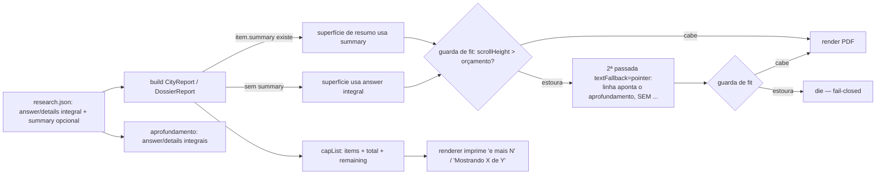

# Impl: Relatórios e dossiês sem truncamento mecânico — reformular para caber ou ampliar o campo

Status: aprovado
Atualizado em: 2026-09-17
Issue: #1136
Intenção: docs/plans/relatorios-sem-truncamento.md
Appetite restante: herdado (~1–2 dias eng)
Design UI: N/A — superfície inalterada; alvo é o hi-fi já aprovado do C186 e do C163 (Impeccable B)

## Leitura da intenção

- **Outcome:** gerar relatório/dossiê/boletim com texto longo sem **nenhum "…" em superfície de resumo**, sem item sumindo em silêncio (contador em toda lista truncada), com o **integral preservado no aprofundamento** e a **guarda de fit verde** (fail-closed).
- **O que NÃO negociar:** proibido corte mecânico no resumo; contador em toda lista truncada; integral no aprofundamento; guarda de fit fail-closed; **sem redesenho do hi-fi aprovado C163/C186**; o `summary` é redigido pelo researcher — o builder não redige; sem fonte não publica; empenho ≠ pagamento; esfera/abrangência nunca somadas; PII mínima; artefato gitignored; defeso.
- **O que reavaliar:** (a) a "Direção" sugere dono único substituindo `excerpt()` — a hipótese de _onde_ ele vive é decisão de engenharia (D1); (b) a mecânica de "ampliar orçamento enquanto a guarda permitir" precisa de um mecanismo concreto (D5); (c) C157 pode virar sucessor (D-assumida).

**Natureza explícita:** mudança de **`scripts/` + skills**. **Sem Payload schema, sem migration, sem contrato de URL pública, sem Consent/LGPD**; `push:false` intocado; nenhuma collection/global/field tocado.

## Abordagem recomendada

**Opções consideradas:** A | B | C
**Recomendação:** A — dono único estendido em `reportText.mjs`, `summary` opcional por item, contador `{items,total,remaining}`, fallback de ponteiro sem "…", e ampliação decidida pela guarda em 2 passadas.
**Rejeitadas:** ver D1–D5.

### Decisões de engenharia

**D1 — Onde vive o dono único de orçamento/composição de texto (substitui o `excerpt()` do C163)?**
Opções: A) estender `scripts/lib/reportText.mjs` (contrato compartilhado de texto impresso, já "one owner, two consumers" para C163+C186) | B) módulo novo `scripts/lib/reportBudget.mjs` | C) manter em `cityReportBlocks.mjs` e importar no C186.
Recomendação: **A** — `reportText.mjs` já é o dono declarado do texto impresso consumido pelos dois relatórios; adicionar `capList`/`excerptDeepDive`/`joinWithRemainder`/`summaryText` ali **estende o dono** em vez de gemar, e mantém o módulo puro (não importa modelo de blocos).
Rejeitadas: **B** porque cria um segundo lugar para o mesmo conceito ("texto compartilhado"), exatamente o twin que o AGENTS proíbe; **C** porque faria o C186 (dossiê) depender do modelo de blocos do C163 — inversão de dependência e grafo pesado.

**D2 — Forma e fallback do `summary`.**
Opções: A) `summary` opcional em `items[]` dos dois contratos de pesquisa, sem fonte própria (herda a do item); builder prefere `summary`, senão `answer` | B) `summary` global por arquivo | C) `*Summary` em todo campo livre (`approach`, `leaders`, `leaderAgenda`, `emendasIndicators[].purpose`…).
Recomendação: **A** — resolve na origem e dá ao researcher o controle editorial; é o menor contrato que cobre as superfícies de resumo; herda a fonte do item (não é fato novo, não passa por "sem fonte não publica" de novo).
Rejeitadas: **B** porque o próprio plano de intenção rejeita global ("summary por item, auto-contido por superfície"); **C** porque explode contrato/validador/testes por ganho marginal — `purpose` de indício segue sem corte, coberto pelo fallback de linha.

**D3 — Forma do contador (toda lista truncada).**
Opções: A) `capList(list, max)` devolve `{ items, total, remaining }`; renderizadores imprimem a copy que já existe no repo ("e mais N" em listas; "Mostrando X de Y" em tabelas/painéis) | B) só `remaining` | C) só `total`/`shown`.
Recomendação: **A** — reusa as três formas já impressas (indicatorList, table note, region scope), não perde o total e cobre corte por desenho e por lista.
Rejeitadas: **B** porque não sustenta "Mostrando X de Y" onde o corte é por desenho; **C** porque perde o "e mais N" das listas.

**D4 — O que fazer quando nem `summary` nem o `answer` cabem.**
Opções: A) linha-ponteiro **sem reticências** ("Texto integral no aprofundamento — <seção>") | B) cortar com "…" | C) deixar a guarda abortar.
Recomendação: **A** — literal do plano de intenção ("a linha aponta o aprofundamento sem reticências"); o integral já vive no aprofundamento.
Rejeitadas: **B** porque viola o outcome; **C** porque a guarda fail-closed é a última linha de defesa, não a primeira.

**D5 — Mecânica de "ampliar o orçamento enquanto a guarda permitir".**
Opções: A) 2 passadas guard-gated: (1) `summary ?? answer` integral; se a guarda estourar, (2) rebuild com `textFallback:'pointer'` (só campos sem `summary` viram ponteiro; o `summary` do researcher é preservado); ainda estourou → `die` | B) descida em 3 degraus (integral → caps de referência → ponteiro) | C) manter caps fixos atuais e só trocar "…" por ponteiro.
Recomendação: **A** — a guarda é o teto real ("amplia enquanto permitir"); a 2ª passada cobre o caso comum (researcher sem `summary`) sem corte mecânico; determinístico, testável (o modelo aceita a flag, o builder orquestra as 2 medições). O `die` final permanece e, quando dispara com `summary` presente, aponta o arquivo de pesquisa a encurtar.
Rejeitadas: **B** porque custa mais uma medição/estado para ganho marginal; **C** porque mantém o corte mecânico e não honra "prefere `answer`".

### Componentes / mudanças

- **`scripts/lib/reportText.mjs`** (dono único; atualiza o header para declarar orçamento/composição): ganha `capList(list, max) → {items,total,remaining}`, `excerptDeepDive(text, max)` (corte explícito com "…", **só aprofundamento**), `joinWithRemainder(values, limit)` (junção por contagem, sempre "e mais N", **sem** corte de caractere), `summaryText(item) → {text, fromSummary}` e `SUMMARY_POINTER_COPY`. Puro, sem modelo de blocos. Substitui o `excerpt()` do C163.
- **`scripts/lib/cityReportResearch.mjs`** e **`scripts/lib/dossieResearch.mjs`**: `items[]` passa a aceitar `summary` (`isNonEmptyString → trim`, senão `null`; **não** gera lacuna — é fallback de renderização). `news[].summary` fica como está (não tocado).
- **`scripts/lib/cityReportBlocks.mjs`**: remove `excerpt()`; todos os call-sites de página 1 (`:158,198,232,236,248,255,288,310/311,322,350,368,382`) usam `summaryText(item)`; `joinLimited` → `joinWithRemainder`; slices silenciosos do aprofundamento (`:870` sinal, `:1097` menção, `:1113` sumário de fala) → `excerptDeepDive`; `buildCityReport({ textFallback = 'full' })` — em `'pointer'`, campos sem `summary` imprimem o ponteiro. Integral permanece em `buildResearchAnswersTable`.
- **`scripts/build-city-report.mjs`**: loop de 2 passadas (build → render → medir `[data-page="summary"]`; se `> PAGE_ONE_BUDGET_PX`, rebuild com `textFallback:'pointer'`; se ainda estourar → `die`). Tolerância/budget atuais intocados; mensagem de `die` atualizada.
- **`scripts/lib/dossieBlocks.mjs`**: `limit()` → `capList`; `deliveries/hooks/pending/era.numbers/era.actions/regionItems` carregam `{items,total,remaining}` (fim do descarte silencioso); `buildDossierReport({ textFallback = 'full' })` para os títulos/sumários de página 1.
- **`scripts/lib/dossieRender.mjs`**: `renderDeliveries`/`renderHooksAndPending`/`renderEra`/região imprimem o contador reusando `.meta`/`.muted small` ("Mostrando X de Y — o restante está nas eras"). Região já tem `total` (:308/:317).
- **`scripts/lib/dossieBulletin.mjs`** + **`dossieBulletinRender.mjs`**: boletim passa a expor `remaining`/`total`; renderer imprime "e mais N item(ns) no dossiê" na seção "E mais".
- **`scripts/lib/dossieCamara.mjs`**: `(sumario ?? transcricao).slice(0,280)` → `excerptDeepDive` (aprofundamento, "…" explícito); nota de limite de coleta para o teto de 20 da API (sem inventar total).
- **`scripts/build-dossie-solla-cidade.mjs`**: mesmo loop de 2 passadas para dossiê e boletim; mensagens de `die` atualizadas.
- **Skills**: `.agents/skills/relatorio-cidade/SKILL.md` (§Contrato dos JSONs :131-158 + copy de página 1 :305-322) e `.agents/skills/dossie-solla-cidade/SKILL.md` (§Contrato dos JSONs :141-170 + item/notes :117-139) documentam `summary` por item ("curto, completo e auto-contido, redigido para caber no orçamento da superfície de resumo") e a regra "integral no aprofundamento; sem `summary`, o builder prefere `answer`; nunca há corte no resumo".
- **Migration:** **sem migration** (nenhum schema Payload tocado).
- **Access / Consent:** N/A — sem write path, sem PII, sem auth; nada de `Consent`/`overrideAccess`.
- **UI:** N/A — Impeccable B; encaixe no hi-fi aprovado; sem componente/estado/layout novo. Se algo exigir mudança material de layout, o `designer` entra e volta ao humano no PR.

### Dados → forma (se aplicável)

- **Forma:** contador **textual** reusando padrões existentes — "e mais N" (listas/bullets) e "Mostrando X de Y" (tabelas/painéis/notas) — e ponteiro textual para o aprofundamento no limite. É a menor mudança sobre o hi-fi aprovado e não introduz linguagem visual nova.
- **Rejeitadas:** ícone/`badge` de "há mais" (redesenho e novo vocabulário visual); reticências como marcador de resto (é o defeito a eliminar); paginação/expansão (não cabe em PDF A4 de uma página, é redesign).

## Fases verificáveis

1. **Dono único (tracer)** — `reportText.mjs`: `capList`, `excerptDeepDive`, `joinWithRemainder`, `summaryText` + `SUMMARY_POINTER_COPY`. Novo `tests/unit/reportText.unit.spec.ts`: `capList` devolve `items/total/remaining`; `excerptDeepDive` marca "…" uma única vez e respeita `max`; `summaryText` prefere `summary` e cai para `answer`; **nenhum primitivo de superfície de resumo emite "…"**. Quota ~2–3h.
2. **Contrato `summary`** — `cityReportResearch.mjs` + `dossieResearch.mjs`; casos novos nos specs respectivos (summary trimado, vazio→null, sem lacuna, item segue publicado só com a fonte do `answer`). Skills atualizadas (contrato + copy de página 1). Quota ~2–3h.
3. **C163** — remove `excerpt`, call-sites de página 1 via `summaryText`, `joinWithRemainder`, slices do aprofundamento via `excerptDeepDive`; flag `textFallback`; 2 passadas no `build-city-report.mjs`. Atualiza `tests/unit/cityReportBlocks.unit.spec.ts:702,752,780` (o :752 deixa de esperar `endsWith('…')`) e `tests/unit/cityReportRender.unit.spec.ts:127,166`; novo teste "página 1 sem '…' e integral presente". Quota ~4–5h.
4. **C186 + boletim** — `capList` e contadores em deliveries/hooks/pending/era/region; boletim `remaining`/`total`; `dossieCamara` com corte explícito de aprofundamento; 2 passadas no `build-dossie-solla-cidade.mjs`. Atualiza `tests/unit/dossieBlocks.unit.spec.ts:155` e `tests/unit/dossieBulletin.unit.spec.ts:27,60`; novos testes de contador (nenhum item some; `highlights+moreItems+remaining === total`). Quota ~4–5h.
5. **Gates** — `pnpm lint`, `pnpm typecheck`, `pnpm test:unit` (ou `pnpm gate:fast`); `pnpm knip`; checagem de ciclos do CI; push via `pnpm push`. Quota ~1–2h.

## Rabbit holes / Não escopo (engenharia)

- **Varredura de todo `slice` do repo** — só a família C163/C186.
- **C157** (`build-solla-ceuci-salvador-report.mjs`, self-contained, "…" próprios em :392/:446 e slices :133/:142/:601) — **sucessor**, não este item; gatilho de revisitação: se o dono novo provar drop-in de ~1h no C157, incluir; senão abrir Issue sucessora.
- **Builder redigir/encurtar texto** — proibido; sem `summary`, o texto é integral ou ponteiro; nunca reescrito.
- **`summary` global** — rejeitado (D2).
- **Ampliação como licença para crescer** — a guarda fail-closed é o teto; nada de espremer layout.
- **Confundir "e mais N" (lista) com "…" (frase)** — remediações distintas, ambas tratadas.
- **`news[].summary` validado e nunca renderizado** — não mexer aqui (não é superfície do problema; bullet-in separado se houver demanda).
- **Redesenho do hi-fi C163/C186** — fora; se material, aciona `designer`.
- **Payload schema/migration/URL pública/Consent/LGPD** — nada.

## Riscos e mitigação

- **Página 1 estoura com a pesquisa real** → 2 passadas guard-gated (D5); guarda fail-closed preservada; teste com `answer` longo sem `summary` e com `summary`.
- **Pesquisas existentes sem `summary`** → fallback `answer` integral; `summary` é opt-in, sem regressão e sem lacuna nova.
- **Linha de contador empurra o layout aprovado do C186** → nota curta reusando `.meta`/`.muted small`; se estourar, a guarda aborta e a copy do contador é encurtada antes de qualquer mudança visual; se exigir mudança material → `designer`.
- **Corte explícito com "…" no aprofundamento confundido com resumo** → `excerptDeepDive` só é usado em seções de aprofundamento (sinais, acervo de falas, ações da Câmara); teste de renderer garante ausência no `[data-page="summary"]`.
- **Duplicação C163↔C186** → dono único em `reportText.mjs`; `knip`/ciclos no CI.
- **Testes que hoje afirmam "…"** → atualização deliberada e listada (Fase 3/4), com o novo aceite "sem '…' no resumo".
- **Câmara sem total confiável da API** → contar o que o artefato imprime (era/deliveries) e rotular o limite de coleta; nunca inventar total.

## Decisões assumidas

Registradas do §Questões em aberto da intenção (fluxo `--auto` grava os literais assumidos):

1. **Campo `summary` vs só ampliar orçamento** → **A) `summary` por item + ampliação como fallback** (assumido).
2. **"…" sempre proibido ou só no aprofundamento** → **A) proibir nas superfícies de resumo, manter no aprofundamento** (assumido).
3. **Cobrir C157 agora ou sucessor** → **B) sucessor** (assumido; gatilho de revisitação em Não escopo).
4. **Prioridade P1 vs P2** → **B) P2** (assumido; reavaliar para P1 se o C187 entrar em produção imediatamente).
5. Hipóteses de engenharia assumidas: dono em `reportText.mjs` (D1), contador `{items,total,remaining}` (D3), 2 passadas guard-gated (D5), `summary` herda a fonte do `answer` (D2).
6. Sem Payload schema/migration/URL pública/Consent/LGPD; `push:false` intocado.

## Aceite de engenharia

- [ ] Aceite de produto da intenção ainda coberto: nenhum "…" em superfície de resumo; toda lista truncada com contador; integral no aprofundamento; guarda verde fail-closed; contrato `summary` documentado nas duas skills.
- [ ] Invariantes AGENTS/engineering-standards: "edite o dono, não gema um irmão" (dono único em `reportText.mjs`, reusado por C163+C186); sem Payload/migration/URL/Consent; scripts puros.
- [ ] Testes de domínio previstos (unit) onde os caps/contrato mudam: `cityReportBlocks`, `cityReportRender`, `dossieBlocks`, `dossieBulletin`, `cityReportResearch`/`dossieResearch` e o novo `reportText`.
- [ ] `pnpm gate:fast` (lint + typecheck + unit) e `pnpm knip` verdes; push via `pnpm push`.
- [ ] Nenhuma migration criada; `push:false` inalterado.

## Desvios na execução

- **Boletim sem 2ª passada de ponteiro.** O plano previa o "mesmo loop de 2
  passadas para dossiê e boletim". Na execução, o defeito do boletim era o
  **descarte silencioso** (teto 20 sem contador), não corte de texto; o texto por
  fato já é capado por desenho e a guarda é fail-closed. Então: contador
  `factsRemaining` ("e mais N fatos com fonte no dossiê") + `summary ?? answer`
  como headline, sem 2ª passada. O dossiê e o C163 mantêm a 2ª passada.
- **Indício de emenda (`emendasIndicators[].purpose`) nunca vira ponteiro.** Não
  há cópia do `purpose` no aprofundamento; então ele entra integral (sem "…") e a
  guarda fail-closed decide — o researcher encurta se estourar. Coerente com a
  decisão D2 ("purpose segue sem corte").
- **Nota do limite de coleta da Câmara no método da Era C**, não num campo novo
  de dados (não inventa total): o texto do `eraMethod.C` declara que a coleta é
  limitada às páginas consultadas.
- **`region.items`/`era.numbers`/`era.actions` ganham contador, sem paginação.**
  O integral dessas listas não vive em outra página; o contador torna o descarte
  declarado (fim do silêncio), sem redesenho — conforme o appetite.

## Self-score decision-quality

**Score: 5/5** — (1) decisões caras (dono único, contrato `summary`, contador, fallback, mecânica de ampliação) têm rejeitadas explícitas em D1–D5; (2) cabe no appetite herdado (5 fases, ~14–18h); (3) rabbit holes nomeados e cortados (C157 sucessor, varredura de slices, builder-redator, `news[].summary`); (4) depth check: reusa o dono existente `reportText.mjs` e as três formas de contador já impressas, sem módulo/helper especulativo; (5) o outcome de produto permanece intacto — a engenharia não o reescreveu (nada de "…", integral preservado, guarda fail-closed).
