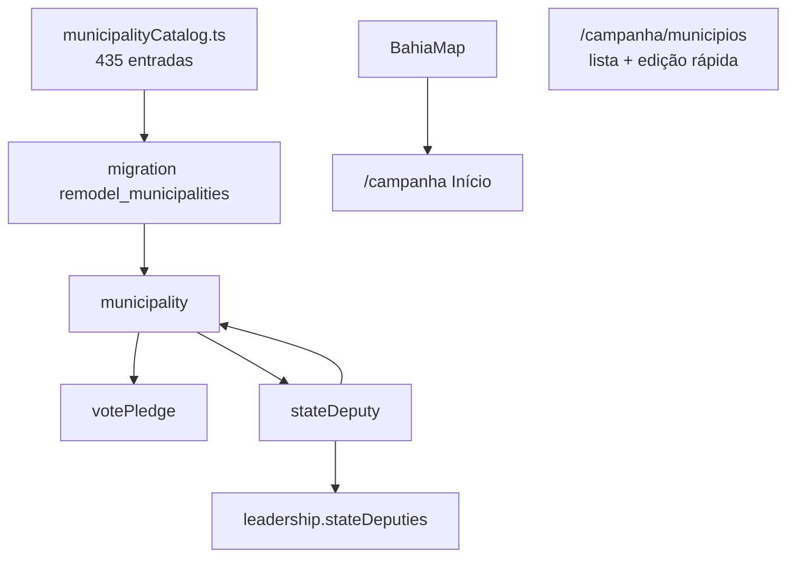

# Remodelagem Municípios — mudanças de rumo 2026-07-23

Status: em execução
Atualizado em: 2026-07-23
Item do roadmap: [docs/roadmap.md](../roadmap.md) (seção "Remodelagem Municípios", fases M1–M5)
Impeccable: C — vertical `/campanha` com rename, lockdown de liderança, dobradinhas e mapa no Início
Appetite: ~5–5,5 dias eng (M1–M5)
Responsável: —

## Design (Impeccable)

Âncoras: `PRODUCT.md` / `DESIGN.md` (register product — "Field Desk") · tema `data-theme='campaign'`.

Na implementação: shape compacto por superfície → craft → critique → polish (F3–F5). `harden` em form novo do leader; `optimize` só se dashboard degradar.

Brief compacto:

- **Persona / contexto:** Alex (coordenador) e assessores no desk; Lia (liderança) só cadastra contatos de apoiadores no celular.
- **Job principal:** nomenclatura "Município" alinhada ao jargão de campo; staff opera sem ruído de expectativa para lideranças; mapa analítico no Início; dobradinhas registráveis.
- **Estratégia de cor:** Restrained (Field Desk).
- **Edit where you see:** mantido para staff; leader perde edição de votos/demandas.
- **Anti-goals:** não expor inteligência staff à liderança; não virar dashboard SaaS; não abrir polígonos de zona neste ciclo.

## Dados → decisão → apresentação

- **Vou apresentar dados?** Sim — mapa move para Início (staff); lista de municípios foca números editáveis.
- **Decisões desbloqueadas:** coordenador prioriza território no mapa (Início); assessor edita votos na lista; staff associa dobradinhas por município/liderança.
- **Forma escolhida:** mapa choropleth no dashboard (BahiaMap, ano/escala/cenário); lista/tabela na aba Municípios — **rejeitado:** mapa na lista (tira foco operacional).
- **Anti-goals de dado:** % estadual absoluto; gauge SaaS.

## Contexto

Reunião 2026-07-23 com coordenador geral e deputado Jorge Solla ([CUSTOMER.md](../CUSTOMER.md), entrevista `output/transcribe/general-coordinator-interview-20260723/`). A remodelagem Praças (R0–R5) está em código mas **não deployada** — janela para rename destrutivo barato.

Mudanças acordadas:

1. Nomenclatura "Praça" → "Município" (código `municipality`, URLs `/campanha/municipios`).
2. Role `candidate` (candidato) — superset de visão do coordenador.
3. Demandas só staff (coordenador, assessor, candidato).
4. Liderança: apenas ferramenta de contatos de apoiadores; staff registra votos declarados.
5. Camaçari = município inteiro (não dividido em zonas); Salvador mantém 19 zonas.
6. Dobradinhas: entidade `stateDeputy` + seletores em município e liderança.
7. Mapa analítico na aba Início; lista de municípios focada em números.

## Objetivos

- 435 municípios seedados (`municipality` collection); catálogo congelado da era Praça preservado para migration histórica.
- Roles: `coordinator`, `advisor`, `leader`, `candidate`; candidate vê tudo; leader só cadastra apoiadores.
- Demandas criáveis apenas por staff; leader sem acesso a demandas/planos/municípios/eleições.
- `stateDeputy` + relações N:N com `municipality` e `leadership`.
- Mapa no dashboard staff; `/campanha/municipios` sem mapa.
- Guardrails: access `overrideAccess: false`; transações com `req`; Consent fail-closed; migrations commitadas.

## Decisões travadas

- **Rename completo `plaza` → `municipality`.** Código, DB, URLs. **Rejeitado:** só labels (drift código/UI); ALTER RENAME (sem dados reais a preservar, risco de drift).
- **Camaçari única entrada** (`slug: camacari`, `tseZones: [170,171]`). **Rejeitado:** manter 2 zonas.
- **Leader lê só apoiadores que criou** (`createdBy`). **Rejeitado:** add-only sem lista; ver todos do município.
- **`stateDeputy` + hasMany** (padrão `organization`). **Rejeitado:** collection-join dobradinha.
- **Staff registra `declaredVotes`.** Leader não declara pelo app.
- **Sem redirects** `/campanha/pracas` (pré-deploy).
- **i18n:** identificadores em inglês; UI em pt-BR.

## Questões em aberto

- **Rótulo do kind `municipio` vs `zona`?** **Opções:** "Município inteiro" / "Zona eleitoral" | manter "Município"/"Zona eleitoral". **Recomendação:** "Município inteiro" / "Zona eleitoral (Salvador)" no polish.
- **Consent `apoiador-cadastro` cobre cadastro por liderança?** **Recomendação:** sim no Onda 0; app fail-closed até jurídico confirmar.

## Abordagem proposta

Fases M1–M5 mapeiam F1–F7 do plano de execução da sessão.

## Dependências

- Remodelagem Praças R1–R5 (código base).
- A10 cenários (entregue).
- Onda 0 para PII real de apoiadores.

## Não escopo

- Redirects de URL antiga; polígonos B8 F2; histórico de dobradinha; A6 insight TSE (camada futura sobre `stateDeputy`).
- Renomear `bahiaTerritories` / identificadores TI.

## Rabbit holes

- **Merge Camaçari com dados existentes.** Prod sem dados — seed direto 435, sem migration de merge.
- **Rename parcial.** Uma passada completa; não misturar com features no mesmo commit por camada.

## Adiado com gatilho

- **Campos candidate-only.** Revisitar quando produto definir o que só o candidato vê (role já plumbed).
- **Lista de contatos do leader com busca.** Revisitar quando volume > 50 por liderança.

## Referências

- [remodelagem-pracas.md](remodelagem-pracas.md) — plano anterior
- [insight-dobradinha-2026.md](insight-dobradinha-2026.md) — A6 insight (futuro)
- `docs/CUSTOMER.md` — entrevista 2026-07-23
- AGENTS.md — Campaign auth, naming, migrations
