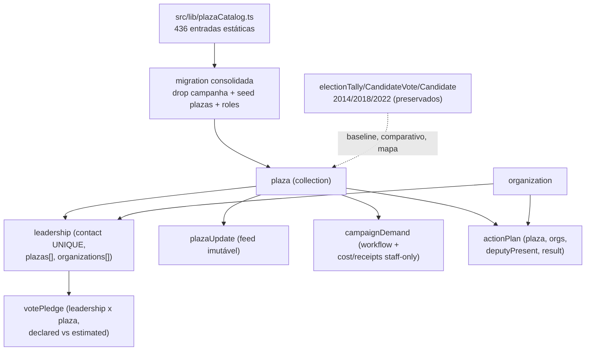

# Remodelagem da /campanha: Núcleo Eleitoral → Praça

Status: entregue (código; deploy pendente — revisar SQL destrutivo antes do build de produção)
Atualizado em: 2026-07-21
Item do roadmap: [docs/roadmap.md](../roadmap.md) (seção "Remodelagem Praças", itens R0–R5)
Impeccable: C — vertical `/campanha` remodelada (rotas novas `/campanha/pracas`, `/campanha/organizacoes`, `/campanha/demandas`; adaptação de planos/apoiadores/dashboard)
Appetite: ~2,5–3 semanas eng (fases R0–R5), funcional antes de 16/08 (início da propaganda)
Responsável: —

## Design (Impeccable)

Âncoras: `PRODUCT.md` / `DESIGN.md` (register product — "Field Desk") · tema `data-theme='campaign'` · shells existentes (`CampaignPageShell`, `CampaignListPagination`, `campaignListUrl`, `campaignFormFields`, shadcn `src/components/ui`).

Na implementação: shape compacto por superfície → craft → critique → polish (Fase R5).

Brief compacto:

- **Persona / contexto:** Alex (coordenador geral) aloca esforço entre 436 Praças; o Assessor opera só as Praças que administra, no celular, sob pressão; Lia (liderança) declara votos e abre demandas pelo PWA.
- **Job principal:** enxergar o mesmo quadro operacional por Praça (votos, lideranças, agenda, demandas) e agir no território certo.
- **Estratégia de cor:** Restrained (Field Desk). Exceção justificada: escala divergente do mapa comparativo (vermelho `#c51414` ↔ branco ↔ azul novo token).
- **Anti-goals:** não virar dashboard SaaS genérico; não expor à liderança números de staff (estimativas do assessor, tendência política, custos).

## Contexto

O MVP de Núcleos (ciclos 1–2, Trilhas A–E) modelou a unidade operacional como `electoralNucleus`: uma entidade criada manualmente, com geografia livre (arrays `regions`/`cities`/`neighborhoods`), natureza organizativa (`organizationKind`) e estimativa de votos única por núcleo (proposta→confirmada). Em 2026-07-20, feedback da coordenação de campanha invalidou três premissas:

1. **A coordenação não se organiza em torno de núcleos abstratos, e sim de territórios pré-definidos** — municípios, exceto na RMS onde o delimitador é a zona eleitoral. Criar/editar geografia manualmente é atrito sem valor.
2. **O jargão real é "Assessor"**, não "coordenador" (que colide com "Coordenador Geral"). E "tendência" na campanha significa mudança de conjuntura política (prefeito aliado que virou adversário), não evolução de série numérica.
3. **Estimativa de votos é por liderança×território**, com assimetria: a liderança informa quantos votos traz; o assessor estima o valor real e a liderança nunca vê o ajuste.

A decisão de produto (2026-07-20, confirmada com o usuário) é remodelar a vertical em torno de **"Praça"** (código: `plaza`), com reset dos dados de campanha em produção (não há dados reais na vertical; o site público permanece intocado).

## Objetivos

- As 436 Praças existem pré-definidas (seed via migration a partir de catálogo estático versionado); ninguém cria/edita geografia de Praça no app.
- Roles `coordinator` ("Coordenador Geral"), `advisor` ("Assessor"), `leader` ("Liderança"); assessor vê e gerencia **somente** as Praças que administra.
- Liderança é 1 registro por pessoa (`contact` UNIQUE), vinculada a N Praças e N Organizações; declara votos por Praça (`votePledge.declaredVotes`); o assessor registra `estimatedVotes` invisível à liderança (field access nega leitura).
- Organizações (sindicatos, associações, etc.) com página própria mostrando lideranças associadas e Planos de Ação apoiados.
- Planos de Ação com Praça, organizações apoiadoras, "Deputado presente" e registro de resultado (texto + fotos/vídeos) consultável no histórico da Praça.
- Demandas abertas pela liderança (ou staff), revisadas pelo assessor, escaláveis ao coordenador geral, com custo e comprovantes staff-only.
- Tendência política manual (staff) por Praça; a série numérica E2 é renomeada para "Evolução de votos" na UI.
- Comparativo multi-candidato/multi-ano por Praça (tabela) e no mapa (escala divergente vermelho↔branco↔azul).
- Guardrails: access control por papel em toda leitura (`overrideAccess: false` com `user`); escrita multi-collection transacional com `req`; sem chave `Consent` nova (Onda 0 inalterada); migrations commitadas (`push: false`).

## Decisões travadas

- **Entidade principal "Praça", código `plaza`.** Tradução direta minimiza carga cognitiva; "Praça" evita colisão com Territórios de Identidade na UI. (Usuário, 2026-07-20.) **Rejeitado:** `territory` (não traduz "praça"; colide com identificadores TI existentes — `bahiaTerritories`, `regions`, `territoryForCity` permanecem intocados); manter "Núcleo" (não representa a organização real da coordenação).
- **436 Praças pré-definidas:** 415 municípios (todos menos Salvador e Camaçari) + 19 zonas de Salvador (ZE 1–19) + 2 de Camaçari (ZE 170/171). Zonas compartilhadas (141, 162) e que vazam da RMS (128, 185, 200) são **cortadas na divisa municipal** — cada município é sua própria Praça; dados TSE são município×zona, recorte exato. (Usuário, 2026-07-20.) **Rejeitado:** zona "pura" multi-município (unidades cruzando divisa municipal e vazando da RMS); zonas em todos os 13 municípios da RMS (11 têm zona única — viraria 1:1 com o município); manter geografia livre por núcleo.
- **Roles em inglês no valor do enum:** `coordinator` | `advisor` | `leader` (labels pt "Coordenador Geral" / "Assessor" / "Liderança"). Aproveita o reset; sem segundo "coordenador" não há ambiguidade. Migração converte `geral`→`coordinator`, `coordenador`→`advisor`, `lideranca`→`leader` preservando contas. (Usuário, 2026-07-20.) **Rejeitado:** manter valores pt (`assessor` etc.) — inconsistente com a decisão de reduzir carga cognitiva no código.
- **Reset dos dados de campanha em produção.** Migração destrutiva dropa e recria as collections da vertical campanha (núcleos, lideranças, atualizações, convites, apoiadores, planos); `campaignUser` e `Contact` preservados; site público intocado. (Usuário, 2026-07-20 — "apenas na vertical campanha; as publicações do site público são reais".) **Rejeitado:** migração núcleo→praça com preservação (não há dados reais que justifiquem o custo); coexistência `/nucleos` + `/pracas` (duas verticais em paralelo confundem o time).
- **Assimetria de votos: `declaredVotes` (liderança) vs `estimatedVotes` (staff-only).** A liderança informa; o assessor estima; a liderança lê apenas o próprio declarado. Field access nega leitura de `estimatedVotes`/`estimateNote` a `leader` (mesma técnica de `supportStatus`); view models de liderança nunca somam estimados. Agregados staff usam `estimatedVotes ?? declaredVotes`. (Usuário, 2026-07-20.) **Rejeitado:** fluxo sugerir→confirmar por Praça (não é o processo real); mostrar o ajuste à liderança (quebra a relação de campo).
- **Assessor vê somente as Praças que administra** (`plaza.advisors`), incluindo lista, mapa, agregados e dashboard. (Usuário, 2026-07-20.) **Rejeitado:** leitura global com gestão restrita (vazaria inteligência entre assessores).
- **Demandas com eixo financeiro na v1:** `cost` + `receipts[]` (upload → `media`), field access staff-only, disclaimer de controle interno (não substitui SPCE/TSE — base legal e limites já pesquisados em [demandas-campanha.md](demandas-campanha.md)). (Usuário, 2026-07-20.) **Rejeitado:** cortar comprovantes da v1.
- **Mapa comparativo divergente:** vermelho da plataforma (`#c51414`) onde Solla lidera, centro branco, azul onde o comparado lidera. (Usuário, 2026-07-20.)
- **i18n e naming** seguem o AGENTS.md: identificadores em inglês (`plaza`, `Plaza*`, `votePledge`, `campaignDemand`, `plazaUpdate`, `organization`), URLs/segmentos em pt (`/campanha/pracas`, `/campanha/organizacoes`, `/campanha/demandas`), labels/admin em pt-BR; enums de dados permanecem em pt (`municipio|zona`, `aberta|em_analise|...`).

## Questões em aberto

- **Valores do enum de tendência política?** **Opções:** `favoravel|neutra|desfavoravel` | escala 5 pontos | texto livre. **Recomendação:** 3 valores + nota obrigatória (validar jargão com a coordenação na âncora de quarta).
- **Contas `leader` órfãs pós-reset?** **Opções:** manter logins | desativar. **Recomendação:** manter contas (username/senha preservados) e revincular quando a nova liderança for cadastrada com o mesmo telefone.
- **Tom do azul do modo comparação?** **Recomendação:** novo token semântico no tema `campaign` com contraste AA sobre branco; definir no polish (R5).

## Abordagem proposta

Componentes principais (depth check: reusar shells/utilities existentes):

- **`src/lib/plazaCatalog.ts`** — catálogo estático das 436 Praças (slug, nome, kind `municipio|zona`, city, region TI, ibgeCode, tseCityCode, zoneNumber?, tseZones[]), derivado de `bahiaTseZones`/`bahiaMunicipalityCodes`/`bahiaTerritories` + fixture `tests/fixtures/` + teste int de contagem/bijeção/consistência.
- **Collections** (`src/collections/`): `Plaza.ts`, `Leadership.ts` (reescrita), `VotePledge.ts`, `Organization.ts`, `CampaignDemand.ts`, `PlazaUpdate.ts` (ex-`NucleusUpdate`), `ActionPlan.ts` (alterada: `plaza`, `organizations`, `deputyPresent`, `result*`), `Supporter.ts` (nucleus→plaza), `CampaignUser.ts` (roles), `CampaignInvite.ts` (escopo por plazas).
- **`src/utilities/campaignAccess.ts`** — reescrita: `getAdministeredPlazaIds` (advisor), `getLeaderPlazaIds`, access por collection seguindo o padrão atual (Where por papel, cache em `req.context`).
- **Migração** `pnpm migrate:create remodel_plazas` — converte roles com `USING`, dropa tabelas da vertical, cria o novo schema e faz seed das 436 Praças (import do catálogo no migration, precedente Onda 0).
- **Geografia eleitoral** — `plazaElectionGeography` substitui `nucleusElectionGeography` (praça-município: cityCode + todas as zonas; praça-zona: cityCode + [zoneNumber]); baseline/série/gap/insights adaptados.
- **Superfícies** (`src/app/(campaign)/campanha/(app)/`): `pracas/` (lista + mapa com seletor de ano), `pracas/[slug]/` (tabs Visão geral / Eleições / Lideranças / Atualizações / Demandas), `organizacoes/`, `demandas/`, `planos/` adaptado, `apoiadores/` adaptado, dashboard reancorado. Server actions em `campanha/actions/` seguem o padrão transacional existente.
- **Mapa** — reusa `BahiaMap`/`ChoroplethMapPanel` (B3) com métrica por ano (2014/2018/2022 TSE; 2026 = `estimatedVotes ?? declaredVotes` agregado) e modo comparativo divergente (Fase R4).

## Fases

- **R0 Documentação** — este plano; roadmap reescrito; AGENTS/notebook/PRODUCT/CUSTOMER.
- **R1 Domínio** — catálogo + collections + access + migração + types verdes.
- **R2 Superfícies core** — pracas lista/detalhe/mapa v1, CRM liderança multi-Praça, votos declarados×estimados, dashboard, convites.
- **R3 Organizações, Planos, Demandas** — verticais novas + adaptação de planos.
- **R4 Inteligência** — comparativo multi-candidato, mapa divergente, tendência manual, rename série E2.
- **R5 Hardening** — testes por papel, responsividade 360/390/768/1440, critique/polish, Aikido, checklist de deploy (migração destrutiva revisada antes do build de produção).

## Dependências

- Reusa: `bahiaTseZones`/`bahiaMunicipalityCodes`/`bahiaTerritories`/`bahiaGeometries` (A2/B2), collections eleitorais + seeds 2014/2018/2022 (A3/E2), `BahiaMap`/choropleth (B3), locks transacionais (`postgresTransactionLocks`), `withPayloadTransaction`, `campaignConsent` (chaves existentes), shells de lista/form (C6/C9), PWA D1.
- Nenhum item externo bloqueia; Onda 0 (lote jurídico) segue paralelo e inalterado.

## Não escopo

- Polígonos por zona eleitoral no mapa (permanece como evolução futura do B4; v1 agrega zonas no polígono municipal com painel de detalhe).
- Push/notificações (D2, [notifications.md](notifications.md)); GOTV (C5); dobradinha automática 2026 (A6, reenquadrar pós-remodel); perfis IBGE (A8, reenquadrar).
- Exportação fiscal SPCE (documentado em [demandas-campanha.md](demandas-campanha.md)).
- Import CSV de lideranças/pledges (apoiadores mantém o wizard existente adaptado).

## Rabbit holes

- **Polígonos de zona (geocodificar seções).** Se alguém "só completar" o mapa de Salvador por zona: semanas de geoprocessamento frágil. **Mitigação:** agregação municipal + painel por zona; polígono de zona só com decisão explícita.
- **Cargo da liderança por organização.** Join com atributos (presidente, diretor…) explode o CRM. **Mitigação:** v1 é `hasMany` simples; atributo por vínculo só com pedido real.
- **Histórico auditável de tendência política.** v1 = valor atual + nota + autor/data; collection de histórico só se o coordenador geral pedir.
- **Renomear identificadores TI existentes.** `bahiaTerritories`/`regions`/etc. permanecem; renomear em massa é churn sem valor.
- **Vídeo grande no resultado do plano.** Upload via `media`/Blob tem limites de tamanho; documentar limite na UI, não construir pipeline de vídeo.
- **Paridade 1:1 da suíte de testes de núcleos.** Reescrever 488 testes int nucleus-based seria a cauda longa; portar cobertura por papel/fluxo crítico e apagar specs obsoletos, documentando o corte.

## Adiado com gatilho

- **Lista global de lideranças com filtros avançados.** Revisitar quando o CRM por Praça não bastar (pedido do coordenador geral ou >200 lideranças).
- **`demandUpdate` como collection separada.** Revisitar se o array `statusHistory` crescer além do razoável (>20 entradas por demanda).
- **Import em massa de pledges.** Revisitar quando houver planilha real de votos declarados por liderança.

## Referências

- `docs/roadmap.md` (seção "Remodelagem Praças")
- `docs/plans/demandas-campanha.md` — pesquisa legal/LGPD do eixo financeiro (reaproveitada)
- `docs/plans/mapa-bahia-geometrias.md` — decisões de geometria e limitação de zonas
- `docs/plans/baseline-eleitoral-tse.md` — modelo eleitoral por município×zona
- `src/collections/ElectoralNucleus.ts`, `Leadership.ts`, `NucleusUpdate.ts`, `ActionPlan.ts`, `Supporter.ts` — padrões (hooks de slug, locks, access) a portar
- `src/utilities/campaignAccess.ts`, `voteEstimate.ts`, `nucleusElectionGeography.ts`, `nucleusElectoralBaseline.ts` — base da reescrita
- `src/lib/bahiaTseZones.ts`, `bahiaMunicipalityCodes.ts`, `bahiaTerritories.ts`, `electionResults.ts`, `electionInsights.ts`
- AGENTS.md — Campaign auth, naming, transações, migrations (`push: false`), LGPD/Consent fail-closed
- `PRODUCT.md` / `DESIGN.md` — register product (Field Desk), Signal Red Rule, tokens `data-theme='campaign'`
