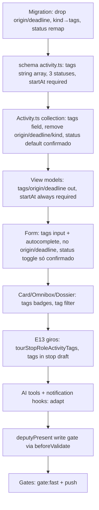

# Impl: Remodelar atividades para a agenda (calendário)

Status: aprovado
Atualizado em: 2026-08-06
Issue: #389
Intenção: docs/plans/remodelar-atividades-para-agenda.md
Appetite restante: ~1,5–2 dias eng (herdado)

## Leitura da intenção

- **Outcome:** Remodelar o modelo/formulário de atividade para parecer compromisso de agenda — tempo + lugar + quem + tags livres — em ~1 minuto. Lista/detalhe/actions continuam usáveis; C15 traz o calendário por cima.
- **O que NÃO negociar:** remover `origin` e `deadline`; renomear `kind` → `tags` (livres); status enxuto `confirmado | realizado | cancelado`; default `confirmado` + `startAt` obrigatório; remarcar horário com `deputyPresent` só coordinator/candidate; leader lockdown intacto; nenhuma nova collection de pessoa (Contact).
- **O que reavaliar:** hipótese da intenção de "omnibox de associados" — o formulário atual já tem `RelationMultiSelect` para orgs e checkboxes de assessores; uma omnibox mista (assessor + liderança + organização) é caro e o produto não mostrou dor real — **rejeitada** nesta leva (ver Rabbit holes).

## Abordagem recomendada

**Opções consideradas:** A | B | C  
**Recomendação:** **B** — `text` com `hasMany: true` (Payload 3.x nativo, armazena `text[]`, indexável, queryable com `contains`) — porque é o mais simples que atende "tags livres + filtro" sem nova collection.  
**Rejeitadas:**

- A — `array` com campo `text` aninhado: mais verboso, cada tag é uma row com id, desnecessário para tags simples.
- C — `relationship` para nova collection `ActivityTag`: super-engineering, a intenção diz "a mesa inventa" — não precisa catálogo administrado.

### Decisões de engenharia

**1. Tags: `text` com `hasMany: true`**  
Opções: A) `text hasMany` | B) `array` com text field | C) relationship a nova collection  
Recomendação: **A** — Payload 3.x suporta nativamente, armazena como `text[]`, filtro `contains` funciona sem join.  
Rejeitadas: B — verbosidade desnecessária; C — nova collection sem necessidade, vai contra "tags livres".

**2. Migração de `kind` → `tags`**  
Opções: A) migrar valores usando label map (comício → Comício) | B) migrar valores raw (comício) | C) descartar histórico  
Recomendação: **A** — preserva legibilidade; as labels já são pt-BR amigáveis e é o que a UI sempre mostrou.  
Rejeitadas: B — valores raw com underscore são feios como tag; C — perde histórico útil.

**3. Remap de status antigos**  
Opções: A) `planejado` → `confirmado`, `rascunho` → `cancelado` | B) tudo → `confirmado` | C) tudo → `cancelado`  
Recomendação: **A** — planejados tinham data, viram confirmados; rascunhos eram esboços sem data, cancelados é o destino honesto.  
Rejeitadas: B — rascunhos sem data virariam "confirmados" sem data, quebrando a invariante; C — perde trabalho já planejado.

**4. deputyPresent write gate**  
Opções: A) `beforeValidate` hook com role check | B) field-level access control | C) server action check  
Recomendação: **A** — `beforeValidate` tem acesso a `req.user`, `originalDoc`, e `data`; cobre todos os caminhos (admin + server action).  
Rejeitadas: B — field access não lê o doc atual facilmente; C — não cobre Payload admin.

**5. Omnibox tag filter**  
Opções: A) filter por tag exata (`contains`) com autocomplete dos valores existentes | B) multi-tag filter | C) manter kind enum no filtro  
Recomendação: **A** — atende o job "filtrar por tipo de compromisso" sem inflar; multi-tag é rabbit hole para C15.  
Rejeitadas: B — scope creep; C — viola aceite de produto.

**6. Formulário de tags (client)**  
Opções: A) tag input custom com datalist de valores conhecidos | B) Combobox multi-select | C) text field livre  
Recomendação: **A** — datalist HTML nativo dá autocomplete sem JS extra; o servidor passa a lista de tags conhecidas via props. Combobox multi é overkill para v1; text livre não dá autocomplete.  
Rejeitadas: B — dependência pesada para v1; C — sem autocomplete, viola opção B da intenção.

### Componentes / mudanças

- **Migration** (`20260806_XXXXXX_c14_remodel_activity_agenda`):
  - Add `tags` column (`text[]`)
  - Data: `tags = ARRAY[activity_kind_labels[kind]]` where kind is not null
  - Remap: `planejado` → `confirmado`, `rascunho` → `cancelado`
  - Drop `kind`, `origin`, `deadline` columns
  - Add NOT NULL default `confirmado` on status
  - JSON side: espelhar no `.json`
- **`src/lib/schemas/activity.ts`**: remover `activityKinds`/`activityOrigins`/`activityKindLabels`/`activityOriginLabels`/`ActivityKind`/`ActivityOrigin`; `activityStatuses` → `['confirmado', 'realizado', 'cancelado']`; adicionar `MAX_ACTIVITY_TAGS`, `MAX_ACTIVITY_TAG_LENGTH`; schema `tags: z.array(z.string().trim().min(1).max(80)).max(20).optional()`; remover `kind`/`origin`/`deadline` do `activityFieldsSchema`; `activityCreateSchema` default status → `confirmado`; `tourStopDraftSchema` — `kind` → `tags`.
- **`src/collections/Activity.ts`**: `tags` field (`text`, `hasMany: true`, `index: true`, `label: 'Tags'`); remover `kind`/`origin`/`deadline` fields; `status` options → 3 valores, default `'confirmado'`; `startAt` required; `activityStaffFieldSnapshot` atualizado; `validateActivitySchedule` adaptada (startAt sempre required); novo `validateDeputyPresentTimeGate` hook; `afterChange` remover check de `rascunho`; `defaultColumns` — trocar `kind` por `tags`.
- **`src/utilities/activityViewModels.ts`**: remover `kind`/`origin`/`deadline` de todos os view models; adicionar `tags: string[]`; `activityListSelect`/`activityFormSelect`/`activityDetailContextSelect` trocar `kind`/`origin`/`deadline` por `tags`.
- **`src/utilities/activityUi.ts`**: `ActivityListState.kind` → `.tag`; `buildActivityListWhere` — `{ tags: { contains: state.tag } }`; `isActivityKind` → `isActivityTag` (string validation); `parseActivityListParams` — `tag` instead of `kind`; `activityTabs` remover `rascunhos`.
- **`src/utilities/activityOmnibox.ts`**: `kind` filter → `tag` filter; seeds from `activityKindLabels` → from existing tags (server-provided); chips `kind:` → `tag:`.
- **`src/utilities/activityFormData.ts`**: remover `kind`/`origin`/`deadline` parsing; adicionar `tags` parsing (from `tagsJson` bounded JSON field).
- **`src/components/campaign/activity/ActivityForm.tsx`**: remover `kind` select, `origin` select, `deadline` field; adicionar `ActivityTagsField` (tag input + datalist); status toggle: apenas `confirmado` para novo; `startAt` always required.
- **`src/components/campaign/activity/ActivityCard.tsx`**: `activityKindLabels[activity.kind]` → render tags as small badges.
- **`src/components/campaign/activity/ActivityStatusBadge.tsx`**: remover `rascunho`/`planejado` variants.
- **`src/components/campaign/activity/ActivityFilters.tsx`**: kind → tag no omnibox.
- **`src/app/(campaign)/campanha/(app)/atividades/[slug]/ActivityOverviewTab.tsx`**: remover rows de deadline/origin; adicionar tags display.
- **`src/app/(campaign)/campanha/(app)/atividades/[slug]/page.tsx`**: kind badge → tags badges.
- **`src/components/campaign/municipality/MunicipalityDossier.tsx`**: `activityKindLabels[activity.kind]` → tags badges.
- **`src/utilities/visit/visitPlannerViews.ts`**: `tourStopRoleActivityKind` → `tourStopRoleActivityTags: Record<TourStopRole, string[]>` (`ancora: ['Comício']`, `satelite: ['Reunião de apoio']`, `semente: ['Reunião de apoio']`).
- **`src/components/campaign/tour/TourComposerForm.tsx`**: `kind` → `tags`; `ActivityKind` → `string[]`; `origin` → removed; `DEFAULT_STOP_ORIGIN` → removed.
- **`src/utilities/ai/tools/buildCampaignLinks.ts`**: `kind: z.enum(activityKinds)` → `tag: z.string().optional()`; `status: z.enum(activityStatuses)` atualizado.
- **`src/utilities/ai/campaignNavigationUrls.ts`**: `kind?: ActivityKind` → `tag?: string`; `activityKinds` reference removida; filter logic adapted.
- **`src/utilities/notification/notificationEvents.ts`**: `afterChange` hook `becameVisible` check — `rascunho` → `confirmado` (since rascunho doesn't exist anymore, `becameVisible` is always true for creates).
- **`src/utilities/access/activities.ts`**: adicionar `canUpdateDeputyPresentTime` para o gate do deputyPresent.
- **`tests/unit/activityUi.unit.spec.ts`**: atualizar para 3 statuses, tag filter.
- **`tests/unit/listOmniboxB128.unit.spec.ts`**: kind → tag.
- **`tests/unit/codebaseConventions.unit.spec.ts`**: vocabulary guard — `actionPlan`/`plano de ação` já existe; adicionar `activityKind` como forbidden? Não — `kind` vira `tags`, não há vocabulário proibido novo.

### Dados → forma

N/A — remodel de modelo, não apresentação de dados novos.

## Fases verificáveis

1. **Tracer / schema+server** (~40% do appetite)
   - Migration (drop/add columns + data migration)
   - `src/lib/schemas/activity.ts` — schema remodel
   - `src/collections/Activity.ts` — collection remodel + hooks
   - `src/utilities/activityViewModels.ts` — view models
   - `src/utilities/activityUi.ts` — list state/where/params
   - `src/utilities/activityFormData.ts` — form data parsing
   - `src/app/(campaign)/campanha/actions/activity.ts` — actions
   - `src/utilities/visit/visitPlannerViews.ts` — giro tags
   - `src/utilities/notification/notificationEvents.ts` — hook
   - Unit tests: `activityUi`, `listOmniboxB128`
   - `pnpm exec tsc --noEmit` + `pnpm test`

2. **UI** (~40% do appetite)
   - `ActivityForm.tsx` — tags input, no origin/deadline/kind
   - `ActivityCard.tsx` — tags badges
   - `ActivityStatusBadge.tsx` — 3 variants
   - `ActivityOverviewTab.tsx` — no deadline/origin
   - `ActivityFilters.tsx` / `activityOmnibox.ts` — tag filter
   - `TourComposerForm.tsx` — tags per stop
   - `MunicipalityDossier.tsx` — tags display
   - AI tools — tag/status
   - `pnpm lint` + `pnpm build` against local DB

3. **Gates** (~20% do appetite)
   - `pnpm gate:fast`
   - `pnpm push -u origin HEAD`
   - PR + auto-merge + `gh pr checks --watch --required`

## Rabbit holes / Não escopo (engenharia)

- **Omnibox mista de associados** (assessor + liderança + organização num só campo): a intenção menciona, mas o formulário atual já funciona com campos separados e o aceite não depende disso. Fica para C15 se a dor aparecer.
- **Multi-tag filter**: o filtro de lista aceita UMA tag por vez. Multi-tag é scope creep para C15.
- **Recorrência / sync Google**: fora de escopo (C16).
- **FullCalendar / `/campanha/agenda`**: C15.
- **Redesign do compositor de giros**: "só não quebrar sem destino" — adaptar os tipos, não mudar o fluxo.
- **Catalog admin de tags**: a intenção rejeita explicitamente (opção C). Tags são livres.
- **`activityKind` vocabulary guard**: não adicionar — o termo some naturalmente com a migration.

## Riscos e mitigação

- **Migration destrutiva em prod**: a migration dropa colunas. Revisar SQL antes do deploy. Dados de `kind` são migrados para `tags`; `origin`/`deadline` são descartados sem backup (a intenção aceita explicitamente).
- **E13 giros quebrado**: `tourStopDraftSchema` muda de `kind` a `tags`. O giro passa a enviar `tags: ['Comício']` no lugar de `kind: 'comicio'`. Testar o fluxo end-to-end.
- **Omnibox sem tags existentes**: o autocomplete de tags precisa de uma lista de valores já usados. Na listagem, isso vem do Payload (query distinta de tags existentes) ou de um endpoint. **Mitigação**: v1 usa `datalist` populado pelo servidor via props da página (tags distintas do `payload.find` na listagem). C15 traz um endpoint dedicado se preciso.
- **deputyPresent gate hook**: o `beforeValidate` precisa ler `originalDoc.deputyPresent` e o role do `req.user`. Se o actor for advisor e tentar mudar `startAt`/`endAt` de atividade com `deputyPresent: true` → throw. Testar com fixtures de role.

## Aceite de engenharia

- [ ] Aceite de produto da intenção ainda coberto (tags livres, 3 statuses, origin/deadline removidos, deputyPresent gate)
- [ ] Invariantes AGENTS/engineering-standards (transaction pattern, Contact convention, leader lockdown, naming)
- [ ] Testes de domínio previstos: `activityUi.unit.spec.ts`, `listOmniboxB128.unit.spec.ts`, `codebaseConventions.unit.spec.ts`
