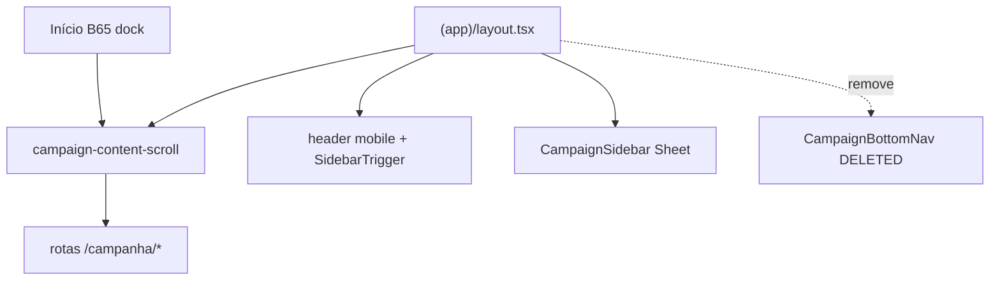

# Remover bottom navigation bar no mobile

Status: rascunho
Atualizado em: 2026-07-29
Item do roadmap: [docs/roadmap.md](../roadmap.md) (Trilha B — **B73**; chassis UX-1)
Impeccable: B — encaixe no shell `(app)`; remove chrome, não cria rota nova
Appetite: ~0,25–0,5d eng; remover componente + ajustar padding do scroll + atualizar testes; sem migration
Responsável: —

## Design (Impeccable)

Âncoras: `PRODUCT.md` (register `product` — clareza sob pressão; UX-1 ação-primeiro) / `DESIGN.md` (hybrid mobile top bar Mandate Red + sidebar Sheet) · tema `data-theme='campaign'`.

Na implementação (`implement-roadmap-item`): craft compacto → critique → polish (só chrome do shell).

Brief compacto:

- **Persona / contexto:** CG/assessor no celular — o ritual diário passa pelo Início (ações + busca); listas densas são visita ocasional, não navegação por domínio.
- **Job principal:** recuperar altura útil do viewport e deixar um único caminho de navegação secundária (sidebar via `SidebarTrigger` no header vermelho).
- **Estratégia de cor:** Restrained — remove barra fixa; header mobile existente permanece.
- **Edit where you see:** não — só chrome.
- **Anti-goals:** segunda barra de atalhos; reinventar drawer fora do `Sidebar`; mover destinos para tabs no Início; exigir sidebar aberta por padrão no mobile.

## Dados → decisão → apresentação

Dados: N/A — remoção de chrome de navegação; nenhuma métrica/série/mapa.

## Contexto

O shell de `/campanha` monta hoje **duas** superfícies de navegação no mobile (&lt;`md`):

1. **Header vermelho** com `SidebarTrigger` → `CampaignSidebar` em Sheet (`collapsible="offcanvas"` no `CampaignSidebar`, B38 ✓).
2. **`CampaignBottomNav`** fixa (`src/components/campaign/shell/CampaignBottomNav.tsx`) com até 5 destinos derivados de `getCampaignBottomNav` em `nav.ts` — subconjunto de `staffNav`/`leaderNav` (exclui Quadro, Territórios, Apoiadores, Assessores).

O scroll global reserva espaço com `pb-24` em `src/app/(campaign)/campanha/(app)/layout.tsx` para não cobrir conteúdo com a bottom bar. O chassis UX-1 (**B43–B47 ✓**, **B65 ✓**) ancorou busca + strip de ações **acima** dessa barra.

**Decisão de produto (2026-07-29):** o paradigma deixou de ser “navegar por domínio” (Início / Municípios / Lideranças / … na barra inferior) e passou a ser **intenção** (ações do Início, busca, wizards). A bottom bar só consome ~48–56 px + safe-area sem servir ao ritual diário. A navegação ocasional para listas de alto volume permanece no **sidebar** (fechado por padrão no mobile via `CampaignSidebarViewportDefault` quando não há cookie `sidebar_state`).

Evidência alinhada: [fluxos-acao-primeiro-inicio.md](fluxos-acao-primeiro-inicio.md) — anti-goal “depender de sidebar para o ritual diário”; a barra inferior era o espelho mobile do modelo domínio-primeiro.

## Objetivos

- Em viewport **&lt; `md`**: **não renderizar** `CampaignBottomNav`; navegação secundária só via `SidebarTrigger` + Sheet.
- Remover o padding inferior artificial (`pb-24`) do `campaign-content-scroll` no mobile — substituir por padding normal (`p-4` / `pb-4` ou equivalente) com safe-area só onde necessário (toasts/PWA, não nav fantasma).
- Revalidar o dock do Início (**B65 ✓**): com a barra sumida, o grupo strip+busca pode usar o limite inferior real do scrollport; medir se o spacer `flex-1` ainda precisa de ajuste.
- Sidebar mobile continua **fechada por padrão** (`CampaignSidebarViewportDefault` + cookie) — sem mudar o default tablet/desktop (B38 ✓).
- Apagar código morto: `CampaignBottomNav.tsx`, `getCampaignBottomNav`, exports órfãos; `pnpm exec knip` limpo.
- Guardrails: sem migration, sem collection, sem Consent, sem server action; `print:hidden` preservado; leader/staff `getCampaignNav` intactos.

## Decisões travadas

- **Remover a bottom bar por completo — não esvaziar nem reduzir ícones.** O produto não quer atalhos de domínio no mobile; busca + ações cobrem o caminho frequente. **Rejeitado:** manter 2–3 ícones (ainda compete com thumb zone); mover Municípios/Lideranças para tabs no Início (segundo sistema de nav); PWA shortcut bar nativa (fora de escopo).
- **Sidebar como única navegação estrutural no mobile.** O `SidebarTrigger` no header vermelho já existe; não adicionar segundo gatilho flutuante. **Rejeitado:** FAB “Menu”; gesto edge-only sem affordance; abrir sidebar por padrão no mobile (contradiz B38 + campo com uma mão).
- **Apagar `getCampaignBottomNav` com o componente.** Não deixar helper “para o dia em que redesenharmos a barra” — git history é o arquivo. Testes que citavam a barra passam a assertar só `getCampaignNav` + `getCampaignSecondaryNav`. **Rejeitado:** deprecar com `@deprecated` (knip/CI bloqueia export morto).
- **Ajustar `pb-24` no mesmo PR.** O padding existia só pela altura da barra; mantê-lo após remoção devolve gap morto e contradiz B65. **Rejeitado:** `pb-24` “por segurança” sem medir (o dock do Início pode precisar de `pb` menor local, não global).
- **i18n e naming** seguem o AGENTS.md: identificadores em inglês (`CampaignBottomNav` deletado; layout classes em inglês); copy visível em pt-BR no sidebar (`aria-label` do trigger já existe).

## Questões em aberto

- **Reduzir `pb` global ou só revalidar o Início?** **Opções:** A) trocar `pb-24` → `pb-4` no scroll global | B) manter `pb-24` nas outras rotas e só no Início usar dock | C) `pb` proporcional a safe-area apenas. **Recomendação:** **A** no layout global — a barra era a única razão do 24; listas longas ganham área útil; se alguma rota com FAB/toast colidir, corrigir pontualmente. _(assumido — validar no craft com device real)_

## Abordagem proposta

Componentes:

- **`src/app/(campaign)/campanha/(app)/layout.tsx`**: remover import/render de `CampaignBottomNav`; ajustar `className` do scroll (`pb-24` → `pb-4` ou `p-4` simétrico no mobile); confirmar que `SidebarTrigger` no header mobile permanece.
- **Deletar `src/components/campaign/shell/CampaignBottomNav.tsx`**.
- **`src/components/campaign/shell/nav.ts`**: remover `getCampaignBottomNav` e o comentário do cap de 5 itens; manter `getCampaignNav` / `getCampaignSecondaryNav` / `MUNICIPALITY_NAV_HREF`.
- **`src/components/campaign/shell/CampaignSidebarViewportDefault.tsx`**: sem mudança de comportamento (já fecha sidebar &lt;1024 sem cookie) — só verificar que mobile continua com default fechado.
- **Início (`CampaignHomeLayout` / `CampaignHomeStaffChrome`)**: smoke visual após remoção da barra — o dock pode colar mais baixo; ajustar spacer se sobrar gap &gt;~8 px (herança do B65).
- **`tests/unit/campaignIntelligenceConcepts.unit.spec.ts`**: teste “stays out of … mobile bottom bar” → assertar que `CAMPAIGN_CONCEPTS_PATH` não está em `getCampaignNav` (bottom bar deixa de existir).
- **E2E smoke**: navegar via sidebar no mobile viewport — abrir Sheet, ir a Municípios, voltar (nenhum `nav[aria-label="Navegação principal"]` no DOM).
- **Sem migration, sem collection, sem server action.**

## Dependências

- **B43 ✓** (Início ação-primeiro) — decisão de paradigma; sem ela a barra ainda faria sentido como atalho de domínio.
- **B65 ✓** (soft) — o dock foi desenhado acima da bottom nav; este item **revisita** o padding/âncora, não bloqueia o merge.
- **B38 ✓** (soft) — sidebar Sheet + default fechado no mobile/tablet sem cookie.
- Nenhuma dependência dura de item pendente.

## Não escopo

- Redesenhar itens do `staffNav` / reordenar sidebar — só remover a projeção mobile de 5 ícones.
- Atalhos de domínio no Início (busca B48+ e ações B45 ✓ já cobrem).
- Mudar bottom nav em design-refs HTML legados (`docs/design-refs/latest/*.html` com `pb-24` estático) — artefatos UX Pilot, não runtime.
- PWA install banner / `InstallPwaToast` — inalterados.

## Rabbit holes

- **Reintroduzir navegação por gestos sem affordance.** Se alguém “só documentar” que o usuário deve arrastar: sem `SidebarTrigger` visível, a descoberta cai. **Mitigação:** manter trigger no header; e2e cobre o caminho.
- **Padding inferior em cascata.** Copiar `pb-24` para o dock do Início “por precaução” recria o bug que este item remove. **Mitigação:** um único `pb` no scroll global; ajuste local só com medição.

## Adiado com gatilho

- **Atalho “recentes” na sidebar** (visitados) para compensar menos um toque na bottom bar. Revisitar quando: métrica de sessão mostrar &gt;3 aberturas de sidebar só para repetir os mesmos 2 destinos — hoje busca + ações cobrem.

## Referências

- `docs/roadmap.md` (UX-1, B73)
- `src/app/(campaign)/campanha/(app)/layout.tsx` — montagem do shell e `pb-24`
- `src/components/campaign/shell/CampaignBottomNav.tsx` — alvo de remoção
- `src/components/campaign/shell/nav.ts` — `getCampaignBottomNav`
- `src/components/campaign/shell/CampaignSidebarViewportDefault.tsx` — default fechado mobile
- `docs/plans/ancorar-busca-acoes-inicio-mobile.md` — decisões que citavam a bottom nav (contexto histórico B65)
- `docs/plans/fluxos-acao-primeiro-inicio.md` — anti-goal sidebar no ritual diário
- `docs/plans/sidebar-recolhido-tablet.md` — B38, mobile Sheet inalterado
- `PRODUCT.md` — princípios 2 e 3 (clareza sob pressão; edit where you see)
- AGENTS.md — Campaign auth shell; knip mata órfãos no mesmo PR
