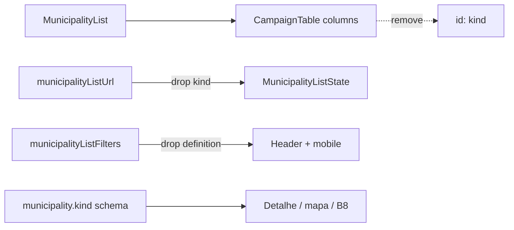

# Remover coluna Tipo da lista de Municípios

Status: entregue
Atualizado em: 2026-07-29
Item do roadmap: [docs/roadmap.md](../roadmap.md) (Fill-ins)
Impeccable: B — encaixe em `MunicipalityList` / filtros da lista (`/campanha/municipios`); sem rota nova
Appetite: ~0,25–0,5 dia eng; remove coluna + filtro/sort `kind` da URL da lista; sem migration
Responsável: —

## Design (Impeccable)

Âncoras: `PRODUCT.md` (princípio 2 — clareza sob pressão; anti spreadsheet) / `DESIGN.md` (register `product`; Field Desk) · tema `data-theme='campaign'` · shells `MunicipalityList` + `CampaignTable` + header B15/B16.

Na implementação (`implement-roadmap-item`): craft compacto → critique → polish (só remoção de densidade morta; sem redesign da tabela).

Brief compacto:

- **Persona / contexto:** CG / Assessor / Candidato varre a fila de alocação (E9); a coluna "Tipo" (Município × Zona eleitoral) ocupa largura sem mudar a decisão — as 19 ZE de Salvador já se leem pelo nome e pelo filtro de município/TI.
- **Job principal:** uma coluna a menos na varredura; quem precisa das zonas de Salvador filtra pelo município (ou busca "Salvador"), não por um enum paralelo.
- **Estratégia de cor:** Restrained — nenhuma superfície nova.
- **Edit where you see:** não — só remove leitura/filtro; `kind` no schema continua read-only da geografia.
- **Anti-goals:** redesign do header; seletor de colunas neste item (B17); apagar `municipality.kind` do modelo/catálogo; segunda forma de filtrar Salvador (chip "só zonas").

## Dados → decisão → apresentação

Dados: N/A — este item **não** introduz nem altera métricas; só remove uma dimensão categórica redundante da lista. O campo `kind` no domínio (catálogo / detalhe / mapa / dossiê) permanece.

## Contexto

Em `/campanha/municipios`, a tabela staff (`MunicipalityList` → `CampaignTable`) inclui a coluna `id: 'kind'` com header "Tipo", sort (`sortKey="kind"`) e filtro single-select no header (`filterParam="kind"`, B16). Célula: `municipalityKindLabels[municipality.kind]` → "Município" | "Zona eleitoral" (`src/utilities/municipalityLabels.ts`). O mesmo `kind` vive na URL (`MunicipalityListState.kind`, `?kind=municipio|zona`) e em `buildMunicipalityListWhere`.

Pedido de produto (2026-07-25): **remover a coluna**. Municípios e Zonas Eleitorais são tratados da mesma forma na coordenação; para isolar as ZE de Salvador basta filtrar por Salvador (multi-select de slugs / busca no popover de Município — as 19 entradas `salvador-ze-*`). O filtro `?kind=zona` não acrescenta um recorte que a operação use.

O campo Payload `municipality.kind` e o catálogo (`municipalityCatalog`) **não** saem: geografia seedada, card de bairros (B8), mapa multi-zona, dossiê e labels de detalhe ainda dependem dele.

## Objetivos

- Em `/campanha/municipios`: sumir a coluna "Tipo" (desktop `CampaignTable` e qualquer echo no card mobile se existir).
- Remover o filtro UI "Tipo" (header Popover B16 + select mobile em `MunicipalityFilters`) e a sort key `kind` dos labels/selects de ordenação.
- Encolher o contrato URL da lista: deixar de parsear/serializar `kind` (bookmarks `?kind=` viram no-op após canonicalize).
- Atualizar testes unitários da lista (`municipalityList.unit.spec.ts`) e int que montam bundle/mapa com `{ kind: … }` **só quando** o teste estiver exercitando o filtro da lista — mapa/loader podem continuar aceitando `kind` no state até o state perder o campo.
- Guardrails: sem migration, sem collection, sem Consent, sem server action; campo `kind` no schema/admin/catálogo intacto; detalhe/dossiê/mapa/B8 intactos.

## Decisões travadas

- **Fill-in com plano próprio (sem ID B novo).** Polish de densidade da lista, ~¼–½ dia, paralelizável, cortável. (2026-07-25, classificação roadmap-item.) **Rejeitado:** B24 de trilha (infla grafo para remoção de coluna); absorver só em B17 (hide/show não substitui “não deveria existir”); só R6 (atrasa quick win).
- **Remover coluna + filtro + sort `kind` da lista — não só a célula.** Sem coluna, filtro órfão no header é ruído; sort sem coluna é inconsistente com B15. Pedido de produto: ZE ≡ município operacionalmente; Salvador cobre o recorte. **Rejeitado:** manter `?kind=` na UI “por se”; deixar sort `kind` no select mobile sem coluna.
- **Encolher URL: drop de `kind` no parse/serialize/`MunicipalityListState`.** Contrato congelado do Pass 2 W1 / B18: remoção deliberada de um param morto, não adição. Bookmarks e filtros salvos futuros que carreguem `kind` perdem o recorte (aceitável — path canônico = slugs de Salvador). **Rejeitado:** parse silencioso sem UI (param zumbi); manter param “por compat” sem consumidor.
- **Schema / catálogo `kind` permanece.** Geografia read-only; consumidores fora da lista (mapa, B8 bairros, dossiê, labels de detalhe). **Rejeitado:** migration drop `kind` (caro, quebra remodelagem); fundir as 19 ZE num único município Salvador (fora de escopo — decisão M1).
- **i18n e naming** (AGENTS.md): identificadores (`kind`, `municipalityKindLabels`) podem permanecer onde o domínio ainda usa; strings “Tipo” / “Zona eleitoral” saem só das superfícies de lista.

## Questões em aberto

- **Testes int de mapa que passam `{ kind: 'zona' }` no state da lista — refatorar para filtro por slugs de Salvador, ou manter um path interno de where por `kind` só no loader?** **Opções:** A) testes passam a filtrar por `slugs` das 19 ZE | B) helper interno `whereKind` só para testes | C) manter `kind` no state sem UI. **Recomendação:** **A** — alinha teste ao path de produto; C contradiz a decisão URL. _(assumido)_
- **Badge “Tipo” no dossiê / detalhe (`municipalityKindLabels` na capa) — cortar também?** **Opções:** A) manter no detalhe (contexto geográfico pontual) | B) remover em toda UI. **Recomendação:** **A** — o pedido é a lista; no detalhe de uma ZE o tipo ainda orienta (B8 bairros). _(assumido — validar com produto se o critique da lista pedir paridade)_

## Abordagem proposta

Componentes:

- **`MunicipalityList`** (`src/components/campaign/municipality/MunicipalityList.tsx`): remover o bloco de coluna `id: 'kind'`; dropar import de `municipalityKindLabels` se ficar órfão neste arquivo.
- **`municipalityListUrl.ts`**: remover `'kind'` de `MunicipalityListSortKey` / labels / `MunicipalityListState` / `municipalityListParamNames` / parse / serialize / `buildMunicipalityListWhere`.
- **`municipalityListFilters.ts`**: remover definition `param: 'kind'`, `applyMunicipalityKindFilter`, ramos em summary/`hasActive`; ajustar tipos `MunicipalityFilterParam` e `getMunicipalitySingleFilterValue` (fica só `coverage` exclusivos se ainda precisar).
- **`MunicipalityHeaderFilter` / `MunicipalityFilters`**: remover ramos single-select de Tipo (comentários “Tipo is the only single-select” → coverage/toggle ou o que sobrar).
- **`municipalityPageData.ts`**: map de sort Payload `kind: 'kind'` — dropar a entrada.
- **Testes**: `tests/unit/municipalityList.unit.spec.ts` (hrefs/`applyMunicipalityKindFilter`); int `municipalityPageData` / `municipalityMapData` que usam `{ kind }` no state da lista → slugs Salvador ou where direto.
- **B17 / B22 / planos vizinhos:** não editar planos entregues em massa; na implementação, se B17 listar `kind` como coluna toggleável, o id some naturalmente ao sumir da definição de colunas.
- **Migration**: Sem migration, sem collection, sem server action.

Depth check: só delete/estreitamento nos módulos profundos já donos do contrato da lista — sem wrapper novo.

## Dependências

- Nenhuma dura de outro plano. Soft: B15 ✓ / B16 ✓ (header); B17 (uma coluna a menos no seletor); B18 (param a menos no subset URL).

## Não escopo

- Remover ou alterar `municipality.kind` no Payload / seed / catálogo — modelo geográfico da remodelagem.
- Unificar as 19 ZE de Salvador numa linha — decisão M1 / B8.
- Seletor mostrar/ocultar colunas — **B17**.
- Explicação no header / tooltip de célula — **B22** / **B23**.
- Filtro “cidade Salvador” como atalho dedicado (chip) — desnecessário se o popover de Município + busca “Salvador” bastar; ver Adiado.

## Rabbit holes

- **Drop schema `kind`.** Explode migration + mapa + B8 + dossiê. **Mitigação:** UI da lista só; schema intocado.
- **Atalho “Salvador (19 zonas)” como filtro de primeira classe.** Segunda taxonomia paralela a `kind`. **Mitigação:** reusar multi-slug; defer se campo pedir atalho após uso.
- **Reescrever B17/B18/planos históricos.** Diff cosmético sem valor. **Mitigação:** nota aqui; implementação atualiza só código vivo.

## Adiado com gatilho

- **Chip / preset “Salvador (zonas)”** no popover de Município. Revisitar quando: ≥1 ator de campo pedir o atalho depois de perder `?kind=zona`, ou evidência de que marcar 19 slugs à mão atrita.
- **Remover `municipalityKindLabels` da capa do dossiê / detalhe.** Revisitar quando: produto pedir a mesma regra “tipo não importa” fora da lista.

## Referências

- `docs/roadmap.md` (Fill-ins abertos)
- `src/components/campaign/municipality/MunicipalityList.tsx` — coluna `kind` (~L262–270)
- `src/utilities/municipality/municipalityListUrl.ts` — contrato URL / sort / where (Pass 2 W2)
- `src/utilities/municipality/municipalityListFilters.ts` — definitions (sem `kind` desde 2026-07-29)
- `src/components/campaign/municipality/MunicipalityHeaderFilter.tsx` — single-select Tipo
- `src/components/campaign/municipality/MunicipalityFilters.tsx` — mobile
- `src/utilities/municipalityLabels.ts` — `municipalityKindLabels` (permanece para detalhe)
- `tests/unit/municipalityList.unit.spec.ts` — pins de `kind` na URL
- [icone-prioridade-lista-municipios.md](icone-prioridade-lista-municipios.md) — precedente fill-in Impeccable B na mesma lista
- [filtros-no-header-lista-municipios.md](filtros-no-header-lista-municipios.md) — B16 (Tipo como coluna filtrável)
- [seletor-colunas-lista-municipios.md](seletor-colunas-lista-municipios.md) — B17 (Tipo como candidata a hide; este item a remove)
- AGENTS.md — Município remodel; naming
- `PRODUCT.md` / `DESIGN.md` — Field Desk, clareza sob pressão
