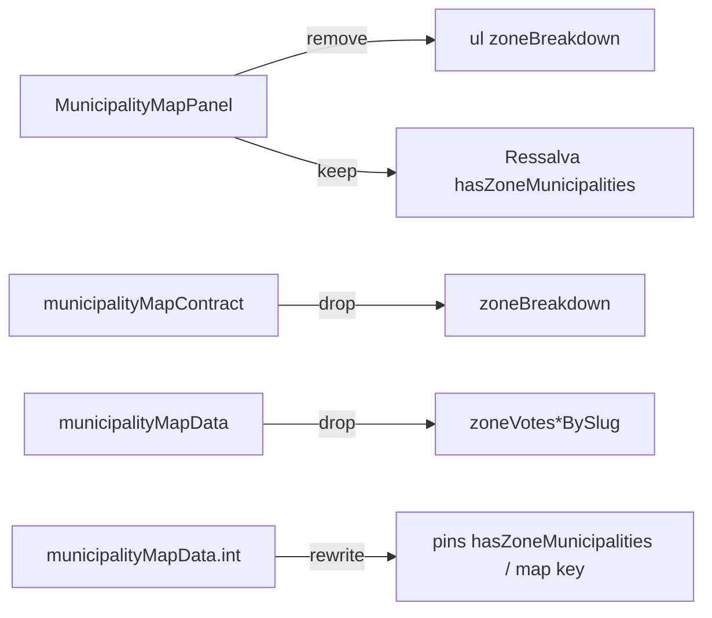

# Remover lista "Municípios por zona eleitoral" do Início

Status: entregue
Atualizado em: 2026-07-28
Item do roadmap: [docs/roadmap.md](../roadmap.md) (Fill-ins)
Impeccable: B — encaixe em `MunicipalityMapPanel` no Início (`/campanha`); sem rota nova
Appetite: ~0,25–0,5 dia eng; remove bloco UI + payload `zoneBreakdown` do bundle; sem migration
Responsável: —

Revisão 2026-07-28 (auditoria pré-implementação): **B8+ F3 ✓** já landou — a ressalva de aproximação vive sob o mapa gated por `bundle.hasZoneMunicipalities` (inclusive em comparação). Residual deste item = apagar o `<ul>` + dropar `zoneBreakdown` / `zoneVotes*BySlug` do bundle. Questões em aberto fechadas por evidência.

**Entrega 2026-07-28:** lista "Municípios por zona eleitoral" removida do Início; `zoneBreakdown` / `MunicipalityZoneBreakdownRow` / `zoneVotes*BySlug` saíram do contrato e do loader; `hasZoneMunicipalities` + ressalva B8+ F3 intactos; int `municipalityMapData` e `TESTING.md` atualizados. Sem migration. Gate: tsc/lint/format/cycles; knip P3 pré-existente; int do loader 4/4; Aikido 0 findings nos módulos de contrato/loader.

## Design (Impeccable)

Âncoras: `PRODUCT.md` (clareza sob pressão; anti dashboard clutter) / `DESIGN.md` (register `product`; Field Desk) · tema `data-theme='campaign'` · shells `MunicipalityMapPanel` + `BahiaMap` + `MapFeatureReadout`.

Na implementação (`implement-roadmap-item`): craft compacto → critique → polish (só remoção de densidade morta; a ressalva já está no lugar via B8+ F3 ✓ — sem redesign do mapa).

Brief compacto:

- **Persona / contexto:** CG / Assessor / Candidato no Início; o mapa já pinta cada ZE de Salvador (B8 F2 ✓). A lista de 19 linhas abaixo repete o que o coroplético + clique no polígono já respondem.
- **Job principal:** o Início volta a ser mapa + controles + readout — sem rolagem obrigatória por uma lista que o polígono tornou redundante.
- **Estratégia de cor:** Restrained — nenhuma superfície nova.
- **Edit where you see:** não — só leitura no mapa; sem mutação.
- **Anti-goals:** redesign do mapa; segunda navegação textual para ZE; apagar a malha/artefato B8; esconder a ressalva jurídica de aproximação.

## Dados → decisão → apresentação

- **Vou apresentar dados?** Não (N/A nesta entrega) — **remove** uma superfície tabular redundante. A decisão “qual pedaço de Salvador?” continua no **mapa** (B8 F2 ✓: polígono por ZE + readout + clique → `/campanha/municipios/salvador-ze-N`).
- **Decisões desbloqueadas:** N/A (não introduz métrica). A decisão já desbloqueada pelo mapa permanece.
- **Forma escolhida:** mapa (já entregue) — **por quê** a lista era o degrau de pobreza _antes_ dos polígonos; com polígonos, a lista é degrau a mais sem nova decisão. **Rejeitado:** manter lista “por se”; chart/KPI de zonas no Início.
- **Anti-goals de dado:** sem % estadual absoluto; sem segunda série tabular no dashboard.

## Contexto

Até o **B8 F2 ✓** (2026-07-26), Salvador era **um** polígono no mapa; a única visão por Município-zona era a lista textual `zoneBreakdown` em `MunicipalityMapPanel` — título **"Municípios por zona eleitoral"**, 19 links + votos do ano/cenário selecionado (`src/components/campaign/map/MunicipalityMapPanel.tsx` ~L593–625). O bundle carrega isso em `MunicipalityMapBundle.zoneBreakdown` (`municipalityMapContract.ts` / `municipalityMapData.ts`).

Com o artefato `bahia-municipality-zones.topo.json` e o re-keying por map key, cada ZE é pintável, hoverável e clicável. Pedido de produto (2026-07-26): **remover a seção** — não precisamos mais dela.

O fill-in de engenharia **B8+** ([escala-dry-pos-b8f2.md](escala-dry-pos-b8f2.md)) F3 ✓ (2026-07-27) já moveu a ressalva para fora do gate `!comparisonActive` e a condicionou a `bundle.hasZoneMunicipalities` (campo próprio — não `zoneBreakdown.length`). Este item só remove a lista + o campo do bundle; a ressalva atrelada à malha permanece.

## Objetivos

- Em `/campanha` (staff, `MunicipalityMapPanel`): sumir o bloco "Municípios por zona eleitoral" (título, lista, números).
- Remover `zoneBreakdown` do contrato do bundle e do loader (e os intermediários `zoneVotesBySlug` / `zoneVotes2026BySlug` se só servirem a ele) — dead code dies.
- Manter a ressalva de aproximação já entregue por B8+ F3 (`hasZoneMunicipalities`, inclusive em comparação) — **não** reinseri-la.
- Atualizar int `municipalityMapData.int.spec.ts` (pins de `zoneBreakdown` → `hasZoneMunicipalities` / map keys) e qualquer copy/comentário que ainda diga que a lista é a navegação N>1.
- Guardrails: sem migration, sem collection, sem Consent, sem server action; malha B8 / `BahiaMap` / catálogo `kind === 'zona'` intactos; card de bairros no detalhe (F1) intacto.

## Decisões travadas

- **Fill-in com plano próprio (sem ID B novo).** Quick win de densidade no Início pós-B8 F2; ~¼–½ dia; paralelizável; cortável. (2026-07-26, classificação roadmap-item.) **Rejeitado:** B43 de trilha (infla grafo para delete de bloco); absorver _só_ como nota no B8+ sem plano de produto (pedido explícito de produto merece plano próprio + link no Fill-ins); deixar para R6 (atrasa).
- **Remover UI + dropar `zoneBreakdown` do bundle — não só esconder.** Payload RSC do Início carrega 19 rows por visita; knip/engineering-standards: o que a mudança orfanou morre no mesmo PR. **Rejeitado:** `display: none` / flag; manter array “por se” sem consumidor.
- **Ressalva de aproximação sobrevive, atrelada à malha.** Entregue por B8+ F3 ✓ como `
` gated por `bundle.hasZoneMunicipalities` (publicado pelo loader a partir de `kind === 'zona'`), visível também em comparação. Fonte: decisão B8+ F3 + rabbit hole B8 (“tratar polígono derivado como limite oficial”). **Rejeitado:** apagar a ressalva com a lista; duplicar copy em dois braços; re-derivar “é zona?” da forma da chave no cliente.
- **Lista de bairros no detalhe da ZE (B8 F1) permanece.** Geografia operacional no município ≠ lista redundante no dashboard. **Rejeitado:** cascatear remoção para `MunicipalityZoneNeighborhoodsCard`.
- **i18n e naming** (AGENTS.md): identificadores `zoneBreakdown` / `MunicipalityZoneBreakdownRow` saem; strings pt-BR da seção saem; disclaimer permanece em pt-BR.

## Questões em aberto

- **Gate da ressalva.** **Resolvido 2026-07-27 (B8+ F3 ✓):** `bundle.hasZoneMunicipalities` (server, `kind === 'zona'` no escopo). Assessor sem Salvador não vê a frase; chunk das zonas que falha degrada o mapa (aceitável). **Rejeitado no as-built do B8+:** derivar da forma da chave no cliente; gatear em `zoneBreakdown.length`.
- **Ordem vs B8+ F3.** **Resolvido 2026-07-27:** B8+ landou primeiro. Este fill-in só apaga o `<ul>` + o campo do bundle e mantém a frase onde F3 a colocou.

## Abordagem proposta

Componentes:

- **`MunicipalityMapPanel.tsx`**: apagar o bloco do `<ul>` (~L603–629); manter a ressalva B8+ F3 (~L595–601); atualizar o comentário de `MunicipalityMapSelection` que menciona “zone list”.
- **`municipalityMapContract.ts`**: remover `MunicipalityZoneBreakdownRow` e `zoneBreakdown` de `MunicipalityMapBundle`; manter `hasZoneMunicipalities`.
- **`municipalityMapData.ts`**: parar de montar `zoneBreakdown` / `zoneVotesBySlug` / `zoneVotes2026BySlug` (só alimentavam a lista; o coroplético usa `valuesByYear` por map key).
- **`tests/int/municipalityMapData.int.spec.ts`**: trocar expects de `zoneBreakdown` por `hasZoneMunicipalities` + keys de zona em `municipalitiesByMapKey` / `valuesByYear`.
- **`docs/TESTING.md`**: coluna “zone breakdown shape” → pin de `hasZoneMunicipalities` / map keys.
- **Migration**: Sem migration, sem collection, sem server action.

Depth check: delete/estreitamento nos módulos que já são donos do bundle e do painel — sem wrapper novo.

## Dependências

- **Dura:** ~~B8 F2~~ ✓ (polígonos — sem eles a lista ainda seria a única visão por ZE).
- Soft: ~~**B8+** F3~~ ✓ (2026-07-27) — ressalva já no lugar via `hasZoneMunicipalities`; este item só removeu a lista + o campo.
- Reusa: `MunicipalityMapPanel`, `BahiaMap`, `municipalitiesByMapKey`, `hasZoneMunicipalities`.

## Não escopo

- Alterar malha / script / artefato TopoJSON — **B8** / **B8+ F1**.
- Degradar chunk das zonas / memoização de rejeição — **B8+ F3**.
- Rank competitivo por ZE — débito com gatilho no [plano B8](poligonos-pracas-zona.md).
- Desambiguar ZE no card "Onde estou" — mesmo plano B8, gatilho "pedido de campo".
- Remover coluna "Tipo" na lista de municípios — fill-in [remover-coluna-tipo-municipios.md](remover-coluna-tipo-municipios.md).
- Card "Bairros" no detalhe da ZE — B8 F1.

## Rabbit holes

- **"Já que a lista some, refaço o readout / legenda de Salvador."** Explode em redesign do B13. **Mitigação:** só delete + uma frase de ressalva.
- **"Já que zoneBreakdown morre, unifico navegação e proximity."** F4 do B8+ já colapsa `MunicipalityMapNavigation`. **Mitigação:** não misturar PRs.
- **Extrair CSS compartilhado lista-zona ↔ card de bairros (S6 do B8).** A lista do mapa some — o gatilho morre. **Mitigação:** fechar S6 como obsoleto na nota do plano B8 (abaixo), sem extrair nada.

## Adiado com gatilho

- Nenhum neste item. (S6 do B8 fica **obsoleto** com a remoção — ver plano B8.)

## Referências

- `docs/roadmap.md` (Fill-ins abertos)
- `src/components/campaign/map/MunicipalityMapPanel.tsx` — bloco "Municípios por zona eleitoral"
- `src/utilities/municipalityMapContract.ts` — `zoneBreakdown`
- `src/utilities/municipalityMapData.ts` — montagem do array
- `tests/int/municipalityMapData.int.spec.ts` — pins
- [poligonos-pracas-zona.md](poligonos-pracas-zona.md) — B8 F2 ✓ (pai)
- [escala-dry-pos-b8f2.md](escala-dry-pos-b8f2.md) — B8+ (coordenação F3)
- [remover-coluna-tipo-municipios.md](remover-coluna-tipo-municipios.md) — precedente fill-in Impeccable B de densidade
- AGENTS.md — mapa keyed por map key; naming
- `PRODUCT.md` / `DESIGN.md` — Field Desk, clareza sob pressão
