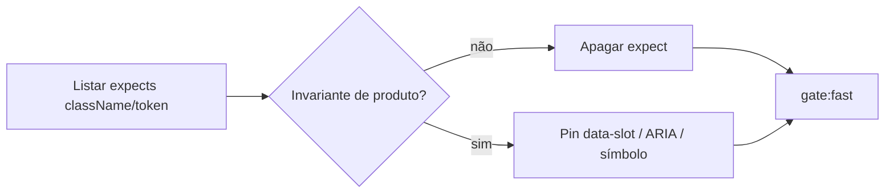

# Remover pins de className / tokens Tailwind literais

Status: registrado
Atualizado em: 2026-08-02
Issue: #240 (OPS13)
Priority: P2
Model: composer-2.5
Impeccable: A — N/A (sem superfície UI; só testes de convenção / pin unitário)
Appetite: ~0,5–1 dia eng; editar specs unitárias; sem migration; sem mudança de produto obrigatória
Responsável: —

## Dados → decisão → apresentação

Dados: N/A — higiene de guardrails de teste; sem métrica de produto.

## Contexto

Review de guardrails (2026-08-02): vários unit specs congelam **strings completas de `className`**, sequências Tailwind e tokens hex de CSS. Exemplos vivos:

- `tests/unit/campaignComponents.unit.spec.ts` — `className="h-svh min-h-0 overflow-hidden print:h-auto print:overflow-visible"`; sticky `sticky left-0 z-20…min-w-56…`; `--sidebar: #fafaf9` / foreground hex
- `tests/unit/campaignHomeActionButton.unit.spec.tsx` — `w-[5.5rem]`, `gap-0`, `px-4`
- `tests/unit/campaignHomeLayout.unit.spec.tsx` — `-mx-4`, `w-[calc(100%+2rem)]`, `grid-rows-[0fr]`, `opacity-0`
- `tests/unit/campaignWizardShell.unit.spec.tsx` — `pt-2` vs `pt-3`, `pb-6`
- `tests/unit/campaignQuickActionsDrawer.unit.spec.tsx` — `-mx-4`, `w-[calc(100%+2rem)]`
- `tests/unit/homeSearchResultsLayout.unit.spec.tsx` — `flex-col` / `md:grid-cols-2` / `lg:grid-cols-3`

O intent original (shell fixa + scroll no content pane; coluna Município sticky; touch target; contraste da sidebar) é legítimo. O **mecanismo** (literal de utilitários) empurra agentes a: (a) não mexer no layout com bug real; (b) satisfazer a string e colocar o comportamento em outro arquivo; (c) “passar” o gate sem preservar a invariante.

Pedido: **remover** esses pins de classname/token e, onde a invariante ainda importa, **substituir por pin comportamental** (`data-slot`, role/ARIA, presença de região de scroll, não-presença de `title=` onde deve ser texto acessível, etc.).

## Objetivos

- Nenhum unit spec sob `tests/unit/` exige igualdade/substring de uma **lista completa de utilitários Tailwind** (ex. string multilasse colada do JSX) nem hex de token CSS como prova de layout.
- Invariantes que ainda valem ficam pinadas por **contrato estável**: `data-slot`, `data-*` de domínio, roles/ARIA, uso de constantes exportadas (`HOME_SEARCH_*_CLASS` **como símbolo**, sem reassertar o conteúdo da constante), ou comportamento renderizado (texto acessível, overflow scrollport presente).
- Specs que só existiam para congelar spacing/sizing cosmético (`pt-2` vs `pt-3`, largura exata do botão) **somem** ou viram assert do contrato exportado, sem re-listar utilities.
- Atualizar `docs/GUARDRAILS.md` / nota curta se alguma linha citar esses pins; entrada no ledger se P4-H-adjunto não se aplicar.
- Guardrails: sem migration; sem mudança de UI obrigatória neste PR (só testes/docs). Se um pin comportamental exigir `data-slot` novo no shell, é permitido e mínimo.
- **Tracer bullet:** apagar o `toContain('className="h-svh…')` em `campaignComponents` → substituir por assert em `data-slot="campaign-content-scroll"` + overflow no scrollport (já parcialmente presente) → `pnpm gate:fast` verde.

## Decisões travadas

- **Remover literais de className/token; não “afrouxar” para regex parcial da mesma string.** Opções: A) delete puro | B) delete + pin comportamental onde havia invariante de produto | C) manter e documentar judgment-only. **Recomendação: B.** A sozinho perde cobertura real (shell scroll / sticky / a11y). C perpetua o incentivo a shortcut. **Rejeitado:** C; “só comentar o expect”.
- **Constantes exportadas (`HOME_SEARCH_*_CLASS`) podem continuar sendo referenciadas por identidade (`toBe(CONST)`), sem `toContain('rounded-md')` adjacente que recongele o conteúdo.** Se o spec hoje compara `className === CONST` **e** ainda lista utilities, manter só a igualdade ao símbolo. **Rejeitado:** expandir pins para o valor string da constante.
- **Hex de `--sidebar*`:** provar contraste/tema via token name (`text-sidebar-foreground`) ou snapshot de contrato de tema se existir; não o valor `#fafaf9`. **Rejeitado:** pin de palette hex em unit (design tokens mudam sem bug).
- **Sticky Município:** pinar `data-slot` / sticky via atributo estável ou teste de presença da célula sticky sem a sequência `z-20…min-w-56…`. **Rejeitado:** regex da class completa.
- **Kind: `chore` (OPS13).** Engenharia de guardrail, não feature de `/campanha`.
- **i18n:** ids de teste/data-slot em inglês; copy pt-BR intocada.

## Questões em aberto

- **Incluir também asserts `min-h-11` / `min-w-11` (touch target)?** **Opções:** A) remover junto (são classname) | B) manter como proxy de touch target até haver pin computed-style/e2e. **Recomendação:** **A neste item** — o produto já tem regra em `campanha-edit-where-you-see`; o literal Tailwind é o mesmo cheiro. Se regressão de touch aparecer, e2e/comportamental depois. _(assumido)_
- **`campaignCompositionCleanup` `w-full` no submit?** **Opções:** A) no escopo | B) fora (é um assert pontual de form). **Recomendação:** **A** se for `className` literal; fora se for só layout smoke sem lista de utilities. _(assumido: incluir se for toContain de utility)_

## Abordagem proposta

Componentes:

- **Auditoria mecânica:** `rg "className|toMatch\\(/sticky|--sidebar: #" tests/unit` — checklist no PR; cada hit classificado delete vs replace.
- **`tests/unit/campaignComponents.unit.spec.ts`:** remover strings de layout/sidebar hex/sticky utilities; conservar `data-slot="campaign-content-scroll"`, `data-scope`, badges semânticos, a11y de prioridade/classe territorial (`sr-only` vs `title` — esse pin é de **conteúdo acessível**, não de classname de layout; **manter**).
- **Home / wizard / drawer / search layout specs:** cortar expects de spacing/bleed/grid utilities; onde B115/B116 etc. dependem de contrato, apontar para constante exportada ou `data-slot` já existente.
- **`docs/GUARDRAILS.md`:** se alguma linha referenciar pin de classname, atualizar; senão só o PR das Issues.
- **Migration:** nenhuma.

## Dependências

- Nenhuma dura. Independente de OPS14/OPS15.
- Soft: issues de UI mobile (B115/B116) podem conflitar em specs de home — rebase trivial; não bloqueia registro.

## Não escopo

- Reescrever o shell visual / redesign.
- Matar pins de **comportamento** (`data-pending`, `aria-busy`, `data-slot` semântico, texto acessível vs `title`).
- OPS14 (form-action por política) e OPS15 (TooltipProvider nesting).
- ESLint banindo Tailwind arbitrary values.

## Rabbit holes

- **"Já que mexo no spec, refatoro o layout".** Explode appetite. **Mitigação:** só testes (+ `data-slot` mínimo se faltar âncora).
- **Substituir classname por snapshot HTML enorme.** Mesmo cheiro. **Mitigação:** asserts pontuais de contrato.
- **Computed style em jsdom.** Frágil e barulhento. **Mitigação:** não neste item; data-slot/ARIA bastam.

## Adiado com gatilho

- **Pin e2e de scroll/sticky real.** Revisitar se regressão de shell voltar após remoção dos literais.
- **Lint `no-restricted-syntax` contra `toContain('min-h-` em tests.** Só se agentes reintroduzirem o padrão ≥2×.

## Referências

- GitHub Issue #240 (OPS13)
- Review de guardrails (chat 2026-08-02) — item 1
- `tests/unit/campaignComponents.unit.spec.ts` (shell + sticky + sidebar)
- `tests/unit/campaignHomeLayout.unit.spec.tsx`, `campaignHomeActionButton.unit.spec.tsx`, `campaignWizardShell.unit.spec.tsx`, `homeSearch*.unit.spec.tsx`, `campaignQuickActionsDrawer.unit.spec.tsx`
- `docs/GUARDRAILS.md` — escada de determinismo
- AGENTS.md / engineering-standards — gates; não congelar incidental syntax
