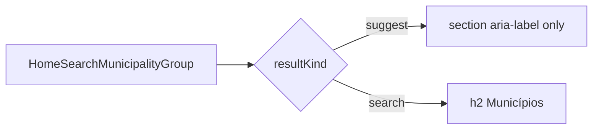

# Remover título “Sugestões” no empty state da busca

Status: registrado
Atualizado em: 2026-08-01
Issue: #130
Priority: P2
Model: composer-2.5
Impeccable: B — `HomeSearchMunicipalityGroup` (modo suggest)
Appetite: ~0,25d eng; copy/CSS; sem migration
Responsável: —

## Design (Impeccable)

Âncoras: `PRODUCT.md` (Clarity under pressure) · B68 suggest · tema `campaign`.

Na implementação: craft mínimo → critique → polish (Início focus vazio).

Brief:

- **Persona:** staff foca a busca no Início; já vê a lista curada.
- **Job principal:** ir aos hits sem cabeçalho decorativo.
- **Anti-goals:** remover o grupo “Municípios” no modo search; esconder `aria-label` acessível.

### Wireframe (texto)

```text
Antes (focus, query vazia):
  Sugestões          ← h2 + linha/espaço
  ────────────────
  Cairu …
  …

Depois:
  Cairu …
  …
```

## Dados → decisão → apresentação

Dados: N/A — só chrome do empty; ranking B68 intacto.

## Contexto

**B68 ✓** mostra seção com `sectionTitle = resultKind === 'suggest' ? 'Sugestões' : 'Municípios'` e `h2` via `HOME_SEARCH_GROUP_HEADING_CLASS` em `HomeSearchMunicipalityGroup`. Produto (2026-08-01): no empty/suggest do Início, o título **“Sugestões”** e a linha/espaço abaixo **não adicionam valor** — só ocupam thumb zone.

## Objetivos

- No `resultKind === 'suggest'`: **não renderizar** o `h2` “Sugestões” (nem regra visual equivalente).
- Manter `aria-label` no `<section>` (ou no list) para leitores de tela — “Sugestões” pode ficar só no accessible name.
- Modo `search`: título **“Municípios”** permanece _(assumido — pedido só citou suggest)_.
- Atualizar unit `homeSearchUi` / group spec se pinarem o heading.
- Sem migration.

## Decisões travadas

- **Só sumir o heading visual no suggest; hits B68 ficam.** **Rejeitado:** matar o empty state inteiro; renomear para outro título.
- **A11y: nome acessível sem `h2` visível.** **Rejeitado:** section muda sem nome.
- **i18n:** string “Sugestões” some da UI visível; id `sectionTitle` / `aria-label` ok.

## Questões em aberto

- **Modo search também perde “Municípios”?** **Opções:** A) não — só suggest | B) sim, todos os grupos sem h2. **Recomendação:** **A** (pedido explícito). _(assumido)_

## Abordagem proposta



Componentes:

- **`HomeSearchMunicipalityGroup.tsx`**: condicional no `h2`; `aria-label` sempre.
- **Tests** que assertam o texto “Sugestões” visível → ajustar.
- **Migration:** Sem migration.

## Dependências

- Soft: B68 ✓. Nenhuma dura.

## Não escopo

- Outros group headings (Lideranças, …) no modo search.
- Crash drawer → **B102**.

## Rabbit holes

- **Restyling de todos os group headings da busca.** Mitigação: um `if` no suggest.

## Adiado com gatilho

- Remover headings em todos os grupos no mobile. Revisitar se critique da busca pedir lista “flat”.

## Referências

- GitHub Issue #130 (B103)
- `HomeSearchMunicipalityGroup.tsx` · `src/lib/homeSearchUi.ts` · `docs/plans/sugestoes-busca-vazia-inicio.md` (B68)
- `PRODUCT.md` — Clarity under pressure
