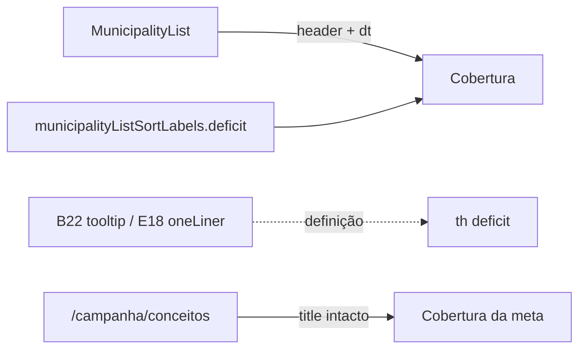

# Renomear coluna "Cobertura da meta" → "Cobertura"

Status: rascunho
Atualizado em: 2026-07-25
Item do roadmap: [docs/roadmap.md](../roadmap.md) (Fill-ins)
Impeccable: B — encaixe no header/card de `/campanha/municipios`; sem rota nova
Appetite: ~0,25 dia eng (ou menos); só strings + pins de teste; sem migration
Responsável: —

## Design (Impeccable)

Âncoras: `PRODUCT.md` (clareza sob pressão; anti spreadsheet) / `DESIGN.md` (register `product`; Field Desk) · tema `data-theme='campaign'` · precedente A11 (header curto `2022`, definição no hover).

Na implementação (`implement-roadmap-item`): craft compacto → critique → polish (copy only; sem redesign).

Brief compacto:

- **Persona / contexto:** CG / Assessor varre a fila (E9); o header "Cobertura da meta" compete em largura com células curtas (`80%` / déficit) e com sort+funil no mesmo `<th>`.
- **Job principal:** ler a coluna de cobertura de meta com um rótulo curto; o que a métrica significa fica no tooltip do header (**B22**) / glossário (**E18 ✓**).
- **Estratégia de cor:** Restrained — nenhuma superfície nova.
- **Edit where you see:** não — só rename de leitura.
- **Anti-goals:** renomear o conceito do glossário; fundir com o param URL `coverage` (assessores); inventar segundo rótulo "Cobertura %" / "Meta %".

## Dados → decisão → apresentação

Dados: N/A — este item **não** altera fórmula, denominador nem apresentação numérica. Só o rótulo da coluna (e o label de sort `deficit` que a acompanha). A métrica continua `comprometido ÷ meta` (E8).

## Contexto

No E8 a coluna antiga "Cobertura" (= tem assessor) foi renomeada para "Assessoria" para abrir espaço ao rótulo longo "Cobertura da meta". No B16 a coluna "Assessoria" **saiu** (ordenação/filtro de assessores moram em "Assessores"); o comentário em `municipalityListUrl.ts` já antecipa: _"`Cobertura` alone now reads as the goal one (`deficit`)"_ — mas o header ainda diz "Cobertura da meta".

Pedido de produto (2026-07-25): **coluna = "Cobertura"**. Mesmo padrão do A11 (`2022` em vez de "Concentração 2022"): título curto na tabela; definição no hover (**B22** consome `oneLiner` de `cobertura-da-meta` no E18).

Onde a string aparece hoje na lista:

- Header desktop: `MunicipalityList.tsx` coluna `id: 'goalCoverage'` → `MunicipalitySortableHead` children.
- Card mobile: `<dt>Cobertura da meta</dt>` no mesmo arquivo.
- Sort select / summary: `municipalityListSortLabels.deficit = 'Cobertura da meta'`.

Fora da lista (não escopo deste fill-in): strip do dashboard/overview, card "Conta da cadeira", dossiê, título do conceito em `/campanha/conceitos` — o nome canônico da métrica continua "Cobertura da meta".

## Objetivos

- Em `/campanha/municipios` (staff): header da coluna `goalCoverage` e `<dt>` do card mobile mostram **"Cobertura"**.
- `municipalityListSortLabels.deficit` (e qualquer summary que o cite) alinhado a **"Cobertura"**.
- Pins de teste da lista atualizados (`campaignComponents.unit.spec.ts` espera a string nova; o teste de `coverage` → "Assessores" pode reforçar que `deficit` → "Cobertura").
- Guardrails: sem migration, sem collection, sem Consent, sem server action, sem mudança de sort key / URL (`deficit` permanece); glossário E18 e KPIs do strip intactos.

## Decisões travadas

- **Fill-in com plano próprio (sem ID B novo).** Rename cosmético de coluna, ~¼ dia, paralelizável, cortável. (2026-07-25, classificação roadmap-item.) **Rejeitado:** B26 de trilha (infla grafo); absorver só em B22 (atrasa quick win atrás de meio dia de tooltip); só R6.
- **Só a superfície da lista (header + card + label de sort `deficit`).** Pedido = "coluna". KPI strips / card de detalhe / glossário mantêm o nome longo da métrica. **Rejeitado:** varredura global de "Cobertura da meta" (desfaz o título do conceito E18 e o heading e2e); renomear o conceito para "Cobertura" (ambíguo fora do contexto da tabela).
- **Ambiguidade com assessores já resolvida pelo B16.** Sem coluna "Assessoria", "Cobertura" na lista = cobertura da meta. Param URL `coverage` e sort key `coverage` continuam = com/sem assessor (identificadores internos; labels já são "Assessores"). **Rejeitado:** renomear sort key `deficit` → `coverage` (quebra bookmarks/`?sort=deficit`); segundo rótulo "Cobertura (meta)".
- **i18n e naming** (AGENTS.md): identificadores (`goalCoverage`, `deficit`, `cobertura-da-meta`) intactos; só strings visíveis da lista.

## Questões em aberto

- **Strips do dashboard / overview ("Cobertura da meta") — encurtar também?** **Opções:** A) manter longo (mais espaço, KPI nomeado) | B) encurtar para "Cobertura" por paridade. **Recomendação:** **A** — o pedido é a coluna; strips não competem com sort+funil no `<th>`. _(assumido — validar no critique se a mesa achar inconsistência)_
- **Ordenação mobile "Frescor do sinal" vs header "Último sinal" — tocar neste item?** **Opções:** A) não | B) alinhar num fill-in separado. **Recomendação:** **A** — fora do pedido; se incomodar, fill-in próprio.

## Abordagem proposta

Componentes:

- **`MunicipalityList.tsx`**: children do `MunicipalitySortableHead` `sortKey="deficit"` → `"Cobertura"`; `<dt>` do card mobile idem.
- **`municipalityListUrl.ts`**: `municipalityListSortLabels.deficit = 'Cobertura'`; comentário do sort `coverage` já documenta a intenção — confirmar que continua verdadeiro.
- **Testes:** `tests/unit/campaignComponents.unit.spec.ts` (`toContain('Cobertura')` / deixar de exigir o sufixo "da meta" na lista); opcional pin em `municipalityList.unit.spec.ts` (`deficit` → `"Cobertura"`).
- **B22:** ao implementar, o mapa de `description` da coluna `goalCoverage` já aponta para `campaignConceptOneLiner('cobertura-da-meta')` — o header curto + tooltip longo é o desenho desejado; **não** editar o plano B22 em massa neste fill-in.
- **Migration:** Sem migration, sem collection, sem server action.

Depth check: só strings nos módulos que já donam a coluna — sem helper novo.

## Dependências

- Nenhuma dura. Soft: **B16 ✓** (liberou o nome "Cobertura"); **A11 ✓** (precedente de header curto); **B22** (tooltip carrega a definição — soft, não bloqueia este rename).

## Não escopo

- Título do conceito / heading em `/campanha/conceitos` — **E18 ✓** (e2e `campaignConcepts.e2e.spec.ts` permanece).
- Labels do `CampaignMetricStrip` (dashboard + overview) e do `MunicipalityGoalAccountCard` / dossiê.
- Seletor de colunas / explicação no header / tooltip de célula — **B17** / **B22** / **B23**.
- Semântica ou sort key `deficit` / fórmula E8.

## Rabbit holes

- **Varredura "renomear tudo que diga Cobertura da meta".** Quebra glossário + e2e + card. **Mitigação:** boundary = lista + sort label.
- **Renomear `?sort=deficit` ou o id `goalCoverage`.** Quebra URL canônica / B18. **Mitigação:** só string visível.
- **Reabrir a coluna "Assessoria".** Fora do pedido. **Mitigação:** B16 já decidiu.

## Adiado com gatilho

- **Encurtar "Cobertura da meta" nos strips / card de detalhe.** Revisitar quando: critique/R6 ou CG pedir paridade explícita com a lista.
- Nenhum outro neste item.

## Referências

- `docs/roadmap.md` (Fill-ins abertos)
- `src/components/campaign/municipality/MunicipalityList.tsx` — coluna `goalCoverage` + `<dt>` mobile
- `src/utilities/municipalityListUrl.ts` — `municipalityListSortLabels.deficit` (+ comentário em `coverage`)
- `tests/unit/campaignComponents.unit.spec.ts` — pin da string na lista
- `tests/unit/municipalityList.unit.spec.ts` — labels de sort
- [conta-da-cadeira.md](conta-da-cadeira.md) — E8 (origem do rótulo longo)
- [filtros-no-header-lista-municipios.md](filtros-no-header-lista-municipios.md) — B16 (saiu "Assessoria")
- [ranking-votos-municipio.md](ranking-votos-municipio.md) — A11 (precedente header curto)
- [explicacao-colunas-header-listas.md](explicacao-colunas-header-listas.md) — B22 (definição no hover)
- [remover-coluna-tipo-municipios.md](remover-coluna-tipo-municipios.md) — precedente fill-in Impeccable B na mesma lista
- AGENTS.md — naming; E8
- `PRODUCT.md` / `DESIGN.md` — Field Desk
