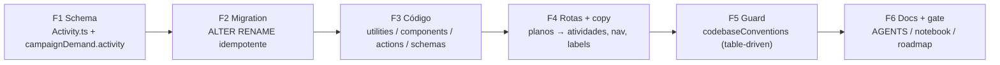

# Renomear "Plano de Ação" para "Atividade" (entidade, código e rotas)

Status: entregue (2026-07-25)
Atualizado em: 2026-07-25
Item do roadmap: [docs/roadmap.md](../roadmap.md) (Trilha C, item C13)
Impeccable: B — encaixe em telas existentes (`/campanha/planos` → `/campanha/atividades`, sidebar, cards do Início/dossiê/organização/demanda); nenhuma tela nova
Appetite: ~1–1,5 dia eng; 1 migration de rename (sem perda de dados) + varredura de 61 arquivos + guard no linter de convenções
Responsável: —

## Design (Impeccable)

Âncoras: `PRODUCT.md` (princípio 2 "Clarity under pressure"; §Users e §Product Purpose já chamam a superfície de **agenda**, nunca de "planos de ação") / `DESIGN.md` (register `product`, Field Desk) · tema `data-theme='campaign'`.

Na implementação (`implement-roadmap-item`): craft compacto → critique → polish. Não há layout novo — o craft é conferir densidade dos rótulos ("Atividades" é 1 caractere mais curto que "Planos de ação" no `h1`, e 3 mais longo que "Planos" no rail do sidebar) e a coerência do vocabulário entre título, breadcrumb, botão e mensagens de erro.

Brief compacto:

- **Persona / contexto:** Coordenador Geral e assessores no onboarding (Janela 1), aprendendo a ferramenta pela primeira vez; e o próprio candidato lendo o dossiê antes de uma visita.
- **Job principal:** reconhecer a entidade pelo nome que a mesa já usa, sem tradução mental nem explicação de terceiros.
- **Estratégia de cor:** Restrained — nenhuma mudança de cor, ícone ou hierarquia; só vocabulário.
- **Edit where you see:** N/A — este item não muda affordance de edição (a agenda continua com `/editar` para o formulário multi-campo, como hoje).
- **Anti-goals:** redesenhar a vertical no mesmo PR (o critique/polish visual dela é **R6**); introduzir um segundo sinônimo ("Agenda" em um lugar, "Atividade" em outro); manter nomes de banco divergentes do código "porque é só cosmético".

## As-built (2026-07-25)

Entregue como planejado, com quatro correções de inventário que a auditoria contra o banco real levantou:

- **4 tabelas, não 5.** `action_plan_texts` não existe mais — a remodelagem de 2026-07-23 já a havia removido. O rename cobre `activity{,_tasks,_updates,_rels}`.
- **O snapshot do drizzle não era a lista-alvo completa.** `action_plan_upcoming_start_at_idx` (índice parcial escrito à mão em `20260719_014906_action_plan_list_perf.ts`) não aparece no `.json`; a lista canônica veio de `pg_indexes`/`pg_constraint`/`pg_type`/`pg_sequences`. Total renomeado: **4 tabelas, 3 enums, 2 colunas, 39 índices** (4 pkeys inclusos — `ALTER INDEX … RENAME` leva a constraint junto), **14 FKs** e **2 sequences**.
- **Fósseis `%plaza%` corrigidos no mesmo passo** (decisão do usuário nesta sessão): a remodelagem renomeou as colunas `plaza_id` → `municipality_id` mas não os índices, então o banco tinha `action_plan_plaza_idx`, `campaign_demand_plaza_idx`, `leadership_rels_plaza_id_idx`, `organization_rels_plaza_id_idx`, `supporter_plaza_idx`, `supporter_contact_plaza_nulls_not_distinct_idx`, `vote_pledge_plaza_idx` e `leadership_plaza_idx` enquanto o snapshot já dizia `*_municipality*`. Os 8 foram alinhados aqui; o `down()` os restaura, para não inventar um estado que nunca existiu.
- **Snapshot escrito à mão.** `pnpm migrate:create` é interativo para renames (pergunta enum por enum), então o `.json` foi derivado do snapshot anterior por transformação textual e validado pelo teste que importa: `pnpm migrate:create __probe` responde **"No schema changes detected"**.

Decisões de vocabulário fechadas na implementação: sidebar **"Atividades"**; rótulos de campo alinhados à entidade (**"Tipo de atividade"**, **"Origem da atividade"**, **"Resultado da atividade"**), porque "ação" ao lado de "atividade" reintroduzia a tradução mental que o item existe para eliminar. Rota nova é `/campanha/atividades/nova` (feminino, como `demandas/nova`). Valores de enum `kind`/`status` seguem inalterados, como o plano previa.

Efeito colateral do guard: estendê-lo a `tests/` e `scripts/` revelou fósseis "Praça" em fixtures e nomes de teste (8 ocorrências), limpos no mesmo PR; `scripts/generate-remodel-municipalities-migration.mjs` (gera SQL congelado) e o comentário histórico em `tests/int/campaignMigrationReconciliation.int.spec.ts` entraram na allowlist.

## Dados → decisão → apresentação

**Dados: N/A** — o item renomeia entidade, identificadores, rotas e copy. Nenhuma métrica, série, ranking ou mapa é criado, alterado ou removido; os contadores existentes (tarefas concluídas, próximos eventos) continuam idênticos, só mudam de rótulo.

## Contexto

A vertical de agenda nasceu no **C3** ([eventos-agenda-mobilizacao.md](eventos-agenda-mobilizacao.md)) com o nome "Plano de Ação". Em 2026-07-25 o produto registrou que a palavra que o time usa em campo é **"atividade"** (ou "agenda") e que "plano de ação" **sempre precisa ser explicado** — custo recorrente de tradução justamente na janela de onboarding (Onda 0 §4). O próprio `PRODUCT.md` já descreve a superfície como "agenda" nas seções Users e Product Purpose: a divergência é entre o produto escrito e o produto implementado.

Estado atual (varredura de 2026-07-25):

- **Collection** `actionPlan` (`src/collections/ActionPlan.ts`, 631 linhas), labels "Plano de ação"/"Planos de ação", grupo admin `Campanha`.
- **Banco:** tabelas `action_plan`, `action_plan_tasks`, `action_plan_updates`, `action_plan_rels`, `action_plan_texts`; enums `enum_action_plan_kind|status|origin`; colunas FK `campaign_demand.action_plan_id` e `payload_locked_documents_rels.action_plan_id`; ~30 índices/constraints com o prefixo.
- **Código:** 61 arquivos (+ `src/payload-types.ts`, regenerado) e ~820 ocorrências de `actionPlan|ActionPlan|ACTION_PLAN` — 13 componentes em `src/components/campaign/actionPlan/`, 7 utilities (`actionPlanUi`, `actionPlanPageData`, `actionPlanDetailPageData`, `actionPlanViewModels`, `actionPlanFormData`, `actionPlanDetailTabUi`, `actionPlanLeadershipOptions`), `src/utilities/access/actionPlans.ts`, `src/lib/schemas/actionPlan.ts`, `src/app/(campaign)/campanha/actions/actionPlan.ts`, 11 arquivos de rota em `.../(app)/planos/`, e o campo `campaignDemand.actionPlan`.
- **Copy pt-BR** fora da vertical: `Organization.ts` (`admin.description`), `/campanha/organizacoes` (lista e detalhe), `CampaignDemand.ts` (label + mensagem de erro), `DemandForm.tsx`, sidebar (`nav.ts` → "Planos").
- **Guard existente:** o describe "banned campaign terminology" em `tests/unit/codebaseConventions.unit.spec.ts` já mantém Praça/Núcleo fora de `src/`, com allowlist para dados legítimos (`src/lib/cities.ts`). É esse guard que o pedido manda estender.

## Objetivos

- Uma única palavra para a entidade em todo o produto: **Atividade** (pt-BR) / `activity` (código, banco, rota).
- Zero divergência código↔banco↔URL: `activity` na collection, `activity*` nas tabelas/enums/colunas, `/campanha/atividades` na rota.
- **Nenhum dado perdido:** a migration renomeia (não recria) — qualquer atividade já registrada pela mesa sobrevive com o mesmo `id` e `slug`.
- Access control, RBAC e regras de negócio **inalterados** (só nomes mudam); sem novo `Consent`; sem mudança de papel ou de visibilidade.
- Guard programático que falha o CI na primeira reintrodução do termo antigo, na mesma peça que já guarda Praça/Núcleo.
- Gate completo verde (`tsc`, `lint`, `format:check`, `knip`, `check:cycles`, `test`, `build`) e `pnpm generate:types` / `generate:importmap` refeitos.

## Decisões travadas

- **Identificador de código = `activity` (collection slug `activity`).** É a tradução direta do termo aprovado, uma palavra só, sem colisão no repositório (a única ocorrência atual de "activity/atividade" em `src/` é prosa dentro da própria vertical). Fonte: pedido de produto 2026-07-25. **Rejeitado:** `agenda` porque nomeia a _superfície_ (a lista/calendário), não o _registro_ — e o roadmap/PRODUCT.md já usam "agenda" nesse sentido, o que criaria ambiguidade nova; `event` porque a collection também abriga ações sem hora marcada (kind `demanda`/`reunião`) e conflitaria com o vocabulário de eventos de UI.
- **Migration data-preserving por `ALTER … RENAME` (tabelas, colunas, enums, índices e constraints), escrita à mão.** O diff do Payload gera `DROP TABLE` + `CREATE TABLE` para troca de slug: apagaria a agenda já cadastrada. A janela de "sem dados reais" que justificou o drop na remodelagem ([remodelagem-municipios.md](remodelagem-municipios.md), decisão de 2026-07-23) **fechou**: a atividade não tem trava jurídica (não é PII de terceiros como liderança/apoiador), então a mesa pode registrá-la assim que o smoke passar — e o deploy deste item é posterior. **Rejeitado:** aceitar o SQL destrutivo gerado (perda irreversível em produção, sem backup de campanha); `dbName: 'action_plan'` mantendo o nome antigo no banco (é exatamente a "dúvida para futuros desenvolvedores" que este item existe para eliminar, e obrigaria a allowlistar a própria config no linter).
- **Snapshot gerado, SQL substituído.** Rodar `pnpm migrate:create rename_action_plan_to_activity`, **manter** o `.json` (é o estado-alvo que o próximo diff vai comparar) e **substituir** o corpo do `.ts` pelos renames idempotentes (`IF EXISTS` / `DO $$`), com `RAISE NOTICE` do que foi renomeado — mesmo padrão de `20260715_215834_rename_tag_visible_to_hidden.ts` e das reconciliações da remodelagem. **Rejeitado:** migration só de dados sem tocar índices/constraints (os nomes ficariam órfãos no snapshot do drizzle e o próximo `migrate:create` tentaria recriá-los).
- **Rota renomeada para `/campanha/atividades`, sem redirect legado.** `/campanha` é interno, autenticado e sem SEO; os links vêm da navegação do próprio app, e o histórico do navegador de ~10 pessoas não justifica manter uma rota fantasma que o linter teria de allowlistar. **Rejeitado:** manter `/campanha/planos` (divergência URL↔entidade, o problema em miniatura); redirect permanente em `next.config` (peça viva para sempre por um mês de bookmark).
- **Guard = extensão table-driven do describe existente**, com os roots ampliados para `src/`, `tests/` e `scripts/`, `src/migrations/` fora (história congelada) e o próprio spec na allowlist (ele cita os termos banidos por definição). **Rejeitado:** regra ESLint nova (o precedente do repositório para vocabulário é o spec de convenções, e ESLint não varre `.mjs` de script com a mesma facilidade); módulo separado só para hospedar os literais (indireção por um único arquivo).
- **Escopo do banimento: compostos + copy + rota** — `actionPlan|ActionPlan|ACTION_PLAN|action_plan|action-plan`, `plano de ação|planos de ação` (case/acento tolerantes) e `/campanha/planos`. **Rejeitado:** banir `plan`/`plano` isolado — falso-positivo garantido na Fase 2 white-label (planos de assinatura por mandato) e em nomes próprios; os `plan` locais desta vertical caem na varredura manual, dentro dos mesmos arquivos que já estão sendo renomeados.
- **História congelada não é reescrita:** `src/migrations/*` (incl. `20260718_222832_add_action_plan`), `docs/plans/*` já entregues e os artefatos `docs/design-refs/latest/Planos-de-Acao.*` / `Novo-Plano-de-Acao.*` mantêm os nomes originais. **Rejeitado:** renomear design-refs (quebra os links dos planos C3/E13 sem ganhar nada — são fotografias datadas).
- **i18n e naming** seguem o AGENTS.md: identificadores em inglês (`Activity`, `activity`, `activityKinds`, `ActivityCard`, `activityUi`, `loadActivityPageData`, `canReadActivity`, `campaignDemand.activity`), strings visíveis em pt-BR ("Atividade", "Atividades", "Nova atividade"); o segmento de rota `atividades` é valor de URL em pt-BR, como `municipios`/`liderancas`/`dobradinhas`.

## Questões em aberto

- **Rótulo do item no sidebar: "Atividades" ou "Agenda"?** **Opções:** A) "Atividades" (nome da entidade, plural) | B) "Agenda" (nome do destino/calendário) | C) "Agenda" no rail e "Atividade" no registro. **Recomendação: A** — o item existe para acabar com dois vocabulários; usar duas palavras reintroduz, em escala menor, o custo de tradução que motivou o pedido. "Agenda" continua válido em prosa (docs, PRODUCT.md), não como rótulo de navegação. _(proposta — validar com produto; o pedido citou as duas palavras.)_
- **Renomear também os valores de enum `kind` (`caminhada`, `comício`, …)?** **Opções:** A) manter | B) revisar junto. **Recomendação: A, manter** — são valores de dado em pt-BR já compreendidos, e mexer neles transforma um rename de vocabulário em migração de conteúdo. Revisitar só se o R6 trouxer evidência de confusão nos rótulos de tipo.
- **Renomear a pasta de teste e2e e as fixtures no mesmo PR?** **Opções:** A) sim, no mesmo PR | B) depois. **Recomendação: A** — deixar `campaignActionPlan.e2e.spec.ts` para depois cria exatamente a ocorrência que o linter vai barrar no PR seguinte.

## Abordagem proposta

Componentes:

- **`src/collections/Activity.ts`** (ex-`ActionPlan.ts`): `slug: 'activity'`, `labels: { singular: 'Atividade', plural: 'Atividades' }`, hooks e access idênticos com os nomes internos renomeados (`setCanonicalActivitySlug`, `validateActivitySchedule`, `deriveActivityFields`, `activityStaffFieldSnapshot`). Mensagens de erro passam a dizer "atividade" ("O título da atividade não pode ser alterado após a criação."). Registro em `src/payload.config.ts`.
- **`src/collections/CampaignDemand.ts`**: campo `actionPlan` → `activity` (label "Atividade"), hook de coerência de município e a mensagem "A demanda e a atividade devem pertencer ao mesmo município." O `cacheKey` do `req.context` acompanha (`campaignDemand:activityMunicipality:<id>`).
- **Migration `pnpm migrate:create rename_action_plan_to_activity`** — snapshot gerado mantido, corpo substituído por: `ALTER TABLE … RENAME TO` (5 tabelas), `ALTER TYPE … RENAME TO` (3 enums), `ALTER TABLE campaign_demand RENAME COLUMN action_plan_id TO activity_id`, idem em `payload_locked_documents_rels` (precedente: `20260723_202000_reconcile_municipality_remodel`), `ALTER INDEX … RENAME TO` e `ALTER TABLE … RENAME CONSTRAINT …` para os ~30 objetos derivados. Tudo dentro de guardas `IF EXISTS`/`DO $$` para ser idempotente, com contagem logada; `down()` reverte na ordem inversa. Ensaio obrigatório sobre cópia real (`pnpm db:pull` → `pnpm migrate`) antes do deploy, conforme o guard rail do skill `payload-migrations`.
- **Utilities** (`src/utilities/`): `actionPlanUi.ts` → `activityUi.ts`, `actionPlanPageData.ts` → `activityPageData.ts`, `actionPlanDetailPageData.ts` → `activityDetailPageData.ts`, `actionPlanViewModels.ts` → `activityViewModels.ts`, `actionPlanFormData.ts` → `activityFormData.ts`, `actionPlanDetailTabUi.ts` → `activityDetailTabUi.ts`, `actionPlanLeadershipOptions.ts` → `activityLeadershipOptions.ts`, `access/actionPlans.ts` → `access/activities.ts` (re-export por `campaignAccess.ts` mantido). `campaignDemandData.ts`, `organizationData.ts`, `municipalityDossierData.ts`, `campaignRelationOptions.ts` e `campaignFormActionError.ts` acompanham os símbolos.
- **`src/lib/schemas/actionPlan.ts` → `activity.ts`**: `activityKinds`, `activityStatuses`, `activityOrigins` e seus `*Labels` (valores de enum inalterados); `campaignDemandInput.ts` passa a falar `activity`.
- **`src/components/campaign/actionPlan/` → `src/components/campaign/activity/`** (13 arquivos `ActionPlan*.tsx` → `Activity*.tsx`), mais as variáveis locais `plan`/`plans`/`PlanListItem` em `MunicipalityDossier.tsx` e nas rotas de organização/demanda.
- **Rotas**: `src/app/(campaign)/campanha/(app)/planos/` → `.../atividades/` (11 arquivos), incluindo os literais de `revalidatePath('/campanha/atividades/[slug]')` e os `redirect()`; `src/app/(campaign)/campanha/actions/actionPlan.ts` → `actions/activity.ts`; `nav.ts` com `{ title: 'Atividades', href: '/campanha/atividades' }` (ícone `CalendarDaysIcon` mantido).
- **`tests/unit/codebaseConventions.unit.spec.ts`**: o describe "banned campaign terminology" vira table-driven —
  `[{ id, pattern, remedy, allowlist }]` com a linha existente (Praça/Núcleo → Município, allowlist `src/lib/cities.ts`) e a nova (termo antigo da agenda → Atividade/`activity`, allowlist do próprio spec). O walker passa a percorrer `src/`, `tests/` e `scripts/`, pulando `src/migrations/`.
- **Testes renomeados**: `tests/int/campaignActionPlan.int.spec.ts` → `campaignActivity.int.spec.ts`, `tests/unit/actionPlanUi.unit.spec.ts` → `activityUi.unit.spec.ts`, `tests/e2e/campaignActionPlan.e2e.spec.ts` → `campaignActivity.e2e.spec.ts`; `tests/helpers/campaignFixtures.ts` e `tests/e2e/fixtures/campaignE2EFixtures.ts` acompanham (inclusive a chave `action_plan_id` do cleanup de locked documents).
- **Docs vivos**: `AGENTS.md` (seções "Campaign action plans (C3)" e a lista de collections), `.cursor/rules/codebase-map.mdc` (lista de domínios de `components/campaign`), `.cursor/rules/projects/nucleos-eleitorais.mdc` e o `docs/roadmap.md`. Planos entregues e migrations ficam como estão.

## Dependências

- **Nenhuma dura.** Reusa a collection, o access (`src/utilities/access/actionPlans.ts`), os shells de lista e o padrão de migration à mão já existentes.
- **Soft — fazer antes de:** **E13** planejador de giros (constrói uma visão nova dentro desta vertical; renomear depois multiplica o trabalho) e **C11** escala de planos. Não conflita com B28–B34 (lista de lideranças/dobradinhas) nem com o programa E8–E16.
- **Soft — janela:** antes do onboarding do time (Onda 0 §4) para que a equipe aprenda uma palavra só; e obrigatoriamente antes do congelamento (~20/09), porque carrega migration.

## Não escopo

- Critique/polish visual da vertical → **R6**.
- Qualquer mudança de comportamento, campo, access ou fluxo da agenda (tarefas, atualizações, resultado, ciclo de vida) → permanecem como o C3/C12 os deixaram.
- Visão "Giros" e camada de decisão de agenda → **E13** ([planejador-de-giros.md](planejador-de-giros.md)).
- Escala/perf da lista e do feed → **C11** ([escala-dry-pos-c7.md](escala-dry-pos-c7.md)).
- Renomear os valores de `kind`/`status` (dado em pt-BR) e os arquivos de `docs/design-refs/latest/`.
- Estender o guard a `docs/` (planos entregues são história; reescrevê-los apagaria o rastro da decisão).

## Rabbit holes

- **"Já que estou renomeando, vou também arrumar a vertical."** Se alguém encostar no craft: o rename passa a competir com o R6 e o PR fica irreversível de revisar. **Mitigação:** um PR só de rename, diff mecânico, zero mudança de comportamento — qualquer melhoria vista no caminho vira linha no R6.
- **Renomear índices/constraints "na mão" e esquecer um.** O drizzle compara nomes: um objeto esquecido faz o próximo `migrate:create` gerar um DROP/CREATE surpresa. **Mitigação:** enumerar os objetos a partir do `.json` do snapshot gerado (é a lista-alvo canônica) e conferir com `pnpm migrate:status` + um `migrate:create` de teste que deve sair **vazio** depois do rename (descartado em seguida).
- **Guard genérico virando framework de vocabulário.** Se alguém "só generalizar", nasce um mini-DSL de regras de copy com severidade, escopo e config. **Mitigação:** tabela literal de 2 linhas dentro do spec; terceira entrada só quando existir um terceiro rename real.
- **Banir `plan`/`plano` isolado.** Parece completar a limpeza e quebra a Fase 2 white-label e nomes de cidade. **Mitigação:** decisão travada acima; varredura manual única no PR.

## Adiado com gatilho

- **Rótulo "Agenda" no sidebar.** Revisitar se, no onboarding (ou no R6), ≥2 pessoas do time chamarem o destino de "agenda" ao navegar — aí o rail muda de rótulo mantendo a entidade "Atividade".
- **Terceira entrada no guard de vocabulário (extração para módulo próprio).** Revisitar quando existir um 3º rename de termo — antes disso, a tabela no spec basta.

## Referências

- `docs/roadmap.md` (Trilha C / "Demais itens abertos"; Janela 1; grafo)
- `src/collections/ActionPlan.ts` e `src/collections/CampaignDemand.ts` — schema, hooks, labels e o campo relacional a renomear
- `src/migrations/20260718_222832_add_action_plan.ts` — inventário real de tabelas, enums, índices e constraints a renomear
- `src/migrations/20260715_215834_rename_tag_visible_to_hidden.ts` e `20260723_202000_reconcile_municipality_remodel.ts` — padrão de migration à mão, data-preserving e guardada
- `tests/unit/codebaseConventions.unit.spec.ts` — guard de terminologia a estender (walker, allowlist, escopo)
- `src/components/campaign/shell/nav.ts`, `src/app/(campaign)/campanha/(app)/planos/**` — rota e navegação
- `docs/plans/eventos-agenda-mobilizacao.md` (C3, origem do nome) · `docs/plans/planejador-de-giros.md` (E13, herdeiro da vertical) · `docs/plans/remodelagem-municipios.md` (precedente de rename amplo)
- AGENTS.md — naming (identificadores em inglês, copy pt-BR), migrations (`push: false`, snapshot commitado), checklist de verificação; skill `payload-migrations` (guard rails de migration à mão)
- `PRODUCT.md` (§Users, §Product Purpose, princípio 2) / `DESIGN.md` (register `product`) — o produto escrito já diz "agenda"
