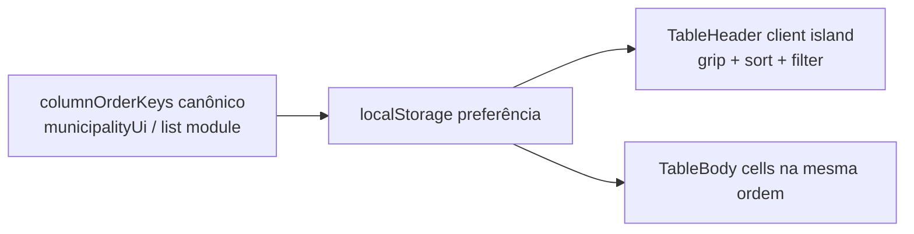

# Reordenar colunas da lista de Municípios (drag-and-drop)

Status: fora de escopo (avaliado — não fazer agora)
Atualizado em: 2026-07-24
Item do roadmap: [docs/roadmap.md](../roadmap.md) (Fora de escopo — avaliação de produto/UX)
Impeccable: B — se revisitado: encaixe em `MunicipalityList` / headers desktop de `/campanha/municipios` (não mobile cards)
Appetite: ~1–1,5 dia eng **se** o gatilho disparar (DnD no header + persistência local + a11y); **0 eng agora** — só registro da avaliação
Responsável: —

## Design (Impeccable)

Âncoras: `PRODUCT.md` (princípio 3 — Edit where you see / anti spreadsheet; princípio 6 — inteligência, não planilha chique) / `DESIGN.md` (register `product`; Field Desk) · tema `data-theme='campaign'`.

Na implementação (`implement-roadmap-item`), **só se o gatilho disparar:** craft compacto → critique → polish. Shape só se a affordance de drag vs sort+filtro (B15/B16) ainda estiver ambígua.

Brief compacto (para revisitação):

- **Persona / contexto:** Assessor / CG na tabela densa desktop; quer colunas “de decisão” (ex. 2022, cobertura, frescor) mais à esquerda sem mudar o sort da lista.
- **Job principal:** arrastar o header para mudar a **ordem visual** das colunas (não a ordem das linhas).
- **Estratégia de cor:** Restrained — affordance de grip sóbria; sem glow/pill de “modo edição”.
- **Edit where you see:** não — só layout; B9 Popovers e mutações intactos.
- **Anti-goals:** spreadsheet / data-grid mode; TanStack Table como plataforma; resize de colunas; hide/show de colunas neste item; DnD em cards mobile.

## Dados → decisão → apresentação

- **Vou apresentar dados?** Não — **Dados: N/A**. Não cria métrica, série nem ranking; só permuta a ordem visual de colunas já existentes.
- **Decisões desbloqueadas:** Nenhuma decisão eleitoral nova. No máximo preferência de leitura (conforto visual) — insuficiente sozinha para priorizar eng agora.
- **Forma escolhida (se revisitado):** mesma **tabela/lista**; ordem de colunas = preferência local. **Rejeitado:** chart; segunda “view” custom; URL `?cols=` compartilhada (surpresa entre atores; não é estado de decisão).
- **Anti-goals de dado:** N/A (sem métrica nova).

## Contexto

Em `/campanha/municipios`, `MunicipalityList` (`src/components/campaign/MunicipalityList.tsx`) é Server Component com tabela desktop shadcn (`Table` / `TableHead`) e cards no mobile. Colunas staff atuais (ordem fixa no JSX): Município · TI · Tipo · 2022 (`votos`) · Assessores (B9) · Tendência (B9) · Votos estimados (B9) · Última atualização · Cobertura.

**B15 ✓** ([ordenacao-colunas-lista-municipios.md](ordenacao-colunas-lista-municipios.md)) já entrega **reordenar as linhas** via clique no header (`?sort=`/`?dir=`). O rabbit hole explícito de B15: _não_ puxar TanStack / reorder de colunas / resize.

**B16** ([filtros-no-header-lista-municipios.md](filtros-no-header-lista-municipios.md)) coloca filtro URL no mesmo `TableHead` ao lado do sort — headers ficam mais densos; Não escopo de B16 já lista “Lib de data-grid / reorder/resize de colunas”.

Pedido de produto (2026-07-24): **avaliar** drag-hold-drop para reorganizar colunas. Não há evidência em `CUSTOMER.md` / sessão do CG pedindo ordem de colunas customizável; o job da mesa é “quem no topo / o que atacar”, já coberto por sort + filtros + (em breve) fila E9.

Não há `@dnd-kit` (nem equivalente) no `package.json` hoje.

## Objetivos (só se o gatilho disparar)

- Desktop: drag no handle do header reordena colunas; clique no rótulo/chevron continua sort (B15); filtro no header (B16) não inicia drag.
- Persistência **local** da ordem (ex. `localStorage` keyed por role/vista); default = ordem canônica do código; botão “Restaurar ordem”.
- Mobile: sem reorder (cards); ordem canônica.
- Guardrails: sem migration, sem collection, sem Consent, sem server action; não mudar `MunicipalityListState` URL; `leader` não vê a tabela staff.

## Decisões travadas

- **Agora: fora de escopo — não implementar.** Avaliação 2026-07-24: custo/benefício ruim na Janela 1 (convenções → 05/08) frente a B16, E8, R6, onboarding. Preferência de _ordem_ visual ≠ decisão de alocação. **Rejeitado:** abrir item de trilha **só para DnD** agora (compete com path crítico de UX da lista e com inteligência); fill-in “barato” sem nomear o conflito gestual (subestima ~1–1,5d + a11y); absorver em R6 (R6 é critique/polish, não feature DnD). **Nota (mesmo dia):** o ID **B17** foi atribuído depois ao [seletor mostrar/ocultar colunas](seletor-colunas-lista-municipios.md) — job distinto (viewport densidade), sem DnD; este plano de reorder permanece fora de escopo.
- **Se revisitado: preferência local, não URL.** Ordem de colunas é preferência de ator/dispositivo; URL permanece filtro+sort. **Rejeitado:** `?cols=a,b,c` (share/back confusos; não é estado de decisão compartilhada); persistir em `campaignUser` (migration cara para preferência cosmética).
- **Se revisitado: handle de drag ≠ alvo de sort/filtro.** Grip explícito (ou long-press no header) separado do `CampaignTransitionAnchor` de sort e do controle de filtro B16. **Rejeitado:** arrastar o rótulo inteiro (colide com clique de sort); pointer-events no filtro iniciando drag.
- **Coluna Município (nome) fixa à esquerda (v1).** Identidade da linha não some no scroll horizontal. **Rejeitado:** todas as colunas permutáveis sem âncora (desorientação).
- **i18n e naming:** identificadores EN (`MunicipalityColumnOrder`, `columnOrderKeys`); strings pt-BR (“Restaurar ordem das colunas”, aria do grip).

## Questões em aberto (para quando o gatilho disparar)

- **Lib DnD?** **Opções:** A) `@dnd-kit/sortable` | B) HTML5 drag nativo | C) reordenar só via menu “Mover coluna” (sem drag). **Recomendação:** **C** primeiro se o pedido for “customizar ordem” sem gesto Excel; **A** só se discovery insistir em drag. _(assumido)_
- **Ordem default após E9?** A fila pode ter outro conjunto de colunas — este plano cobre só `/campanha/municipios`; E9 decide o próprio layout. **Recomendação:** não unificar ordem entre lista e fila até 2º call site.

## Abordagem proposta (somente se revisitado)

Componentes (depth check):

- **Preferência + keys** em módulo client-safe junto de `municipalityUi` (ou helper dedicado se crescer) — lista ordenada de keys de coluna; default canônico; parse/serialize; sem Payload.
- **Ilha cliente no header** (hoje a lista é Server Component): ou extrair só o `<TableHeader>` + map de células por key, ou um wrapper fino que recebe rows já serializadas. **Não** virar a página inteira client-only.
- **Sem migration / sem server action.**

## Dependências

- **Duras (se construir):** **B15 ✓** (sort no header); **B16** entregue ou no mínimo o contrato de composição header (sort + filtro) estável — senão o grip compete com alvos em movimento.
- **Suaves:** E9 (não compartilhar ordem); fill-ins de prioridade/Cenário (não bloqueiam).

## Não escopo

- Resize de colunas; pin múltiplo; export CSV da vista; TanStack Table como shell da lista.
- **Hide/show de colunas** — aberto como **B17** ([seletor-colunas-lista-municipios.md](seletor-colunas-lista-municipios.md)); este plano é só _ordem_.
- Reordenar linhas por drag (já é sort B15).
- Preferência sync cross-device / admin Payload.
- Aplicar a mesma feature em apoiadores/lideranças/TI — só no 3º call site.

## Rabbit holes

- **Spreadsheet mode.** Drag de coluna + B9 editável + B16 filtro = grade tipo Excel. **Mitigação:** grip só de layout; ban resize/hide; anti-goal PRODUCT.
- **Conflito gestual sort × drag × filtro.** **Mitigação:** alvos separados; sem drag no mobile.
- **Hydration mismatch** (localStorage vs SSR). **Mitigação:** default canônico no SSR; aplicar preferência após mount (flash aceitável) ou `suppressHydrationWarning` localizado no header only.
- **Lib DnD + bundle.** **Mitigação:** preferir menu “Mover” antes de adicionar `@dnd-kit`.

## Adiado com gatilho

- **Implementar reorder de colunas.** Revisitar quando **qualquer** de: (1) nota de sessão / R6 / discovery com ≥2 atores da mesa pedindo ordem custom; (2) B16 + **B17** + E9 estáveis e a ordem fixa for citada como atrito medido (não só “seria legal”); (3) produto decidir menu “Mover coluna” sem DnD como polish &lt;0,5d. Até lá: **não** implementar — B17 já cobre densidade via hide/show.

## Referências

- `docs/roadmap.md` (Fora de escopo; B15 ✓; B16; **B17** seletor; E9)
- [seletor-colunas-lista-municipios.md](seletor-colunas-lista-municipios.md) — B17 hide/show (job distinto; compartilhará ids de coluna se reorder voltar)
- [ordenacao-colunas-lista-municipios.md](ordenacao-colunas-lista-municipios.md) — B15; rabbit hole reorder/TanStack
- [filtros-no-header-lista-municipios.md](filtros-no-header-lista-municipios.md) — B16; Não escopo data-grid/reorder
- [edicao-rapida-lista-pracas.md](edicao-rapida-lista-pracas.md) — B9; anti spreadsheet
- `src/components/campaign/MunicipalityList.tsx`, `MunicipalitySortableHead.tsx`
- `src/utilities/municipalityUi.ts`
- `PRODUCT.md` — Edit where you see / Intelligence serves organization
- AGENTS.md — naming EN / strings pt-BR; Campaign auth
