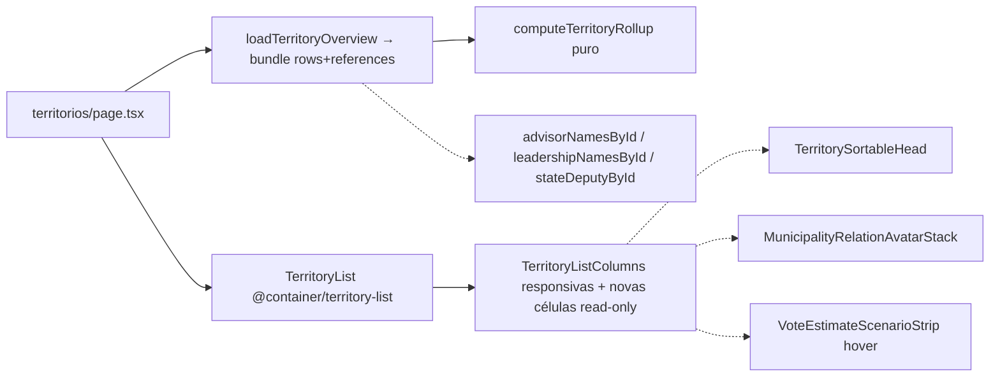

# Impl: Repintar a lista de Territórios no padrão da lista de Municípios

Status: aprovado
Atualizado em: 2026-08-08
Issue: #451
Intenção: docs/plans/repintar-lista-territorios.md
Appetite restante: herdado (~1,5–2 dias eng); sem corte — a abordagem reusa o padrão B158 das colunas responsivas, não constrói novo.

## Leitura da intenção

- **Outcome:** `/campanha/territorios` passa ao padrão da lista de Municípios (B158): headers curtos, contagem de municípios colada ao nome do TI, % e votos absorvidos na célula de 2022, célula de 2026 no detalhe de Municípios (valor + faixa de cenários no hover, só leitura), novas colunas de rede só leitura (Assessor, Liderança, Dobradinha), `Cobertura` oculta por padrão no seletor, tabela responsiva à largura do painel sem rolagem horizontal, ordem visual fixa `<Território><2022><Captura><2026><Assessor><Liderança><Dobradinha><Classe><Assessoria><Cobertura>`.
- **O que NÃO negociar:** barreira `noLeader` intacta; leitura permanece por agregado por TI (soma/contagem, nunca dado de município individual); sub-linhas do Metropolitano seguem o pai (nunca ordenam sozinhas); sort default contínua `pct` desc; contratos de URL intactos (sort keys `region|municipalities|votes2022|pct|validVotes2022|estimate2026|coverage|cobertura|captura|classe`, filtros `region`/`coverage`); sem migração; sem Consent; formulários de visualização para 2026 e rede ficam fora (nenhuma célula abre editor).
- **O que reavaliar:** a hipótese apontava células reutilizando os componentes de Municípios (`MunicipalityVotePositionReadout`, editor de 2026). Ajuste: as células de território reutilizam **formatters** e o **padrão visual**, mas são read-outs próprios (sem `rank` por TI; sem editor; sem série 2014/2018). A hipótese também não resolveu o acesso da rede por TI — decidido abaixo.

## Abordagem recomendada

**Opções consideradas:** A (fiar no bundle único do loader + padrão B158) | B (carregar rede em loader separado do overview p/ homeSearch não pagar) | C (reusar 1:1 os componentes editáveis de Municípios)
**Recomendação:** **A** — um `loadTerritoryOverview` que devolve `{ rows, references }`; as consultas de rede são poucas e pequenas (advisor names por ids, batch reverso de lideranças por município, catálogo de dobradinhas) e o home-search (`searchHomeMunicipalities`) passa a usar `.rows` — o custo adicional (3–4 queries pequenas) é aceitável contra a coesão de UM loader e zero leituras duplicadas de `municipality`. O `Termo` `TerritoryReader` (union `CampaignUser | User`) é apertado para `CampaignUser` — os dois call sites passam `CampaignUser`.
**Rejeitadas:** B porque duplicaria a leitura de municípios e criaria um segundo módulo de domínio para o mesmo bundle (smell da Depth Check); C porque traria editores e `rank`/série 2014-2018 que o gate explicitamente cortou e duplicaria tooltip no mesmo gesto.

### Componentes / mudanças

- **`territoryOverview.ts`** (`src/utilities/territory/`, puro/client-safe): estende `TerritoryMunicipalityInput` com `estimateByScenario: Record<VoteEstimateScenario, number>`, `hasEstimate: boolean`, e os conjuntos `advisorIDs: number[]`, `leadershipIDs: number[]`, `stateDeputyIDs: number[]` (elimina `advisorCount` redundante — cobertura deriva de `advisorIDs.length > 0`). O rollup (`computeTerritoryRollup`) passa a somar por cenário (`estimateByScenario`), OR de `hasEstimate` e união (dedup) dos três conjuntos por TI — covariando nas sub-linhas do Metropolitano. `sortTerritoryRows` para `estimate2026` usará `estimateByScenario.central`.
- **`loadTerritoryOverview.ts`** (`server-only`): novo retorno `{ rows, references }`; `references = { advisorNamesById, leadershipNamesById, stateDeputyById }` via `loadAdvisorSummaries` + `loadMunicipalityLeadershipSummaries` (batch reverso por municípios, honra `canReadLeadership`, fail-closed) + catálogo `loadStateDeputyOptions` (honra `canReadStateDeputy`). Por município: `advisorIDs` de `doc.advisors`, `stateDeputyIDs` de `doc.stateDeputies` (select novo), `leadershipIDs` do batch reverso; `estimateByScenario` por `resolveMunicipalityStaffVoteTotalForScenario`; `hasEstimate` = `hasAnyVoteEstimate(expectedVotes)` OU `pledgeAggregate.declaredTotal > 0`.
- **`searchHomeMunicipalities.ts`**: consome `.rows` do novo retorno (não usa rede).
- **`territoryListUrl.ts` / `territoryListLabels.ts`**: labels de coluna curtos — `votes2022: '2022'`, `estimate2026: '2026'`, `captura: 'Captura'`, `cobertura: 'Cobertura'`; removem-se as descrições mortas (`municipalities`, `pct`, `validVotes2022` — colunas saem da tabela e o tooltip de header não as usa). **Não** se remove nenhuma sort key (todas permanecem válidas via omnibox/resumo — só o header clicável some).
- **`campaignColumnVisibility.ts`** (`lib/`): `DEFAULT_HIDDEN_COLUMN_IDS.territorios = ['cobertura']` (Espelho de `municipios: ['goalCoverage','lastSignal']`).
- **`TerritoryList.tsx`**: envolve a tabela em `
`; `CampaignTable` com `containerClassName="overflow-x-auto supports-[container-type:inline-size]:overflow-x-hidden"` e `overflow-visible`; passa `references` às colunas. Sem aba mobile (a leitura estreita para no núcleo P0 — intenção).
- **`TerritoryListColumns.tsx`**: nova ordem visual fixa e classes responsivas por coluna (`hidden @min-[Xrem]/territory-list:table-cell`):
  - `region` (mandatory, sticky left, `min-w-56`): name-link + ` (N)` da contagem (`Metropolitano de Salvador (40)`; sub-linhas `Salvador (19)` / `Demais RMS (21)` — mesma convenção).
  - `votes2022` (header `2022`, P0): célula `% (primária) + votos (linha secundária)` — read-out próprio (formatters `formatVoteSharePercent`/`formatElectionNumber`; sem `rank`; sem curva 2014/2018); `cellTooltip` = **exclusivamente** os votos válidos 2022 (`Votos válidos 2022: N`).
  - `captura` (header `Captura`, P1 `@min-[46rem]`): célula atual (taxa de captura agregada), `cellTooltip` atual (mediana/amplitude/município crítico/beacon) — inalterada.
  - `estimate2026` (header `2026`, P0): read-out leitura — valor `estimateByScenario.central` + `%` como linha secundária; `—` quando `!hasEstimate`; `cellTooltip` = `VoteEstimateScenarioStrip` dos 3 cenários (`labelMode="endpoints"`, `markerMode="active-only"`, espelho do hover compacto de Municípios). Sem editor, sem seletor de cenário (lista lê o cenário default — intenção).
  - `advisor` (header `Assessor`, P2 `@min-[62rem]`): read-only via `MunicipalityRelationAvatarStack` (avatars + nomes no tooltip — padrão Municípios); vazio = `—` mudo (o alerta de lacuna continua na Assessoria); aporta `advisorNamesById`.
  - `leadership` (header `Liderança`, P2 `@min-[68rem]`): read-only (avatars, href `/campanha/liderancas/<id>`, nomes no tooltip); vazio = `—`.
  - `stateDeputy` (header `Dobradinha`, P2 `@min-[74rem]`): read-only (avatars, href `/campanha/dobradinhas/<id>`, nome+partido no tooltip); vazio = `—`. **Coluna para TODO o staff** (decisão do gate humano 2026-08-08): nomes via catálogo `loadStateDeputyOptions` (honra `canReadStateDeputy` = todo staff), sem restrição de papel na coluna.
  - `classe` (header `Classe`, P1 `@min-[52rem]`): célula atual inalterada.
  - `coverage` (header `Assessoria`, P1 `@min-[56rem]`): célula atual (`X de N`) + filtro `coverage` no header (inalterado).
  - `cobertura` (header `Cobertura`, P3 `@min-[80rem]`): célula atual (ratio + déficit), oculta por padrão no seletor.
  - Saem da tabela: `municipalities`, `pct`, `validVotes2022` (absorvidas; sort keys preservadas via omnibox/resumo).
- **Novos read-outs** ficam inline em `TerritoryListColumns.tsx` (componentes pequenos no próprio arquivo — 3 células pequenas + 2 read-outs; sem módulos novos só para células de 1 call site, contra a Depth Check).
- **`TerritorySortableHead.tsx`**: sem mudança estrutural (labels vêm de `territoryListSortLabels`).
- **Migration:** sem migration (nenhuma mudança de schema).

### Dados → forma

- Forma: cell 2022 = % primário + votos secundário (espelho `MunicipalityVotePositionReadout`, sem `rank`); 2026 = valor central + % secundário, faixa de cenários só no hover (espelho do compacto de `StaffMunicipalityVotesDisplay`). Rejeitadas: manter coluna `% da própria votação` (o painel estourava — objeto do item); válidos na célula (empilharia 3 linhas no mesmo gesto — gate); série 2014/2018 no hover (decisão do gate: sai; hover = só válidos).

## Fases verificáveis

1. **Schema/server** — `territoryOverview.ts` (input/rollup/sort) + `loadTerritoryOverview.ts` (bundle+references) + `searchHomeMunicipalities.ts` (`.rows`) + `tests/unit/territoryOverview.unit.spec.ts` (fixture com novos campos; asserts de soma por cenário, `hasEstimate`, uniões de advisor/leadership/stateDeputy, sub-linhas).
2. **UI** — labels (listUrl/listLabels), default-hidden (campaignColumnVisibility + teste unit), `TerritoryList.tsx` (container), `TerritoryListColumns.tsx` (ordem, células, responsivas, células novas), picker (passa as colunas novas; `stateDeputy` condicional por unrestricted).
3. **Gates** — `pnpm gate:fast` em iteração, e2e (`campaignTerritories.e2e.spec.ts`: atualizar `Ordenar por Votos 2022` → `Ordenar por 2022`; assert regex de contagem `(N)` e de colunas novas), `pnpm format:check`, `knip`, `check:cycles`, `pnpm build`; entrega via `pnpm push`.

## Rabbit holes / Não escopo (engenharia)

- Não adicionar seletor de cenário ao território (fora de escopo da intenção — lista lê o cenário default).
- Não criar módulo novo para as células (1 call site; inline no arquivo de colunas).
- Não mexer em fórmulas (captura/cobertura/%) nem na malha/`territorialClass`.
- Não aplicar o padrão às demais listas (lideranças, dobradinhas, organizações…).
- Não tocar em migration/schema/Consent.
- Não reabrir cards mobile de territórios (não existem; a estreiteza para no núcleo P0).

## Riscos e mitigação

- **Breakpoints de container** (P1/P2/P3): valores concretos são ajustáveis (baratos) — começar com os acima e afinar pelo widget/preview; registrar gatilho de revisitação no CHANGELOG se o painel mostrar degraus feios.
- **e2e sensível a label**: `Ordenar por Votos 2022` → `Ordenar por 2022` (aria-label vem de `territoryListSortLabels.votes2022`).
- **Acesso da rede por TI**: nomes de assessores via `loadAdvisorSummaries` (todos os staff; drop de ids não-elegíveis, fail-closed); nomes de lideranças via `loadMunicipalityLeadershipSummaries` (honra `canReadLeadership` — assessor só vê lideranças dos municípios que administra; fora do escopo, célula vazia `—`, fail-closed); **Dobradinha para todo o staff** (decisão do gate humano 2026-08-08; `canReadStateDeputy` = todo staff). Sem overrideAccess: false nos loads de rede.
- **Performance**: rollup permanece puro e O(n) por TI; referências usam poucos `where in` (não N+1 por TI).

## Decisões de engenharia (formato obrigatório)

1. **Loader de rede**: Opções: bundle único | loader separado | reusar componentes editáveis. Recomendação: bundle único (`loadTerritoryOverview` → `{ rows, references }`). Rejeitadas: loader separado (2º módulo + leitura dupla de municípios), componentes de Municípios 1:1 (editores/rank/série fora do gate).
2. **Células 2022/2026**: Opções: reusar `MunicipalityVotePositionReadout`/`StaffMunicipalityVotesDisplay` | read-outs próprios com formatters. Recomendação: read-outs próprios (hospedados no arquivo de colunas), reusando `formatVoteSharePercent`/`formatElectionNumber` e `VoteEstimateScenarioStrip`. Rejeitadas: reuso direto (arrastaria `rank`/`totalUnits` e o layout de editor/pledge).
3. **Assessor vazio**: Opções: badge `MissingAdvisorBadge` (padrão Municípios) | `—` mudo. Recomendação: `—` mudo — o alarme de lacuna já vive na coluna Assessoria (`X de N`), duplicar o mesmo aviso no mesmo gesto é ruído.
4. **Coluna Dobradinha por papel**: Opções: restringir a `isCampaignUnrestricted` (consistência com B157) | expor a todo o staff (leitura simples da intenção + `canReadStateDeputy` já é todo staff). Recomendação (confirmada no gate humano 2026-08-08): **expor a todo o staff** — nenhum editável é duplicado e a leitura é agregada por TI; o acesso de dados já permite.

## Aceite de engenharia

- [x] Aceite de produto da intenção ainda coberto (headers curtos, `(N)` no nome, %/válidos absorvidos, 2026 espelho, rede leitura, Cobertura oculta, sem scroll, ordem fixa)
- [x] Invariantes AGENTS/engineering-standards (sem overrideAccess: false na rede; sort/URL/filtros conservados; copy pt-BR / ids em inglês; sem migration; sem Consent)
- [x] Testes de domínio previstos: unit (rollup puro — cenários, hasEstimate, uniões, Metropolitano) + e2e (labels, contagem, colunas novas, url/âncoras) + campaignColumnVisibility (default oculto de territorios)
- [x] Self-score decision-quality: 5/5 (decididas com rejeitadas; cabe no appetite; rabbit holes nomeados; reuso de shells; intenção preservada)
