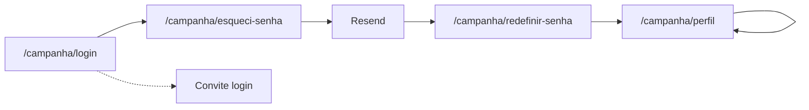

# Reset de senha self-service + foto de perfil

Status: implementado
Atualizado em: 2026-07-19
Item do roadmap: [docs/roadmap.md](../roadmap.md) (Fill-ins — UX adiada do ciclo 1)
Responsável: —

## Contexto

O MVP de Núcleos (ciclo 1) entregou login por e-mail ou celular e recuperação de acesso via convite WhatsApp `login` pelo coordenador, mas adiou explicitamente o link “Esqueceu?” no login e a foto de perfil no shell mobile ([plano MVP](file:///Users/francisco.solla/.cursor/plans/núcleos_eleitorais_mvp_7f788d29.plan.md)). Hoje `campaignUser` tem colunas Payload de reset (`resetPasswordToken`, …) sem UI; não há email adapter; não há `/campanha/perfil` nem campo `avatar`. Media + Vercel Blob já existem para uploads.

## Objetivos

- Trocar senha **já autenticado** em `/campanha/perfil`.
- Forgot por **e-mail** (Payload `forgotPassword` / `resetPassword` + Resend) com resposta anti-enumeration.
- Quem acessa só com celular (`lideranca` sem e-mail) continua pelo convite `login` — copy explícita no login e em `/campanha/esqueci-senha`.
- Foto de perfil opcional (`avatar` → `media`) com upload/remoção no perfil e exibição no shell.
- Sem `Consent` novo; sem SMS/WhatsApp para token.

## Decisões travadas

- **1C (produto 2026-07-19):** trocar senha logado + forgot por e-mail + fallback convite para sem e-mail.
- **Adapter Resend** (`@payloadcms/email-resend`), indicado para Vercel.
- **Self-update** de `campaignUser` liberado para o titular com hook que bloqueia alteração de `role`, `name`, `email`, `username`, `phone` (só `avatar` via UI neste MVP; senha via actions dedicadas).
- **Após reset por e-mail:** login automático (cookie `campaign-token`), mesmo padrão do convite `login`.
- **Avatar:** jpeg/png/webp, ≤ 2 MB; `alt` = nome do usuário.
- **i18n:** identificadores em inglês; strings visíveis em pt-BR.

## Questões em aberto

- **Perfil na bottom nav mobile?** **Recomendação:** link “Meu perfil” no rodapé da sidebar com avatar; não adicionar 5º item na bottom nav (evita poluição). Validar com produto.
- **Apagar `media` órfã ao trocar avatar?** **Recomendação:** sim, deletar documento anterior após commit bem-sucedido. Validar com produto se volume justificar fila.

## Abordagem proposta

Componentes:

- **`src/utilities/campaignPasswordReset.ts`:** `buildCampaignPasswordResetUrl`, `isCampaignEmailConfigured`, constantes de copy.
- **`src/lib/schemas/campaignPassword.ts`:** Zod para forgot / reset / change.
- **`src/app/(campaign)/campanha/actions/password.ts`:** `requestCampaignPasswordReset`, `resetCampaignPassword`, `changeCampaignPassword` + form actions.
- **`src/app/(campaign)/campanha/actions/profile.ts`:** `updateCampaignAvatar`, `removeCampaignAvatar`.
- **`src/collections/CampaignUser.ts`:** `auth.forgotPassword` HTML/subject; campo `avatar`; hook `preventSelfServicePrivilegedFields`; access self-update.
- Rotas públicas: `/campanha/esqueci-senha`, `/campanha/redefinir-senha` (`noindex`).
- **`/campanha/(app)/perfil`:** senha + avatar; shell com avatar/iniciais.

**Migration:** `add_campaign_user_avatar` — FK `campaign_user.avatar_id` → `media`.

## Dependências

- Nenhuma de outro plano. Reusa `campaignAuth`, `campaignInviteOrigin.getCampaignInviteBaseURL`, `Media` + Blob, `mapCampaignFormActionError`.

## Não escopo

- Forgot por SMS/WhatsApp Business.
- Edição de nome/telefone/e-mail no perfil.
- Forgot para collection `users` (admin Payload).
- Sino de notificações ([notifications.md](notifications.md)).
- E-mail obrigatório para `lideranca`.

## Referências

- `docs/roadmap.md` (Fill-ins)
- [escala-dry-pos-reset-senha-perfil.md](escala-dry-pos-reset-senha-perfil.md) — débitos de escala/DRY pós-`/simplify` (RS+)
- `src/collections/CampaignUser.ts`
- `src/app/(campaign)/campanha/actions/auth.ts`
- `src/utilities/campaignInviteOrigin.ts`
- AGENTS.md — Campaign auth, migrations, naming
