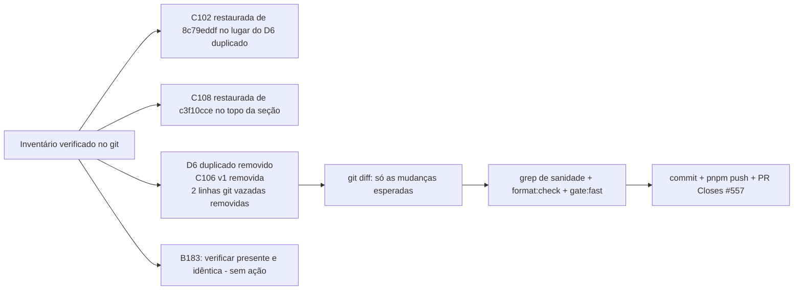

# Impl: Restaurar entradas B183/C102 perdidas do docs/CHANGELOG-AGENTS.md

Status: aprovado (gate humano 2026-08-10)
Atualizado em: 2026-08-10
Issue: #557
Intenção: docs/plans/restaurar-entradas-changelog-b183-c102.md
Appetite restante: ~0,25 dia eng (herdado; exploração já consumida, execução é minutos)

## Leitura da intenção

- **Outcome:** as entradas de entrega perdidas do CHANGELOG voltam ao main, sem duplicar nem alterar texto (fonte: git), na posição cronológica correta; nada mais é tocado; sem Issue nova por entrada.
- **O que NÃO negociar:** texto canônico vindo do git (`8c79eddf`); posição relativa de C102 (após C104, antes de B179 — mesma ordem de `8c79eddf`); nenhuma outra **entrada legítima** é editada/removida; sem guarda automatizada de presença.
- **O que reavaliar:** a hipótese da intenção ("só B183 e C102 sumiram") está **desatualizada** — o snapshot da intenção (2026-08-10, pré-merges do B184/C103/C106/B185) não viu o churn do rebase do C106 (PR #555), que (a) **perdeu também a entrada da C108** (escrita em `c3f10cce`, ausente em main) e (b) deixou lixo de resolução de conflito no topo: D6 duplicado, C106 duplicado e 2 linhas de `git log` vazadas no markdown. A B183, que a intenção manda restaurar, **já foi re-adicionada** pela branch da C106 (`7eaa65ce`, PR #555 — `fab834fc`/B184 não a tocou), byte-idêntica à fonte — restaurá-la de novo criaria duplicata. E o rebase do C104 (`ea700e31`) **truncou a entrada da D6** (perdeu o final "Pendência humana: …"; o prettier `d52d0016` escapou `**Pe` → `\*\*Pe`) — achado dos revisores do /simplify, corrigido na mesma sessão (fase 2).

## Abordagem recomendada

**Opções consideradas:** A | B | C
**Recomendação:** A — restauração cirúrgica das 2 entradas perdidas (C102 + C108) + remoção do lixo do mesmo churn (dup D6 no lugar da C102, dup C106 v1, 2 linhas vazadas). É a única opção que deixa a seção íntegra: uma entrada por entrega, sem texto alterado, sem conteúdo canônico perdido.
**Rejeitadas:**

- B — executar a intenção ao pé da letra (restaurar só C102): deixa C108 perdida, D6 duplicado, C106 duplicado e linhas de commit vazadas como defeito permanente num doc que agentes leem para contexto. A intenção não previu o churn posterior; "nenhuma outra entrada é tocada" refere-se a entradas legítimas, não a lixo de conflito.
- C — reordenar a seção topo inteira pela ordem de merges: viola o "não reorganizar o arquivo" da intenção e mexe em entradas legítimas (B184/C103/B185…). O custo (diff grande, risco de desordenar o que está aceitável) não compra nada para o aceite.
- D — registrar Issues novas para as entregas mergeadas que **nunca** escreveram entrada (B187/B188/B190/B191/C107/C105 — verificado: branch tips e merges não tocaram o CHANGELOG): proibido pela intenção ("Sem Issue nova por entrada"); é gap de processo, não perda. Registrado como nota no impl e levado ao capture-review-debts se o humano quiser.

### Componentes / mudanças

- **`docs/CHANGELOG-AGENTS.md`** (único arquivo): edição de ~5 linhas no topo da seção "Recently resolved".
  1. **C102** — linha inteira de `8c79eddf` (linha 11), colada verbatim, no lugar do D6 duplicado (atual linha 23, entre C104 e B179). `git diff` contra o arquivo da intenção confirma texto idêntico.
  2. **C108** — linha inteira de `c3f10cce` (linha 7), colada verbatim, no **topo da seção** (acima da B184): era a posição dela quando escrita (mais nova na época) e é a posição menos ambígua para uma entrada restaurada; datada 2026-08-10 como a B184.
  3. **D6 duplicado** (linha 11 vs 23) — o da linha 23 é substituído pela C102; o da linha 11 (posição canônica) permanece → D6 único.
  4. **C106 duplicado** (linhas 12–13) — remove a v1 (2026-08-09, rascunho pré-rebase; a própria v2 a descreve como superada: "a hipótese original de CSS de página … foi descartada na execução"); mantém a v2 (2026-08-10, texto final reconciliado, com E2E).
  5. **Linhas vazadas** — `1c6b3d6e (…)` e `f37b8bcd (…)` (saídas cruas de `git log --oneline` coladas no markdown) — removidas.
  6. **B183** — verificação apenas: presente na linha 16 e byte-idêntica à fonte (já demonstrado: linha de contexto no diff `8c79eddf→main`). Nenhuma ação.
- **Migration:** sem migration.
- **Access / Consent:** não se aplica.
- **UI:** não se aplica (docs-only; CI `build-affected` pula o build).

### Dados → forma (se aplicável)

Não se aplica (sem dados/forma).

## Fases verificáveis

1. **Fonte + colagem** — extrair as 2 linhas canônicas com `git show` (C102 de `8c79eddf:…`; C108 de `c3f10cce:…`), colar verbatim (nunca redigitar — evita drift de transcrição).
2. **Edição cirúrgica** — aplicar os 5 pontos acima no arquivo; `git diff` deve mostrar: +2 linhas de entrada (C102, C108), −1 entrada (C106 v1), −2 linhas vazadas, −1 D6 duplicado (substituído pela C102). Nenhuma outra linha muda.
3. **Sanidade** — `grep -c "C102\|C108"` = 2 em posições esperadas; `grep -c "D6"` = 1; `grep -c "C106"` = 1; zero linhas casando `^[0-9a-f]{7,40} (`; `git show 8c79eddf` diffs das 2 entradas restauradas = vazio; `pnpm format:check`; `pnpm gate:fast`.
4. **Entrega** — commit com o impl plan incluso; `pnpm push -u origin HEAD`; PR Ready `--base main` + `Closes #557` + auto-merge; `gh pr checks --watch --required`.

## Rabbit holes / Não escopo (engenharia)

- Não criar guarda automatizada de presença de entradas no CHANGELOG (intenção; processo = revisar diff em merges que o toquem).
- Não reordenar a seção nem reorganizar o arquivo.
- Não restaurar C107/B187/B188/B190/B191/C105 (nunca escritas — gap de processo; fora do aceite). B186/B189 não mergeadas — entradas vêm com os merges.
- Não criar Issue por entrada nem editar outras Issues in-progress.

## Riscos e mitigação

- **Drift de transcrição na colagem** → colagem via `git show | sed -n` com verificação de diff (fase 1 e 3); nunca redigitar.
- **Conflito com merge em andamento** (B186/B189 locais não mergeados também contêm c3f10cce) → `pnpm push` + rebase na branch antes do PR se necessário; o fix é no arquivo, conflito resolve-se a favor da versão restaurada.
- **gate:fast lento** (docs-only muda nada) → rodar mesmo assim (exigência da skill); esperado green em lint/typecheck/unit.

## Aceite de engenharia

- [x] Aceite de produto da intenção ainda coberto (C102/C108 restauradas; B183 já presente e idêntica; texto canônico intacto)
- [x] Invariantes AGENTS/engineering-standards (docs-only; sem migration/access/Consent/DB)
- [x] Testes de domínio previstos: nenhum (docs); gate:fast + grep de sanidade + diff verificado

---

### Nota de achado (gap de processo, fora do escopo)

Entregas mergeadas sem entrada no CHANGELOG (verificado em branch tips e merges): B187 (#559), B188 (#548), B190 (#560), B191 (#554), C107 (#552), C105 (#536). B186 e B189 seguem **não mergeadas** em branch (a B189 escreveu entrada no tip da branch em 2026-08-10 — virá junto com o merge; a B186 ainda não tem). Recomendação de processo (não automatizada): revisar o diff do CHANGELOG no rebase de cada branch que o toque — o mesmo processo que a intenção já registra.
