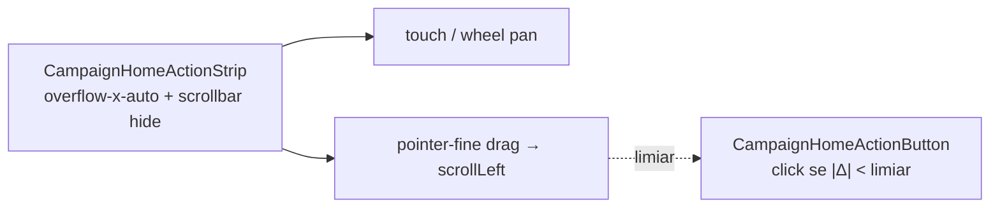

# Restaurar pan/scroll na strip de ações (scrollbar oculta)

Status: rascunho
Atualizado em: 2026-07-29
Item do roadmap: [docs/roadmap.md](../roadmap.md) (Trilha B, item **B67** — UX-1 chassis)
Impeccable: B — encaixe em `CampaignHomeActionStrip` / `CampaignHomeActionButton`
Appetite: ~0,25–0,5 dia eng; overflow + drag-to-scroll; sem migration
Responsável: —

## Design (Impeccable)

Âncoras: `PRODUCT.md` (Feel the action) / `DESIGN.md` · tema `data-theme='campaign'`.

Na implementação (`implement-roadmap-item`): craft compacto → critique → polish.

Brief compacto:

- **Persona / contexto:** staff no Início com viewport estreito (mobile / janela pequena) — as 6 ações não cabem; precisa rolar a strip sem ver barra feia.
- **Job principal:** descobrir e acionar qualquer ação da strip com wheel, toque-e-arrasta ou click+arrasta; a barra de scroll continua invisível.
- **Estratégia de cor:** Restrained — só comportamento; sem chrome novo.
- **Edit where you see:** não — só navegação.
- **Anti-goals:** `overflow-x-hidden` “para esconder a barra”; setas de carousel; lib de swipe; quebrar long-press / Tooltip do botão.

## Dados → decisão → apresentação

Dados: N/A — affordance de pan; sem KPI.

## Contexto

**B44 ✓** entregou `CampaignHomeActionStrip` com `overflow-x-auto` e adiou **drag-to-scroll** no desktop (“nativo basta”). **B58 ✓** pediu scrollbar **oculta** com pan preservado (`[scrollbar-width:none]` + WebKit hide) — classes ainda em [`CampaignHomeActionStrip.tsx`](../../src/components/campaign/dashboard/CampaignHomeActionStrip.tsx).

**Pedido de produto (2026-07-29):** depois do polimento, a strip ficou **sem forma de rolar**. O desejado é exatamente o contrato B58: barra escondida, mas continuar possível rolar com **mouse (wheel/trackpad)**, **click+movimento** e **toque e puxar**.

Diagnóstico a confirmar na implementação (não assumir um só culpado): parent que captura gesture; conflito `touch-action` × long-press; wheel vertical do scrollport do Início engolindo delta horizontal; ou só falta o drag desktop que B44 adiou e que, com scrollbar oculta, vira a única affordance descoberta no mouse.

## Objetivos

- Restaurar pan horizontal **nativo** (touch + wheel/trackpad) com `overflow-x-auto` intacto e scrollbar visual **continua oculta** (classes atuais ou utilitário `scrollbar-hide` de `styles.css` se for o 2º call site — B58 Adiado).
- Adicionar **drag-to-scroll** em `pointer-fine` (mousedown → move → `scrollLeft`), com limiar de movimento para **não** virar click/navegação do `CampaignHomeActionButton` nem cancelar long-press coarse.
- Não reintroduzir barra visível; não trocar por carousel/setas.
- Pins: unit no limiar drag-vs-click (jsdom + fake pointer events se estável); e2e smoke de classes/`overflow-x-auto` + ausência de scrollbar utility que zere overflow.
- Sem migration, collection, server action, Consent ou mudança de catálogo.

## Decisões travadas

- **Scrollbar oculta + pan real (nativo + drag fine).** **Rejeitado:** `overflow-x-hidden` (corta ações); reexibir scrollbar fina (pedido explícito: só esconder a barra); setas/lib swipe.
- **Drag-to-scroll no desktop agora** (fecha o Adiado de B44 — gatilho “sessão reclamar” disparou). **Rejeitado:** só wheel (em muitos mice o delta é vertical e a strip não se move sem Shift).
- **Limiar de arraste antes de cancelar click.** **Rejeitado:** `preventDefault` no primeiro `pointerdown` (mata Link/botão); `draggable` nativo de imagem.
- **i18n:** ids `useHomeActionStripPan` / `dragThresholdPx`; copy intacta.

## Questões em aberto

- **Fade nas bordas quando há overflow?** **Opções:** A neste item | B manter Adiado B58. **Recomendação:** **B** — affordance de pan primeiro; fade só se, após drag, ainda houver “não sei que tem mais”. _(assumido)_
- **Hook compartilhado vs lógica só na strip?** **Opções:** A `useDragScroll` em `lib/` | B handlers locais na strip. **Recomendação:** **B** até 2º call site (depth check). _(assumido)_

## Abordagem proposta

Componentes:

- **`CampaignHomeActionStrip.tsx`:** auditar/corrigir classes de overflow; listeners de pan por drag (ref no scroller); `cursor-grab`/`grabbing` só enquanto arrasta, sem mudar layout.
- **`CampaignHomeActionButton.tsx`:** se necessário, coordenar com o strip via limiar (não abrir Link se o strip marcou `didDrag`); não duplicar máquina de long-press.
- **Testes:** unit do limiar; e2e leve se já houver spec da strip.
- **Migration:** Sem migration, sem collection, sem server action.

## Dependências

- Dura: **B44 ✓** / **B58 ✓** (strip existe).
- Soft: **B65** (dock mobile — pan na faixa inferior); **B46 ✓**.

## Não escopo

- Fade edges → Adiado (B58 / questão acima).
- Reabrir rótulos/escala do B58.
- Busca / empty state → **B68**.
- Carousel / snap agressivo que force “página” de ações.

## Rabbit holes

- **Lib de swipe / Embla.** **Mitigação:** overflow + ~30 linhas de drag.
- **Unificar long-press + drag num gesture manager genérico.** **Mitigação:** limiar local; extrair só no 2º call site idêntico.
- **`overscroll-behavior` / nested scroll debugging em todos os shells.** **Mitigação:** só a cadeia do Início (`CampaignHomeLayout` → strip).

## Adiado com gatilho

- **Fade nas bordas.** Revisitar se, com pan restaurado, usuários ainda não descobrirem overflow.
- **`useDragScroll` compartilhado.** Revisitar no 2º scroller horizontal com a mesma política.

## Referências

- `docs/roadmap.md` (UX-1 / B58 / B44)
- [`CampaignHomeActionStrip.tsx`](../../src/components/campaign/dashboard/CampaignHomeActionStrip.tsx)
- [`CampaignHomeActionButton.tsx`](../../src/components/campaign/dashboard/CampaignHomeActionButton.tsx)
- [polimento-strip-acoes-inicio.md](polimento-strip-acoes-inicio.md) (B58 — “scrollbar oculta, pan preservado”)
- [botao-acao-inicio-strip.md](botao-acao-inicio-strip.md) (B44 — Adiado drag-to-scroll)
- `PRODUCT.md` / `DESIGN.md` — Feel the action; register product
