# Impl: Restaurar pin de visibilidade CSS das colunas de rede em Territórios

Status: aprovado
Atualizado em: 2026-08-10
Issue: #616
Intenção: docs/plans/restaurar-pin-visibilidade-colunas-territorios.md
Appetite restante: herdado (~0,25 dia eng)

## Leitura da intenção

- **Outcome:** um spec de browser mínimo pina que, a 2200px, os columnheaders de rede (Assessor / Liderança / Dobradinha) e o restante do contrato (sortables) de `/campanha/territorios` estão **visíveis** — visibilidade CSS real via container queries (`@min-[Nrem]/territory-list:table-cell`) — e Cobertura permanece oculta; verde no job e2e existente.
- **O que NÃO negociar:** nada de re-migrar a família; não duplicar asserções do `campaignTerritoriesHttp` (presença no HTML + classes de rung continuam lá); zero mudança de CSS/UI; spec mínimo (só este comportamento).
- **O que reavaliar:** a letra do manifesto `e2e-affected` da intenção ("rota `territorios` → specs `['campaignTerritoriesHttp', 'campaignTerritoriesColumns']`") — o prefixo de rota não acorda o spec quando o **arquivo das rungs** muda (ver D2; as rungs vivem em `src/components/campaign/municipality/TerritoryListColumns.tsx`, hoje mapeado para specs de municípios).

## Abordagem recomendada

```mermaid
flowchart LR
  Spec[campaignTerritoriesColumns.e2e.spec.ts<br/>1 teste — corpo do antigo teste 3] --> Login[campaign.login<br/>viewport 2200x1000 antes do login]
  Login --> Goto[goto /campanha/territorios]
  Goto --> Sort[sortables visíveis<br/>Ordenar por 2022/Captura/2026/Classe/Assessoria]
  Sort --> Net[rede visível<br/>Assessor/Liderança/Dobradinha exact]
  Net --> Cobertura[Cobertura count 0]
  Manifest[e2e-affected: territórios<br/>+campaignTerritoriesColumns<br/>+prefixo TerritoryListColumns] --> Spec
```

**Opções consideradas:** D1 (corpo do spec) A | B · D2 (manifesto) A | B
**Recomendação:** corpo **exato** do antigo teste 3 (D1-A) + manifesto com o spec **e** o prefixo do arquivo das rungs (D2-B) — porque o corpo restaurado já foi aceito por produto (B175) e o prefixo extra é o que faz o pin acordar exatamente quando o CSS que ele protege muda.
**Rejeitadas:** D1-B (versão enxuta só com as 3 colunas de rede) porque perde o pin de "Cobertura oculta" e dos sortables sem ganho de custo; D2-A (só a letra da intenção) porque deixa o spec mudo exatamente para a regressão que o motivou.

### Componentes / mudanças

- **`tests/e2e/campaignTerritoriesColumns.e2e.spec.ts`** (novo, projeto `campaign` — casa `/campaign.*\.e2e\.spec\.ts/`): um teste que restaura o corpo do teste 3 do spec deletado (`campaignTerritories.e2e.spec.ts` em `1f31d1b6^`), com o mesmo comentário B175 e a mesma ordem: `page.setViewportSize({ width: 2200, height: 1000 })` → `campaign.login(page, email, password)` → `page.goto('/campanha/territorios')` → loop de sortables (`getByRole('columnheader', { name: new RegExp(\`^Ordenar por ${header}\`) })`visível para`['2022', 'Captura', '2026', 'Classe', 'Assessoria']`) → loop da rede (`columnheader`exact`['Assessor', 'Liderança', 'Dobradinha']`visível) →`columnheader` `'Cobertura'`com`toHaveCount(0)`. Cabeçalho do arquivo documenta a divisão de trabalho com o spec HTTP (presença + rungs no HTML são do HTTP; visibilidade em viewport é browser) e por que ele existe (OPS35+).
- **`scripts/lib/e2e-affected-manifest.mjs`** (entrada territórios): `specs: ['campaignTerritoriesHttp']` → `['campaignTerritoriesHttp', 'campaignTerritoriesColumns']` e `prefixes` ganha `src/components/campaign/municipality/TerritoryListColumns` (arquivo das rungs; startsWith prefixo-de-arquivo é válido no contrato do manifesto — mesmos checks unit de `e2eAffectedManifest.unit.spec.ts` seguem passando).
- **Migration:** sem migration.
- **Access / Consent:** sem mudança.
- **UI:** Impeccable A — N/A (infra de testes; sem UI nova).

## Fases verificáveis

1. **Spec + manifesto** — criar o spec novo e a entrada do manifesto. Prova de não-vazio (muta): com `@min-[60rem]/territory-list` de `advisor` temporariamente alterado para `@min-[200rem]`, o spec deve falhar em `Assessor`; reverter. Depois rodar os pins unit afetados: `pnpm test:unit tests/unit/e2eAffectedManifest.unit.spec.ts tests/unit/ciSkipInvariants.unit.spec.ts tests/unit/testAffected.unit.spec.ts`.
2. **E2e local** — `pnpm test:e2e tests/e2e/campaignTerritoriesColumns.e2e.spec.ts` (dev, worktree: `teqo_wt35_test`, porta 3135) verde; conferir que o job CI continua verde no PR (o spec novo entra no `campaign` project).
3. **Gates** — `pnpm gate:fast` (lint + tsc + unit), `pnpm format:check`, `pnpm exec knip`, `pnpm check:cycles`; entrega via `pnpm push`.

## Rabbit holes / Não escopo (engenharia)

- **Re-migrar famílias ou tocar o `campaignTerritoriesHttp`** — fora de escopo; a equivalência HTTP continua como está.
- **Pinar rungs das outras listas** (municípios, lideranças…) — rabbit hole de produto já catalogado na intenção; o pin de municípios já existe (`campaignMunicipalityResponsiveColumns`).
- **Cobrir mudanças de `tailwind.config`/`globals.css` no manifesto** — gap do OPS5 conhecido, não desta issue; uma regressão de container-query Tailwind que quebre a rung também quebra o pin via `TerritoryListColumns.tsx` quando o arquivo mudar.

## Riscos e mitigação

- **Flake de viewport/container:** o corpo é exatamente o que passou em CI por semanas antes do OPS35 (2200px com sidebar expandida deixa o container acima de 72rem). Sem estado novo, sem interação — risco baixo.
- **Custo do job e2e:** +1 teste browser (~5–10 s dev; <1 s prod) — o trade do OPS35 foi explícito: viewports continuam em browser.
- **Prefixo novo no manifesto muda o alcance do `selectE2eSpecs`:** mudanças em `TerritoryListColumns.tsx` passam a rodar os 2 specs de territórios **além dos** specs de municípios (o seletor faz união de entradas) — é o comportamento desejado (a regressão de CSS de territórios acorda o pin de territórios).

## Aceite de engenharia

- [x] Aceite de produto da intenção ainda coberto (corpo do teste 3 restaurado; nada de CSS/HTTP tocado)
- [x] Invariantes AGENTS/engineering-standards (spec novo mapeado no manifesto; unit pins verdes; sem twin de fixtures — `campaign.login` reusado)
- [x] Testes de domínio previstos: spec e2e novo + prova de não-vazio (mutação revertida) + pins unit do manifesto
