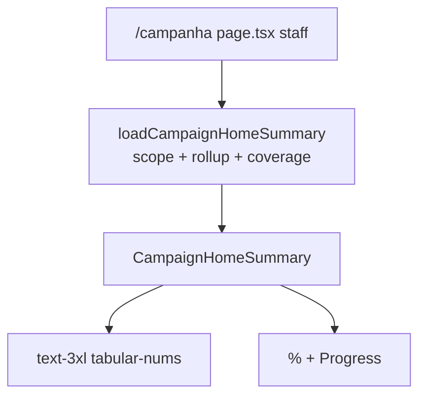

# Resumo da campanha no Início (total + cobertura)

Status: entregue
Atualizado em: 2026-07-29
Item do roadmap: [docs/roadmap.md](../roadmap.md) (Trilha B, item B56)
Impeccable: C — bloco KPI novo no Início (não é strip do Quadro)
Appetite: ~1 dia eng; loader slim + componente tipográfico + Progress; sem migration
Responsável: —

## Design (Impeccable)

Âncoras: `PRODUCT.md` (Clarity under pressure; Intelligence serves organization — sem hero-metric SaaS) / `DESIGN.md` (Headline / tabular-nums) · tema `campaign`.

Na implementação: **shape → craft → critique → polish** (classe C).

Brief compacto:

- **Persona / contexto:** CG/assessor abre o Início e quer, sem rolar, o pulso estadual (carteira, no assessor) da estimativa e quanto está lastreado.
- **Job principal:** “quanto estamos projetando?” + “quanto disso já está comprometido por lideranças?”
- **Estratégia de cor:** Restrained; barra de cobertura usa `Progress` existente; sem vermelho decorativo no número.
- **Edit where you see:** não — só leitura; edição continua na lista/Quadro/wizards.
- **Anti-goals:** saudação; `CampaignMetricStrip` em cards no Início; seta/delta 7 dias (→ **B57**); gauge/donut; % estadual absoluto; leader vendo estimativas; segunda lib de charts.

## Dados → decisão → apresentação

- **Vou apresentar dados?** Sim, superfície neste item.
- **Decisões desbloqueadas:**
  - Coordenador: “a conta estadual (ou da carteira) ainda fecha na ordem de grandeza da reunião — ou caiu/subiu o suficiente para abrir A1 hoje?”
  - Assessor: “minha carteira está lastreada ou a cobertura está baixa demais para o total que estou projetando?”
- **Forma escolhida:** número tipográfico grande (não enorme) + linha secundária com % + barra — degrau mais pobre da escada. **Rejeitado:** strip multi-KPI do Quadro; sparkline; mapa no bloco; chart.
- **Profile:** 2 escalares (total absoluto + ratio 0–1); granularidade = escopo do ator (435 ou carteira); cenário fixo `central`.
- **Anti-goals de dado:** sem % dos válidos estaduais; sem vanity de cadastros; sem inventar denominador paralelo ao E8.

## Contexto

Início staff já monta ações (**B45 ✓**); thumb-zone/busca (**B46–B55**) compõem o chrome. O Quadro (`/campanha/quadro`) já agrega `staffVoteTotalByScenario` e `goalCoverage` via `getCampaignDashboardData` — mas o Início está sem briefing numérico. Pedido de produto (2026-07-29): no **topo** do conteúdo (sem saudação), total das estimativas +, abaixo e mais discreto, cobertura E8 com barra. Delta 7 dias fica em **B57** (baixa prioridade).

Gate fechado 2026-07-29: hero = `staffVoteTotal` central; cobertura = E8 (`comprometido ÷ meta`); layout = topo sem saudação; mobile mantém ações na thumb-zone (**B46**).

## Objetivos

- Bloco **`CampaignHomeSummary`** (nome final no PR) no Início **staff** (`coordinator` / `candidate` / `advisor`); **não** montar para `leader`.
- **Número principal:** `rollupMunicipalityStaffVotes(…).staffVoteTotalByScenario.central` no escopo do ator (`loadMunicipalityScope`), formatado com `formatElectionNumber`.
- Tipografia: grande mas não enorme — alvo craft ~`text-3xl` / Headline+; `tabular-nums`; sem card chrome pesado.
- **Cobertura (discreta):** `goalCoverage.aggregateByScenario.central` — `%` via `formatGoalCoverageRatioLabel` + `Progress` com `goalCoverageProgressPercent`; copy curta tipo “Cobertura por lideranças” (craft fecha o rótulo; verbete E18 `cobertura-da-meta` como destino de “Saiba mais” opcional).
- Loader slim (não puxar mapa/sugestões do Quadro): reusar `rollupMunicipalityStaffVotes` + `loadMunicipalityGoalCoverageBundle` (ou fatia mínima de `getCampaignDashboardData`).
- No modo focado da busca (**B47**): o resumo some com o resto do chrome (contrato do B47).
- Sem migration / collection / Consent / action de escrita.

## Decisões travadas

- **Hero = staff vote total `central`.** `expectedVotes[S] ?? Σ pledges efetivos` por município, depois Σ no escopo — mesmo contrato do Quadro. **Rejeitado:** só Σ `expectedVotes` (zera municípios sem planilha); Σ meta E8 como hero (confunde “projeção da mesa” com “meta da conta”).
- **Cobertura = E8 OMTM.** `meta = expectedVotes ?? suggestedGoal`; `comprometido = Σ pledges efetivos`; ratio = comprometido ÷ meta. **Rejeitado:** declared ÷ hero (segunda métrica); só `declaredVotes` no numerador (quebra paridade com Quadro/lista).
- **Topo do conteúdo, sem saudação.** **Rejeitado:** linha “Olá, …” (produto 2026-07-29); resumo só na 2ª dobra (KPI some do ritual diário).
- **Staff-only; advisor no escopo da carteira.** **Rejeitado:** número estadual irrestrito para assessor.
- **Sem seta/delta nesta fatia.** Slot visual do delta = **B57**. **Rejeitado:** inventar Δ com `Date.now()` / último load em memória.
- **i18n:** `CampaignHomeSummary`, `homeSummaryVotes`, `homeSummaryCoverage`; copy pt-BR.

## Questões em aberto

- **Rótulo do número (“Votos estimados” vs “Projeção” vs “Total na média”)?** **Opções:** A “Votos estimados” | B “Projeção (média)” | C só o número sem label. **Recomendação:** A + cenário implícito (central) — alinha ao vocabulário da mesa; B se critique achar “estimados” ambíguo vs pledges. _(assumido)_
- **Link “Ver no Quadro” / lista por déficit?** **Opções:** A sem link (só número) | B link discreto para `/campanha/quadro` | C link para `?sort=deficit`. **Recomendação:** A em v1; B se critique pedir âncora. _(assumido)_

## Abordagem proposta

Componentes:

- **`loadCampaignHomeSummary`** em [`src/utilities/campaignDashboardData.ts`](../../src/utilities/campaignDashboardData.ts) (`server-only`, colocado no módulo do Quadro em vez de `campaignHomeSummaryData.ts` top-level): `loadMunicipalityScope` + `rollupMunicipalityStaffVotes` + `loadMunicipalityGoalCoverageBundle`; devolve `{ staffVoteTotalCentral, goalCoverage }` (só `central`). `overrideAccess: false` com `user`.
- **`CampaignHomeSummary.tsx`** (`components/campaign/dashboard/`): RSC ou server-friendly; `formatElectionNumber`; `Progress`; sem import de catálogo/Bahia no client.
- **Wire-up** em `page.tsx`: acima de ações/busca na ordem de leitura; no mobile o **B46** continua ancorando a strip embaixo — o resumo fica no fluxo superior do scroll.
- **Migration:** Sem migration, sem collection, sem server action.

## Dependências

- Duras: **E8 ✓** (fórmulas), **B43 ✓** / **B45 ✓** (Início staff com chrome). Soft: **B46** (ordem thumb-zone vs conteúdo); **B47** (ocultar no modo focado).
- Desbloqueia slot visual de **B57** (delta).

## Não escopo

- Delta 7 dias / seta → **B57**.
- Mapa, sugestões, prioritários, “Onde estou” de volta ao Início → Quadro / itens próprios.
- Seletor de cenário no Início → fica no Quadro/lista.
- Wizards UX-1 → fatias seguintes.

## Rabbit holes

- **Reusar `CampaignDashboard` inteiro no Início.** Arrasta mapa/Suspense/sugestões e contradiz B43. **Mitigação:** loader slim + componente próprio.
- **Hero-metric SaaS / card grid.** **Mitigação:** tipografia + uma barra; sem `CampaignMetricStrip` de 3–4 células.
- **Snapshot/Δ “só um pouquinho”.** **Mitigação:** explícito em B57; aqui mostrar só o presente.

## Adiado com gatilho

- **Delta 7 dias ao lado do número.** Revisitar em **B57** (prioridade baixa; produto 2026-07-29).
- **Saudação.** Revisitar só se sessão de campo pedir nome/contexto emocional — hoje cortada.

## Referências

- `docs/roadmap.md` (Trilha B / UX-1)
- `src/utilities/campaignDashboardData.ts` — precedente de rollup + coverage
- `src/lib/voteEstimate.ts` / `src/utilities/votePledgeViews.ts` — `rollupMunicipalityStaffVotes`
- `src/utilities/municipality/goalCoverage.ts` — labels + `goalCoverageProgressPercent`
- `src/components/campaign/shared/CampaignMetricStrip.tsx` — o que **não** copiar como layout do Início
- `src/app/(campaign)/campanha/(app)/page.tsx` — mount atual
- `docs/plans/conta-da-cadeira.md` (E8) — semântica de cobertura
- `PRODUCT.md` / `DESIGN.md` — anti hero-metric; tipografia

**Revisão 2026-07-29 (entrega):** loader slim colocado em `campaignDashboardData.ts`; `CampaignHomeSummary` + `summarySlot` no layout staff com ocultação no modo focado B47; specs `campaignHomeSummary.unit.spec.tsx` e extensão de `campaignHomeSearch.unit.spec.tsx`.

## Explicitamente fora (pós-`/simplify`)

- `CampaignMetricStrip` no Início — anti-goal do plano; Quadro já cobre multi-KPI.
- Componente compartilhado Progress+label — só dois call sites (resumo + métricas); extrair quando ≥3.
- Renomear rótulo para “Cobertura da meta” sem sign-off de produto (copy atual alinhada ao plano).
- Helper E8 só-agregado / int test do loader — cobertura unit do componente + rollup existente bastam por ora.
- Módulo top-level `campaignHomeSummaryData.ts` — loader permanece em `campaignDashboardData.ts` (pin + um call site).
