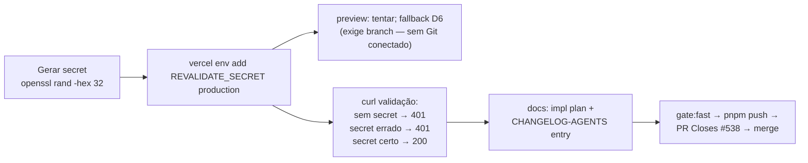

# Impl: OPS21 — Adicionar REVALIDATE_SECRET na Vercel production (runbook /api/revalidate)

Status: aprovado
Atualizado em: 2026-08-10
Issue: #538
Intenção: body da Issue #538 (ops pura, sem plano de intenção separado)
Appetite restante: herdado (ops ~30min + passos de validação)

## Leitura da intenção

- **Outcome:** `POST /api/revalidate` responde `200` em produção com o secret correto (hoje `500`), e o runbook pós-seed / mudança direta de DB (AGENTS.md "Posts & Tags") volta a funcionar: bust do cache `posts` / `election-tse` / `global_privacy-policy` / `municipality-catalog` em produção.
- **O que NÃO negociar:** o secret nunca é impresso/logado/commitado; `vercel env add` só no projeto correto (`solla/jorgesolla`); nenhum código muda (issue diz "Sem código").
- **O que reavaliar:** "documentar no Vercel" — não há campo de descrição em `vercel env`; documentação = registrar a entrega no `docs/CHANGELOG-AGENTS.md` (padrão do repo) e deixar a env visível em `vercel env ls production`. Preview é **opcional** e o precedente D6 mostra que `vercel env add ... preview` exige branch (`branch_not_found`) porque o projeto não tem Git conectado (deploys CLI).

## Diagnóstico (evidência, 2026-08-10)

| Elo | Estado | Evidência |
| --- | ------ | --------- |
| 1. Env `REVALIDATE_SECRET` (Vercel prod) | **AUSENTE** | `vercel env ls production` (projeto `solla/jorgesolla`, link em `/home/fsolla/Code/teqo/.vercel`): não listada |
| 2. Endpoint prod | **500** | `curl -X POST https://pt.jorgesolla.com.br/api/revalidate -H "x-revalidate-secret: <errado>"` → `HTTP 500` (corpo: `REVALIDATE_SECRET is not configured` — route.ts:54-58) |
| 3. Comportamento esperado pós-fix | 401/200 | secret errado → `401`; secret certo → `200 { revalidated: true }` |

## Abordagem recomendada

**Opções consideradas:** A) gerar com `openssl rand -hex 32` | B) `openssl rand -base64 32` | C) segredo legível digitado manualmente
**Recomendação:** A — 64 chars hex, compatível com o header HTTP sem encoding, documentado em `.env.example` (`Generate with e.g. openssl rand -hex 32`).
**Rejeitadas:** B porque `+` `/` `=` do base64 pedem encoding cuidadoso em headers (funcionaria, mas sem ganho); C porque segredo de baixa entropia é fraco contra brute-force do endpoint público.

**Opções (environments):** A) só production | B) production + preview
**Recomendação:** A — production é o que o runbook usa; preview não tem deploy ativo de código (sem Git conectado, deploys CLI) e `vercel env add ... preview` exige branch (precedente D6: `branch_not_found`). Tentativa opcional de preview documentada como falha esperada, não como passo obrigatório.
**Rejeitadas:** B como obrigatório — ver acima.

**Opções (validação):** A) curl no endpoint prod real | B) `vercel redeploy` + curl
**Recomendação:** A — env vars runtime (não `NEXT_PUBLIC_*`) são lidas em `process.env` a cada invocação; se após `env add` o endpoint ainda responder `500`, disparar `vercel redeploy <latest prod url> --prod` e revalidar (fallback documentado, não passo padrão).

### Componentes / mudanças

- **Código:** nenhum (issue "Sem código" — route.ts, `.env.example` e AGENTS.md já documentam `REVALIDATE_SECRET`).
- **Vercel ops:** `vercel env add REVALIDATE_SECRET production` (projeto `solla/jorgesolla`, link `/home/fsolla/Code/teqo/.vercel`), valor via stdin (não em argv — histórico de shell).
- **Docs:** `docs/plans/revalidate-secret-vercel-production-impl.md` (este) + entrada curta em `docs/CHANGELOG-AGENTS.md` (padrão "Recently resolved").
- **Migration:** nenhuma. **Access / Consent:** N/A. **UI:** N/A (Impeccable A).

## Fases verificáveis

1. **Ops** — gerar secret, `vercel env add` production, tentativa preview (esperado falhar).
2. **Validação prod** — curl: secret ausente → `401`; secret errado → `401`; secret certo → `200 { revalidated: true, tag: 'posts' }`; tag inválida → `400`. Fallback: `vercel redeploy` se `500` persistir.
3. **Docs + gates** — CHANGELOG-AGENTS entry; `pnpm gate:fast`; `pnpm push -u origin HEAD`; PR `--base main` com `Closes #538`; merge + `gh pr checks --watch --required`.

## Rabbit holes / Não escopo (engenharia)

- Rotacionar `PAYLOAD_SECRET` ou outras envs (fora do escopo).
- Codificar o valor do secret em qualquer arquivo do repo (nunca).
- Adicionar descrição/suporte de env no Vercel (não existe campo).
- Mudar o endpoint `/api/revalidate` (funciona; só falta a env).

## Riscos e mitigação

- **Env adicionada no projeto errado:** `vercel` CLI já logado (`franciscosolla`), projeto verificado via `vercel env ls production` antes e depois (nome `solla/jorgesolla`).
- **Segredo vazado em shell history:** valor passado via stdin (`vercel env add` aceita stdin), nunca em argv.
- **Endpoint continua 500 após env add:** fallback `vercel redeploy <url> --prod` (env runtime pode estar congelada no deploy existente); revalidar.
- **Preview impossível (`branch_not_found`):** documentado como esperado (precedente D6), não bloqueia.

## Aceite de engenharia

- [ ] Aceite de produto da intenção ainda coberto (runbook revalida em prod com 200)
- [ ] Invariantes AGENTS/engineering-standards (sem código, sem migration, sem access)
- [ ] Validação real em produção: 401/401/200/400 conforme fases
