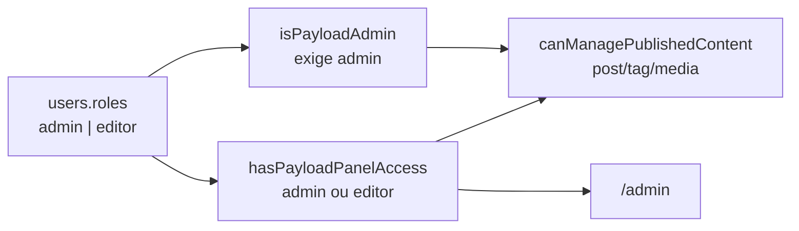

# Roles no admin Payload (`users.roles`)

Status: entregue 2026-07-27
Atualizado em: 2026-07-27
Item do roadmap: [docs/roadmap.md](../roadmap.md) (Admin Payload / Bloqueadores — campo `roles` em `users`)
Impeccable: A — N/A sem superfície UI própria (campo renderiza no admin Payload)
Appetite: ~0,75–1 dia eng; migration + predicados + testes; 15–30 min docs
Responsável: —

_Revisão 2026-07-27: auditoria do implement-roadmap-item. Unificação `users`+`campaignUser` rejeitada (25 FKs, isolamento estrutural → dado, janela de congelamento). Escopo mínimo: `admin` | `editor`; `isPayloadAdmin` exige papel `admin`; editor escreve `post`/`tag`/`media`. Entrega: migration `20260727_032523_add_users_roles` + backfill; predicados `hasPayloadPanelAccess`/`canManagePublishedContent`/`isPayloadEditor`; `canReadMunicipality` nega ator `users` sem admin; testes unit+int (ator editor + pin `payload.auth` com `roles`); unificação documentada como rejeitada com gatilho Fase 2 white-label._

## Dados → decisão → apresentação

Dados: N/A — RBAC de accounts do `/admin`; sem KPI/mapa/série/ranking nesta entrega.

## Contexto

A collection `users` ([src/collections/Users.ts](../../src/collections/Users.ts)) não tem `roles`: todo account admin é omnipotente. O hardening Fase 0 (2026-07-23) já trancou collections CMS/PII com `payloadAdminOnly` / `isPayloadAdmin` (type guard em `user?.collection === 'users'`), mas isso não diferencia papéis **dentro** do realm admin. O gap está em AGENTS Known Gap #1, roadmap "Bloqueadores atuais" e TECH-DEBT P1.

`/campanha` permanece em `campaignUser` (cookie `campaign-token`, roles `coordinator|advisor|candidate|leader`). As duas collections ficam separadas de propósito nesta entrega.

## Objetivos

- Campo `roles` (`select` hasMany, `admin` | `editor`) em `users`, `required`, `defaultValue: ['admin']`, `saveToJWT: true`, field access admin-only.
- Migration com backfill `admin` em todas as rows existentes + `down()` simétrico.
- `isPayloadAdmin` exige `roles` contendo `admin` (falha fechado se ausente/vazio).
- Editor entra em `/admin` e cria/edita/apaga `post`/`tag`/`media`; negado em PII, petições, campanha e gestão de `users` (exceto a própria conta).
- Guardrails: `push: false`; Local API com `user` → `overrideAccess: false` nos testes; sem Consent novo; sem unificar collections.

## Decisões travadas

- **Vocabulário `admin` + `editor`.** Cobre a razão real de abrir `/admin` (comunicação publicando notícias) com um predicado novo. **Rejeitado:** só `admin` (campo inútil além de revogar); matriz fina `content`/`legal`/`campaign-admin` (ninguém pede hoje).
- **`defaultValue: ['admin']`.** Bootstrap seguro: o "create first user" do Payload não expõe `roles` (field access admin-only); default `editor` deixaria o primeiro usuário sem poder promover ninguém. Mantém fixtures de teste intactas. **Rejeitado:** default `editor`; required sem default.
- **`petition` fora do escopo do editor na v1.** Abaixo-assinados carregam assinaturas (PII) e o export CSV é admin-only. **Rejeitado:** editor em `petition` nesta fatia.
- **`saveToJWT: true`.** Consistência com `campaignUser.role`; revogação imediata porque `payload.auth` devolve o documento fresco — pin de teste anti-lockout.
- **Não unificar `users` + `campaignUser`.** Decidido 2026-07-27. Números: 25 FKs → `campaign_user` em 22 tabelas (incl. `_vote_pledge_v`, `municipality_rels`, `activity_rels`, internals Payload com ambas as colunas); isolamento hoje é estrutural (`collection === 'users'`); unificado vira checagem de dado sobre ~400 `leader` accounts do outro lado de PII; `loginWithUsername` + template de reset de campanha colidiriam com `/admin`. Janela: congelamento ~20/09. **Gatilho para reabrir:** Fase 2 white-label/multi-tenant, ou "uma pessoa precisa de dois logins" deixar de ser hipotético.
- **i18n e naming:** identificadores em inglês (`roles`, `admin`, `editor`, `isPayloadEditor`, `canManagePublishedContent`, `hasPayloadPanelAccess`); labels admin em pt-BR ("Papéis", "Administrador", "Editor").

## Questões em aberto

Nenhuma bloqueante. Defaults acima carregados como decisão.

## Abordagem proposta

1. Schema + migration `add_users_roles` (enum + tabela `users_roles` + backfill).
2. Apertar predicados em `shared.ts`; Users.access; Post/Tag/Media; corrigir `cliReader` do script de aggregates.
3. Testes: lockdown com ator editor; pin `payload.auth` devolve `roles`; fixtures + unit dos predicados.
4. Gate AGENTS.md + Aikido + docs.

## Não escopo

- Unificar `users` + `campaignUser`.
- UI de matriz de permissões por collection.
- RBAC a nível de campo dentro do `/admin`.
- Log de auditoria de mudança de papel.
- Papéis por tenant / white-label.
- Editor em `petition` / `signature` / `consent` / collections de campanha.

## Dependências

Nenhuma dura. Soft: Onda 0 jurídica é independente (Consent keys). Soft: abrir `/admin` a comunicação só depois deste ship + smoke.

## Verificação

- `pnpm migrate:status` + backfill local `roles: ['admin']`.
- Conta `editor`: entra `/admin`, publica post; negada em signature/users/municipality.
- Conta `admin`: comportamento pré-existente intacto.
- `pnpm exec tsc --noEmit`, `pnpm lint`, `pnpm format:check`, `pnpm exec knip`, `pnpm check:cycles`, `pnpm test`, `pnpm test:e2e`, `pnpm build` contra banco local.
- Scan Aikido nos arquivos first-party editados.

## Rabbit holes

Unificação de identidade; matriz fina de papéis; editor em petition; auditoria de role change.
