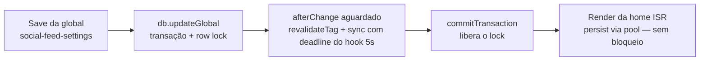

# Impl: S11-FOLLOWUP — janela de lock/sync de render acoplada à duração do sync de credenciais do Instagram

Status: rascunho
Atualizado em: 2026-08-24
Issue: #762
Intenção: body da Issue (sem plano de intenção linkado — body é a spec)
Appetite restante: herdado (P2, correção cirúrgica — 1 constante + 1 call site; sem migration)

## Leitura da intenção

- **Outcome:** dissociar a janela de row lock do `social_feed_settings` — e a latência
  acoplada do render ISR da home, cujo persist bloqueia nesse lock — da duração do fetch
  do Instagram no save de credenciais: no caminho do hook, a janela cai de ≤10s para ≤5s,
  com o aceite do S11 intacto.
- **O que NÃO negociar:** o aceite do S11 — hook aguardado dentro da transação do save
  (reload mostra o status final com as credenciais novas) e persist tx-bound (sem deadlock);
  fail-closed do fluxo (status IS o resultado; falha nunca quebra o save); contratos públicos
  (rota de retry, panel, URLs) intocados.
- **O que reavaliar:** a constante compartilhada `INSTAGRAM_SYNC_TIMEOUT_MS` — verificado
  que só o caminho do hook segura row lock; o botão de retry (`route.ts`) não abre transação,
  seu fetch não segura lock. Reordenar os dois hooks não ajuda (ver abaixo, timing verificado).

## Abordagem recomendada

**Opções consideradas:**

- **A — deadline específico do hook (recomendada):** `INSTAGRAM_SYNC_HOOK_TIMEOUT_MS = 5_000`
  ao lado de `INSTAGRAM_SYNC_TIMEOUT_MS`, usado só pelo `afterChange`.
- **B — fetch antes do persist transacional:** reestruturar para buscar antes de persistir.
- **C — persist pós-commit (fire-and-forget) via `onPayloadTransactionCommit`** (`src/utilities/payloadTransaction.ts:37-48`, seam já usada por `createCampaignNotification`).
- **D — reordenar hooks (sync primeiro, depois `revalidateTag`).**
- **E — reduzir a constante compartilhada para 5s globalmente.**

**Recomendação: A** — cirúrgica e única que encurta a janela sem tocar no aceite. Efeito: o
lock do save durante uma troca de credenciais cai de ≤10s para ≤5s; o reload continua
mostrando o status final (hook continua aguardado e tx-bound); zero mudança de UI; e2e
intocado (o stub responde instantaneamente — o deadline de 5s é invisível para
`tests/e2e/admin.e2e.spec.ts:134`).

**Rejeitadas (com a razão verificada):**

- **B** — infeasível no caminho do hook: verificado no source do Payload
  (`node_modules/payload/dist/globals/operations/update.js`), a ordem é `db.updateGlobal`
  (adquire o row lock) → afterRead → afterChange (aguardados) → `commitTransaction`
  (libera o lock). A transação/lock **já estão abertos quando o hook roda** — o fetch
  "antes dos persists" já é como `syncInstagramFeed` está estruturado; não encurta a janela.
- **C** — remove o acoplamento por completo, mas regride o aceite do S11: o reload do admin
  após o save mostraria o status ANTIGO (a falha do token anterior) até o sync em background
  chegar — o `InstagramSyncStatusPanel` lê o valor persistido do form e não tem auto-refresh.
  A mitigação (marcador "sincronizando" + estado do panel + polling + rework de e2e) é
  desproporcional à raridade do trigger (saves de credencial são raros; janela limitada a
  segundos; sem deadlock; público recebe stale-while-revalidate, nunca bloqueio).
- **D** — neutro-a-pior: o fetch do render já roda concorrente ao sync hoje; atrasar o bust
  do tag atrasa o início do render sem encurtar a espera dele no lock (análise de timing).
- **E** — encolheria a folga do retry do BOTÃO (refresh + retry = até 5 round trips
  sequenciais do Graph API) sem benefício nenhum — o botão não segura lock.

### Componentes / mudanças

- **`INSTAGRAM_SYNC_HOOK_TIMEOUT_MS`** (`src/utilities/socialFeed/instagramSync.ts`): nova
  constante `5_000` ao lado de `INSTAGRAM_SYNC_TIMEOUT_MS`, com comentário explicando o
  acoplamento — o hook roda dentro da transação do save e segura o row lock durante o fetch;
  o deadline do hook limita essa janela. O botão (`route.ts`) mantém a constante de 10s
  (sem transação aberta, precisa da folga para refresh+retry).
- **`syncInstagramAfterChange`** (`src/globals/SocialFeedSettings.ts:36`): trocar
  `AbortSignal.timeout(INSTAGRAM_SYNC_TIMEOUT_MS)` por `INSTAGRAM_SYNC_HOOK_TIMEOUT_MS`
  (1 linha + import + ajuste do comentário do JSDoc).
- **Migration:** sem migration. **Access / Consent:** sem mudança. **UI:** zero mudança.

## Fases verificáveis

1. **Constante + hook** — adicionar `INSTAGRAM_SYNC_HOOK_TIMEOUT_MS` em `instagramSync.ts`
   (com o comentário do acoplamento de row lock); trocar o `AbortSignal.timeout` do hook em
   `SocialFeedSettings.ts`. `route.ts` intocado.
2. **Teste** — em `tests/unit/instagramSync.unit.spec.ts` (convenções do arquivo: testa
   `syncInstagramFeed` direto com fetch stubado e payload fake; nunca importa o config global
   — o hook vive no módulo do global, então o teste fica na seam de constantes): um teste
   assertando `INSTAGRAM_SYNC_HOOK_TIMEOUT_MS < INSTAGRAM_SYNC_TIMEOUT_MS` (e o valor 5_000),
   pinando o invariante de que a janela de lock do hook fica estritamente abaixo do deadline
   do botão. Teste mais barato e honesto — 1 arquivo, 1 import, sem helper novo.
3. **Docs + gates** — entrada curta em `docs/changelog/2026-08-24-s11-followup.md`;
   `pnpm gate:fast`; entrega via `pnpm push` (CI roda unit + int + e2e + lint + typecheck +
   knip + cycles + prettier). O e2e existente (`admin.e2e.spec.ts:134`) continua cobrindo o
   aceite do S11 sem mudança.

## Rabbit holes / Não escopo (engenharia)

- Mitigação do candidato C (marcador "sincronizando" + estado do panel + polling): fora de
  escopo. Gatilho registrado: se o produto reportar que o status antigo após troca de
  credencial é um problema real, é Issue própria com aquele desenho.
- Render path (`getInstagramFeed`) sem deadline no fetch do ISR: pré-existente e fora do
  escopo (a Issue é o caminho do save; o render não segura row lock). Gatilho: flakiness
  real da Graph API em prod segurando a home stale → fix de 1 linha (signal no render).
- Débito registrado na triage: hooks do sync do Google Calendar seguram row lock por I/O
  de rede (mesmo anti-padrão) → Issue #870 (C114-LOCK, depends #762).
- Reduzir a constante compartilhada globalmente (E): não — ver rejeitadas.
- Reordenar hooks (D), mexer no render path (`getInstagramFeed`/`instagramFeedView.ts`),
  no panel ou na rota de retry: não escopo.
- Nenhum helper novo para o teste (1 assert não justifica camada).

## Riscos e mitigação

- **Graph API mais lenta que 5s:** o sync falha com timeout e o status persistido mostra
  "demorou demais" (mapeamento existente de `AbortError` em `describeInstagramError`) —
  benigno: o panel reflete o estado real e o botão de retry mantém 10s de folga para a
  tentativa manual. A janela de lock no save fica ≤5s mesmo assim.
- **Degradação do aceite S11:** nenhuma — hook continua aguardado, persist tx-bound, reload
  mostra o status final; fail-closed preservado.
- **Sem migration / sem schema / sem access:** invariantes do repo intocados.

## Aceite de engenharia

- [ ] Aceite de produto da intenção ainda coberto (janela de lock do save ≤5s; reload mostra
      status final; deadlock-free preservado)
- [ ] Invariantes AGENTS/engineering-standards (sem migration, sem access, sem Consent;
      sem mudança de contrato público)
- [ ] Testes de domínio previstos (unit na seam de constantes; e2e existente cobre o aceite)

## Self-score decision-quality (gate ≥4)

**5/5**

1. Decisões caras têm rejeitadas? Sim — B/C/D/E registrados com razões verificadas no
   source do Payload (`update.js`) e por análise de timing.
2. Abordagem cabe no appetite? Sim — 1 constante + 1 linha no hook + 1 teste; sem
   migration/UI/e2e.
3. Rabbit holes nomeados? Sim — mitigação do C, redução global, reorder, render path.
4. Depth check? Reusa o seam existente (`syncInstagramFeed` + `AbortSignal.timeout`); sem
   módulo novo; teste na seam de constantes (unit specs já evitam o config global).
5. Intenção (aceite S11) permanece satisfeita? Sim — a engenharia encurta a janela, não
   reescreve o outcome.
