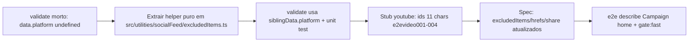

# Impl: S2-FOLLOWUP: validate do itemId (excludedItems) do YouTube e co

Status: rascunho
Atualizado em: 2026-08-24
Issue: #775
Intenção: docs/plans/s2-followup-validate-itemid-excludeditems-youtube.md
Appetite restante: herdado — item pequeno de follow-up, P2

## Leitura da intenção

- **Outcome:** o `validate` do campo `itemId` do array `excludedItems` em `SocialFeedSettings` deixa de ser código morto e passa a validar de verdade IDs de vídeo do YouTube (padrão `[A-Za-z0-9_-]{11}`), sem quebrar o e2e do S2 — ou, na alternativa licenciada pela própria intenção, é removido e o campo fica livre.
- **O que NÃO negociar:** correção em dupla — (1) validar via `siblingData.platform` OU remover o validate; (2) ids do stub de YouTube para 11 chars exatos + `excludedItems` do spec atualizados; (3) e2e do describe "Campaign home content section" verde. Fora de escopo: mexer no S2 entregue em produção.
- **O que reavaliar:** hipótese de que "produção tem IDs inválidos salvos" — não verificável do worktree (guards proíbem tocar prod); tratada em Riscos com verificação pré-deploy.

## Abordagem recomendada



**Opções consideradas:** A (consertar validate via `siblingData.platform`) | B (remover o validate) | C (validate "tolerante a legado" lendo o doc salvo via `req.payload`)
**Recomendação:** A — porque entrega o outcome primário da intenção (validação real de ID de vídeo, que hoje não existe), é mudança de ~1 linha com risco mitigado (ver Riscos) e o próprio guard nunca bloqueia o read nem corrompe dados; a alternativa B fica como fallback documentado com gatilho explícito (pré-check de prod), não como escolha primária — remover o validate joga fora a razão de ser do follow-up e deixa o erro de colar URL inteira continuar silencioso.
**Rejeitadas:** B como escolha primária — zera o risco, mas abdica do outcome primário da intenção e mantém o status quo de exclusões que falham silenciosamente com id mal colado (URL inteira, código curto); C — validate lendo o doc persistido (`req.payload.findGlobal`) para tolerar linhas legadas é over-engineering para um item P2, adiciona DB read dentro de validação e ciclo/recursão potencial; a permissão da intenção ("ou deixar o campo livre") já cobre o cenário de segurança máximo sem essa cerimônia.

### Componentes / mudanças

- **`validate` do `itemId`** (`src/globals/SocialFeedSettings.ts:204-212`): troca `{ data }`/`data.platform` por `{ siblingData }`/`siblingData.platform`; extrai a regra para helper puro `validateExcludedItemId(value, siblingData)` + `YOUTUBE_VIDEO_ID_PATTERN` em `src/utilities/socialFeed/excludedItems.ts` (mesmo diretório do `instagramSync` — o módulo que já é dono do concern "social feed"; a global já importa de `@/utilities/socialFeed/`). Mensagem de erro pt-BR existente fica: 'Informe o ID do vídeo (11 caracteres)'. Precedente do padrão siblingData: `Post.ts:61`, `Tag.ts:65` (beforeValidate), `AllocationDecision.ts:136` (condition).
- **`youtube-stub.mjs`** (`tests/e2e/`): os 4 ids de 20 chars viram 11 chars exatos — `e2e-video-destaque-1` → `e2evideo001`, `e2e-video-caravana-2` → `e2evideo002`, `e2e-video-entrevista-3` → `e2evideo003`, `e2e-video-excluido-4` → `e2evideo004` (todos `[A-Za-z0-9_-]{11}`, mantêm semântica de destaque/excluído). Thumbnails (`/thumbs/<id>.jpg`), `statisticsResponse` e `searchResponse` derivam das entradas de `VIDEOS` — consistência interna basta, nada mais muda.
- **`frontend.e2e.spec.ts`**: `excludedItems` youtube em :1030 e :1152 → `itemId: 'e2evideo004'`; href `watch?v=e2e-video-destaque-1` em :1049 e na mensagem WhatsApp em :1584 → `watch?v=e2evideo001`. Canal `UCe2eTestChannel` e IG (`e2e-ig-grade-excluido-5`, `e2e-ig-muro-1`) não mudam — IG é `platform: 'instagram'`, o guard não dispara (`SocialFeedSettings.ts:208`).
- **Unit test** (`tests/unit/socialFeedExclusions.unit.spec.ts`, padrão de nome `*.unit.spec.ts`): helper puro coberto — aceita 11 chars válidos (`e2evideo001`, `dQw4w9WgXcQ`), rejeita 20 chars/URLs/curtos; só falha quando `siblingData.platform === 'youtube'`; retorna `true` para `instagram` e para valor vazio.
- **Migration:** sem migration — `validate` é validação de runtime no config Payload, não altera schema do DB (o array/select/text já existem desde o S2).
- **Access / Consent:** não se aplica — global admin-only já existente (`payloadAdminOnly`, `SocialFeedSettings.ts:64-67`).
- **UI:** não há UI nova — o array já tem o admin panel; o erro inline do campo já existe.

### Dados → forma (se aplicável)

- Não se aplica (nenhuma forma nova; copy de erro já existente em pt-BR).

## Fases verificáveis

1. **Fix do validate + unit test** — extrai helper (`src/utilities/socialFeed/excludedItems.ts`) e usa `siblingData.platform` no validate; `tests/unit/socialFeedExclusions.unit.spec.ts`; valida com `pnpm test -- unit` do arquivo e `tsc --noEmit`. (Se o implementador preferir manter o validate inline, a única perda é o unit test — decisão barata, registrada.)
2. **Ids do stub + spec** — `youtube-stub.mjs` (4 ids) e `frontend.e2e.spec.ts` (:1030, :1049, :1152, :1584). IG e `admin.e2e.spec.ts` intocados.
3. **E2E + gates** — `pnpm test:e2e --no-deps -- tests/e2e/frontend.e2e.spec.ts -g "Campaign home content section"` (cobre os dois testes afetados: exclusões e "keeps the last snapshot"); rodar também o teste de save do admin do IG (`admin.e2e.spec.ts` — deve continuar verde, IG não é validado); `pnpm gate:fast`.

## Rabbit holes / Não escopo (engenharia)

- Instagram não é afetado: `platform !== 'youtube'` → validate retorna `true` (linhas IG em `instagram-stub.mjs` e specs não mudam).
- Sem migração de dados: `excludedItems` em prod é dado de admin; ids inválidos já salvos não quebram o read (o board casa por id exato e apenas "não exclui").
- Não mexer no S2 entregue em produção (nada do board/read path muda; o stub só ganha ids realistas).
- Não criar validate "tolerante a legado" com leitura do banco (opção C rejeitada).
- Não adicionar warning-mode no Payload (não existe — validate retorna `true` ou string de erro; sem meio-termo).

## Riscos e mitigação

- **Save-trap no admin/REST se prod tiver id youtube inválido pré-existente.** O validate roda por row quando o doc inteiro é submetido: o admin form PUTa o global completo e o e2e `updateSocialFeedSettings` idem — linhas existentes re-validam. Como o validate está morto desde o S2, nada garantiu o que foi salvo (id digitado à mão, URL inteira colada). (a) O risco é estruturalmente real, mas de severidade baixa: o erro é inline por row no form, e a row pode ser corrigida ou DELETADA no próprio form antes do save — a recuperação nunca exige acesso ao banco; o único dano realista é um save não relacionado falhar uma vez e a assessoria ter que ajustar/apagar a linha. Probabilidade de existir row inválida em prod é desconhecida-moderada (campo manual, sem validação), mas mitigável: **verificação pré-deploy read-only** de `excludedItems` com `platform: 'youtube'` fora do padrão (query única no homeserver, feita por quem dispara o `workflow_dispatch` — deploy é manual). Se achar rows inválidas: corrigir/apagar pela UI antes de publicar; se não for possível limpar → **fallback B (remover o validate)**, licenciado pela intenção e pré-comprometido neste plano. (b) Remover o validate é de fato mais seguro — por isso é o fallback; mas com o pré-check + recuperação 100% na UI, A não é fail-closed violado (sem corrupção, sem lockout, sem PII) e entrega o outcome primário.
- **Fix quebra o e2e existente (400 nos writes de exclusão).** Não é risco, é a causa raiz — a troca dos ids do stub para 11 chars (fase 2, mandatória) resolve na mesma entrega; ordem importa: aplicar fase 1 e 2 juntas antes de rodar o e2e.
- **Typing do validate:** `{ data }` hoje tipa `data.platform`; trocar o destructure para `siblingData` acompanha o tipo do row — sem `as` casts.
- **Save do admin (IG) no `admin.e2e.spec.ts:92-97`:** submete o doc inteiro com row IG → validate retorna `true` para `instagram`; confirmado na fase 3.

## Aceite de engenharia

- [ ] Aceite de produto da intenção ainda coberto (validação real via siblingData + ids do stub 11 chars + e2e do describe verde; fallback B explícito se o pré-check de prod falhar)
- [ ] Invariantes AGENTS/engineering-standards (sem schema → sem migration; sem escrita multi-collection; copy pt-BR / identificadores em inglês; nada de acesso/Consent novo)
- [ ] Testes de domínio previstos (unit do helper de validação na fase 1; e2e do describe + save admin IG na fase 3)

## Decisões de engenharia

```
Opções: A (validate via siblingData.platform) | B (remover validate) | C (validate tolerante a legado lendo o doc salvo)
Recomendação: A — porque entrega o outcome primário da intenção (validação real de ID de vídeo), com risco de save-trap baixo (erro inline por row, row corrigível/deletável na própria UI, sem acesso a banco) e gatilho de fallback documentado (pré-check read-only de prod no deploy manual → B).
Alternativas rejeitadas: B como primária — zeraria o risco mas abdica do propósito do follow-up e mantém exclusões que falham silenciosamente com id mal colado; fica como fallback pré-comprometido. C — over-engineering para P2 (DB read dentro de validate, ciclo potencial), quando a intenção já licencia o caminho seguro máximo sem essa cerimônia.
Self-score decision-quality: 5/5 — (1) decisão cara (validate vivo vs morto em prod) tem rejeitadas A/B/C documentadas; (2) cabe no appetite P2 (2 fases de edição + gates, sem migration nem UI); (3) rabbit holes nomeados (IG, migração de dados, S2 em prod, warning-mode inexistente); (4) depth check reusa `src/utilities/socialFeed/` (mesmo dono do concern) e helpers de e2e existentes, sem módulo novo; (5) intenção preservada — correção em dupla e e2e do describe intactos.
```
