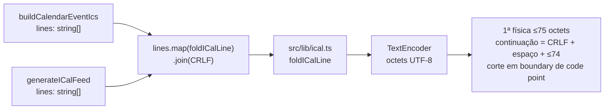

# Impl: S29-FOLLOWUP — .ics do link de anúncio: folding RFC 5545 (75 octets) no owner ical.ts

Status: aprovado
Atualizado em: 2026-09-23
Issue: #1281
Intenção: Issue #1281 (body = spec; sem arquivo de intenção no repo — triagem da review do S29, #1268 / PR #1280)
Appetite restante: herdado — P3/chore de review, sem appetite explícito na intenção; corte explícito: ~meio dia (1 primitiva pura no owner + 2 wirings + 1 spec unit), sem tocar rota, admin, schema ou UI.

## Leitura da intenção

- **Outcome**: o `.ics` do link de anúncio e o feed da agenda passam a emitir linhas físicas ≤75 octets (RFC 5545 §3.1), dobrando com `CRLF + 1 espaço` e sem partir caractere multi-byte. Após unfold (`replace(/\r\n /g, '')`), o texto lógico — campos, escapes, datas, ordem — é byte-a-byte o de hoje; o contrato das rotas (`/slug/evento.ics`, feed `/campanha/agenda/ical/...`) e o comportamento de Apple/Outlook ficam idênticos.
- **O que NÃO negociar**: owner único `src/lib/ical.ts` (escopo explícito do issue); os 2 call sites `lib/calendarEvent.ts` e `utilities/calendarFeed.ts`; `lib/` client-safe (sem `server-only`/`Buffer` — `calendarEvent` é importado por `ShareLinkAgendaMenu` `'use client'`); separador CRLF; specs existentes verdes (asserções exatas de CRLF em `calendarEvent.unit.spec.ts:91-99`); sem schema/migration, sem mudança de URL ou de conteúdo.
- **O que reavaliar**: nada de produto neste delivery. Se um parser estrito real quebrar, o gatilho é a evidência concreta. O `DESCRIPTION` do feed hoje interpola as partes cruas (sem `escapeICalText`) — concern pré-existente e separado, não entra aqui.

## Abordagem recomendada

### Decisões registradas (só o caro de reverter)

- **D1 — Assinatura do folding**: Opções: A `foldICalLine(line: string): string` (linha lógica → texto dobrado com `\r\n ` embutido) | B `foldICalLines(lines: string[]): string[]` | C folding inline em cada call site. **Recomendação: A — porque** é a menor primitiva que casa com o estilo do owner (`escapeICalText`/`formatICalDate` são 1 valor → 1 valor), mantém o `lines.join('\r\n')` existente (vira `lines.map(foldICalLine).join('\r\n')`) e dá ao unit exatamente a unidade RFC: uma linha lógica → suas físicas. **Alternativas rejeitadas**: B é pass-through raso (`lines.map` embrulhado no owner) que não adiciona conhecimento — depth check manda não criar; C duplicaria a mesma máquina nos 2 call sites e contraria o escopo ("folding no owner").
- **D2 — Unidade de medida**: Opções: A `TextEncoder` (web-standard, global em Node ≥11, browser e jsdom) | B `Buffer.byteLength` (node-only) | C `line.length` (code units UTF-16). **Recomendação: A — porque** mede octets UTF-8 reais sem `server-only`, preservando o contrato client-safe de `lib/` (o `ical.ts` chega ao bundle via `ShareLinkAgendaMenu`). **Alternativas rejeitadas**: B quebra o client boundary (o precedente `src/lib/formData.ts:213` só é válido porque aquele arquivo é `server-only`); C mede pt-BR acentuado a menos (ex. "ç"/"í" = 2 octets mas 1 code unit) e deixaria passar linha >75 octets.
- **D3 — Regra de corte e forma de retorno**: Opções: A recebe linha lógica sem CRLF e devolve a linha com dobras (`\r\n` + 1 espaço; 1ª física ≤75 octets, continuações com payload ≤74; corte sempre em boundary de code point) | B devolver `string[]` de físicas para o call site fazer `flatMap(...).join('\r\n')`. **Recomendação: A — porque** a semântica de dobra fica inteira no owner (uma string iCal válida de saída), o join por `\r\n` continua sendo só o separador entre linhas lógicas, e o invariante de teste fica direto: `foldICalLine` curta = identidade byte-a-byte. **Alternativa rejeitada**: B espalha a semântica no call site e deixa a interface menos profunda, sem ganho.
- **D4 — Onde aplicar**: Opções: A nos 2 call sites, `lines.map(foldICalLine).join('\r\n')` antes do join | B helper de join no owner (`joinICalLines`) | C folding na rota/handler. **Recomendação: A — porque** é o único ponto onde as linhas lógicas existem por inteiro, cobre todas as linhas (não só `DESCRIPTION`) e não muda os contratos. **Alternativas rejeitadas**: B adiciona um segundo conceito ao owner para 2 usos, sem ganho sobre `.map` (e o join já é trivial); C fica longe do dado, duplicaria por superfície e não cobriria consumidores futuros do owner.
- **D5 — Testes**: Opções: A novo `tests/unit/ical.unit.spec.ts` (função + os 2 builders), mantendo os specs existentes como regressão | B só adicionar casos aos specs existentes. **Recomendação: A — porque** o owner é compartilhado e passa a ter spec próprio (o comentário do topo promete "pinned by unit tests"); B duplicaria o helper de boundary em 2 arquivos e não fixaria a primitiva. **Rejeitada**: B.

### Componentes / mudanças

1. `src/lib/ical.ts` — novo export `foldICalLine(line: string): string` com JSDoc do contrato (linha lógica sem CRLF; identidade se ≤75 octets; continuação `CRLF + 1 espaço`; nunca parte multi-byte). Constantes privadas `MAX_OCTETS = 75` e `CONTINUATION_PAYLOAD_OCTETS = 74` (não exportar — RFC, não API; o unit assere literais 75/74 de propósito). Algoritmo: codifica a linha uma vez com `TextEncoder`; se ≤75 octets devolve a própria string; senão caminha os bytes e escolhe o maior corte ≤75 (e ≤`end + 74` nas continuações) cujo byte seja lead de sequência UTF-8 (`(byte & 0xc0) !== 0x80`), decodificando os pedaços com `TextDecoder` e unindo com `\r\n`. Há sempre boundary válido (nenhum code point passa de 4 octets), sem loop infinito.
2. `src/lib/calendarEvent.ts` — importar `foldICalLine` e trocar o `return lines.join('\r\n')` de `buildCalendarEventIcs:93` por `lines.map(foldICalLine).join('\r\n')`.
3. `src/utilities/calendarFeed.ts` — idem em `generateICalFeed:76` (import na linha 7).
4. `tests/unit/ical.unit.spec.ts` — novo spec (detalhe na fase 1/2).
5. `docs/changelog/2026-09-23-s29-followup-ics-folding.md` — entrada de 1 linha, intro em negrito.

Sem schema, sem migration, sem UI, sem rota nova.

### Dados → forma

- Entrada: `lines: string[]` lógicas, já escapadas/formatadas (`escapeICalText`/`formatICalDate`); nunca contêm CRLF real (newlines viram `\n` literal).
- Saída: o mesmo texto com dobras; `unfold` (`replace(/\r\n /g, '')`) restaura byte-a-byte o pré-folding — é o invariante dos testes.
- Exemplo (DESCRIPTION ~160 octets): 1ª física com 75 octets + `\r\n ` + 74 + `\r\n ` + resto; cada física ≤75 contando o espaço da continuação.
- Linhas curtas (todas as existentes em produção hoje além do `DESCRIPTION` longo) saem idênticas — zero diff de conteúdo/ETag para feeds sem descrição longa.

## Fases verificáveis

1. **Tracer — owner + unit (RED→GREEN)**: adicionar `foldICalLine` e `tests/unit/ical.unit.spec.ts` com (a) linha curta = identidade (sem CRLF acrescentado), (b) exatamente 75 octets intacta e 76 dobrando, (c) >150 octets ASCII com múltiplas continuações — cada física ≤75 e boundary exato 75/74, unfold === original, (d) acento multi-byte ("Comício" repetido) sem partir caractere: sem `\uFFFD` e unfold === original. Rodar `pnpm test:unit tests/unit/ical.unit.spec.ts`.
2. **Wiring dos 2 call sites + testes de builder**: `.map(foldICalLine)` antes do join em `buildCalendarEventIcs` e `generateICalFeed`; no mesmo spec, casos com descrição longa nos 2 builders — nenhuma física >75, unfold contém a linha lógica exata (`DESCRIPTION:...`), `BEGIN:VCALENDAR\r\n`/`END:VCALENDAR` e demais linhas intactos. Regressão: `tests/unit/calendarEvent.unit.spec.ts` e `tests/unit/calendarFeed.unit.spec.ts` verdes.
3. **Gates**: `pnpm gate:fast`; e2e afetados localmente — `pnpm test:e2e:affected` resolve `campaignAgendaFeed` + `frontendShareLink` pelo manifest (`scripts/lib/e2e-affected-manifest.mjs:112`); `pnpm push` (roda `gate:push` → `gate:ci`); changelog adicionado. Int não muda (sem access/write path), mas roda no `gate:ci`.

## Execução — achado do e2e local (2026-09-23)

O run local dos 2 specs afetados (`--no-deps --workers=1`) pegou 2 falhas reais: `campaignAgendaFeed.e2e.spec.ts` assertava `toContain(title)` com títulos longos de fixture (`Comício do feed completo-<uuid>`) como substring crua — depois do folding a UID/SUMMARY quebram em `CRLF + espaço`. É o consumidor ingênuo que a RFC manda desdobrar: o spec ganhou o helper local `unfoldICal` (`replace(/\r\n /g, '')`) e os corpos passam a ser desdobrados antes do match; 9/9 verdes. Nenhuma mudança de produção — a superfície `campaignAgendaFeed` era exatamente a que o manifest mapeia para o owner. O `gate:ci` pegou a MESMA classe em `tests/int/calendarFeed.int.spec.ts:524` (título longo de fixture como substring crua no teste C113): mesmo helper `unfoldICal` aplicado aos 3 corpos; 18/18 verdes.

## Rabbit holes / Não escopo (engenharia)

- **Rate limiting da rota `/api/share-link/[slug]/live`** — deferido (fora do issue); gatilho: pico anômalo de requisições na rota.
- **Settle dev-only de 6s no e2e `frontendShareLink`** — deferido; gatilho: primeira flake local do spec.
- **Unfold/parse de ICS de entrada** (imports C165) — só geração aqui; nenhuma leitura de calendário neste delivery.
- **Escaping do `DESCRIPTION` do feed** (partes cruas, sem `escapeICalText`) — concern pré-existente; não tocar para não misturar com folding. Gatilho: quebra real de parser/consumidor por newline cru (o fold exige linha lógica sem CRLF e o call site não garante).
- **Helper de unfold compartilhado entre unit e e2e** (`unfold` × `unfoldICal`, one-liner em 2 camadas) — deferido. Gatilho: 3º consumidor de unfold.
- **Refatorar os 2 builders para um line-array compartilhado** — redesign fora de escopo; o owner `ical.ts` já é o ponto de reuso.
- **Quoted-printable/base64/parameter folding** — não emitimos esses formatos; só valores `text` simples.
- **Tornar o limite configurável/exportar constantes** — YAGNI; a RFC fixa 75 e o unit pina o literal.

## Riscos e mitigação

- **Quebrar as asserções exatas existentes** → identidade para ≤75 é o fast path; caso (a) + regressão dos specs de `calendarEvent`/`calendarFeed`.
- **Partir caractere multi-byte** → corte só em lead byte; caso (d) com "Comício" e ausência de `\uFFFD`.
- **Off-by-one da continuação (o espaço conta nos 75)** → caso (c) assere física ≤75 e boundary 75/74.
- **LF em vez de CRLF** → dobras usam CRLF; unfold do teste é literal `\r\n `; specs existentes pinam CRLF.
- **ETag do feed muda uma vez** para feeds com descrição longa (corpo muda) → esperado e correto (hash de conteúdo); clientes revalidam uma vez.
- **Export órfão (knip)** → `foldICalLine` tem 2 usos em `src/`.
- **`TextEncoder`/`TextDecoder` no bundle client** → web-standard, globais em Node ≥11, jsdom e browser; sem polyfill.
- **Consumidor ingênuo de corpo cru** → confirmado no e2e local: asserção de título longo como substring crua quebra com o fold. Consertado no spec com `unfoldICal`; qualquer outro consumidor de corpo cru deve desdobrar (RFC 5545 §3.1).

## Aceite de engenharia

- [ ] Aceite de produto da intenção ainda coberto: `.ics` e feed com nenhuma linha >75 octets, dobra `CRLF + espaço`, conteúdo lógico idêntico após unfold; Apple/Outlook e parser estrito aceitam.
- [ ] Invariantes AGENTS/engineering-standards: edit-owner sem twinning; `lib/` client-safe (sem `server-only`/`Buffer`); sem schema/migration/URL; pt-BR só em copy, identificadores em inglês; knip sem órfão; sem Consent/PII; sem write multi-collection.
- [ ] Testes de domínio previstos (unit/int) onde access/write paths mudam: não há access/write path novo — unit novo `tests/unit/ical.unit.spec.ts` (função + 2 builders) e regressão dos specs existentes; int inalterado; e2e afetados (`campaignAgendaFeed`, `frontendShareLink`) rodados localmente antes do push.

## Self-score (decision-quality)

1. **Decisões caras com rejeitadas:** 5 — D1 (A/B/C), D2 (A/B/C), D3 (A/B), D4 (A/B/C), D5 (A/B), todas com recomendação e porquê.
2. **Cabe no appetite:** 5 — ~meio dia: 1 função pura no owner, 2 linhas de wiring e 1 spec; sem rota/admin/UI/schema.
3. **Rabbit holes nomeados:** 5 — rate limit da `live`, settle do e2e, unfold de entrada, escaping do DESCRIPTION do feed, refactor dos builders, formatos QP/base64, limite configurável.
4. **Reusa shells/helpers:** 5 — reusa o owner `src/lib/ical.ts` (não cria helper novo) e os builders existentes; nenhuma abstração nova com <3 call sites.
5. **Intenção satisfeita:** 5 — escopo exato do issue (folding no owner + 2 call sites + unit de >75/continuação); os "Fora" seguem deferidos com gatilho.

Média 5.0/5 — plano aprovado no modo `--auto`.
