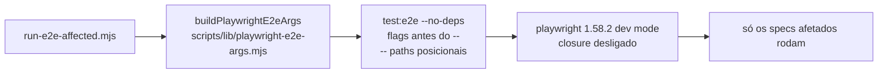

# Impl: S6-FOLLOWUP — CLI Playwright ignora filtros; `test:e2e:affected` roda a suíte completa

Status: em execução
Atualizado em: 2026-08-18
Issue: #58 (S6-FOLLOWUP, depends S6)
Intenção: docs/plans/s6-followup-playwright-filtros-cli-ignorados.md
Appetite restante: ~0,5 dia (herdado)

## Leitura da intenção

- **Outcome:** `pnpm test:e2e:affected` roda SÓ os specs afetados (contagem verificada); comandos de iteração locais documentados e funcionando.
- **O que NÃO negociar:** não mudar specs, CI (`--shard` ok), `gate:ci` nem trocar de runner.
- **O que reavaliar:** a hipótese de mecanismo do plano de intenção está **errada** — evidência empírica nova desta sessão (mesmo binário 1.58.2, config real e config mínima):

| Invocação (config REAL do repo)                        | Resultado medido                                                                       |
| ------------------------------------------------------ | -------------------------------------------------------------------------------------- |
| `--list admin` / `--list frontend` / `--list campaign` | 180 / 177 / 162 (frontend 15 + closure campaign 160 + setup 2; admin 180 = suíte toda) |
| `--list campaignHomeActions`                           | 20 (arquivo 18 + setup 2)                                                              |
| `--list pwa`                                           | 3 (campaign-pwa 1 + setup 2)                                                           |
| `--list seedParity`                                    | 1 (arquivo, sem setup)                                                                 |
| `--list zzz_nonexistente`                              | 0 ("No tests found" — filtro aplicado)                                                 |
| `--list frontend --no-deps` (dev)                      | **15** (só o arquivo!)                                                                 |
| `CI=1 --list frontend` (prod mode)                     | **15** (só o arquivo!)                                                                 |

- **Causa raiz (não é o parse de args):** o commander entrega os posicionais corretamente (`POSITIONALS: ['admin']` — probe) e o matcher de arquivo funciona (probe via `RegExp.prototype.test`: `/frontend/gi` casa só `frontend.e2e.spec.ts`). O que arrasta a suíte é o **closure de dependências entre projects no dev mode** (`setup ← campaign ← frontend ← admin` em `playwright.config.ts`): `collectProjectsAndTestFiles` filtra os arquivos por project, mas `buildProjectsClosure` repõe TODOS os arquivos de cada project-dependência. Filtrar um spec do `frontend` puxa `campaign` (160) + `setup` (2) — 177 no total com o próprio arquivo (15); filtrar `admin` puxa a suíte inteira. Em prod mode (`CI=1`/`E2E_PROD=1`) os projects não têm `dependencies` → filtro funciona (é por isso que o CI selecionado funciona).
- **`-g` e `--list` NÃO estão quebrados** (evidência do plano desatualizada): `-g alpha` filtra por título (verificado em config mínima); `--list` respeita posicionais e `-g` (verificado: `zzz` → 0). A "quebra" era o closure arrastando o resto. Sem pin/upgrade upstream necessário.

## Abordagem recomendada

**Opções consideradas:** A (inserir `--` antes dos paths — a correção do plano) | B (`--no-deps` + `--` + correção do passthrough; builder puro em `scripts/lib/` com unit test) | C (forçar prod mode `CI=1` no local) | D (remover `dependencies` do config dev)

**Recomendação: B** — ataca a causa real (closure) com o mecanismo oficial do playwright (`--no-deps`, exatamente o workaround que o plano já apontava), mantém a cadeia de prewarm do dev mode para a suíte completa, e segue o padrão do repo (lógica pura derivada em `scripts/lib/` unit-testada, como `test-affected-core.mjs`).

**Rejeitadas:**

- **A** — o `--` não muda nada no config real: commander já parseia posicionais sem `--`; a evidência do plano (11 testes com `--`) foi medida em config mínima. Só `--` não corrige o sintoma de 173 testes.
- **C** — `CI=1` muda `webServer` para `pnpm start` (exige build), `forbidOnly`, `retries` e o budget do servidor; é uma semântica de ambiente diferente, não um filtro.
- **D** — remove a garantia de ordenação de cold-compile do dev mode (comentário OPS34 no config); afeta a suíte completa dev, não só seleção.

### Componentes / mudanças

- **`buildPlaywrightE2eArgs` + `parsePassthroughArgs`** (`scripts/lib/playwright-e2e-args.mjs`, novo): puros e síncronos. `parsePassthroughArgs(argv)` remove só um `--` líder (pnpm já consumiu o dele; invocação direta pode deixar um) e repassa o resto **verbatim** — valores de flag como `-g grade` não são reclassificados. `buildPlaywrightE2eArgs({ scopeSpecPaths, passthroughArgs })` → `['test:e2e', ...passthroughArgs]` + `--no-deps` quando o run é filtrado (paths de escopo, positional no passthrough ou flag de filtro `--project`/`-g`/`--grep`/`--grep-invert`) + `-- <scopeSpecPaths>` quando há paths de escopo. `--no-deps` condicional: suíte completa mantém a cadeia OPS34.
- **`run-e2e-affected.mjs`**: (1) corrige o parse do passthrough — hoje `pnpm test:e2e:affected -- tests/x.spec.ts` perde o path (pnpm consome o `--`, argv fica sem `--` e `passthroughIndex === -1` → args descartados); novo contrato via `parsePassthroughArgs`. (2) usa o builder (remove o loop manual de paths).
- **`tests/unit/playwrightE2eArgs.unit.spec.ts`** (novo): pina o parse (invocação nua, pnpm `--`, `--` direto, flags+valores) e a forma dos args — `--no-deps` só em runs filtrados (path de escopo, positional ou flag de filtro), flags de runner (`--shard`, `--reporter`) preservam a cadeia, sem duplicar `--no-deps` explícito.
- **`test-affected-core.mjs`**: `scripts/run-e2e-affected.mjs` entra em `HIGH_RISK_EXACT` (+ invariant em `ciSkipInvariants.unit.spec.ts`) — é o espelho local do job e2e; um PR só de runner hoje escaparia do e2e (mode `none`).
- **Migration:** sem migration (nenhum schema/collection).
- **Access / Consent:** nenhum.
- **UI:** nenhuma.

### Dados → forma

N/A (sem dados novos).

## Fases verificáveis

1. **Tracer (builder + wiring)** — criar `scripts/lib/playwright-e2e-args.mjs`, unit spec, ligar em `run-e2e-affected.mjs`. Verificação: unit green; forma final confirmada com `--list` direto no binário do repo (já medida: `--no-deps` → 15/18).
2. **Docs** — comentário em `playwright.config.ts` (mecanismo do closure no dev mode + receitas de filtro: path posicional exige `--no-deps`; `--project=<família> --no-deps`; `-g`/`--list` funcionam, mas o closure arrasta dependências); header do `run-e2e-affected.mjs` (contrato de invocação corrigido); bullet curto em `AGENTS.md` (seção OPS59/test:e2e:affected); `docs/changelog/2026-08-18-s6-followup.md` + `pnpm changelog:build`.
3. **Gates** — `pnpm gate:fast` (lint, typecheck, test:unit); CI do PR roda e2e completo (o diff toca `playwright.config.ts` e `scripts/run-e2e-affected.mjs` — ambos em `HIGH_RISK_EXACT`; o runner entrou no set nesta entrega).

## Rabbit holes / Não escopo (engenharia)

- **Não investigar o hang do `pnpm test:e2e` neste worktree** (invocação via pnpm congela após a fase de install do pnpm; o binário direto com a mesma `NODE_OPTIONS` funciona e é o veículo de verificação local — pré-existente, ambiente, não o bug). Verificação de contagem local via binário direto + unit; CI é o verifier.
- Não reescrever o parse do commander do playwright, não fazer pin/upgrade de versão (`-g`/`--list` funcionam; evidenciado).
- Não tocar `.forgejo/workflows/*` nem `gate-ci.mjs`.
- Não "consertar" a evidência do plano de intenção retroativamente (a tabela do plano fica como está — docs histórica; o impl plan registra a divergência).

## Riscos e mitigação

- **Dev mode sem prewarm do setup em runs selecionados** (o `--no-deps` pula o spec de setup): cold-compile mais lento do primeiro spec em máquina carregada. Mitigação: prod mode (CI) já roda sem prewarm e é o caminho gateado; budget de 60s/240s do webServer permanece.
- **Flag com valor separado por espaço no passthrough** (`-g grade`): resolvido na implementação — passthrough verbatim (sem reclassificação flag/posicional); `-g grade` chega intacto ao playwright. Só sobra o caso do usuário passar um `--` interior explícito junto com paths de escopo gerados (o `--no-deps`/`--` gerados caem depois do `--` do usuário e viram padrão de arquivo → "No tests found", falha ruidosa; pnpm nunca produz isso).
- **Regression na suíte completa dev**: o `--no-deps` só entra nos args gerados pelo builder; `pnpm test:e2e` puro (sem args) não muda — a cadeia de deps dev permanece intacta.

## Aceite de engenharia

- [ ] Aceite de produto da intenção ainda coberto: `run-e2e-affected` roda só os specs afetados (unit + `--list` do binário com a forma final); comandos de iteração documentados; `--project=<família> --no-deps` documentado como receita manual.
- [ ] Invariantes AGENTS/engineering-standards: script puro em `scripts/lib/` (padrão test-affected-core); sem tocar CI/gate:ci/specs; identificadores em inglês, copy pt-BR.
- [ ] Testes de domínio previstos: unit do builder (args), nada de access/write path muda.
