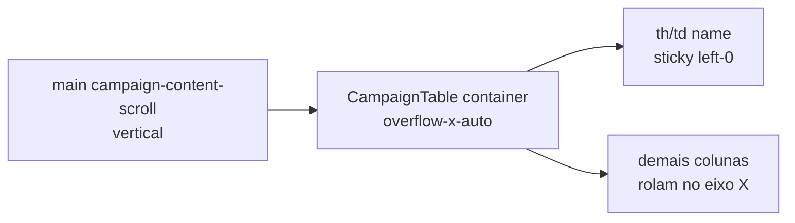

# Scroll horizontal + coluna Município fixa na lista de municípios

Status: entregue
Atualizado em: 2026-07-27
Item do roadmap: [docs/roadmap.md](../roadmap.md) (Trilha B, item B41)
Impeccable: B — encaixe em `CampaignTable` / `MunicipalityList` (desktop/tablet); sem rota nova
Appetite: ~0,5–0,75 dia eng; overflow-x + sticky left na 1ª coluna; reusa padrão de `TerritoryList`
Responsável: —

**Revisão 2026-07-26 (auditoria pré-implementação):** questão aberta fechada — **A** (classes na column def `name` só; sem `stickyColumnId` no `CampaignTable` até o 3º call site). O wrapper desktop já usa `className="hidden overflow-visible md:block"` (sobrescreve o `overflow-hidden` do `CampaignTable`, como Territory) — **manter** ao trocar só `containerClassName` para `overflow-x-auto`.

**Revisão 2026-07-27 (as-built):** `MunicipalityList` → `containerClassName="overflow-x-auto"`; coluna `name` com `sticky left-0 z-20` (head) / `z-[5]` (cell) + `min-w-56 bg-background` (espelho Territory; `max-w-52` removido no polish — conflitava com `min-w-56`). Mobile cards intactos. Critique: 0 P0; P1 width fix aplicado; edge fade permanece Adiado; sticky top+left layering igual Territory (header pode grudar no scroller interno do `overflow-x-auto` — aceitável). Gate: tsc/lint/format/knip(P3 pré-existente)/cycles/540 unit/413 int/build; Aikido 0 findings (Opengrep exit 2 conhecido).

## Design (Impeccable)

Âncoras: `PRODUCT.md` (Clarity under pressure; anti spreadsheet) / `DESIGN.md` · sistema de listas Pass 2 W1 · precedente **B21 ✓** (`TerritoryList`).

Na implementação: craft compacto → critique → polish.

Brief compacto:

- **Persona / contexto:** CG/assessor em iPad ou laptop estreito na fila de `/campanha/municipios` (10+ colunas staff); a tabela estoura a viewport e empurra o layout.
- **Job principal:** rolar as colunas na horizontal **dentro** da lista, mantendo o nome do município visível (âncora da linha).
- **Estratégia de cor:** Restrained — fundo opaco na célula sticky (`bg-background` / zebra se houver).
- **Edit where you see:** não muda o contrato dos controles; só o scroller.
- **Anti-goals:** voltar a um scroller vertical interno que quebre o header sticky do B16; esconder colunas à força (isso é **B17**); inventar data-grid.

## Dados → decisão → apresentação

Dados: N/A — chrome de tabela; as métricas já existentes não mudam de forma.

## Contexto

Em **B16 ✓**, a lista de municípios optou por `containerClassName="overflow-x-visible"` para o `sticky top-0` dos `th` resolver contra o scroller do `<main>` (`campaign-content-scroll`). Trade-off documentado no plano: _"uma tabela mais larga que a viewport passa a rolar junto com a página"_. Com as colunas de E8/E9/E10/B27, em tablet/desktop a tabela **estoura** a tela — pedido de produto 2026-07-26.

O precedente já existe na página de territórios (**B21 ✓**): [`TerritoryList.tsx`](../../src/components/campaign/municipality/TerritoryList.tsx) usa `overflow-x-auto` e [`TerritoryListColumns.tsx`](../../src/components/campaign/municipality/TerritoryListColumns.tsx) marca a 1ª coluna com `sticky left-0 z-20 … bg-background`. O plano de reorder ([reordenar-colunas-lista-municipios.md](reordenar-colunas-lista-municipios.md), fora de escopo) já travava _"Coluna Município fixa à esquerda"_ como âncora — este item entrega essa âncora **sem** DnD.

`CampaignTable` / `MunicipalityList` (trecho desktop `hidden md:block`) são o alvo. Cards mobile (`md:hidden`) ficam em **B42**.

## Objetivos

- Em `md+`, quando a tabela for mais larga que a viewport: **rolagem horizontal** no container da tabela (barra própria), sem estourar o shell.
- Coluna **Município** (nome) permanece **fixa à esquerda** durante o scroll horizontal (`sticky left-0` + fundo opaco + z-index acima das células que passam por baixo).
- Header sticky vertical (`top-0` do B16) **continua** funcionando, ou degrada de forma documentada e aceitável (ver Decisões).
- Popovers de célula (Tendência, Assessores, Sinal, votos) continuam portais Radix — não ficam clipados pelo `overflow-x-auto` (já é o motivo de vários planos preferirem Popover).
- Guardrails: sem migration/action/Consent; mobile cards inalterados neste item; **B17** (ocultar colunas) permanece complementar, não substituto.

## Decisões travadas

- **Scroller horizontal no container da tabela (`overflow-x-auto`), espelhando `TerritoryList`.** **Rejeitado:** (a) manter `overflow-x-visible` e rolar a página inteira (é o bug atual); (b) `min-w-0` + truncar todas as colunas (mata legibilidade da fila); (c) esperar **B17** esconder colunas (mitiga, não resolve tablet com muitas colunas default).
- **Sticky left só na coluna `name` (Município).** **Rejeitado:** sticky em Nome+2022 (complexidade de offsets `left`); sticky em todas as colunas "importantes".
- **Conviver sticky top (header) + sticky left (1ª coluna) + overflow-x no wrapper.** Canto superior-esquerdo precisa `z` maior e fundo opaco (padrão Territory). Se o header vertical e o scroll horizontal brigarem no browser X, preferir **horizontal correto + header que gruda no scroller interno** se necessário — medir no craft; não reinventar virtualização. **Rejeitado:** abandonar sticky top sem medir.
- **i18n/naming:** seam opcional `stickyFirstColumn` / classes na column def; sem copy nova.

## Questões em aberto

- **Extrair helper de classes sticky para `CampaignTable`?** **Resolvida (2026-07-26):** **A** — só classes nas column defs de municípios (Territory já tem as suas). **B** (`stickyColumnId` no `CampaignTable`) quando o 3º call site pedir o mesmo seam. _(assumido — validado na auditoria de implementação.)_

## Abordagem proposta

Componentes:

- **`MunicipalityList.tsx`**: trocar `containerClassName="overflow-x-visible"` → `overflow-x-auto` (ou equivalente); classes sticky na coluna nome em `municipalityListColumns`.
- **`CampaignTable.tsx`**: só se precisar de seam mínimo para `head`/`cell` sticky (senão classes via `className` da column).
- **Teste unit** de contrato (coluna name traz sticky; container overflow-x-auto) — pin como em B22/B23.
- **Migration:** nenhuma.

Depth check: copiar o padrão Territory, não um grid library.

## Dependências

- Soft: **B17** (menos colunas → menos scroll) — não bloqueia.
- Soft: **B38 ✓** (sidebar offcanvas em tablet) — já ajuda viewport; este item fecha o overflow restante.
- Nenhuma dura.

## Não escopo

- Redesign do card mobile / drawers → **B42**.
- Seletor de colunas → **B17**.
- Reorder DnD → fora de escopo ([reordenar-colunas…](reordenar-colunas-lista-municipios.md)).
- Sticky first column nas outras listas (lideranças/dobradinhas) — Adiado.

## Rabbit holes

- **Scroller vertical interno + sticky header.** Reverter o B16 inteiro. **Mitigação:** só `overflow-x`; vertical continua no `main`.
- **`position: sticky` dentro de `overflow` em Safari.** **Mitigação:** espelhar Territory (já em produção); testar iPad no critique.

## Adiado com gatilho

- **Sticky first column genérico no `CampaignTable`.** Revisitar no 3º call site (municípios + territórios + uma terceira).
- **Sombra/edge fade indicando mais colunas à direita.** Revisitar se critique acusar descoberta fraca do scroll (critique B41 2026-07-27 confirmou descoberta fraca — ainda Adiado até pedido de campo).
- **Tint de hover na célula sticky.** Territory parent rows usam `bg-background` sólido; revisitar no 3º call site sticky (ou se a mesa reclamar da coluna “morta” sob hover).

## Referências

- `docs/roadmap.md` (Trilha B · B41)
- `src/components/campaign/municipality/MunicipalityList.tsx`
- `src/components/campaign/municipality/TerritoryList.tsx` / `TerritoryListColumns.tsx`
- `src/components/campaign/shared/CampaignTable.tsx`
- `docs/plans/filtros-no-header-lista-municipios.md` (trade-off B16)
- `docs/plans/pagina-territorios-identidade.md` (B21)
- `PRODUCT.md` / `DESIGN.md`
