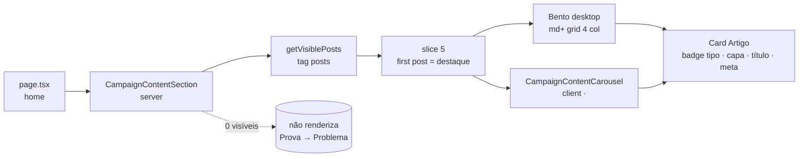

# Impl: S1 — Seção de conteúdos na home de campanha — Artigos

Status: aprovado
Atualizado em: 2026-08-17
Issue: #17
Intenção: docs/plans/secao-conteudos-home-artigos.md
Appetite restante: ~1 dia eng (herdado)

## Leitura da intenção

- **Outcome:** a home pública de campanha ganha, na 3ª posição (entre a prova social e "Por que essa eleição importa"), uma seção "Acompanhe de perto" com bento de 5 artigos (1 grande + 4 pequenos) no desktop e carrossel de 1 por tela no mobile (~390px), lendo o `post` collection com a visibilidade pública existente; sem artigos visíveis, a seção inteira é ocultada (Prova → Problema intacto).
- **O que NÃO negociar:** zero mudança de schema/migration/Consent; `isPostVisible` fail-closed (nada de bypass do `hidden` eleitoral); cache público = tag `posts` existente; o card inteiro é link para a rota canônica (`getPostCanonicalPath`), mesma aba; bento fixo sem paginação ("Ver artigos →" → `/artigos`); sem zona morta no vazio.
- **O que reavaliar:** a hipótese "estilos no bloco `[data-theme='campaign-site']` de styles.css" está certa, mas as seções atuais (`campaign-problem`/`campaign-flags`) usam altura fixa + posicionamento absoluto com geometria clampada do Penpot — o grid de conteúdo é alto e variável, então a seção nova usa flow normal com os mesmos tokens tipográficos/inset; e o carrossel mobile é navegação manual 1/tela com dots, job diferente do `CampaignCarousel` (auto-advance de destaques) — ver Decisão 2.

## Abordagem recomendada

**Opções consideradas:** A | B | C  
**Recomendação:** A — uma seção server (`CampaignContentSection`) que lê `getVisiblePosts()`, fatia 5 e renderiza o bento desktop, com um client component pequeno (`CampaignContentCarousel`) só para o modo mobile (estado de scroll/índice/dots); helpers puros novos em `src/utilities/posts.ts` (dono de formatação de post).  
**Rejeitadas:** B) estender `CampaignCarousel` com uma 3ª variant `content` — o contrato dele (variants `problem`/`flags`, auto-advance 4s, chips, geometria clampada pinada por e2e de swipe/geometria) não tem dots nem "1 de 5"; enfiar o modo manual 1/tela no mesmo módulo torna-o raso e arrisca os dois use-cases pinados; C) tudo client — o bento desktop não precisa de JS e ganharia re-render client.

### Componentes / mudanças

- **`CampaignContentSection`** (`src/components/CampaignContentSection.tsx`, server): dono da seção — eyebrow "Acompanhe de perto", título "A caminhada, em tempo real", subtítulo, link "Ver artigos →" (`/artigos`), bento desktop `hidden md:grid`, carrossel mobile `md:hidden`. `data-home-section="contents"` (convenção `proof`/`problem`/`flags`). Renderiza `null` quando `posts.length === 0`.
- **`CampaignContentCarousel`** (`src/components/CampaignContentCarousel.tsx`, client): snap-x mandatário 1/tela + dots-botões (`aria-current`) + contador "N de 5 · deslize para ver os próximos", `aria-roledescription="carrossel"`, `data-carousel="contents"`, respeita `prefers-reduced-motion`; padrões copiados do `CampaignCarousel` (scrollToItem/syncActiveItem, `scrollbar-hide`).
- **Card** (`CampaignArticleCard`, server-friendly, dentro do section file): badge de tipo (Decisão 3), capa `coverImage` (next/image fill, fallback sem imagem), título, meta "há X · categoria" (Decisão 4); `Link` para `getPostCanonicalPath(post)`, mesma aba. Variação `featured` (grande) só no bento.
- **`formatRelativePostDate`** (`src/utilities/posts.ts`): "hoje", "há 1 dia", "há 5 dias" via `Intl.RelativeTimeFormat('pt-BR')`; novo record `POST_TYPE_BADGE_LABELS` singular (`Notícia|Campanha|Artigo|Evento`).
- **`src/app/(frontend)/(home)/page.tsx`**: insere `<CampaignContentSection />` entre `campaign-proof` e `campaign-problem`; a página passa a depender da tag `posts` (ISR — comportamento já desenhado para consumidores de post; `afterChange` do Post/Tag já revalida).
- **`src/app/(frontend)/styles.css`**: classes da seção no bloco `[data-theme='campaign-site']` (tokens `--pt-red`, `--campaign-surface`, `--campaign-line`, `--campaign-content-inset`; tipografia `campaign-section-*`); flow normal, sem altura fixa.
- **Migration:** sem migration. **Access/Consent:** nenhum — leitura pública via helpers existentes.
- **UI:** Impeccable B — seção nova na home pública com wireframe aprovado; shape → craft → critique → polish no navegador.

### Dados → forma (se aplicável)

- Forma: meta = "há X · categoria" (data relativa + categoria do post) — dados já exibidos no site, nenhum contador inventado (restrição da intenção). Rejeitadas: data longa absoluta (`formatPostDate`) no card — o rascunho aprovado mostra recência, e "prova de atividade" pede relativa; contadores/visualizações — proibido pela intenção.

## Decisões de engenharia

1. **Carrossel mobile novo vs estender `CampaignCarousel`.**
   Opções: A) `CampaignContentCarousel` próprio | B) variant `content` no `CampaignCarousel`.
   Recomendação: A — jobs diferentes (auto-advance de destaques vs navegação manual 1/tela com indicador); o contrato atual é pinado por Penpot + e2e. Não é twin: é o mesmo padrão visual-mechanics, encapsulado por job.
   Alternativas rejeitadas: B porque muda contrato pinado e adiciona dots/counter/aria-current a um módulo que não os expõe.

2. **Badge do card.**
   Opções: A) label do tipo do post (Notícia/Campanha/Artigo/Evento) | B) "Artigo" fixo (literal do aceite).
   Recomendação: A — a intenção decidiu "os N mais recentes visíveis, qualquer tipo"; com o feed misto, um badge "Artigo" sobre uma notícia seria desonesto. O aceite foi escrito assumindo artigos; o badge de tipo cumpre o mesmo papel do badge de fonte do wireframe.
   Alternativas rejeitadas: B porque engana no feed misto (decisão A da intenção).
   → **Confirmar no gate** (divergência de leitura do aceite).

3. **Ocultação com 1–4 posts.**
   Opções: A) ocultar só com zero visíveis; bento/carrossel se adaptam | B) exigir os 5 para renderizar.
   Recomendação: A — zero é o fail-closed do aceite; com 1–4, mostrar o que existe (grid auto preenche; "1 de N" no carrossel).
   Alternativas rejeitadas: B porque esconderia conteúdo real da campanha no meio de funil.

4. **Meta relativa vs absoluta.**
   Opções: A) relativa ("há 1 dia · categoria") | B) `formatPostDate` longa.
   Recomendação: A — rascunho aprovado mostra relativa; gatilho de revisitação: trocar para absoluta é uma linha se a assessoria pedir.
   Alternativas rejeitadas: B porque foge do rascunho e da intenção de "atividade".

## Fases verificáveis

1. **Tracer (server + helpers):** `formatRelativePostDate` + `POST_TYPE_BADGE_LABELS` em `posts.ts` com unit tests; `CampaignContentSection` com bento desktop + `page.tsx` + CSS mínimo; e2e empty-state (seção ausente no estado default da suite) e full-state (cria posts via `getPayload` → revalida → asserts desktop). Gates parciais: tsc + unit.
2. **UI mobile:** `CampaignContentCarousel` (dots, contador, swipe) + CSS responsivo; e2e mobile (1/tela, swipe, "1 de 5", click-through para a página do artigo, post com tag `hidden` ausente — fail-closed); cleanup + revalidação no afterAll.
3. **Gates finais:** `pnpm gate:fast` (tsc, lint, format:check, knip, check:cycles), `pnpm test`, `pnpm build` local, e2e completo.

## Rabbit holes / Não escopo (engenharia)

- Não mexer na API de `getVisiblePosts` (limite/param) para otimizar 5 de ~39 docs — custo irrelevante, outros consumidores dependem do contrato.
- Não criar hooks de scroll-snap compartilhados ("DRY < 3 call sites").
- Não animar entrada da seção / parallax / prefetch de imagens (não escopo do wireframe).
- Sem "Ver todos" além do link `/artigos`; sem paginação; sem curadoria manual.
- YouTube/Instagram (S2/S3), share WhatsApp (S4): fora.
- Não tocar `CampaignCarousel`, `PostCard` (editorial), nem as geometrias clampadas das seções existentes.

## Ajustes pós-review (simplify, 2026-08-18)

- **A11y do carrossel:** foco + setas no `<ol>` (ArrowLeft/Right navegam), `inert` + `aria-hidden` nos slides inativos (saem do tab order/árvore a11y), `aria-live="polite"` no contador, dots com contraste ≥3:1 (`--campaign-muted`), `tabIndex` só com >1 item, `motion-reduce` corta o zoom da capa.
- **Label relativa vs ISR (testado e revertido):** a primeira resposta ao congelamento da label ("há 5 minutos" gravado no HTML estático) foi `export const revalidate = 300` na home — **medido em prod (Next 15.4): com `revalidate` temporal, `revalidateTag('posts')` deixa de regenerar a home (probe manual: `/artigos` convergia, a home ficava stale para sempre)** — o bust por tag é o contrato documentado do site, então o `revalidate` foi REMOVIDO e a solução virou threshold na formatação: relativa < 48h (drift limitado), data absoluta além (nunca mente congelada).
- **Fidelidade ao rascunho:** `gap-2` nos cards pequenos (gap-3 no featured), `mt-1` no header.
- **Spec e2e:** secret espelhado da env; polling POSITIVO do HTML da home até convergir pós-revalidate (ISR serve stale uma vez sob carga; DOM carregado não refresca); `about:blank` antes do cleanup (prefetch prod dos links apagados geraria 404 no guard); classe morta `.campaign-contents` removida; lock programático 700 ms (paridade com o irmão).
- **Decisões registradas (refusais):** (a) `formatRelativePostDate` não reusa `formatRelativeAge` (contratos divergentes: `numeric: 'auto'` → "anteontem" vs o "há 2 dias" do rascunho; `round` vs `floor`; fallback absoluto; futuro → "agora"; entrada string de post) — a função é pequena e os consumidores existentes do `formatRelativeAge` (bell/sinal/município) não podem mudar de output; (b) gutter da seção usa `px-5/8/10` + `max-w-[1160px]` em vez do `--campaign-content-inset` dos irmãos (layout flow do rascunho manda — o bento wide não cabe em inset de 180px); (c) "Ver artigos →" → `/artigos` lista só notícias com o feed misto — corte sancionado na intenção (rabbit hole "feed infinito"), link por tipo fica como opção futura.

## Riscos e mitigação

- **Home vira ISR (tag `posts`) em produção:** o build bota o estado atual; `afterChange` do Post/Tag já revalida; escrita direta (seed) segue o runbook de `POST /api/revalidate`. No e2e prod-mode, o teste full-state faz `POST /api/revalidate?tag=posts` antes do primeiro `goto` (REVALIDATE_SECRET novo no webServer env do playwright) e o empty-state roda antes — ordem no arquivo garante estado.
- **ISR serve stale uma vez após revalidate:** asserts usam `expect` com timeout/poll em vez de assert imediato.
- **Dois carrosséis na home (problem + contents):** seletores próprios (`data-carousel="contents"`), swipe e2e aponta ao track certo.
- **Seção em flow normal entre duas de altura fixa:** nenhum e2e existente mede posição absoluta de `problem` (verificado: os testes de geometria medem hero+proof e gaps relativos) — a inserção não quebra pinagem.
- **Falha do `getPayload` no spec (DB errado):** mesmo caminho do `campaignE2EFixtures` (config importado + `assertTestDatabase` já guarda o processo playwright).

## Aceite de engenharia

- [x] Aceite de produto da intenção ainda coberto (bento 1+4, carrossel 1/tela, fail-closed vazio, links canônicos)
- [x] Invariantes AGENTS/engineering-standards (sem migration/Consent/access; leitura via helpers com tag `posts`; identificadores em inglês, copy pt-BR)
- [x] Testes de domínio previstos: unit (`formatRelativePostDate`, labels) + e2e (empty-state, full-state desktop+mobile, fail-closed `hidden`, click-through, cleanup)
