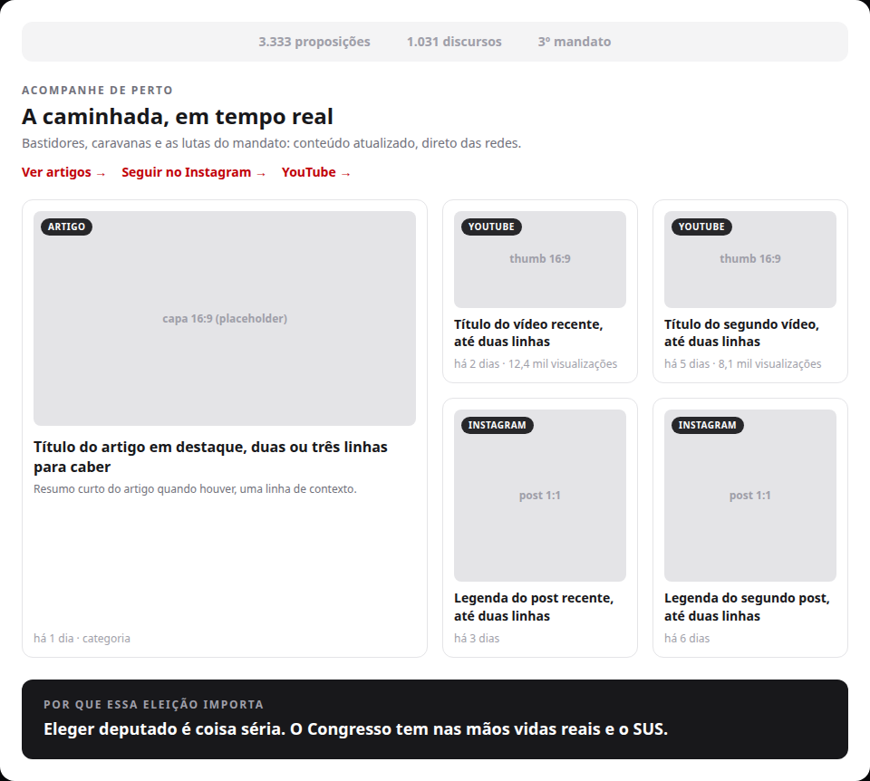
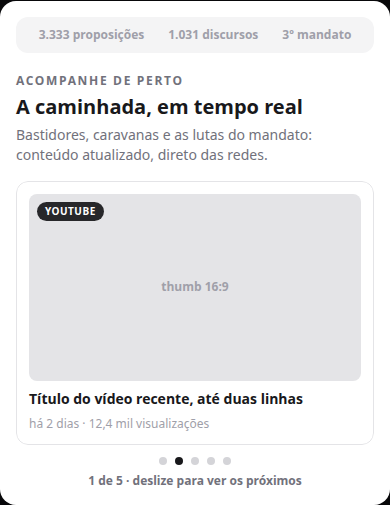

# Seção de conteúdos na home de campanha — Artigos (S1)

Status: registrado
Atualizado em: 2026-08-17
Issue: #17
Priority: P1
Model: composer-2.5
Impeccable: B — nova seção na home pública (3ª posição), padrão visual do wireframe já aprovado
Rascunho UI: docs/plans/secao-conteudos-home-ui-draft.html + PNGs embutidos abaixo
Appetite: ~1 dia eng; seção com cards de artigos reusando o sistema `post` existente
Responsável: —

## Intenção

A home pública de campanha (jorgesolla1313.com.br) não tem nenhuma zona de conteúdo atualizado: ela é estática entre o hero e o CTA. Na reta final (eleição 04/10), as coisas acontecem rápido e o site precisa mostrar atividade. O wireframe já tem a seção "Acompanhe de perto" (board de conteúdo) aprovada — ela só não foi implementada. Este item é a primeira fatia da seção, com **artigos** do site (a fonte que já existe no Teqo); YouTube e Instagram entram nas fatias seguintes (S2/S3), em série, para a estrutura não divergir.

## Persona e fluxo

- **Persona / contexto:** visitante da home de campanha (eleitor, liderança, imprensa) — celular na maioria dos casos, chegou pelo WhatsApp/redes, no meio de funil.
- **Job principal:** ver que a campanha está viva agora (prova de atividade) e ler um conteúdo recente sem sair do clima da página.
- **Fluxo desejado:** rola a home → encontra a seção (3ª, logo antes de "Por que essa eleição importa") → vê cards de artigos recentes com badge "Artigo" → clica e vai para a página do artigo (rota canônica do post) → pode voltar e continuar na home.
- **Anti-goals de produto:** a seção NÃO vira um feed infinito; NÃO compete com o CTA primário; NÃO mostra conteúdo invisível/oculto (mecanismo `hidden`/`isPostVisible` segue valendo — fail-closed).

### Esboço de fluxo (B)

```text
[home: hero → prova social] → [SEÇÃO: eyebrow + título + cards artigos] → [clique no card]
→ [página do artigo: /[type]/[category]/[slug]] → [voltar à home]
```

### Rascunho UI (B)





Fonte iterável: [`secao-conteudos-home-ui-draft.html`](secao-conteudos-home-ui-draft.html). Nesta fatia S1, o bento mostra só cards "Artigo" (a cena `desktop` já ilustra a posição final com as 3 fontes para referência).

## Objetivo e aceite

- A home pública exibe uma nova seção na 3ª posição (entre a prova social e "Por que essa eleição importa"), com eyebrow/título/subtitulo e links de acompanhar conforme o wireframe.
- A seção lista artigos recentes visíveis do sistema `post` existente (mesma regra de visibilidade do site: `isPostVisible` fail-closed — conteúdo oculto por tag `hidden` não aparece).
- Cada card mostra: badge "Artigo", imagem de capa, título e meta (data/categoria); o card inteiro é um link para a página canônica do artigo (`getPostCanonicalPath`), abrindo na mesma aba.
- Layout: bento 1 card grande + 4 pequenos no desktop; **no mobile (~390px) a seção vira um carrossel de 1 conteúdo por tela** (desliza entre os cards, com indicador de página), sem quebrar o fluxo da página.
- Se não houver artigos visíveis: a seção inteira é ocultada (nada de zona morta), mantendo Prova → "Por que essa eleição importa" (cena `vazio` do rascunho).
- Zero mudança em schema/migration/Consent: artigos leem o `post` collection com os helpers de cache existentes (`getVisiblePosts` / tag `posts`).

## Dados (intenção)

- **Vou apresentar dados?** Sim, superfície neste item — mas são **conteúdos** (artigos), não métricas.
- **Decisões desbloqueadas:** o visitante decide qual artigo ler (clique); nenhum número novo de campanha é inventado aqui.
- **Forma:** *adiada ao plano de implementação* — restrição de produto: meta = data/categoria do post (já exibidas no site), sem contadores inventados.

## Direção no codebase (hipótese)

- **Áreas prováveis:** `src/app/(frontend)/(home)/page.tsx` (inserir a seção entre prova e problema), novo componente de seção/card em `src/components/`, estilos no bloco `[data-theme='campaign-site']` de `src/app/(frontend)/styles.css` (padrão das seções atuais), leitura via `src/utilities/posts.ts` (`getVisiblePosts`, `getPostCanonicalPath`, `formatPostDate`).
- **Precedente a olhar:** wireframe `docs/campanha/wireframe-solla-1313.html` (seção 7, board IG+YT — o design aprovado a adaptar para artigos); seções atuais da home (`campaign-problem`, `campaign-flags`) para o ritmo visual; `src/components/PostCard.tsx` e a rota `/artigos` para o formato de card de post existente.
- **Risco de acoplamento:** a seção respeita o mecanismo eleitoral `hidden`/`isPostVisible` (nada de bypass); o cache público é o tag `posts` existente (revalidação já cobre); não duplicar o conceito de "pessoa" nem criar collection nova.

## Dependências

- Nenhuma (primeira fatia). S2 (YouTube) e S3 (Instagram) dependem desta.
- Soft: `docs/campanha/plano-site-campanha-2026.md` — decisões de produto do site (board §4.2, posição discutida na §3).

## Fora de escopo

- YouTube e Instagram na seção → S2 e S3 (deste lote).
- Compartilhamento WhatsApp → S4 (issue separada).
- Player de vídeo inline, lightbox, qualquer embed de rede no load (decisão do plano-site: clique abre na plataforma; sem iframe no carregamento).
- Curadoria manual do feed (é automático pelo mais recente), configuração no admin, "pausar feed" (kill switch) → S2/S3.
- Redesign da home, alteração de CTA primário, outras seções do wireframe.

## Rabbit holes de produto

- **Feed infinito / paginação.** Se alguém "só completar": a seção vira uma lista sem fim competindo com o CTA. **Corte neste item:** bento fixo (1 + 4), sem paginação; link "Ver artigos →" aponta para a rota `/artigos` existente.
- **Segunda fonte de "artigos" paralela ao `post`.** Se alguém "só completar": duplica o sistema de notícias. **Corte:** só o `post` collection com a visibilidade pública existente.
- **Vazio honesto.** A seção oculta quando sem conteúdo — não exibe placeholder de "em breve" queimando o meio de funil.

## Questões em aberto (produto)

- **Posição exata da seção?** **Opções:** A) 3ª seção, logo antes de "Por que essa eleição importa" (recomendação — traz conteúdo atualizado pra cima; decisão do cliente nesta sessão) | B) posição 7 do wireframe (após "Quem é Jorge Solla"). **Recomendação:** A. _(decidido — A)_
- **Quais artigos entram no bento?** **Opções:** A) os N mais recentes visíveis, qualquer tipo de post (noticia/campanha/artigo/evento) | B) só `noticia` (igual à rota `/artigos`). **Recomendação:** A — a home de campanha agrega tudo que estiver visível; o filtro por tipo fica barato depois se a assessoria pedir. _(decidido — A)_
- **Mobile: 1 conteúdo por tela?** **Opções:** A) carrossel de 1 card por vez (decisão do cliente nesta sessão) | B) empilhado. **Recomendação:** A. _(decidido — A)_

## Referências

- GitHub Issue #17
- Rascunho UI (gate): `docs/plans/secao-conteudos-home-ui-draft.html` + PNGs acima
- Wireframe aprovado: `docs/campanha/wireframe-solla-1313.html` (seção 7 "Acompanhe de perto")
- Plano geral do site: `docs/campanha/plano-site-campanha-2026.md` (§4.2 engenharia do board, §3 posições)
- `src/utilities/posts.ts` — visibilidade/cache/rotas canônicas de artigos
- `src/app/(frontend)/(home)/page.tsx` — onde a seção entra
- `AGENTS.md` — Posts & Tags (visibilidade `hidden` fail-closed, cache `posts`)
