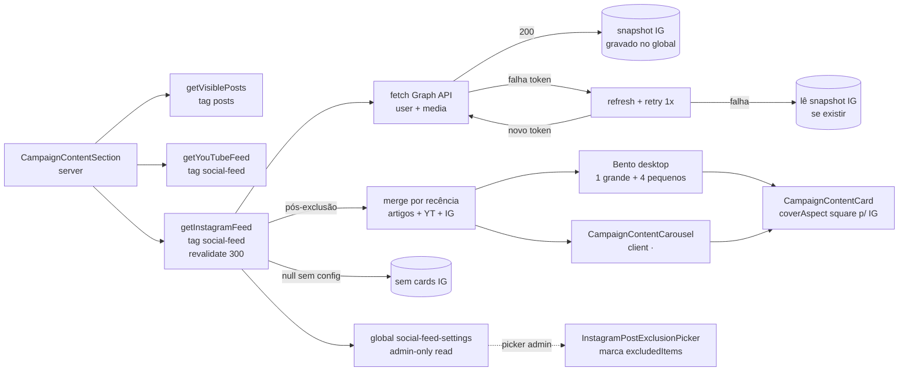

# Impl: S3 — Seção de conteúdos na home de campanha — Instagram

Status: aprovado
Atualizado em: 2026-08-18
Issue: #20
Intenção: docs/plans/secao-conteudos-home-instagram.md
Appetite restante: ~1–2 dias eng (herdado)

## Leitura da intenção

- **Outcome:** a seção "Acompanhe de perto" (S1 artigos + S2 YouTube) passa a incluir os posts recentes do Instagram oficial (`@depjorgesolla`) via leitura servidor-side da Instagram Graph API (token long-lived com refresh, perfil Business/Creator) com cache — cards 1:1 com badge "Instagram", legenda (título) e data; clique abre o post **na plataforma** (nova aba, `noopener`); **exclusão por item é o requisito nº 1** (posts de grade que não são conteúdo real de campanha) e a interface de exclusão (admin vê os últimos posts com thumbnail + marca "não exibir") é parte desta fatia; fail-closed com último snapshot; sem credencial IG → cards IG simplesmente não aparecem (a seção vive com artigos + YouTube); kill switch `enabled` vale para o board como um todo; mobile segue o carrossel 1/tela.
- **O que NÃO negociar:** sem embed/script do Instagram no load (LCP); nenhuma chave no cliente; clique na plataforma (sem lightbox); exclusão por item (o bento pula para o próximo elegível); fail-closed silencioso; zero mudança em schema de conteúdo público (migrações não destrutivas no máximo); convenções do repo (identificadores em inglês, admin em pt, cache por tag).
- **O que reavaliar:** a S2 já entregou quase toda a mecânica — global `SocialFeedSettings` com `excludedItems` já tipado para `instagram`, loader irmão com snapshot persistido via SQL direto, card generalizado com `external`, merge por recência na seção. A S3 **não duplica** nada disso: estende a global (campos IG + snapshot IG + picker de exclusão), cria o loader irmão `instagramFeed.ts` e o **picker de exclusão no admin** (única superfície nova de verdade). O rascunho UI aprovado desenha o card IG **1:1** (`aspect-square`) — o `CampaignContentCard` atual é `aspect-video` hardcoded → o card ganha variante de capa (Decisão 3). O plano-site §4.2 já nomeia a config (token + user ID na global `SocialFeedSettings`) e o "refresh automático ~60 dias" (Decisão 2).

## Abordagem recomendada

**Opções consideradas:** A | B | C
**Recomendação:** A — um loader irmão `getInstagramFeed()` em `src/utilities/instagramFeed.ts` (mesmo esqueleto do `youtubeFeed.ts`: parsers/format puros + fetch da Graph API + `unstable_cache` tag `social-feed` + `revalidate: 300` + snapshot cru persistido por SQL direto, exclusões aplicadas na leitura), campos IG na global existente `social-feed-settings` (sem global nova), card IG com `coverAspect: 'square'` (1:1 do rascunho), e o picker de exclusão como **primeiro componente custom do admin do repo** (`src/components/admin/InstagramPostExclusionPicker.tsx`, client, attach num campo `ui` da global — lista os posts do snapshot com toggle que escreve em `excludedItems`).
**Rejeitadas:** B) global/loader separado por plataforma (`instagramSettings` própria) — viola o plano-site §4.2 que nomeia UMA global `SocialFeedSettings` e espalha o mecanismo de exclusão que a S2 já unificou; C) embed de feed do Instagram (script da plataforma) — proibido pelo plano-site §4.2 (LCP do mobile) e pela intenção.

### Componentes / mudanças

- **Global `SocialFeedSettings`** (`src/globals/SocialFeedSettings.ts`, estender): `instagramEnabled` (checkbox "Instagram ativo", default true), `instagramAccessToken` (text "Token de acesso (Instagram Graph API)", admin.description com nota do tipo de token + refresh), `instagramUserId` (text "ID do usuário (conta Business/Creator)"), `instagramMaxItems` (number "Máximo de posts", default 3, min 1, max 5), `instagramFeedSnapshot` (json, `admin.hidden: true`), `instagramExclusionPicker` (campo `ui` com `admin.components.Field` → picker client; sem valor persistido). `excludedItems` já cobre `platform: 'instagram'` — sem migration para o mecanismo de exclusão. **Migration:** `pnpm migrate:create add_instagram_social_feed_fields` (ALTER TABLE ADD COLUMN, não destrutiva; revisar o DDL gerado — o `migrate:create` da S2 regenerou drift de migrations hand-written sem sidecar JSON, a S2 editou o arquivo para conter só o DDL da feature).
- **`src/utilities/instagramFeed.ts`** (novo, `server-only`): `InstagramPost` (`{ id, caption: string | null, mediaType, permalink, thumbnailUrl?, timestamp }`); puros exportados p/ unit: `parseInstagramMediaResponse` (item sem `permalink` é dropado — não dá para abrir na plataforma; `caption` null é mantido — post de grade não tem legenda e deve aparecer para exclusão manual; carrossel resolve thumbnail do primeiro `children`), `pickInstagramThumbnail` (IMAGE → `media_url`; VIDEO/REEL → `thumbnail_url`; CAROUSEL_ALBUM → 1º child com `media_url ?? thumbnail_url`; sem thumbnail → undefined e o card renderiza sem capa — já suportado), `eligibleInstagramPosts(posts, excludedIds, maxItems)`, `loadInstagramFeed({ accessToken, userId, maxResults, fetchImpl, baseUrl })` — `GET /{ig-user-id}/media?fields=id,caption,media_type,media_url,permalink,thumbnail_url,timestamp,children{media_url,thumbnail_url}&limit&access_token` + `GET /{ig-user-id}?fields=username`; em falha de autenticação tenta **refresh + retry 1x** (Decisão 2) e retorna `{ posts, username, refreshedAccessToken? }`; throw em não-2xx/rede/JSON inválido; `baseUrl` default `https://graph.instagram.com`, override `INSTAGRAM_API_BASE_URL`. `getInstagramFeed()` = `unstable_cache` tag `['social-feed']` + `revalidate: 300` — lê a global (Local API), `null` quando desconfigurado/desligado, grava `instagramFeedSnapshot` (`{ username, posts }` cru, pré-exclusão) em 200, persiste token renovado via SQL direto (mesmo padrão do snapshot da S2), lê o snapshot + aplica exclusões quando o fetch falha; sem snapshot → `{ username: null, posts: [] }`.
- **`CampaignContentCard`** (`src/components/CampaignContentCard.tsx`, estender): `CampaignContentCardData` ganha `coverAspect?: 'video' | 'square'` (default `'video'` — S1/S2 intactos); IG passa `coverAspect: 'square'` (1:1 do rascunho); nada mais muda.
- **`CampaignContentSection`**: mescla `getVisiblePosts()` + `getYouTubeFeed()` + `getInstagramFeed()` por recência, fatia 5, `[featured, ...rest]`; card IG: badge "Instagram", título = `caption` (fallback "Publicação no Instagram" quando null — post de grade sem legenda precisa aparecer para exclusão manual), meta = `formatRelativePostDate(timestamp)` (só data — o rascunho não mostra contador para IG), `external: true`, href = `permalink` da API; link do header "Seguir no Instagram →" (`https://www.instagram.com/<username>`, nova aba) renderizado quando o feed retorna `username` — com API fora e sem snapshot o link some junto com os cards (username é derivado da API, não configurado — Decisão 5).
- **`src/components/admin/InstagramPostExclusionPicker.tsx`** (novo, `'use client'`): lista os posts do `instagramFeedSnapshot` (lido via `useAllFormFields`) com thumbnail (`` — admin não passa pelo optimizer), legenda truncada, data relativa e toggle "Não exibir" que adiciona/remove `{ platform: 'instagram', itemId: id, reason? }` em `excludedItems` (via `useField({ path: 'excludedItems' })` + `setModified(true)`); estado vazio honesto ("Nenhum post recente — configure o token e o ID; os posts aparecem aqui após a primeira sincronização"); razão como campo de texto inline opcional. Registrado no importmap (`pnpm generate:importmap` — primeiro componente custom do repo).
- **`next.config.mjs`**: `images.remotePatterns` ganha `https://*.cdninstagram.com/**` (URLs de mídia da Graph API; o pattern `localhost/thumbs` da S2 já cobre o stub).
- **`playwright.config.ts`**: `webServer` ganha mais um entry — `tests/e2e/instagram-stub.mjs` (porta = dev + 2000; ver Decisão 6) + env `INSTAGRAM_API_BASE_URL` no entry do dev server.
- **`tests/helpers/youtubeStub.ts` → `tests/helpers/socialStub.ts`** (rename + extensão): `youtubeStubUrlFor(baseURL)` (+1000) e `instagramStubUrlFor(baseURL)` (+2000) — a derivação da porta continua tendo UMA spelling (a S2 registrou o "+1000 único" como P2 absorvido; com duas plataformas o módulo é o dono, não um twin).
- **Migration:** `add_instagram_social_feed_fields` (não destrutiva). **Access/Consent:** nenhum consent (metadados públicos de fonte externa, como posts/YouTube); global permanece read/update admin-only (token nunca vaza via REST).
- **UI:** Impeccable B — estende a seção S1/S2 com cards IG (mesma estrutura, badge "Instagram"); shape → craft → critique → polish no navegador (desktop + 390px).

### Dados → forma (se aplicável)

- Forma: **nada derivado da campanha** (restrição da intenção) — legenda (título), data relativa (`formatRelativePostDate`, paridade S1/S2) e thumbnail 1:1; sem contadores (IG não entrega views de graça no media edge; o rascunho não mostra). Rejeitadas: `media_url` do vídeo/reel como capa (entrega o arquivo mp4 ao optimizer — thumbnail_url é o formato certo), contagem de likes via extra endpoint (métrica inventada / custo de API sem aceite).

## Decisões de engenharia

1. **Loader irmão do youtubeFeed.**
   Opções: A) `src/utilities/instagramFeed.ts` espelhando `youtubeFeed.ts` (puros + fetch + cache + snapshot) | B) generalizar um `socialFeed.ts` único com adapter por plataforma | C) fetch inline no componente.
   Recomendação: A — as duas APIs têm contratos diferentes o bastante (URLs, campos, thumbnails, refresh) que um adapter único viraria camada de indireção sem volatilidade real (rabbit hole Teqo); o "irmão" é o precedente declarado pela S2 ("loader irmão de posts.ts"). O conhecimento compartilhado (exclusão, snapshot, kill switch) já está na global + nos helpers, não precisa de classe.
   Alternativas rejeitadas: B indireção sem call sites suficientes; C quebra cache/fail-closed e mistura fetch na UI.

2. **Refresh de token automático.**
   Opções: A) refresh-on-failure: no erro de autenticação do `/media`, uma chamada `GET /refresh_access_token?grant_type=ig_refresh_token&access_token=…`, persiste o token renovado (SQL direto, padrão snapshot) e retry 1x | B) refresh a cada fetch bem-sucedido (token sempre jovem) | C) sem refresh — rotação manual do admin.
   Recomendação: A — satisfaz "token long-lived com refresh automático ~60 dias" do plano-site sem painel de OAuth (corte do rabbit hole da intenção) e sem custo por miss; a falha de refresh cai no fail-closed (snapshot) intacto. Nota honesta no campo do admin: o refresh endpoint da Graph API só renova tokens emitidos via **Instagram Login** (não os page tokens de Facebook Login) — para token business, o refresh falha → snapshot + rotação manual (documentado; setup da Meta é da assessoria, fora do escopo).
   Alternativas rejeitadas: B dobra chamadas + 1 write de DB por miss (5 min) sem ganho de correção (o refresh-on-failure cobre o caso real: token expirou); C contradiz o plano-site.

3. **Formato do card IG (1:1).**
   Opções: A) `coverAspect?: 'video' | 'square'` no `CampaignContentCardData` (default `'video'`) | B) card IG sempre 16:9 (uniformidade com YT) | C) componente de card separado para IG.
   Recomendação: A — o rascunho UI aprovado desenha o IG 1:1 (`aspect-square`, "post 1:1"); o default `'video'` preserva S1/S2 byte a byte; um campo opcional no data é mais barato que um segundo card (aceite da S1: card único por fonte). O grande do bento pode cair num IG (merge por recência) — um quadrado no slot grande é o desenho do rascunho, sem regra especial.
   Alternativas rejeitadas: B trai o rascunho aprovado; C duplica o card (viola o aceite da S1).

4. **Picker de exclusão no admin (requisito nº 1 da intenção).**
   Opções: A) campo `ui` na global com componente client custom (lista do snapshot + toggle em `excludedItems`) | B) manter o array `excludedItems` cru (admin copia/cola IDs) | C) campo por plataforma (`instagramExcludedIds`) com picker próprio.
   Recomendação: A — a intenção decide explicitamente "o admin vê a lista dos últimos posts (thumbnail + ID) e marca os que não devem aparecer; a interface de exclusão é parte desta fatia" (marcar por ID puro é inviável para a assessoria); o snapshot já é persistido pelo loader (a S2 deixou o mecanismo pronto — `excludedItems` já tem `platform: 'instagram'`), então o picker é leitura do snapshot + escrita no array, sem migration e sem endpoint novo.
   Alternativas rejeitadas: B falha o aceite; C espalha o mecanismo que a S2 unificou e força migration.
   → Risco: é o primeiro `admin.components` do repo; se `type: 'ui'` não suportar `admin.components.Field` nesta versão (3.82), fallback documentado: campo `json` `admin.hidden: false` com o mesmo componente attachado — verificar no Riscos.

5. **Link do header "Seguir no Instagram →".**
   Opções: A) derivar o username da API (`GET /{ig-user-id}?fields=username`, 1 chamada por miss, cacheado) e renderizar o link só quando o feed devolve username | B) campo `instagramUsername` na config | C) sem link de perfil até a S4.
   Recomendação: A — o rascunho UI E o wireframe usam exatamente "Seguir no Instagram →" (copy aprovada; nota: a S2 usou "YouTube →" curto — o IG segue a copy do rascunho, divergência de copy documentada); derivar o username evita mais um campo que a assessoria preenche; com API fora e sem snapshot o link some junto com os cards (sem username não há URL honesta — divergência menor do comportamento da S2, onde o link "YouTube →" sobrevive à falha porque o channelId é configurado).
   Alternativas rejeitadas: B campo redundante com o dado que a API entrega; C deixa o perfil sem porta de entrada quando os cards somem (anti-goal).

6. **Test seam do fetch IG.**
   Opções: A) stub HTTP node irmão (`tests/e2e/instagram-stub.mjs`, porta dev+2000) + `INSTAGRAM_API_BASE_URL` no webServer + `fetchImpl` nas units | B) generalizar o stub da S2 num processo único multi-plataforma | C) interceptação do Playwright no browser.
   Recomendação: A — espelha o precedente aprovado da S2 (stub node sem dependências: `/media`, `/user`, `/__stub/health`, `/__stub/state` ok|fail, thumbnails locais em `/thumbs/<id>.jpg` já cobertas pelo remotePattern localhost); o offset +2000 não colide com o +1000 do YouTube nem com dev servers (3100–4099).
   Alternativas rejeitadas: B acopla as fixtures das duas plataformas num processo só sem ganho; C não alcança fetch server-side (mesma lição da S2).
   → A derivação da porta vive UMA vez: `tests/helpers/socialStub.ts` (rename de `youtubeStub.ts`, Decisão 7 da S2 mantida).

## Fases verificáveis

1. **Schema + loader** (~metade do appetite): campos IG na global + `pnpm migrate:create add_instagram_social_feed_fields` (revisar DDL gerado — precedente S2 de drift) + `pnpm migrate` local + `pnpm generate:types`; `instagramFeed.ts` (puros + fetch + refresh + cache + snapshot); unit tests (`parseInstagramMediaResponse` com caption null/carrossel/item sem permalink, `pickInstagramThumbnail` por media_type, `eligibleInstagramPosts`, `loadInstagramFeed` com `fetchImpl` fake cobrindo ok/falha/malformado/refresh-retry). Gates parciais: tsc + unit.
2. **UI + admin picker** (restante): `coverAspect` no card; merge IG na seção + link "Seguir no Instagram →"; `next.config` (`*.cdninstagram.com`); `InstagramPostExclusionPicker` + importmap; estender o spec de convenções (pin `instagramFeed.ts`). Verificação manual no admin (a global com snapshot mostra o picker; toggle grava `excludedItems`).
3. **e2e + gates finais**: stub IG + helper de porta (`socialStub.ts`) + webServer; no describe serial da seção: (a) full-state IG — settings + stub ok + 1 artigo + 4 posts (o mais novo EXCLUÍDO → o grande pula para o elegível), asserts: badge "Instagram", grande = post elegível mais recente com href = permalink + `target=_blank` + `rel=noopener`, meta "há X", título = legenda E fallback "Publicação no Instagram" no post sem legenda (post de grade entra no automático — aceite), excluído ausente, "Seguir no Instagram →" com href `instagram.com/<username>` + target blank, carrossel mobile 1/tela com IG; (b) fail-closed sem snapshot — stub fail → cards E link IG ausentes, seção viva com artigo; (c) snapshot — stub ok → cards; stub fail + settings edit (maxItems 2, snapshot omitido) → cards persistem re-filtrados; (d) kill switch — estender o teste existente com IG configurado (`enabled=false` → cards E link IG somem, artigos vivem); (e) smoke do picker no `admin.e2e.spec.ts` (abre a global, vê os posts do snapshot, marca um, salva, verifica `excludedItems` via REST). Cleanup: reset da global (incl. campos IG) + stub ok + revalidate + polling positivo (padrão S2). Polish no navegador (desktop + 390px). Gates: `pnpm gate:fast`, `pnpm test`, `pnpm build` local, e2e dev (`pnpm test:e2e:affected`? — e2e roda uma vez no CI; local opcional) + changelog `docs/changelog/2026-08-18-s3.md` + `pnpm changelog:build`; AGENTS.md (allowlist `social-feed` já documentada — ajustar a menção "YouTube" para o board YT+IG).

## Rabbit holes / Não escopo (engenharia)

- Não paginar o feed IG (1ª página basta; se o admin excluir mais que o headroom, o board mostra menos cards IG — documentado no campo `instagramMaxItems`).
- Não buscar stories, DMs, estatísticas, hashtags, outras contas, mix por tag (pendência §5 do plano-site é decisão da assessoria — o corte é A + exclusão por item, já decidido na intenção).
- Não tocar no bug #40 (validação do `itemId` com `data.platform` sempre undefined) — débito registrado da S2, fora do escopo; o picker escreve IDs válidos de qualquer forma.
- Não criar global/endpoint/rota nova além do componente admin; sem lightbox/embed; sem player inline.
- Não mudar a API de `getVisiblePosts` nem o merge da S2 (artigos+YT intactos quando IG off).

## Riscos e mitigação

- **Primeiro componente admin custom do repo.** `type: 'ui'` + `admin.components.Field` é o caminho canônico do Payload 3; se a versão 3.82 reclamar, fallback: campo `json` com o mesmo componente (o importmap é regenerado de qualquer forma — `pnpm generate:importmap`); validação cedo na fase 2 com o smoke e2e do admin.
- **Token business vs IG Login (refresh).** O refresh endpoint só renova tokens de Instagram Login; para page token business, o refresh falha → snapshot (fail-closed) e o admin rotaciona manualmente — nota no `admin.description` do campo + risco anotado (setup Meta é da assessoria).
- **CDN do Instagram no optimizer.** `scontent*.cdninstagram.com` é wildcard e pode trocar de host — remotePattern `https://*.cdninstagram.com/**` cobre os hosts atuais; se a Meta mudar o host, é 1 linha no `next.config` (anotado no campo admin não é necessário — risco de produção baixo, impacto visual limitado).
- **e2e serial do describe cresce.** 4 testes novos + extensão do kill switch; orçamento 12s de polling (padrão S2) mantido; reset da global no beforeAll inclui os campos IG (senão o estado vazio deixa de ser determinístico).
- **Escrever o token renovado em render.** 1 UPDATE por refresh (raro — só em falha de autenticação), SQL direto sem hooks (mesmo padrão/precondição do snapshot da S2).
- **Home dependente de mais um fetch.** 2 chamadas IG por miss (user + media) ≈ 24/h no pior caso — folga enorme contra o rate limit de 200/h; cache `revalidate: 300` igual ao YT.

## Aceite de engenharia

- [ ] Aceite de produto da intenção ainda coberto (cards 1:1 com badge/legenda/data, clique na plataforma com noopener, exclusão por item com picker no admin, fail-closed com snapshot, kill switch, sem credencial → nada de IG, mobile 1/tela, link "Seguir no Instagram →")
- [ ] Invariantes AGENTS/engineering-standards (migration não destrutiva; sem consent novo; identificadores em inglês; copy/admin em pt; cache por tag `social-feed`; access admin-only na config com segredo; revalidação via `afterChange` da global já cobre)
- [ ] Testes de domínio previstos: unit (parsers, thumbnail por media_type, eligibility, fetch + refresh com fetchImpl) + e2e (full-state IG com exclusão e fallback de legenda, fail-closed sem snapshot, snapshot persistente, kill switch estendido, smoke do picker no admin)
