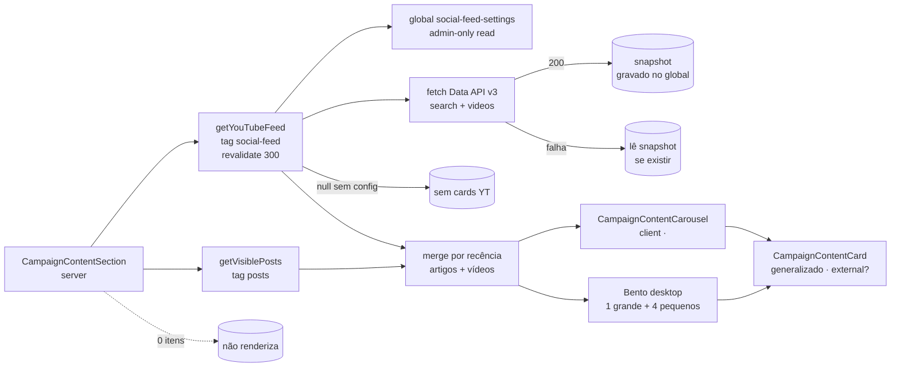

# Impl: S2 — Seção de conteúdos na home de campanha — YouTube

Status: aprovado
Atualizado em: 2026-08-18
Issue: #18
Intenção: docs/plans/secao-conteudos-home-youtube.md
Appetite restante: ~1–2 dias eng (herdado)

## Leitura da intenção

- **Outcome:** a seção "Acompanhe de perto" (S1) passa a incluir os vídeos mais recentes do canal oficial (`@JorgeSollaDep`) via leitura servidor-side da Data API v3 com cache — card grande = último vídeo elegível (16:9, badge "YouTube", título, data relativa e visualizações no formato da plataforma), pequenos = próximos; clique abre o vídeo na plataforma em nova aba (`noopener`); admin exclui vídeos específicos por ID; API fora → último snapshot mantido (sem snapshot, os cards YT somem e a seção vive com artigos — a página nunca quebra); sem chave configurada, nada de YT aparece; mobile segue o carrossel 1/tela da S1.
- **O que NÃO negociar:** sem iframe/embed no load; nenhuma chave no cliente; clique na plataforma (sem lightbox/player inline); exclusão por item (o board pula para o próximo elegível); fail-closed silencioso (nunca erro visível); kill switch "pausar feed" do plano-site; zero mudança em schema de conteúdo público (migrações não destrutivas no máximo); convenções do repo (identificadores em inglês, admin em pt, cache por tag).
- **O que reavaliar:** a hipótese "mesmo componente de seção/card de S1" está certa e a S1 já entregou `CampaignContentSection` + `CampaignArticleCard` + `CampaignContentCarousel` — a generalização do card é um **rename com extensão** (Decisão 5), não código novo; o plano-site §4.2 já nomeia a config no admin (`SocialFeedSettings` global) — segue o nome; "card grande = último vídeo" (aceite) diverge do rascunho UI aprovado na S1 (que ilustra grande = artigo) — **Decisão 1, confirmar no gate**.

## Abordagem recomendada

**Opções consideradas:** A | B | C
**Recomendação:** A — um loader servidor-side `getYouTubeFeed()` em `src/utilities/youtubeFeed.ts` (irmão de `posts.ts`: parse/format puros + fetch + cache `unstable_cache` tag `social-feed` + snapshot no global), config no admin na global `social-feed-settings` (grupo `Configurações`, read/update admin-only — a chave nunca vaza via REST), e o card da S1 generalizado (`CampaignArticleCard` → `CampaignContentCard`) para servir link interno (artigo) OU externo (vídeo, `target="_blank" rel="noopener noreferrer"`); a seção mescla artigos visíveis + vídeos elegíveis por recência e fatia 5.
**Rejeitadas:** B) chave da API em env em vez do admin — mais segura, mas o plano-site §4.2 e a intenção decidiram "config no admin"; o vazamento é mitigado por read admin-only + rotação barata (anotado em Riscos); C) dois cards por fonte — viola o aceite "a estrutura de card generalizada da S1 não pode virar código duplicado por plataforma".

### Componentes / mudanças

- **Global `SocialFeedSettings`** (`src/globals/SocialFeedSettings.ts`, novo): slug `social-feed-settings`, grupo `Configurações`, `access.read`/`update` = `payloadAdminOnly`. Campos: `enabled` (checkbox "Pausar feed" — kill switch do board, default true), `youtubeEnabled` (checkbox "YouTube ativo", default true), `youtubeApiKey` (text "Chave da API (Data API v3)"), `youtubeChannelId` (text "ID do canal"), `youtubeMaxItems` (number "Máximo de vídeos", default 3, min 1, max 5), `excludedItems` (array "Itens excluídos": `platform` select `youtube|instagram`, `itemId` text com validação de ID do YouTube `^[A-Za-z0-9_-]{11}$`, `reason` text opcional — mesmo mecanismo/lugar para a S3, sem migration), `youtubeFeedSnapshot` (json, `admin.hidden: true` — último resultado cru da API). `afterChange` → `revalidateTag('social-feed')`. **Migration:** `pnpm migrate:create add_social_feed_settings` (não destrutiva).
- **`src/utilities/youtubeFeed.ts`** (novo, `server-only`): `YouTubeVideo` (`{ id, title, publishedAt, thumbnailUrl, viewCount }`); puros exportados p/ unit: `parseYouTubeSearchResponse`, `parseYouTubeVideosResponse`, `formatYouTubeViews`, `eligibleYouTubeVideos(videos, excludedIds, maxItems)`, `loadYouTubeFeed({ apiKey, channelId, maxItems, excludedIds, fetchImpl, baseUrl })` (search → ids → statistics, merge por id, throw em não-2xx/rede/JSON inválido; `baseUrl` default `https://www.googleapis.com/youtube/v3`, override `YOUTUBE_API_BASE_URL`); `getYouTubeFeed()` = `unstable_cache` tag `['social-feed']` + `revalidate: 300` — lê o global (Local API), retorna `null` quando desconfigurado/desligado (recurso off), grava `youtubeFeedSnapshot` (lista crua, pré-exclusão) em 200, lê o snapshot + aplica exclusões quando o fetch falha, `[]` sem snapshot.
- **`CampaignContentCard`** (`src/components/CampaignContentCard.tsx`, rename de `CampaignArticleCard` via `git mv`): `CampaignContentCardData` ganha `external?: boolean`; `external` → `<a href target="_blank" rel="noopener noreferrer">`, senão `<Link>`; visual idêntico (badge, capa `aspect-video`, título, meta). Carrossel e seção passam a importá-lo.
- **`CampaignContentSection`**: mescla `getVisiblePosts()` (artigos) + `getYouTubeFeed()` (vídeos) por recência decrescente (`publishedDate` vs `publishedAt`), fatia 5, `[featured, ...rest]`; meta do vídeo = `formatRelativePostDate(publishedAt) · formatYouTubeViews(viewCount) visualizações` (reusa o threshold de 48h da S1 — nunca mente congelada); link "YouTube →" (`https://www.youtube.com/channel/<channelId>`, nova aba) quando o feed está configurado (`!== null`); `null` no feed → comportamento S1 intacto; carrossel mobile idêntico (label do carrossel vira "Conteúdos recentes" — ajusta o assert do spec S1).
- **`src/app/(frontend)/api/revalidate/route.ts` + `src/utilities/revalidateRequest.ts`**: allowlist ganha `social-feed` (`REVALIDATE_SOCIAL_FEED_TAG`) — runbook pós-edição direta no banco.
- **`next.config`**: `images.remotePatterns` ganha `https://i.ytimg.com/**` (thumbnails CDN; `maxres ?? high ?? medium` do snippet).
- **`playwright.config.ts`**: `webServer` vira array — o dev server ganha `YOUTUBE_API_BASE_URL: http://localhost:<port+1000>` e um segundo entry sobe `tests/e2e/youtube-stub.mjs` (node http sem dependências: rotas `search`/`videos` com fixture canônica, `GET /__stub/health`, `POST /__stub/state` para alternar `ok|fail`). Porta = dev port + 1000 (dev ports ≤ 4099; sem colisão).
- **Access/Consent:** nenhum consent (metadados públicos de fonte externa, como posts); global com read admin-only (chave nunca no client nem no REST público); loader lê via Local API (bypass padrão — caminho público).
- **UI:** Impeccable B — estende a seção S1 com cards de vídeo (mesma estrutura); shape → craft → critique → polish no navegador (badge, thumb, hover).

### Dados → forma (se aplicável)

- Forma: views **como a plataforma mostra** (restrição da intenção) — `formatYouTubeViews` pt-BR curto: < 1.000 → inteiro, < 1M → "12,4 mil", < 1B → "1,2 mi", senão "1 bi"; decimal único com vírgula, sem `,0` à direita ("12 mil"). Data relativa reusa `formatRelativePostDate` (relativa < 48h, absoluta além — paridade S1). Rejeitadas: contador cru com separador de milhar (foge da forma da plataforma), `Intl.NumberFormat` compact (rounding varia por runtime — indeterminístico para pinar no teste), derivadas da campanha (proibido pela intenção).

## Decisões de engenharia

1. **Grande do bento quando o YouTube está ligado.**
   Opções: A) merge único por recência (artigos ∪ vídeos ordenados por data; grande = mais recente de todos) | B) fiel ao rascunho UI da S1 (grande = artigo sempre; YT só nos pequenos) | C) prioridade por fonte (grande = último vídeo sempre; pequenos = próximos vídeos até `youtubeMaxItems`, depois artigos).
   Recomendação: A — o aceite da S2 diz "card grande = último vídeo" e o wireframe §7 desenha o grande como o último vídeo; com o canal postando com frequência (fato da intenção), o mais recente do merge é o vídeo na prática, e quando o YT falha/sem config o merge degrada para o comportamento S1 intacto (grande = artigo) sem regra especial. Uma regra só, automática, sem curadoria implícita de fonte.
   Alternativas rejeitadas: B contradiz o aceite desta Issue (o rascunho ilustra o estado final com IG, não o mix S1+S2); C cria duas regras de mistura e prioridade de fonte não pedida.
   → **Confirmar no gate** (divergência da leitura do aceite vs rascunho UI).

2. **Onde vive a config (chave/IDs + exclusões).**
   Opções: A) global Payload `social-feed-settings` nova (grupo `Configurações`), read/update admin-only | B) chave em env + resto no admin | C) globals separadas por plataforma.
   Recomendação: A — plano-site §4.2 nomeia a global `SocialFeedSettings`; a intenção manda "config no admin" e "exclusões no mesmo lugar" (S3 adiciona só uso, sem migration).
   Alternativas rejeitadas: B foge do plano aprovado (e a key server-side não se beneficia de referrer restriction); C espalha o mecanismo de exclusão.

3. **Fail-closed com snapshot.**
   Opções: A) snapshot persistido no global (`youtubeFeedSnapshot` json hidden): 200 → grava; falha → lê snapshot com exclusões aplicadas na leitura; sem snapshot → `[]` | B) sem persistência: falha → `[]`.
   Recomendação: A — o aceite pede explicitamente "mantém o último snapshot em cache se existir"; com `unstable_cache` puro, uma falha cacheia `[]` e o snapshot se perde. Custo: 1 write por miss (a cada 5 min em tráfego) — desprezível. Snapshot guarda a lista crua (pré-exclusão) para exclusão nova valer mesmo com API fora.
   Alternativas rejeitadas: B não atende o aceite.

4. **Cache/ISR do feed.**
   Opções: A) `unstable_cache` com `tags: ['social-feed']` + `revalidate: 300` (TTL da entrada, não da página) + `afterChange` do global busta a tag | B) só tags, sem TTL | C) fetch direto sem cache.
   Recomendação: A — o plano-site pede "cache ISR + revalidate periódico" (vídeos novos precisam aparecer sem edição no admin); o `revalidate` é **por entrada de cache** (o bug medido na S1 foi page-level `export const revalidate`, que trava o bust por tag — contrato diferente).
   Alternativas rejeitadas: B congela o feed até edição no admin (novos vídeos nunca aparecem); C quebra LCP/consistência.
   → Verificar no e2e prod-mode (convergência pós-bust com TTL ativo); fallback documentado em Riscos.

5. **Card generalizado único.**
   Opções: A) rename `CampaignArticleCard` → `CampaignContentCard` + `external?: boolean` (link externo com `target="_blank" rel="noopener noreferrer"`) | B) dois cards (artigo + vídeo) | C) card por plataforma (S3 instagram).
   Recomendação: A — aceite explícito da intenção; `git mv` preserva o histórico; carrossel e bento consomem o mesmo card; a S3 só muda o badge.
   Alternativas rejeitadas: B/C duplicam a estrutura e violam o aceite.

6. **Formato de visualizações.** (ver "Dados → forma") — custom pt-BR curto determinístico; rejeitados: cru, `Intl` compact.

7. **Links do header da seção.**
   Opções: A) "Ver artigos →" (existente) + "YouTube →" (`https://www.youtube.com/channel/<channelId>`, nova aba) quando o feed está configurado | B) só "Ver artigos →" até a S3.
   Recomendação: A — o rascunho mostra o link do YouTube no estado final; derivar do channelId não custa chamada extra.
   Alternativas rejeitadas: B deixa o canal sem porta de entrada quando os cards somem (fail-closed).

8. **Mecanismo de exclusão.**
   Opções: A) array único `excludedItems` (platform + itemId + reason opcional) | B) campo por plataforma (`youtubeExcludedIds` etc.).
   Recomendação: A — "exclusões no mesmo lugar" (intenção); S3 entra sem migration; `reason` opcional sem workflow (corte do rabbit hole "curadoria pesada").
   Alternativas rejeitadas: B força migration na S3 e espalha o mecanismo. (A variante "admin vê thumbnails e marca" é a questão aberta da S3 — fora deste item.)

9. **Kill switch.**
   Opções: A) `enabled` global ("Pausar feed" — desliga as fontes externas do board) + `youtubeEnabled` por plataforma | B) só por plataforma | C) `enabled` pausa a seção inteira (artigos incluídos).
   Recomendação: A — plano-site §4.2: "toggle por plataforma, pausar feed (kill switch)"; artigos são conteúdo editorial do próprio site, não o "feed" — pausar o board externo sem esconder notícias.
   Alternativas rejeitadas: B sem o kill switch global do plano-site; C esconderia o conteúdo editorial do site.

10. **Test seam do fetch.**
    Opções: A) `YOUTUBE_API_BASE_URL` + stub HTTP node no `webServer` do Playwright (array) | B) injetar `fetchImpl` apenas em unit | C) interceptação do Playwright no browser.
    Recomendação: A + B — o fetch roda no processo do servidor (interceptação de browser não alcança); o stub alterna `ok|fail` via `POST /__stub/state`; units injetam `fetchImpl`.
    Alternativas rejeitadas: C impossível (server-side); B sozinho não cobre e2e.

## Fases verificáveis

1. **Schema + loader** (~metade do appetite): global `SocialFeedSettings` + migration + `generate:types`; allowlist `social-feed`; `youtubeFeed.ts` (puros + fetch + cache + snapshot); unit tests (`formatYouTubeViews`, parsers, `eligibleYouTubeVideos`, `loadYouTubeFeed` com `fetchImpl` fake cobrindo ok/falha/malformado). Gates parciais: tsc + unit.
2. **UI + e2e** (restante): `CampaignContentCard` (rename + external), merge na seção, link "YouTube →", carrossel label, `next.config` remotePatterns; stub + `webServer` array; e2e no describe serial da seção: (a) full-state YT — settings seeded, stub ok, 1 post + 4 vídeos (o mais novo EXCLUÍDO → grande pula para o elegível), asserts: badge "YouTube", grande = vídeo mais recente elegível, meta "há X · 12,4 mil visualizações", links externos `target=_blank`+`rel=noopener`, exclusão ausente, "YouTube →" com href do canal, carrossel mobile 1/tela com YT; (b) fail-closed sem snapshot — stub fail, settings ligados → cards YT ausentes, seção viva com artigo; (c) snapshot — stub ok → cards; stub fail + bust → cards persistem; (d) kill switch — `enabled=false` → YT ausente; (e) ajustes no spec S1 (label do carrossel, reset de settings no beforeAll para o empty-state continuar determinístico). Cleanup: reset do global + stub ok + revalidate + polling positivo (padrão S1). Polish no navegador (desktop + 390px).
3. **Gates finais**: `pnpm gate:fast` (tsc, lint, format:check, knip, check:cycles), `pnpm test`, `pnpm build` local, e2e dev + prod (`E2E_PROD=1`); changelog `docs/changelog/2026-08-18-s2.md` + `pnpm changelog:build`; AGENTS.md (allowlist da revalidação); commit em main via PR.

## Rabbit holes / Não escopo (engenharia)

- Não adicionar descrição/legenda do vídeo no card (aceite pede título/data/views; wireframe mostra "quando houver" — corte por build less).
- Não criar paginação/playlists/ordenação manual; `youtubeMaxItems` é o único controle de volume.
- Não usar `Intl` compact; não derivar métricas (nada além de viewCount da API).
- Não tocar `CampaignCarousel` (problem/flags), nem as geometrias clampadas; S3/S4 fora.
- Não mexer na API de `getVisiblePosts`; merge fatia 5 no componente.
- Sem endpoint novo além do stub de teste (fora do build de produção — `tests/e2e/`).

## Riscos e mitigação

- **TTL + tags no Next 15.4 (precedente S1 page-level).** O `revalidate: 300` aqui é por entrada de `unstable_cache`, não segmento de rota; ainda assim, o e2e prod-mode valida convergência pós-bust com TTL ativo. Fallback documentado: sem TTL na entrada, adicionar um `revalidate` periódico... se o mesmo bug se reproduzir, o feed passa a depender do snapshot + bust manual (anotar no impl plan).
- **Chave da API no banco.** Mitigado por read/update admin-only (REST não expõe; Local API é o único caminho de leitura pública e nunca renderiza a chave); rotação barata (1 campo no admin). Nota de produto no gate.
- **Write em render (snapshot).** 1 update por miss (5 min); também roda no build estático (mesmo DB, idempotente); sem transação (escrita única).
- **E2E prod-mode local com settings residuais.** O build pré-playwright pode renderizar com config antiga → fetch real (sem stub) → falha → snapshot; o beforeAll do describe reseta settings e o polling converge — determinístico.
- **Paralelismo do e2e compartilhado.** O describe da seção já é `mode: 'serial'`; testes S2 resetam settings no beforeAll e no finally (padrão S1).
- **Thumbnails.** `i.ytimg.com` precisa entrar em `remotePatterns`; fallback `maxres ?? high ?? medium` (maxres às vezes 404); alt = título do vídeo.
- **Home vira dependente de mais uma tag.** `social-feed` busta a home junto (tag rastreada na render); runbook de escrita direta ganha o tag na allowlist.

## Aceite de engenharia

- [ ] Aceite de produto da intenção ainda coberto (grande = último vídeo elegível, badge/título/data/views, clique na plataforma com noopener, exclusão por item, fail-closed com snapshot, kill switch, sem chave → nada de YT, mobile 1/tela)
- [ ] Invariantes AGENTS/engineering-standards (sem migration destrutiva; sem consent novo; identificadores em inglês; copy/admin em pt; cache por tag; access admin-only na config com segredo)
- [ ] Testes de domínio previstos: unit (formatters, parsers, eligibility, fetch com fetchImpl) + e2e (full-state YT, exclusão, fail-closed sem snapshot, snapshot persistente, kill switch, regressão S1)
