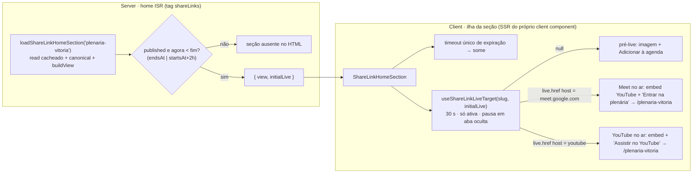

# Impl: S44 — Home — seção da Plenária da Vitória (divulgação e acesso)

Status: aprovado
Atualizado em: 2026-10-01
Issue: #1408
Intenção: docs/plans/secao-home-plenaria-da-vitoria.md
Design UI (gate): docs/plans/secao-home-plenaria-da-vitoria-ui-design.html
Appetite restante: herdado (~0,5–1 dia eng) — uma seção condicional na home, sem migration.

## Leitura da intenção

- **Outcome:** a home divulga a Plenária da Vitória logo depois do hero e leva a `/plenaria-vitoria` em um toque — pré-live mostra o convite (imagem + data/hora da Bahia + `Adicionar à agenda`, sem botão de entrada); ao vivo troca a imagem pelo embed oficial do YouTube e o CTA de entrada assume (`Entrar na plenária` no Meet, `Assistir no YouTube` no YouTube); despublicada ou expirada a seção inteira some (fail-closed), sem deploy.
- **O que NÃO negociar:** o CTA nunca aponta para a URL crua do Meet/YouTube (sempre `/{slug}`); a agenda é a do S29 (`ShareLinkAgendaMenu`), sem mecanismo novo; sem player próprio (embed oficial); sem campo/global/CMS novo nesta fatia; sem coleta/RSVP/rastreio; nada do cadastro do link, da página `/plenaria-vitoria`, das seções irmãs ou do redesenho da home; mobile 390 sem overflow; um único CTA primário por estado.
- **O que reavaliar:** (1) a intenção cogita "a seção acompanha o no ar como o anúncio do S29" — o poll de 30 s está **inline** em `ShareLinkAnnouncement` (`ShareLinkAnnouncement.tsx:51-88`); copiá-lo criaria dois donos do mesmo contrato (D3). (2) A intenção não fixa o que fazer quando não há destino YouTube pré-cadastrado: sem embed, degrada para a imagem e, sem imagem, coluna única (D4). (3) O watch do e2e da home pina a ordem das seções condicionais de forma agnóstica (`frontend.e2e.spec.ts:1778-1796`) — a seção nova é mais uma condicional; a posição exata fica no spec dono (D10).

## Abordagem recomendada

**Opções consideradas:** A) server decide a visibilidade com o read cacheado e renderiza a ilha client com `initialLive` já resolvido; B) wrapper server + ilha só do swap (server pré-live sempre); C) seção 100% client que busca tudo no browser.
**Recomendação:** **A** — a home continua estática/ISR (read sob a tag `shareLinks`, o kill switch já busta), o HTML pré-live sai no server sem JS, e o destino no ar é resolvido no mesmo read cacheado, sem flash de agenda para quem chega durante a live.
**Rejeitadas:** **B** porque em cada visita ao vivo o HTML chegaria pré-live e o refetch imediato trocaria o estado, piscando a agenda antes do embed (o visitante novo é justamente o caso da reta final); **C** porque sem JS a seção sumiria e o fail-closed deixaria de ser HTML do servidor, além de expor a leitura ao browser.

### Componentes / mudanças

- **`src/lib/shareLinkHomeSection.ts` (novo, puro/client-safe):**
  - `SHARE_LINK_HOME_SECTION_SLUG = 'plenaria-vitoria'` (o slug fixo do contrato);
  - `ShareLinkHomeSectionView = ShareLinkAnnouncementView & { expiresAt: number; youtubeVideoId: string | null }`;
  - `buildShareLinkHomeSectionView({ link, imageUrl, canonicalUrl, nowMs })` → `ShareLinkHomeSectionView | null`: janela via `resolveCalendarEventWindow(link.startsAt, link.endsAt)`; sem `startsAt` válido ou `nowMs >= end` → `null`; delega `buildShareLinkAnnouncementView` (alt/location/eventLabel) e acrescenta `expiresAt` (epoch ms) + `youtubeVideoId`;
  - `resolveShareLinkLiveActionLabel(live)` → `meet.google.com` = "Entrar na plenária"; youtube/youtu.be = "Assistir no YouTube"; fallback "Entrar" (host via `new URL`, nunca o label do cadastro);
  - não importa `@/utilities/**` (regra do ESLint para `src/lib`); tipos de `@/lib/shareLink`.
- **`src/lib/shareLink.ts`:** `resolveShareLinkYoutubeVideoId(destinations)` — varre o pool pré-cadastrado, aceita `youtu.be/<id>`, `watch?v=`, `/live/`, `/embed/`, `/shorts/`, valida o id (`^[A-Za-z0-9_-]{11}$`) e devolve o primeiro | `null`; sem I/O.
- **`src/lib/campaignTime.ts`:** `formatBahiaEventDayLabel(iso)` (`sexta, 2 de outubro`) e `formatBahiaEventTimeLabel(iso)` (`18h`/`18h30`); `formatBahiaEventDateLabel` passa a compor as duas, mantendo a saída atual intacta (pin em `shareLinkAnnouncement.unit.spec.ts:26`).
- **`src/utilities/shareLinkReads.ts`:** `loadShareLinkHomeSection(slug)` — server-only: `getCachedPublishedShareLinkBySlug(slug)()` (tag `shareLinks`; draft nunca sai), imagem no proxy same-origin (`typeof link.image === 'object' ? link.image.url : null`), `resolveShareLinkCanonicalUrl(slug)` e `buildShareLinkHomeSectionView({ …, nowMs: Date.now() })`; devolve `{ view, initialLive: resolveLiveShareLinkDestination(link.destinations) } | null`.
- **`src/components/shareLink/useShareLinkLiveTarget.ts` (novo, `'use client'`):** extrai o poll inline do anúncio com assinatura `useShareLinkLiveTarget(slug, initial = null)`; mesmo contrato: refetch imediato, `setInterval` 30 s só com aba visível, `visibilitychange`, guard `cancelled`, igualdade por `href`/`label`, resposta `target: null` nunca limpa o estado. Comportamento do anúncio idêntico (`initial` null).
- **`src/components/shareLink/ShareLinkAnnouncement.tsx`:** passa a consumir o hook (`useShareLinkLiveTarget(view.slug)`), removendo o efeito local — sem mudança visual/comportamental.
- **`src/components/shareLink/ShareLinkAgendaMenu.tsx`:** prop opcional `triggerClassName` (default `SECONDARY_ACTION`) para o gatilho amarelo primário do artefato; popover, rows e `.ics` intactos.
- **`src/components/shareLink/menuControls.ts`:** classes do CTA primário da home (o `PRIMARY_ACTION` do anúncio portado como vocabulário compartilhado + `SAFE_FOCUS`); o anúncio não muda.
- **`src/components/shareLink/ShareLinkHomeSection.tsx` (novo, `'use client'`):** porta classe-a-classe a `.event-section` do artefato (cena 01–06): eyebrow com ponto (`aria-live="polite"` na troca de estado), h2, descrição, grid de metas com ícones lucide (dia · `18h` + "horário da Bahia" · "Online"), bloco de ação (pré-live: `ShareLinkAgendaMenu` com o gatilho amarelo; ao vivo: `<iframe src="https://www.youtube-nocookie.com/embed/<id>?playsinline=1&rel=0" loading="lazy" title=…>` + CTA `resolveShareLinkLiveActionLabel(live)` → `shareLinkPath(view.slug)`, sem `target="_blank"`), figura quadrada com `next/image fill` (ao vivo vira `aspect-video` com o iframe; sem imagem → sem figura), blobs decorativos `aria-hidden`, ordem mobile/desktop do artefato via grid explícito, `data-home-section="plenaria"`. Estado local: `hidden` por expiração (timeout único; no mount, se já expirado, o efeito esconde imediatamente sem mismatch de hidratação) + `live` do hook (`initialLive`).
- **`src/app/(frontend)/(home)/page.tsx`:** `loadShareLinkHomeSection(SHARE_LINK_HOME_SECTION_SLUG)` entra no `Promise.all` (`page.tsx:128`) e a seção renderiza condicional logo após `<CampaignHero />` (`page.tsx:144`), antes da prova (`data-home-section="proof"`).
- **Migration:** sem migration (nenhuma collection/global muda).
- **Access / Consent:** sem escrita, sem PII, sem Consent novo; o gate é o `published: true` do read cacheado (fail-closed).
- **UI:** Impeccable C com gate aprovado — port classe a classe das cenas 01–06, mobile (390) primeiro, inspeção em 1280; shape→craft→critique→polish; crítica final antes do push.

### Dados → forma (se aplicável)

Não aplicável — a intenção fixa **Dados: N/A** (nenhuma métrica nova). A única "forma" é a separação dia × hora no grid de metas do artefato, servida pelos dois formatadores puros (D7); rejeitados: countdown, contador, percentual ou qualquer número inventado numa superfície de convite.

## Decisões de engenharia

1. **Visibilidade/expiração — A) server decide no render; poll e timeout cobrem a borda.** Opções: A | B (TTL/revalidate próprio na home) | C (campo/global novo de destaque) | D (datas fixas no código). Recomendação: **A** — read cacheado do slug fixo (`plenaria-vitoria`), sem link publicado → `null`; janela por `resolveCalendarEventWindow` (fallback 2 h), sem `startsAt` válido ou `agora >= fim` → `null`. O client esconde no instante exato da expiração (timeout único) para abas abertas/HTML ISR defasado; o kill switch (despublicar) já busta a tag. Rejeitadas: **B** (muda o contrato de cache da home por um evento de um dia), **C** (migration por algo que dura um dia) e **D** (hardcode de datas).
2. **Estado inicial ao vivo — A) server resolve o destino do read cacheado e passa `initialLive`.** Recomendação: **A** — quem chega durante a live já recebe o embed/CTA no HTML, sem flash de agenda. O poll mantém o contrato do S29 (só ativa, 30 s, pausa em aba oculta, guard por href/label). Rejeitadas: **B** (server sempre pré-live e refetch imediato trocando — flash exatamente para o visitante novo da reta final).
3. **Poll único — A) extrair o hook `useShareLinkLiveTarget(slug, initial = null)`.** Recomendação: **A** — o anúncio (S29) e a home passam a ter um dono só do contrato de ativação; o anúncio chama sem `initial` e mantém o comportamento atual bit a bit. Rejeitadas: **B** (duplicar o poll na home — dois donos do mesmo contrato, deriva garantida).
4. **Embed — A) vídeo derivado do destino YouTube pré-cadastrado.** Recomendação: **A** — `resolveShareLinkYoutubeVideoId(destinations)` puro aceita os formatos usuais e valida o id; embed `youtube-nocookie` (convenção de `CampaignStorySection.tsx:55`), `loading="lazy"`, sem autoplay, `title` acessível. Sem destino YouTube → sem embed (cai para a imagem; sem imagem, coluna única). Rejeitadas: **B** (hardcodar o id do vídeo) e **C** (player próprio).
5. **CTA de entrada — A) rótulo pelo host do destino no ar; href sempre o path canônico.** Recomendação: **A** — `resolveShareLinkLiveActionLabel` decide Meet/YouTube/fallback pelo host; href sempre `shareLinkPath(view.slug)` (`/plenaria-vitoria`), sem `target="_blank"`. Rejeitadas: **B** (usar `live.href` direto — expõe a URL crua) e **C** (decidir pelo label do cadastro — o host é mais robusto a renomeação de rótulo).
6. **Agenda pré-live — A) reusar a `ShareLinkAgendaMenu` com `triggerClassName`.** Recomendação: **A** — o menu S29 ganha a prop opcional (default `SECONDARY_ACTION`) para o gatilho amarelo primário do gate; classes novas do CTA da home entram no vocabulário de `menuControls.ts`, reusando `SAFE_FOCUS`. Rejeitadas: **B** (duplicar o popover/menu na home) e **C** (manter o gatilho secundário branco — divergiria do gate).
7. **Formatação — A) separar dia e hora em `campaignTime.ts`.** Recomendação: **A** — novas funções puras `formatBahiaEventDayLabel` e `formatBahiaEventTimeLabel`; `formatBahiaEventDateLabel` compõe as duas sem mudar a saída atual (o anúncio do S29 segue coberto pelo unit existente). Rejeitadas: **B** (split de string do `eventLabel` — quebra frágil) e **C** (terceiro módulo de data — o dono da formatação Bahia já existe).
8. **View — A) `buildShareLinkHomeSectionView` delegando ao view model do anúncio.** Recomendação: **A** — reusa alt/location/eventLabel de `buildShareLinkAnnouncementView` e acrescenta `expiresAt` + `youtubeVideoId`; `null` quando expirado. `loadShareLinkHomeSection(slug)` em `shareLinkReads.ts` orquestra read cacheado + canonical + view (e devolve `initialLive`). Rejeitadas: **B** (shape próprio duplicando o view model) e **C** (orquestração inline no `page.tsx` — a home não deve conhecer o read/canonical).
9. **Componente — A) ilha `'use client'` SSR-ada, dona do estado.** Recomendação: **A** — porta classe a classe o `.event-section` do artefato; com JS desligado o HTML pré-live continua completo (o server renderiza o client component) e o timeout de expiração/poll vivem um lugar só. Renderizada logo após `<CampaignHero />`, condicional ao loader. Rejeitadas: **B** (server wrapper + ilha só do swap — fragmenta o dono do estado/expiração).
10. **Testes — A) unit primeiro, int na fronteira do loader, e2e no spec dono com o helper de poll extraído.** Recomendação: **A** — unit (`tests/unit/shareLinkHomeSection.unit.spec.ts`): builder visível/expirado/sem janela, extração do vídeo, rótulo do CTA e labels Bahia novos; unit do hook se barato. Int (estender `tests/int/shareLink.int.spec.ts`): `loadShareLinkHomeSection` com publicado + janela futura → view com `youtubeVideoId`; expirado → `null`; despublicado → `null`; sem `startsAt` → `null`. E2e: novo describe "S44" em `tests/e2e/frontendShareLink.e2e.spec.ts` (spec dona do shareLink; o manifesto já a acorda) — (a) cria `plenaria-vitoria` via REST com mídia e destinos Meet+YouTube, `startsAt` futuro, `mode: announcement`, published; poll do HTML converge, a seção aparece logo após o hero (ordem hero→plenaria→proof), agenda presente e sem link de entrada; flag live via SQL (sem revalidar a tag) + `visibilitychange` → iframe `youtube-nocookie` + `Entrar na plenária` href `/plenaria-vitoria` sem reload; troca para YouTube → `Assistir no YouTube`; kill switch via REST (`published: false`) → HTML converge ausente; (b) janela expirada (`startsAt` passado > 2 h) → ausente; patch `endsAt` futuro → presente (borda dos dois lados). Overflow 390 ≤ 1 px; limpeza no `afterAll` com a infra existente (`createdShareLinkIds`/`createdMediaIds`). **D3 do débito do S39** (extrair o poll do HTML ISR para `tests/helpers/`) tem o gatilho batido (3º spec): unificar `waitForHomeHTML` (`frontend.e2e.spec.ts:777`) e `waitForHomeSection` (`frontendConteudos.e2e.spec.ts:242`) num helper e rewiring os dois specs; se a extração mostrar atrito, manter local e registrar o débito reavaliado. Rejeitadas: **B** (spec e2e nova — 2ª infra de seed do mesmo contrato) e **C** (e2e com `page.clock` para a expiração client — a borda é o predicado unit-testado do builder; clock no e2e é flake).
11. **Docs — A) contrato no `AGENTS-public.md` + changelog + este impl plan.** Recomendação: **A** — `AGENTS-public.md` ganha a seção da home (slug fixo, estados, fail-closed, kill switch, sem migration/Consent); `docs/changelog/2026-10-01-s44.md`; o impl plan entra no commit.

## Fases verificáveis

1. **Tracer — puros + leitura (~0,25 dia).** `src/lib/shareLinkHomeSection.ts` (`SHARE_LINK_HOME_SECTION_SLUG`, builder, rótulo do CTA), `resolveShareLinkYoutubeVideoId` em `shareLink.ts`, os dois formatadores em `campaignTime.ts`, `loadShareLinkHomeSection` em `shareLinkReads.ts`; `tests/unit/shareLinkHomeSection.unit.spec.ts` + casos novos em `tests/int/shareLink.int.spec.ts`. Verificação: `pnpm test tests/unit/shareLinkHomeSection.unit.spec.ts tests/int/shareLink.int.spec.ts` e `pnpm gate:fast`.
2. **UI (~0,5 dia).** Hook `useShareLinkLiveTarget` + rewire do `ShareLinkAnnouncement`; `triggerClassName` na agenda; classes novas em `menuControls.ts`; `ShareLinkHomeSection`; fiação em `page.tsx`; unit do hook (se barato). Verificação: `pnpm gate:fast`; inspeção 390/1280 contra as cenas 01–06 (sem overflow; pré-live sem entrada; ao vivo sem agenda).
3. **E2e + gates (~0,25–0,5 dia).** Extrair `tests/helpers/<homePoll>.ts` e rewiring `frontend.e2e.spec.ts` + `frontendConteudos.e2e.spec.ts`; describe "S44" em `frontendShareLink.e2e.spec.ts`; manifesto — acrescentar `src/app/(frontend)/(home)` ao entry do `frontendShareLink` (mesmo racional do S39: a página é a única fiação da seção, e um diff só dela deve acordar o spec dono). Verificação: `pnpm test:e2e:affected` (ou `pnpm test:e2e --no-deps --project=frontendShareLink`, `--project=frontend`, `--project=frontendConteudos`); `pnpm gate:fast`; push via `pnpm push`.

## Rabbit holes / Não escopo (engenharia)

- Countdown, contador, compartilhar dentro da seção, carrossel/agenda de próximos eventos, CMS de eventos (a lista de eventos é outro produto).
- Campo/global "destaque na home", migration, Consent novo, collection nova.
- CTA para URL crua do Meet/YouTube; `target="_blank"`; player próprio; autoplay com som; segundo poll/endpoint/rota; leitura live (não cacheada) no server da home.
- Tocar o cadastro do `ShareLink`, a rota `[type]`, a página `/plenaria-vitoria`, o `ShareLinkAnnouncement` além da extração do hook, as seções irmãs da home ou o `SiteHeader`/rodapé.
- Spec e2e nova, `page.clock`, screenshot/visual regression da home, dedupe do slug duplicado `plenaria-da-vitoria` (ops).

## Riscos e mitigação

- **Duplicata `plenaria-da-vitoria` (id 5) segue em produção:** fora deste item (ops); a home lê apenas o slug fixo `plenaria-vitoria`.
- **ISR/HTML defasado:** o kill switch busta a tag `shareLinks`; a expiração é coberta pelo timeout no client e o e2e converge por poll do HTML do server antes de navegar.
- **Dev Fast Refresh no primeiro compile da rota de poll:** o e2e aquece `GET /api/share-link/<slug>/live` antes do `goto` (precedente S29, `frontendShareLink.e2e.spec.ts:438-442`).
- **Concorrência em prod (4 workers):** o pin de ordem do `frontend` permanece agnóstico da seção condicional (o `frontendShareLink` pode publicar `plenaria-vitoria` em paralelo); a ordem exata hero→plenaria→proof é pinada no describe S44.
- **Slug fixo no banco de teste:** o describe S44 é serial e único dono do slug; o `beforeAll` remove resíduo de runs abortados e o `afterAll` limpa com a infra existente.
- **Sem imagem e/ou sem destino YouTube:** o componente precisa renderizar sem figura e sem embed (coluna única) sem quebrar o grid do artefato; coberto no unit do builder e na inspeção das cenas.
- **Hidratação/expiração:** estado inicial visível e efeito que esconde no mount quando `Date.now() >= expiresAt` (sem mismatch); timer único limpo no unmount; sem `page.clock`.
- **Segurança do embed:** iframe só existe com id validado (`^[A-Za-z0-9_-]{11}$`) do destino pré-cadastrado; URL nunca vem do estado no ar em texto cru.

## Débitos

- **D3 do S39 — resolvido aqui:** a extração do poll do HTML ISR para `tests/helpers/` é passo da fase 3 (o 3º spec bateu o gatilho). Se a extração mostrar atrito real, manter local e registrar o débito reavaliado no changelog.
- **Dedupe do slug duplicado em produção** — ops, fora deste item (registrado na intenção).
- **Copy do dia da semana ("sexta" vs `Intl` pt-BR "sexta-feira")** — validar no port contra o gate; se divergir, ajustar a copy no artefato, nunca a saída do formatador (o anúncio do S29 precisa continuar idêntico).

### Débitos da revisão (simplify) — explicitamente fora / adiado com gatilho

- **Já resolvido no simplify (não reabrir):** exports mortos (knip); twin do `YOUTUBE_VIDEO_ID_PATTERN` (dono único em `lib/shareLink`, importado por `utilities/socialFeed/excludedItems`); listas de hosts YouTube unificadas; CTA desktop/mobile em `LiveEntryAction`; rename `ShareLinkHomeSectionData`; type do mock no unit da home; mensagem do helper de ISR com o erro original; import do slug no e2e; e2e do estado ao vivo já no HTML do server (caminho `initialLive`); e o describe int S44 aninhado no describe dono (o `afterAll` passou a limpar as linhas — provado com duas execuções).
- **Adiado com gatilho — S2:** ao expirar, o timer esconde a seção mas o hook segue pollando (30 s) até o unmount, e `expired` não volta a `false` se `view.expiresAt` mudar num refresh RSC (hoje a home não re-renderiza a seção no cliente). Gatilho: a seção ganhar refresh dinâmico no cliente (revalidate/refresh RSC) ou o `/api/share-link/<slug>/live` passar a ter custo/rate relevante — aí parar o poll com `expired` (flag `enabled`/desmontar a ilha).
- **Descartado — S1:** `eventLabel` segue no view da home de propósito — `buildShareLinkHomeSectionView` reusa `buildShareLinkAnnouncementView` (D8); shape próprio foi rejeitado. Revisitar só se o payload ganhar um 2º campo inútil.
- **Descartado — S3:** os `cleanup()`/resets dentro do `it` isolam renders múltiplos do mesmo teste; o `afterEach` cobre a fronteira entre testes — não duplicam.
- **Descartado — S4:** `Entrar` é o fail-safe do host desconhecido; sem caso de produto. Rótulo novo só com host novo real.

## Aceite de engenharia

- [ ] Aceite de produto da intenção ainda coberto: seção só enquanto publicado e não expirado; pré-live imagem + `Adicionar à agenda` sem entrada; ao vivo embed + CTA por host sempre → `/plenaria-vitoria`; troca sem reload; kill switch sem deploy; demais seções intocadas; 390 sem overflow; acessível e sem autoplay com som; sem coleta.
- [ ] Invariantes AGENTS/engineering-standards: `src/lib` sem importar `@/utilities/**`; client importa de server só `import type`; sem migration; sem Consent novo; sem PII; copy pt-BR / identificadores em inglês.
- [ ] Testes de domínio previstos: unit do builder/vídeo/CTA/labels (+ hook se barato); int do `loadShareLinkHomeSection`; e2e S44 no spec dono; helper de poll extraído e specs rewired.
- [ ] Gates: `pnpm gate:fast`; e2e afetado (`frontendShareLink`, `frontend`, `frontendConteudos`); `pnpm push`.

## Self-score decision-quality

4,5/5.

1. **Decisões caras com rejeitadas (5/5):** visibilidade/cache, estado inicial, ownership do poll, embed, CTA/href, agenda, formatação, view model, componente, testes e docs têm Opções + Recomendação + rejeitadas explícitas (D1–D11).
2. **Cabe no appetite herdado (4,5/5):** sem schema/API nova; 1 módulo puro, 1 loader, 1 hook extraído, 1 componente e extensões de specs — o custo concentra-se na UI e no e2e, dentro de ~0,5–1 dia.
3. **Rabbit holes nomeados (5/5):** countdown, CMS de eventos, campo/global/migration, URL crua, player próprio, segundo poll, spec e2e nova, `page.clock`, dedupe.
4. **Depth check (4,5/5):** reusa o read cacheado + tag `shareLinks`, o view model do anúncio, `resolveCalendarEventWindow`, a agenda S29, o vocabulário de `menuControls` e a infra e2e; extrai o poll do dono existente em vez de duplicar.
5. **Intenção preservada (5/5):** outcome intacto; as reavaliações (sem destino YouTube, helper de poll e o pin agnóstico) são delegadas/antecipadas pela própria intenção e não mudam produto.
