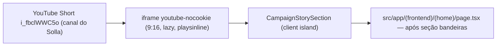

# Impl: Seção de vídeo da história na home de campanha (S8)

Status: em execução
Atualizado em: 2026-08-19
Issue: #91
Intenção: docs/plans/secao-video-historia-home.md
Appetite restante: herdado (~1 dia eng)

## Divergência de produto aprovada pelo humano (2026-08-19)

**Embed do YouTube no lugar de self-hosted.** O plano de intenção previa asset próprio
(WebM/AV1 + MP4/H.264 em `public/videos/`, lazy total, poster extraído/fornecido). Durante a
execução o humano constatou que o vídeo já está publicado no canal do deputado
(https://www.youtube.com/shorts/i_fbclWWC5o — "18 de agosto de 2026", confirmado pelo dono do
produto como o vídeo da história; a assessoria usa títulos datados) e **decidiu embutir o
YouTube**, divergindo do aceite "sem dependência de terceiros". Motivação do produto: cada play
embutido conta como view no canal (alimenta o algoritmo; o canal já é vitrine na seção
"Acompanhe de perto"). Aceite atualizado:

- Seção com o vídeo da história via **iframe `youtube-nocookie`** (LGPD), `playsinline`,
  `loading="lazy"` nativo (iframe só é buscado perto do viewport), frame 9:16, `allowFullScreen`,
  título a11y.
- **Deixa de valer:** lazy-until-click total, poster próprio, chip de duração, orçamento de
  ~15 MB de assets no repo (nada é commitado; os encodes one-off ficam em `data/encode/`,
  gitignored, como artefato local caso se volte a self-hosted).
- **Mantém-se:** posição após "Bandeiras", cenas desktop (2 colunas) e mobile (empilhado) do
  rascunho, CTA "Assistir à história" (agora rola até o player), zero schema/Consent, seções
  existentes intactas.

## Leitura da intenção

Outcome e aceite da intenção (docs/plans/secao-video-historia-home.md), com a divergência
aprovada abaixo: seção com o vídeo da história na home pública, posição após "Bandeiras",
cenas desktop/mobile do rascunho aprovado, zero schema/migration/Consent, seções existentes
intactas, original de 236 MB fora do repo. O que permanece NÃO negociável: copy/pt-BR e
identificadores em inglês; lazy (nada pesado baixa sem o usuário pedir — o `loading="lazy"` do
iframe cobre isso); sem autoplay forçado; seções existentes intocadas.

## Abordagem recomendada

**Opções consideradas:** A) iframe do YouTube (decisão do humano) | B) `<video>` nativo
self-hosted com WebM/AV1 + MP4/H.264 (plano original)
**Recomendação (humano):** A — o vídeo já vive no canal; embed soma views ao canal e evita
15 MB de asset no repo; troca de vídeo sem deploy.
**Rejeitadas (pelo humano, sobre o plano aprovado):** B — dependência própria do aceite; os
artefatos de encode já produzidos (14.9 MB total, validados por design-vision) ficam em
`data/encode/` como fallback local.

### Decisões de engenharia

- **Embed (decisão do humano, supersede o formato/encode do plano original).** iframe
  `youtube-nocookie.com/embed/i_fbclWWC5o` (privacy LGPD) com `playsinline=1&rel=0`, 9:16,
  `loading="lazy"` (busca só perto do viewport), `allow` (autoplay, fullscreen, gyroscope…),
  `allowFullScreen`, `title` a11y. Rejeitadas: `youtube.com/embed` (versão com cookies), o
  padrão de overlay próprio + click (não dá para disparar play cross-origin sem o IFrame API —
  duplo clique no iOS, fragilidade sem ganho).
- **Formato/encode (histórico — não entra).** A conversão one-off foi executada e validada
  (MP4 H.264 720×1280 CRF 27 + WebM AV1 810×1440 CRF 39, 14.9 MB total, poster AVIF da foto
  JOA00327 escolhida pelo humano) e fica como artefato local em `data/encode/` (gitignored) —
  fallback pronto se um dia se voltar a self-hosted. Nada disso é commitado.
- **Posição na home.** Opções: A) após conteúdos | B) após "Bandeiras" (fim da página, antes do
  footer) | C) página própria. **Recomendação: B** (da intenção) — zona de conversão acima da
  dobra intacta, fechamento emocional no fim, semente da seção 6 "Quem é Jorge Solla" do plano do
  site. Rejeitadas: A porque compete com o bloco do problema no funil; C porque estoura o
  appetite de "uma seção na home".
- **CTA "Assistir à história".** Botão que rola (smooth) até o player — play cross-origin não é
  disparável de fora do iframe; o visitante chega no frame com o player do YouTube à mostra.
- **Estilos.** Seguir o padrão atual `CampaignContentSection` (container `max-w-[1160px]`,
  `px-5 sm:px-8 lg:px-10 py-12 lg:py-16`, tokens `--campaign-band`/`--campaign-line`/
  `--campaign-muted`/`--pt-red`) — seção em fluxo, não o padrão absoluto de `problem`/`flags`.
  Fundo branco (contraste entre `--campaign-band` de bandeiras e o footer `#180a09`).

### Componentes / mudanças

- **`CampaignStorySection`** (`src/components/CampaignStorySection.tsx`): client island (`'use
client'`, precedente `CampaignCarousel`) — copy (eyebrow/título/copy do rascunho), frame 9:16
  com iframe do YouTube (nocookie, lazy, playsinline); CTA rola até o player.
  `data-home-section="story"`.
- **`page.tsx`** (`src/app/(frontend)/(home)/page.tsx`): inserir `<CampaignStorySection />` após
  a seção `bandeiras`, antes do footer. Nenhuma seção existente é tocada.
- **Assets:** nenhum commitado (o vídeo vive no YouTube; encodes em `data/encode/` gitignored).
- **Migration:** sem migration (zero schema).
- **Access / Consent:** N/A — conteúdo estático público.
- **UI:** Impeccable B — seguir o rascunho aprovado (desktop 2 colunas / mobile empilhado);
  shape → craft → critique → polish contra o rascunho; verificação mobile 320–430px (o frame
  9:16 full-width fica alto — checar folga vertical e sem overflow horizontal).

### Dados → forma (se aplicável)

- N/A: sem métrica/KPI. Nenhum dado estático (o player do YouTube traz o próprio thumbnail e
  duração).

## Fases verificáveis

1. ~~**Encode (tracer)**~~ — executado como fallback antes da divergência: encodes H.264 + AV1
   (14.9 MB) + poster AVIF da foto JOA00327 (validados por design-vision), retidos em
   `data/encode/` (gitignored), fora do commit.
2. **UI** — `CampaignStorySection` (embed) + wiring no page; shape/craft contra o rascunho;
   crítica visual (design-vision) + polish; e2e novo em `frontend.e2e.spec.ts` (seção presente
   após bandeiras, iframe com src nocookie + `loading="lazy"` + `allowfullscreen`, CTA rola até
   o player, mobile sem overflow; requests do YouTube abortados no teste para o CI ficar
   hermético).
3. **Gates** — `pnpm gate:fast`, `pnpm format:check`, `pnpm exec knip`, `pnpm check:cycles`,
   `pnpm test`, `pnpm build`; e2e no CI; push via `pnpm push`.

## Conflitos de rebase resolvidos (2026-08-19)

- **S9 mergeou em main durante a execução** e inseriu `CampaignNewsletterSection` no mesmo ponto
  (após bandeiras, antes do footer). Resolução: **história → newsletter → footer** — o funil
  põe o "ask" (formulário de captura) depois do fechamento emocional; S9 declara "logo acima do
  rodapé" e S8 "após bandeiras"; ambas as intenções ficam satisfeitas.
- **Changelog agregado**: conflito insert-only resolvido com `git checkout --theirs` +
  `pnpm changelog:build` (S8 re-anexado sobre o agregado com S7/S9).
- Nota de ambiente: o e2e local (dev server) acusa warnings de React keys em
  `CampaignColumnPicker`/omnibox de assessores (B137/B197, era C139) que o guard falha — são
  **dev-only** (build de produção do CI não emite warnings de keys), pré-existentes em main e
  fora do escopo S8.

## Débitos (capture-review-debts — triage autônoma)

- **Absorvidos nesta entrega:** JSDoc enxuto; e2e sem `toHaveURL` redundante; asserts de
  desktop (2 colunas, centro vertical) + `allow`/`playsinline`; plano sem conteúdo morto da
  era self-hosted; `compute-pressure` no `allow` do iframe (silencia o console.error do
  player do YouTube — guard do e2e falha em console.error) + abort global do
  `youtube-nocookie` no fixture `e2eTest.ts` (hermeticidade CI, mesma filosofia dos stubs de
  feed).
- **Diferidos (registrados aqui, não como Issue):** (1) rótulo do CTA "Assistir à história"
  promete ação que só rola — copy aprovada no gate, alternativa mais honesta ("Ver a história
  em vídeo") se a assessoria reabrir o copy; (2) classe do CTA duplica
  `sectionHeaderLinkClassName` de `CampaignContentSection` — consolidar quando S5 (#33)
  terminar a separação da seção de conteúdos (evitar conflito com trabalho in-progress).
- **Descartados:** Safari <16.4/Firefox <121 ignoram `loading="lazy"` em iframe (carrega
  eager — degradação graciosa, sem ação); artefatos de encode self-hosted em `data/encode/`
  (gitignored, fallback documentado).

## Rabbit holes / Não escopo (engenharia)

- Player JS / playlist / tracking de views próprias (o embed já conta views no YouTube) /
  analytics de playback.
- Overlay próprio + click para "autoplay" do embed (cross-origin; IFrame API é fragilidade sem
  ganho — o player do YouTube já tem o próprio play).
- Pipeline de transcodificação versionado no repo (conversão one-off local, não commitada).
- Legendas/transcrição (item futuro separado, fora do escopo da intenção).
- Trocar o vídeo por outro Short: mudança de ID no `src` do iframe (um lugar).

## Riscos e mitigação

- **Embed depender do YouTube** (risco aceito pelo humano): se o Short cair/for bloqueado, a
  seção degrada para o quadro cinza com o player vazio. Mitigação: o fallback self-hosted
  (artefatos em `data/encode/`) fica pronto para reverter em horas.
- **Short trocado/ID errado** → troca de ID no `src` do iframe (um lugar).
- **CI/e2e tocando o YouTube** → `page.route` aborta `youtube-nocookie.com` no teste; os
  asserts são estruturais (src, lazy, allowfullscreen, posição), não de conteúdo do player.
- **Iframe pesado no mobile** → `loading="lazy"` nativo (busca só perto do viewport) + seção no
  fim da página.

## Aceite de engenharia

- [x] Aceite de produto (atualizado pelo humano em 2026-08-19): seção com o vídeo da história
      via embed do YouTube (nocookie, playsinline, lazy, 9:16), posição após Bandeiras, zero
      schema, seções existentes intactas
- [x] Invariantes AGENTS/engineering-standards (sem schema/Consent/access; i18n pt-BR na UI,
      identificadores em inglês; sem tocar seções existentes)
- [x] Testes previstos: e2e da seção (estrutura + scroll + mobile) — sem unit (JSX estático;
      nenhuma lógica de domínio pura a testar)
