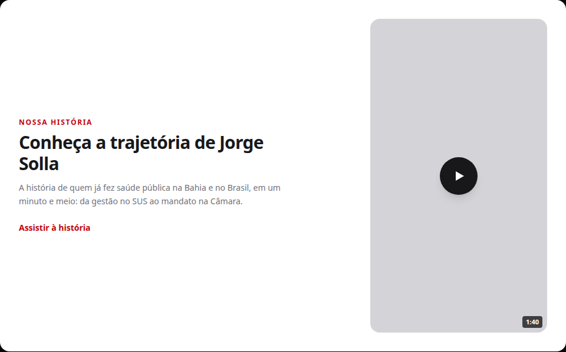
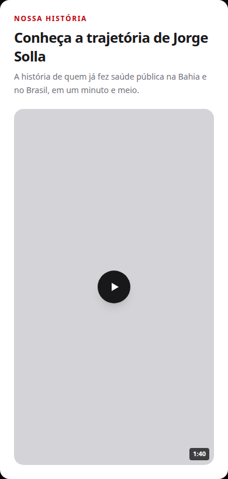
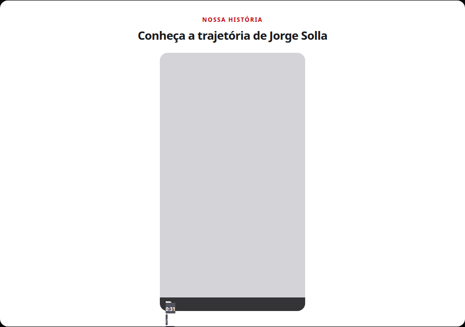

# Seção de vídeo da história na home de campanha (S8)

Status: registrado
Atualizado em: 2026-08-19
Issue: #91
Priority: P1
Model: composer-2.5
Impeccable: B — nova seção na home pública (superfície que o visitante vê/toca)
Rascunho UI: docs/plans/secao-video-historia-home-ui-draft.html + PNGs embutidos abaixo
Appetite: ~1 dia eng; uma seção na home + conversão one-off do vídeo
Responsável: —

## Intenção

A home pública de campanha (jorgesolla1313.com.br) apresenta o candidato só com fotos e
números: o hero mostra o rosto, a prova social mostra os feitos, mas ninguém **conta a história**.
Existe um vídeo pronto de apresentação da trajetória do Dep. Jorge Solla — `SOLLA_P2_V1.mp4`
(~1:40, vertical 1080×1920) — que é exatamente esse material. O problema: o arquivo original tem
**236 MB**, inviável para a rede. Este item publica o vídeo numa seção nova da home, convertido
para um formato leve de web (WebM/AV1 ou o mais moderno disponível), para tocar no site sem
travar o carregamento e sem depender de YouTube.

## Persona e fluxo

- **Persona / contexto:** visitante da home de campanha (eleitor baiano, maioria no celular,
  chegou pelo WhatsApp/redes, no meio do funil) — viu o hero e a prova social, quer saber
  "quem é esse cara" antes de decidir apoiar.
- **Job principal:** conhecer a história de Jorge Solla de forma rápida e humana (1 minuto e
  meio de vídeo) sem sair da página e sem esperar carregamento pesado.
- **Fluxo desejado:** rola a home → encontra a seção (eyebrow + título + frame vertical 9:16)
  → aperta play → assiste à história → continua navegando (bandeiras, apoiar).
- **Anti-goals de produto:** a seção NÃO compete com o CTA primário acima da dobra; NÃO
  autoplay com som (barrado por browsers e ruído para quem não pediu); NÃO vira player
  sofisticado/library; NÃO depende de plataforma de terceiros (YouTube) para existir.

### Esboço de fluxo (B)

```text
[home: hero → prova social → conteúdos] → [SEÇÃO: eyebrow + título + frame 9:16 com poster]
→ [clique no play] → [vídeo toca com controles nativos] → [termina / volta à página]
```

### Rascunho UI (B)







Fonte iterável: [`secao-video-historia-home-ui-draft.html`](secao-video-historia-home-ui-draft.html).

## Objetivo e aceite

- A home pública exibe uma seção dedicada com o vídeo da história (eyebrow "Nossa história" +
  título + frame vertical 9:16 com poster e botão play), nas cenas desktop (2 colunas) e mobile
  (empilhado) do rascunho.
- O vídeo toca em todos os browsers da audiência: Chrome, Firefox e Edge (Android e desktop) e
  Safari **incluindo iOS** — a escolha de formato garante playback universal (WebM sozinho quebra
  iOS Safari; ver Questões em aberto).
- O vídeo é **leve para rede**: conversão do original de 236 MB para formato(s) web com peso
  alvo ≤ ~15 MB no total; o player não baixa o vídeo até o usuário apertar play (lazy).
- Poster extraído do próprio vídeo (frame representativo), controles nativos, `playsInline`
  (sem abrir player fullscreen forçado no iOS), sem autoplay com som.
- O arquivo original (236 MB) NÃO entra no repositório nem no fluxo de deploy.
- Zero mudança de schema/migration/Consent: é conteúdo estático da home pública, sem coleção
  nova (ver Questões em aberto sobre onde o arquivo mora).

## Dados (intenção)

Dados: N/A — o item publica um **conteúdo** (vídeo), não métrica nem KPI. Nenhum número novo
de campanha é inventado aqui (a duração "1:40" do chip é propriedade do vídeo, não estatística).

## Direção no codebase (hipótese)

- **Áreas prováveis:** `src/app/(frontend)/(home)/page.tsx` (inserir a seção), novo componente
  de seção/player em `src/components/`, estilos no bloco `[data-theme='campaign-site']` de
  `src/app/(frontend)/styles.css` (padrão das seções atuais), vídeo servido como asset estático
  em `public/videos/` (precedente: imagens de campanha em `public/`) — ou via coleção `media`
  (decisão no gate).
- **Precedente a olhar:** seção de conteúdos (S1/S2/S3, `CampaignContentSection`) para o ritmo
  visual de seção (eyebrow/título/copy); `CampaignHero` para como o candidato é apresentado
  hoje; seção 6 "Quem é Jorge Solla" do wireframe (`docs/campanha/wireframe-solla-1313.html`) —
  esta seção de vídeo é a semente daquela posição do plano do site
  (`docs/campanha/plano-site-campanha-2026.md` §3.6).
- **Risco de acoplamento:** seção nova convive com as existentes sem mexer nelas (S5, em
  andamento, trata a separação visual da seção de conteúdos — a posição relativa decide no
  gate); se a entrega usar a coleção `media`, respeitar os guards/plugins de storage existentes
  (S3) sem criar caminho paralelo de escrita.

## Dependências

- Nenhuma dura.
- Soft: S5 (#33, in-progress) — separação visual da seção de conteúdos; seção 6 do wireframe
  (linha do tempo "Quem é Jorge Solla") continua fora de escopo, o vídeo a antecipa em parte.

## Fora de escopo

- Linha do tempo + etiquetas de esfera + formação/militância da seção 6 do wireframe → item
  futuro (esta entrega é só o vídeo).
- Legendas/transcrição acessível do áudio → item futuro separado, se a assessoria pedir.
- Hospedar no YouTube / embeds de terceiros (o vídeo é asset próprio, no próprio site).
- Player customizado, biblioteca de vídeo, tracking de views, analytics de playback.
- Alterar hero, prova social ou qualquer seção existente; redesign da home.

## Rabbit holes de produto

- **Player sofisticado / biblioteca.** Se alguém "só completar": integra player JS, capas,
  tracking, playlist. **Corte neste item:** `<video>` nativo com controles nativos; capa + botão
  play são o poster/estado inicial.
- **Pipeline de transcodificação no repo/CI.** Se alguém "só completar": script de conversão
  versionado, re-encode a cada deploy. **Corte:** conversão **one-off** local com ffmpeg (não
  instalado na máquina hoje — executor instala ou usa container); os arquivos convertidos são
  artefato da entrega, não processo.
- **Commit do original no git.** Se alguém "só completar": o repo cresce 236 MB. **Corte:** só
  os arquivos convertidos entram; o original fica fora do repo (referência no plano impl).
- **Autoplay para "engajar".** Se alguém "só completar": autoplay muted loop como teaser.
  **Corte:** click-to-play — o vídeo é narrado (~1:40); o visitante escolhe ouvir a história.

## Questões em aberto (produto)

- **Onde a seção fica na home?** **Opções:** A) logo após a seção de conteúdos (posição 4 atual,
  antes de "Por que essa eleição importa") — história sobe no funil | B) após "Bandeiras"
  (posição 6 do wireframe, onde o plano do site reserva "Quem é Jorge Solla") — respeita a
  estrutura aprovada e não compete com o bloco do problema | C) página própria (ex.
  `/nossa-historia`) linkada da home. **Recomendação: B** — o vídeo é a semente da seção 6 do
  plano do site; a zona de conversão acima da dobra fica intacta; o fim da página ganha um
  fechamento emocional. _(assumido — validar)_
- **Formato de entrega do vídeo?** **Opções:** A) **dupla**: WebM (AV1 — o codec mais moderno e
  leve da atualidade) + MP4 (H.264) como fallback universal — melhor peso/qualidade e cobre
  todos os browsers, incluindo iOS Safari, que não toca WebM | B) só MP4 H.264 — universal,
  mais simples, um arquivo só, um pouco mais pesado | C) só WebM (AV1) — menor, mas iOS Safari
  fica de fora. **Recomendação: A** — audiência de campanha tem muitos iPhones; AV1 sozinho
  excluiria Safari; H.264 sozinho é o caminho mais simples se o peso alvo não for alcançável em
  dois formatos. _(assumido — validar)_
- **Onde o arquivo convertido mora?** **Opções:** A) estático em `public/videos/`, commitado —
  precedente das imagens de campanha em `public/`, deploy automático junto do app, PR revisa o
  arquivo | B) coleção `media` + Garage S3 — admin troca o vídeo sem deploy, mas exige upload
  para produção e o proxy de mídia. **Recomendação: A** — asset fixo da campanha, autossuficiente
  e revisável; B se a troca de vídeo sem deploy virar necessidade real. _(assumido — validar)_
- **Peso-alvo do vídeo?** **Opções:** A) ≤ ~15 MB somando os formatos (referência de mercado
  para 1:40 em 1080×1920) | B) ≤ ~5 MB (compressão agressiva, qualidade visivelmente pior).
  **Recomendação: A** — a história tem valor emocional; qualidade de imagem importa, e 15 MB
  carrega rápido em 4G com lazy. _(assumido — validar)_

## Referências

- Vídeo original: `/home/fsolla/Downloads/SOLLA_P2_V1.mp4` (236 MB, ~1:40, 1080×1920 — fora do
  repo; artefato da sessão que entregar).
- Rascunho UI (gate): `docs/plans/secao-video-historia-home-ui-draft.html` + PNGs acima
- Plano geral do site: `docs/campanha/plano-site-campanha-2026.md` (§3.6 "Quem é Jorge Solla",
  §4.1 doutrina de conversão)
- Wireframe aprovado: `docs/campanha/wireframe-solla-1313.html` (seção 6)
- `src/app/(frontend)/(home)/page.tsx` — onde a seção entra
- `src/components/CampaignContentSection.tsx` — padrão visual de seção (eyebrow/título/copy)
- `AGENTS.md` — conventions do site público (i18n pt, naming, cache/revalidação se aplicável)
