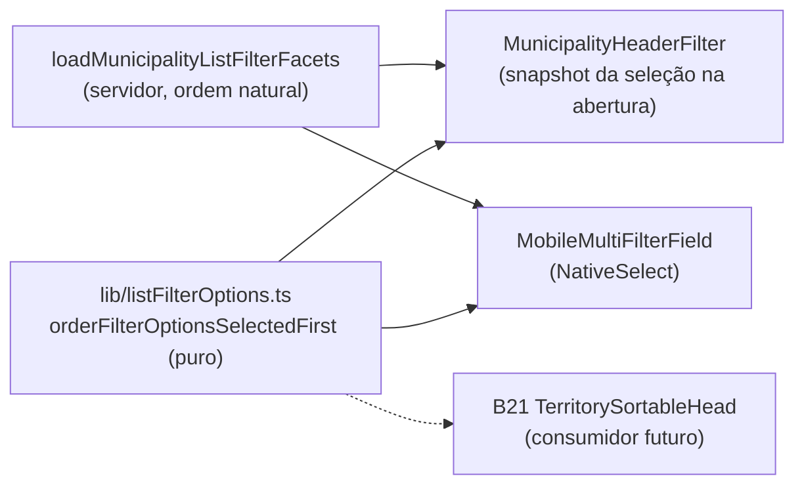

# Opções selecionadas no topo nos filtros do header

Status: rascunho
Atualizado em: 2026-07-25
Item do roadmap: [docs/roadmap.md](../roadmap.md) (Fill-ins abertos — "Selecionados no topo nos filtros do header"; superfície de coordenação, encaixe em B16 ✓)
Impeccable: B — encaixe no Popover de filtro já entregue (`MunicipalityHeaderFilter`) e no select mobile equivalente; sem rota nova, sem tela nova
Appetite: ~0,25–0,5 dia eng; helper puro client-safe + consumo nos dois controles + unit test; sem migration, sem collection, sem Consent, sem server action
Responsável: —

## Design (Impeccable)

Âncoras: `PRODUCT.md` (princípio 2 — clareza sob pressão; princípio 8 — Feel the action) / `DESIGN.md` (register `product`, Field Desk) · tema `data-theme='campaign'` · shells do sistema de listas do Pass 2 W1 (`CampaignTable`, `CampaignTransitionAnchor`, `CampaignListPendingBoundary`) · Popover shadcn já em uso.

Na implementação (`implement-roadmap-item`): craft compacto → critique → polish. Sem `harden`/`optimize` (navegação por URL, ≤435 opções já carregadas no cliente).

Brief compacto:

- **Persona / contexto:** Assessor / CG na lista de municípios com 2–5 territórios (ou assessores) já marcados; abre o funil da coluna para **tirar** um deles e precisa caçar o item marcado no meio de 27 (Território) ou 435 (Município) linhas — hoje a única pista é a checkbox, e a busca não ajuda quem não lembra o nome exato do que marcou.
- **Job principal:** ver imediatamente o que está selecionado naquela coluna e desmarcar em um gesto.
- **Estratégia de cor:** Restrained — agrupamento por posição + o divisor de hairline que o Popover já usa acima da lista; sem badge colorido, sem realce de fundo novo.
- **Edit where you see:** não se aplica — filtro é navegação por URL (B15/B16), não mutação; as células editáveis do B9 continuam sendo o canal de escrita.
- **Anti-goals:** virar painel de "filtros ativos" dentro do Popover (isso é o resumo/chips da barra slim); chips removíveis dentro do funil; seção com título "Selecionados" (chrome a mais para ≤5 linhas); reordenar sob o dedo do usuário durante a interação.

## Dados → decisão → apresentação

- **Vou apresentar dados?** Não — **Dados: N/A**. Nenhuma métrica, série ou agregado novo; o item só reordena as opções de um controle de recorte já existente.
- **Decisões desbloqueadas:** as mesmas do B16 (qual TI / assessor / município atacar) — este item reduz o custo de **desfazer** um recorte, não cria leitura nova.
- **Forma escolhida:** N/A (lista de opções do Popover, inalterada em conteúdo).
- **Anti-goals de dado:** nenhuma contagem nova no trigger do funil; nenhuma reordenação das **linhas** da tabela (isso é sort, B15).

## Contexto

O **B16 ✓** (entregue 2026-07-25) pôs o filtro no `TableHead` de cada coluna de `/campanha/municipios`: `MunicipalityHeaderFilter` (`src/components/campaign/municipality/MunicipalityHeaderFilter.tsx`) abre um Popover com linhas exclusivas no topo (Prioritária; com/sem assessor) e, abaixo, a lista multi-seleção — Município (até 435 slugs, com busca a partir de 8 opções), Território (27), Assessores e Tendência. As opções vêm **facetadas** pelo servidor (`loadMunicipalityListFilterFacets`), na ordem natural do catálogo/consulta; os valores já selecionados entram na união justamente para poderem ser desfeitos. No mobile, o equivalente é o `MobileMultiFilterField` (`MunicipalityFilters.tsx`), um `NativeSelect` que prefixa "✓" nos escolhidos.

O atrito relatado (2026-07-25, uso real): com várias opções marcadas, **desmarcar exige caçar** — no desktop a checkbox marcada pode estar fora do viewport de 288px do Popover (`max-h-72` com scroll), no mobile o "✓" está perdido no meio da lista nativa. A ordem das opções é a única affordance disponível e hoje não trabalha a favor.

O pedido é ordenar as selecionadas no topo **e** fazê-lo no componente do sistema de listas, não numa gambiarra local: **B21** (página dos Territórios de Identidade) já está planejada para replicar este header, e o próprio plano do B21 registra a extração de um head genérico como "adiado com gatilho" (3º call site). Este item entrega o pedaço que **já** dá para compartilhar sem abstração prematura: a regra de ordenação, pura e testada.

## Objetivos

- No Popover de filtro multi-seleção, as opções **selecionadas aparecem primeiro**, na ordem original entre si, separadas do resto pelo mesmo hairline usado hoje acima da lista; as não selecionadas mantêm a ordem original.
- A ordem **não muda enquanto o Popover está aberto**: marcar/desmarcar altera só a checkbox; o reagrupamento acontece na próxima abertura.
- A busca dentro do Popover respeita a mesma regra (selecionadas que casam com o termo primeiro).
- O select mobile (`MobileMultiFilterField`) usa a mesma regra e o mesmo helper.
- A regra vive num módulo **puro e client-safe** em `src/lib/`, com unit test, consumível por qualquer lista da campanha (B21/E12) sem copiar código.
- Guardrails: sem migration, sem collection, sem `Consent`, sem server action; contrato de URL congelado intacto (`municipalityListUrl.ts`); `leader` segue redirecionado; nenhuma mudança no `where` do loader nem nas facetas do servidor.

## Decisões travadas

- **A peça compartilhada é o helper de ordenação (`src/lib/`), não a extração do `MunicipalityHeaderFilter` inteiro.** O plano do Pass 2 W1 nomeia "generalizar o `MunicipalityHeaderFilter` inteiro" como rabbit hole e o B21 condiciona o head genérico ao 3º call site; uma função pura sobre `{ value, label }[]` + `selected[]` é reutilizável hoje (desktop, mobile, B21) e testável sem DOM. **Rejeitado:** extrair `CampaignHeaderFilter` genérico agora (estoura o appetite em 4×, mistura este item com B21 e congela uma interface antes do segundo consumidor existir); reordenar direto no servidor, dentro das facetas (a ordenação passa a depender do estado da URL no cache do loader e o mobile, que não usa facetas para tendência, ficaria de fora); duplicar a lógica nos dois controles (o terceiro consumidor chega com B21).
- **Ordem congelada enquanto o Popover está aberto (snapshot da seleção na abertura).** Reordenar a cada clique move as linhas debaixo do ponteiro e do foco de teclado/leitor de tela: o usuário que desmarca dois territórios seguidos erraria o segundo clique. **Rejeitado:** reordenar a cada toggle (regressão de a11y e de "Feel the action" — o feedback vira movimento, não confirmação); animar a transição de posição (movimento decorativo em controle de trabalho, contra o Field Desk); não reordenar nunca (é o pedido).
- **Agrupamento por posição + divisor, sem cabeçalho de seção.** O Popover já usa `border-b` para separar as linhas exclusivas (Prioritária / com-sem assessor); repetir o mesmo recurso mantém a gramática. **Rejeitado:** título "Selecionadas" (chrome para tipicamente 1–5 linhas); chips removíveis no topo do Popover (duplica o resumo da barra slim e cria um segundo alvo de desmarcação).
- **Escopo = filtros multi-seleção.** O único single-select (Tipo) tem no máximo um valor, já destacado, e ganha nada com reordenação; as linhas exclusivas continuam ancoradas acima da lista. **Rejeitado:** aplicar a comboboxes/`RelationMultiSelect` de formulários nesta entrega (outro padrão de interação — ver Adiado com gatilho).
- **i18n e naming** seguem o AGENTS.md: identificadores em inglês (`src/lib/listFilterOptions.ts`, `orderFilterOptionsSelectedFirst`, `FilterOptionLike`, `selectionSnapshot`), copy pt-BR inalterada.

## Questões em aberto

- **O divisor aparece sempre que há seleção, ou só quando a lista é rolável?** **Opções:** (A) sempre que há ≥1 selecionada; (B) só quando `options.length ≥ SEARCHABLE_OPTION_THRESHOLD`. **Recomendação: A** — regra única é mais previsível e o custo visual é uma linha de 1px; B economiza pixel ao preço de um comportamento condicional que ninguém consegue prever.
- **Mobile reordena imediatamente após cada escolha?** **Opções:** (A) sim (o `NativeSelect` fecha a cada escolha, então não há "sob o dedo"); (B) espelhar o snapshot do desktop. **Recomendação: A** — reabrir o select já mostrando o recém-marcado no topo é exatamente o gesto de desfazer; sem sobreposição, não há risco de erro de alvo.
- **Vale aplicar na lista de opções do `CampaignFilterChips`/barra slim?** **Recomendação:** não — chips ativos já vivem separados por natureza; nada a reordenar.

## Abordagem proposta

Componentes:

- **`src/lib/listFilterOptions.ts`** (novo, puro/client-safe): `orderFilterOptionsSelectedFirst<T extends FilterOptionLike>(options: readonly T[], selected: readonly string[]): { ordered: T[]; selectedCount: number }` — partição estável (selecionadas na ordem original, depois as demais), sem alocar quando `selectedCount === 0` ou quando tudo está selecionado. `FilterOptionLike = { value: string }` para servir também às linhas do mobile. Fica em `lib/` por ser lógica pura: `src/utilities/municipalityListFilters.ts` é o módulo de domínio do município e este helper precisa ser neutro (B21/E12).
- **`MunicipalityHeaderFilter.tsx`** (em `src/components/campaign/municipality/`): guarda `selectionSnapshot` (array de valores) fixado no `onOpenChange(true)` e limpo no fechamento — a mesma função onde `query` já é resetada; a ordenação usa o snapshot, a checkbox continua lendo `viewState` (otimista), preservando o feedback imediato do B16. Aplica o helper **depois** do filtro de busca, sobre `visibleOptions`, e insere o divisor após a última selecionada. Nenhuma mudança nos `href`s nem no `useOptimistic`.
- **`MobileMultiFilterField`** (em `MunicipalityFilters.tsx`): aplica o helper direto sobre `options` com `selected` corrente (sem snapshot — o select fecha a cada escolha), mantendo o prefixo "✓".
- **Testes:** `tests/unit/listFilterOptions.unit.spec.ts` — estabilidade da ordem dentro de cada grupo, ausência de duplicatas, seleção vazia = identidade, valores selecionados fora do conjunto de opções ignorados (caso real: faceta que deixou de alcançar um valor).
- **Sem migration, sem collection, sem server action.**

## Dependências

- **Duras:** nenhuma — **B16 ✓** (Popover e facetas) e o sistema de listas do Pass 2 W1 ✓ já estão entregues.
- **Suaves:** **B21** (primeiro consumidor externo do helper; se B21 vier antes, o head dele já nasce chamando a função); **B22** (promove o tooltip de coluna para `shared/` pelo mesmo critério — peça compartilhada sem head genérico; os dois tocam o mesmo `TableHead` e devem ser feitos em sequência, não em paralelo, para evitar conflito no arquivo); **B17** (visibilidade de coluna não interage, mas divide o mesmo header).
- Reusa: `src/utilities/municipalityListFilters.ts` (tipos e toggles), `src/lib/wordStartFilter.ts` (busca), `CampaignTransitionAnchor` (`CampaignListPending.tsx`).

## Não escopo

- Extrair um `CampaignHeaderFilter` / head genérico para `shared/` — **B21** (adiado com gatilho: 3º call site).
- Contador de selecionadas no trigger do funil ou chips dismissíveis no resumo — débito P2 do critique do B16, segue registrado lá.
- Novos params de filtro, filtros numéricos ou reordenação de colunas — B17 / "Fora de escopo" do roadmap.
- Ordenação das **linhas** da tabela (B15) e das opções nos comboboxes de formulário (`RelationMultiSelect`, `ContactCombobox`).

## Rabbit holes

- **"Já que estou aqui, generalizo o header inteiro."** Vira B21 antecipado sem o consumidor real, com risco de congelar a interface errada. **Mitigação:** o único artefato compartilhado desta entrega é a função pura; o Popover continua específico.
- **Sincronizar snapshot com `useOptimistic` via `useEffect`.** É a mesma corrida que gerou o bug do "clique que se auto-desfazia" no B16. **Mitigação:** o snapshot é fixado no callback de abertura do Popover, nunca em efeito; ele governa **só** a ordem, jamais o estado marcado nem o `href`.
- **Reordenar também as facetas no servidor "para ficar consistente".** Acopla ordenação a cache de loader e quebra a suposição de ordem natural do catálogo. **Mitigação:** ordenação é exclusivamente de apresentação, no cliente.

## Adiado com gatilho

- **Aplicar a regra a `RelationMultiSelect` / comboboxes de formulário.** Revisitar quando houver relato de atrito de desmarcação em formulário (ex.: carteira de municípios em `/campanha/assessores`) — o padrão lá é chip + busca, não lista de checkboxes.
- **Head de filtro genérico em `shared/`.** Gatilho herdado do B21: 3º call site (E12 ou outra lista com header rico).

## Referências

- `docs/roadmap.md` (Fill-ins abertos; B16 ✓; B21; B22; B17)
- [filtros-no-header-lista-municipios.md](filtros-no-header-lista-municipios.md) (B16 — Popover, facetas, bug do clique que se auto-desfazia)
- [sistema-listas-campanha.md](sistema-listas-campanha.md) (Pass 2 W1 — rabbit hole de generalizar o header) · [pagina-territorios-identidade.md](pagina-territorios-identidade.md) (B21 — gatilho do head genérico) · [explicacao-colunas-header-listas.md](explicacao-colunas-header-listas.md) (B22 — mesma estratégia de peça compartilhada; vizinho no mesmo `TableHead`) · [seletor-colunas-lista-municipios.md](seletor-colunas-lista-municipios.md) (B17)
- `src/components/campaign/municipality/MunicipalityHeaderFilter.tsx`, `MunicipalityFilters.tsx` — os dois controles a alterar
- `src/utilities/municipalityListFilters.ts`, `src/utilities/municipalityPageData.ts` (facetas) — origem e tipos das opções
- AGENTS.md — naming (identificadores em inglês, copy pt-BR), fronteira `lib/` puro vs `utilities/` acoplado; `.cursor/rules/campanha-action-feedback.mdc` (Feel the action)
- `PRODUCT.md` / `DESIGN.md` — Field Desk, Restrained, anti-goal de spreadsheet/data-grid
