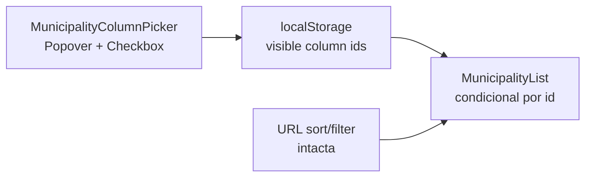

# B17 — Seletor de colunas na lista de Municípios

Status: rascunho — **costuras prontas desde o Pass 2 W1 (2026-07-25):** as colunas da lista são dado (`CampaignTable`, `CampaignTableColumn.id`/`mandatory`/`defaultVisible`); o seletor vira um toggle de visibilidade sobre esses ids + `localStorage`
Atualizado em: 2026-07-24
Item do roadmap: [docs/roadmap.md](../roadmap.md) (Demais itens abertos, B17; superfície de coordenação)
Impeccable: B — encaixe em `MunicipalityList` / barra slim de `/campanha/municipios`; sem rota nova
Appetite: ~0,5–1 dia eng; Popover de colunas + persistência local + render condicional desktop; sem migration, sem collection, sem Consent
Responsável: —

## Design (Impeccable)

Âncoras: `PRODUCT.md` (princípios 2 — clareza sob pressão — e 8 — Feel the action) / `DESIGN.md` (register `product`; Field Desk) · tema `data-theme='campaign'` · shells `MunicipalityList`, `CampaignListPendingBoundary`, shadcn `Popover` / `Checkbox` / `Button`.

Na implementação (`implement-roadmap-item`): craft compacto → critique → polish (só seletor + hide/show; sem redesign da lista/overview nem reorder).

Brief compacto:

- **Persona / contexto:** Alex (CG / Assessor / Candidato) na tabela desktop densa (hoje **9** colunas staff: Município, TI, Tipo, 2022, Assessores, Tendência, Votos estimados, Última atualização, Cobertura); olho compete entre eixos e a tela aperta em laptop de campo.
- **Job principal:** ligar/desligar colunas secundárias para ver só o recorte mental da sessão (ex. nome + 2022 + votos estimados) sem perder sort/filtro/URL.
- **Estratégia de cor:** Restrained — botão “Colunas” sóbrio na barra; checkboxes padrão; sem segunda fileira de chips.
- **Edit where you see:** não — seletor é preferência de viewport; células B9 continuam mutáveis nas colunas que permanecerem visíveis.
- **Anti-goals:** spreadsheet / data-grid / TanStack Table; reorder drag-and-drop de colunas; esconder a coluna Município; meter preferência na URL (quebra share); reinventar cards mobile.

## Dados → decisão → apresentação

- **Vou apresentar dados?** Não como métrica nova — **Dados: N/A** para fórmula/KPI. A superfície continua a **tabela/lista** já existente; este item só controla **quais colunas** do viewport desktop aparecem.
- **Decisões desbloqueadas:** Staff: “nesta sessão quero comparar só concentração 2022 × votos estimados × tendência — esconder TI/Tipo/Cobertura para caber na tela.”
- **Forma escolhida:** **tabela / lista** (inalterada) + seletor de visibilidade — **por quê:** o dado já está na tabela; o problema é densidade do viewport. **Rejeitado:** segunda view “compacta” fixa; chart de colunas; export CSV só das colunas visíveis neste item.
- **Profile:** N/A (sem série/mapa novo); granularidade município; ≤435 no filtrado; colunas já carregadas no VM (hide é só UI).
- **Anti-goals de dado:** sem inventar coluna/métrica; sem omitir coluna no loader só porque está oculta (paginação/sort/filtro independem do viewport).

Self-check dados: N/A (sem superfície de métrica nova).

## Contexto

Em `/campanha/municipios`, `MunicipalityList` (`src/components/campaign/MunicipalityList.tsx`) renderiza tabela desktop (`md+`) com headers fixos + cards mobile com subset curado. Estado canônico de **recorte/ordem** vive na URL (`MunicipalityListState` em `municipalityUi.ts`: filtros + B15 `sort`/`dir`). **B16** relocaciona filtros para o `TableHead` e deixa a barra slim (busca + Limpar [+ Cenário]). **E9** (fila de alocação) vai acrescentar colunas derivadas na mesma lista — densidade só aumenta.

Não há hoje controle de quais colunas aparecem. Pedido de produto (2026-07-24): **avaliar** seletor para ativar/desativar colunas.

Vizinhos: [B15 ordenação](ordenacao-colunas-lista-municipios.md) ✓ · [B16 filtros no header](filtros-no-header-lista-municipios.md) · [E9 fila](fila-de-alocacao.md) · fill-ins [Cenário](cenario-junto-filtros-municipios.md) / [ícone prioridade](icone-prioridade-lista-municipios.md).

## Objetivos

- Desktop (`md+`), staff: controle **Colunas** (Popover) listando as colunas toggable com checkboxes; toggles refletem imediatamente no `Table` (sem RSC round-trip).
- Coluna **Município** (`name`) sempre visível (não aparece como desligável, ou aparece desabilitada).
- Preferência persistida **localmente** no browser (sobrevive reload da mesma máquina); defaults = todas as colunas atuais ligadas.
- Sort/filtro URL intactos: se a coluna ativa de sort/filtro for ocultada, o estado URL permanece (lista continua ordenada/filtrada); affordance de sort some com o header — sem mentir a ordem.
- Mobile (cards): **fora do seletor** — cards já são subset curado; não inventar “headers” em cards.
- Guardrails: sem migration, sem collection, sem Consent, sem server action; `leader` sem a página; access/loader inalterados (`overrideAccess: false`); dados do VM continuam completos (hide ≠ select omit).

## Decisões travadas

- **Item de trilha B17 (não fill-in; não só R6; não fase informal de B16).** Pattern de viewport da lista que **E9** consome quando a fila engordar colunas; ~0,5–1d; distinto de sort (B15) e filtro-no-header (B16). (2026-07-24, roadmap-item — avaliação de produto.) **Rejeitado:** fill-in só (subestima o contrato de ids de coluna que E9 precisa respeitar); absorver em B16 (B16 já tem appetite e job diferentes); absorver em E9 (atrasa o quick win de densidade pré-fila e mistura preferência de UI com métricas derivadas); só R6 (atrasa e dilui).
- **Persistência = `localStorage` (não URL).** Preferência de viewport por dispositivo/ator local; não é estado de decisão compartilhado. Key estável namespaced (ex. `campanha:municipality-list:visible-columns`). **Rejeitado:** `?cols=` na URL (polui share/back; compete com sort/filter; B15 já rejeitou cookie/URL para preferência pessoal no sort — aqui URL seria ainda pior); só memória da sessão (perde no ritual diário do CG que reabre a página); cookie server-side / preferência em `campaignUser` (migration + sync multi-device sem evidência).
- **IDs de coluna estáveis em inglês**, alinhados às sort keys quando existir par: `name` | `region` | `kind` | `votos` | `advisors` | `trend` | `expectedVotes` | `lastUpdateAt` | `coverage`. Labels pt-BR = headers atuais. **Rejeitado:** ids derivados do label pt-BR; TanStack column defs genéricas.
- **`name` obrigatória.** Demais toggable. **Rejeitado:** permitir tabela sem nome (inútil); forçar `votos` sempre on (a âncora A11 é default de sort, não de viewport — sessão pode focar só estimativas).
- **Affordance = botão “Colunas” → Popover + Checkbox** na barra slim (ao lado de busca/Limpar/Cenário quando existirem), não no `TableHead`. **Rejeitado:** DropdownMenu novo (não há no shadcn do repo — Popover+Checkbox bastam); menu por coluna (descuberta pior); TanStack Table ColumnVisibility API.
- **Hide é só render** — loader/VM/paginação/sort inalterados. **Rejeitado:** omitir campos no `select` Payload conforme colunas (acopla preferência client a query; quebra sort em coluna oculta).
- **i18n e naming:** `MunicipalityColumnId`, `MunicipalityColumnVisibility`, `MunicipalityColumnPicker`; strings “Colunas”, “Mostrar colunas”, labels dos headers em pt-BR.

## Questões em aberto

- **Default inicial: todas ligadas vs. preset “mesa” (nome + 2022 + votos estimados + tendência)?** **Opções:** A) todas on (zero surpresa) | B) preset compacto | C) preset compacto só na 1ª visita com CTA “Restaurar todas”. **Recomendação:** **A** — preferência começa igual ao hoje; quem apertar a tela desliga. _(assumido — validar com produto)_
- **Coluna oculta que é o `sort` ativo: manter chevron invisível ou forçar reexibir a coluna?** **Opções:** A) ocultar header; sort URL permanece; live region/`sortSummary` já anuncia a ordem | B) ao ocultar coluna sorted, resetar sort para `name` | C) impedir uncheck da coluna sorted. **Recomendação:** **A** — sortSummary já existe; não mutar URL por preferência de viewport. _(assumido)_
- **Aterrar antes ou depois de B16?** **Opções:** A) B17 depois de B16 (barra slim já definida) | B) B17 agora na fileira atual | C) mesmo PR. **Recomendação:** **A** ou **C** se o implementador pegar os dois — o botão Colunas mora na slim bar que B16 cria; sem B16, pousa ao lado de Limpar na fileira atual. Soft dep, não dura.

## Abordagem proposta

Componentes:

- **`MunicipalityColumnId` + defaults/labels** (em `src/utilities/municipalityUi.ts` ou módulo irmão `municipalityListColumns.ts` se o arquivo de UI já estiver gordo): união das colunas desktop staff; `MANDATORY_MUNICIPALITY_LIST_COLUMNS = ['name']`; labels reusando headers / `municipalityListSortLabels` onde couber (`advisors` sem sort key).
- **`useMunicipalityColumnVisibility`** (hook client, `src/components/campaign/…` ou colado no picker): lê/escreve `localStorage` com parse fail-closed → default todas on; `toggle(id)` ignora mandatory; SSR-safe (default all-on até hydrate — flash mínimo aceitável, ou `useSyncExternalStore`).
- **`MunicipalityColumnPicker`** (`'use client'`): `Button` “Colunas” + `Popover` com lista de `Checkbox` + label; `aria-label` “Mostrar ou ocultar colunas”; estado imediato no controle (Feel the action — sem pending de RSC).
- **`MunicipalityList`**: receber `visibleColumns` via island wrapper **ou** tornar o trecho da tabela um client child fino que consome o hook — preferir **wrapper client só da tabela desktop** (`MunicipalityListTable`) para a lista RSC continuar a montar props; cards mobile inalterados. Condicionar cada `TableHead`/`TableCell` ao set visível.
- **Barra**: plugar o picker em `MunicipalityFilters` (slim pós-B16) ou slot explícito na page ao lado dos filtros — depth: reusar a barra, não inventar segunda toolbar.
- **Migration**: Sem migration, sem collection, sem server action.

Depth check: reusa `Popover`/`Checkbox`/`Button` e keys de `municipalityUi`; sem lib de tabela; sem preferência server-side.

## Dependências

- **Suaves:** B15 ✓ (ids alinhados a sort keys); B16 (destino da barra slim — soft). Nenhuma dura de outro plano aberto.
- **Dependentes suaves:** **E9** (fila) deve reusar os mesmos `MunicipalityColumnId` ao acrescentar colunas derivadas (novas ids entram no picker com default on).

## Não escopo

- Reordenação / resize / pin de colunas (spreadsheet) — reorder DnD avaliado e **fora de escopo**: [reordenar-colunas-lista-municipios.md](reordenar-colunas-lista-municipios.md).
- Preferência syncada em `campaignUser` / multi-device.
- Seletor nas listas de apoiadores / lideranças / planos (fill-in sob demanda no 2º call site).
- Alterar o subset dos cards mobile.
- Omitir campos no loader/VM; export CSV filtrado por colunas visíveis.
- Colunas novas da fila E9 (só o contrato de ids para quando chegarem).

## Rabbit holes

- **TanStack Table / data-grid.** Explode B9 + RSC + pending. **Mitigação:** hide condicional no Table shadcn atual.
- **URL `?cols=`.** Polui share e compete com B15/B16. **Mitigação:** localStorage only.
- **Shared ColumnVisibility service genérico.** Classitis com 1 call site. **Mitigação:** módulo da lista de municípios; extrair no 3º consumidor.
- **Hydration mismatch agressivo.** **Mitigação:** default all-on no SSR + sync no client; ou `useSyncExternalStore` com `getServerSnapshot` = all-on.

## Adiado com gatilho

- **Preset “mesa” compacto como default.** Revisitar quando: evidência de campo (onboarding / R6) de que 9 colunas atrapalham na 1ª visita **e** o seletor não é descoberto.
- **Preferência por `campaignUser` (server).** Revisitar quando: o mesmo ator reclamar em 2+ dispositivos **e** houver appetite para migration de preferências UI.
- **Picker em outras listas `/campanha`.** Revisitar quando: 2º call site real (não especulativo).
- **Ids/novas colunas de E9 no picker.** Entram no item E9 (default on); este item só deixa o contrato pronto.

## Referências

- `docs/roadmap.md` (Demais itens abertos · B17; grafo; cortes)
- `src/components/campaign/MunicipalityList.tsx` — headers/células desktop a condicionar
- `src/utilities/municipalityUi.ts` — sort keys / labels / state URL (não misturar visibility na URL)
- `src/components/campaign/MunicipalityFilters.tsx` — destino do botão na barra
- `src/components/ui/Popover.tsx`, `Checkbox.tsx`, `button.tsx`
- Planos vizinhos: [ordenacao-colunas-lista-municipios.md](ordenacao-colunas-lista-municipios.md), [filtros-no-header-lista-municipios.md](filtros-no-header-lista-municipios.md), [fila-de-alocacao.md](fila-de-alocacao.md), [reordenar-colunas-lista-municipios.md](reordenar-colunas-lista-municipios.md) (fora de escopo — ordem ≠ visibilidade)
- AGENTS.md — naming EN / strings pt-BR; Campaign auth staff-only
- `PRODUCT.md` / `DESIGN.md` — Field Desk, clareza sob pressão, anti spreadsheet
