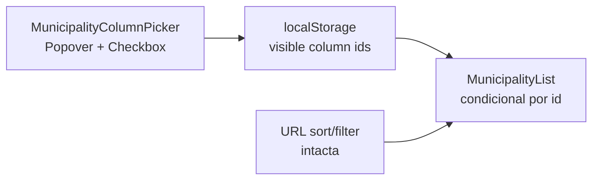

# B17 — Seletor de colunas (todas as listas do sistema `CampaignTable`)

Status: **entregue 2026-07-28** — e com escopo maior e mecanismo diferente do que este plano previa; ver "Como ficou" abaixo antes de ler o resto, que é o desenho de 2026-07-24 preservado como registro
Atualizado em: 2026-07-28
Item do roadmap: [docs/roadmap.md](../roadmap.md) (B17; superfície de coordenação)
Impeccable: B — encaixe no `CampaignTable`; sem rota nova
Appetite: revisado para ~1,3 dia eng (o plano previa 0,5–1 dia para **uma** lista; sete superfícies + a peça compartilhada + `label` em ~55 definições de coluna explicam a diferença); sem migration, sem collection, sem Consent

## Como ficou (as-built, 2026-07-28)

**Escopo: sete superfícies, não uma.** O picker nasceu como capacidade do `CampaignTable` — uma prop `columnVisibility` liga o controle e filtra as colunas — então municípios, lideranças, dobradinhas, organizações, demandas, apoiadores e territórios ganharam a mesma barra "Colunas" no mesmo lugar (`hidden md:flex`, alinhada à direita, acima da tabela). Fora: `/campanha/assessores`, cujo `AdvisorsTable` ainda é um `ui/Table` cru com `table-fixed` — migrá-lo ao sistema de listas é outro trabalho.

**Persistência: cookie, não `localStorage`.** A decisão travada abaixo ("`localStorage`, sem RSC round-trip") **morreu na implementação, por um fato de tipo, não de gosto**: `CampaignTableColumn.cell` é uma **função**, então o array de colunas não atravessa a fronteira server/client e o cliente não tem como reconstruir a tabela sem ela; esconder no cliente exigiria marcar cada célula com `data-column` e injetar `<style>` por lista. Persistência virou o cookie `campaign_columns` (path `/campanha`, `SameSite=Lax`, 1 ano, legível pelo cliente porque é ele quem escreve), com um mapa `listId → ids ocultos` num formato compacto (`municipios:kind~trend|demandas:requester`) — **sem `JSON` e sem percent-encoding**, porque `document.cookie` e o `cookies()` do Next discordam sobre decodificação e todo caractere usado é legal num cookie-value pela RFC 6265. O servidor filtra: a coluna oculta **não é renderizada nem viaja no payload RSC**. O custo é um `router.refresh()` por sessão de edição — **fechar o menu é o commit**; o timer de 3 s é rede de segurança para um Popover deixado aberto, e grava só o cookie, sem refresh —, dentro da transição compartilhada — o resultado dima como em qualquer filtro dessas telas.

**O seam `defaultVisible` morreu.** Era declarado `true` em 10 colunas de `TerritoryListColumns` e `false` em nenhuma. Guardar apenas o **conjunto de ocultas** é o que garante que uma coluna nova nasça visível para quem nunca tocou no picker — o contrato que E9 ✓ e E14 ✓ já assumiam. Em troca, `label: string` passou a ser **obrigatório** em `CampaignTableColumn`: o picker precisa de um rótulo serializável, e `head` continua `ReactNode` opaco.

**`mandatory` é refiltrado no servidor.** Cada superfície declara a sua coluna de identidade como `mandatory`; ela aparece no menu, desabilitada e com o motivo ("sempre visível"), e `resolveVisibleColumns` a mantém **mesmo que o cookie diga o contrário** — um cookie velho não pode deixar ninguém sem a única célula linkada da linha.

**O bug que a revisão pegou** é o de sempre nesta base, em roupa nova: o payload RSC do toggle A chega enquanto B ainda está na janela de debounce; adotar o servidor ali desfazia B **e depois commitava o conjunto sem ele**, perdendo-o em silêncio. A reconciliação passou a rodar só quando não há escrita pendente, pinada em `tests/unit/campaignColumnPicker.unit.spec.ts` (verificado vermelho contra o código anterior).

**Nota de operação, não de código:** durante a sessão, duas rodadas de e2e sugeriram que "`router.refresh()` não aplica o cookie". Era a máquina em load 40 com outro worktree compilando — a suíte passa a 1 e a 2 workers, e a lição registrada é que o `expect` padrão de 5 s não cobre um round-trip RSC de rota pesada em dev com dois workers (as asserções de refresh têm orçamento próprio).

**O `/simplify` mudou três coisas do primeiro corte, e uma delas era uma premissa escrita em comentário.** (1) `listId` + `hiddenColumnIds` viraram **um** valor, `columnVisibility: CampaignColumnVisibility`, devolvido inteiro por `readCampaignColumnVisibility(listId)`: cada superfície nomeia a sua lista **uma vez**. Como duas props, o cookie podia ser lido numa chave e escrito noutra — ambas válidas, nada quebrando, e o sintoma seria "o picker não faz nada". (2) `head` passou a ser **opcional**, com default `<CampaignTableHead>{label}</CampaignTableHead>`: em 24 colunas o `head` só repetia o `label` recém-adicionado, e essa duplicação nascia com este item. Quatro arquivos deixaram de importar `CampaignTableHead` — medida de que a duplicação era real. O `label` continua obrigatório, e a única divergência legítima entre os dois está documentada no tipo: um header pode ser telegráfico porque está em cima dos próprios dados (municípios: "2022"), enquanto a mesma palavra sozinha num menu de nomes de coluna não diz nada ("Votação 2022"). (3) A caption de municípios decidia se cita a coluna "2022" com `hiddenColumnIds.includes('votos')` — uma segunda implementação de "esta coluna está visível?", cega a `mandatory`; agora pergunta a `resolveVisibleColumns`, a mesma função que a tabela usa.

**A segunda rodada do `/simplify` (reuso e performance) achou duplicação que já tinha dono.** (1) O `contentKey` (sort + join) do picker era `sameIdSet` reescrito — o helper cuja docstring descreve **exatamente** esta política; ele foi generalizado para `string | number`, o picker virou o 4º chamador e um `useState` que guardava string derivada morreu junto. (2) Os `label` eram uma segunda fonte de verdade onde já existia módulo de rótulos: territórios acertou (`territoryListSortLabels`), municípios e dobradinhas não. Agora `municipalityColumnLabels` — em `municipalityListUrl.ts`, porque `municipalityLabels.ts` já é importado por ele e o contrário seria ciclo — é `Record<MunicipalityListColumnId, string>` e cita `municipalityListSortLabels` nas dez que **precisam** bater com o header (é de lá que `MunicipalitySortableHead` resolve o texto), deixando as duas divergências de propósito escritas com o motivo ao lado (`votos`, `lastSignal`). Na esteira, o `id` das colunas de municípios passou a ser **tipado** contra `MunicipalityListColumnId`, o que exigiu alinhar o membro `nivel` → `level`: o id da coluna e o filtro `?level=` já eram `level` (o sort continua `nivel`, e as duas grafias de URL estão congeladas pelo B18). Id, descrição (B22 ✓) e rótulo do picker são a mesma chave — coluna nova não nasce sem os três, e renomear o header renomeia a entrada do menu. (3) Dois nits com precedente a três arquivos de distância: `aria-label` no `PopoverContent` (o Radix dá `role="dialog"` sem nome — a mesma correção que `CampaignCellEditOverlay` já documenta) e `secure` no cookie quando o protocolo é https, alinhando com `campaignCookieOptions`.

**A cadência do refresh mudou por medição, e o número que importa não é o do debounce.** O primeiro corte commitava com debounce de 400 ms, o que agrupa **rajada**, não sessão de leitura: desmarcar quatro colunas lendo os rótulos entre os cliques eram quatro `router.refresh()` de rota inteira. Em `/campanha/liderancas` cada um re-paga os ~229 ms / 371 statements fichados como P1 no `TECH-DEBT` (367 deles o mesmo N+1 de access), com o resultado dimando a cada clique. Agora **fechar o menu é o commit** e o timer virou rede de segurança de 3 s para quem deixa o Popover aberto. O que se perde está dito porque é real: a tabela atrás do menu não atualiza mais a cada marcação — a checkbox é o feedback do controle, o refresh é o resultado. O caso "1 s entre duas marcações = **um** refresh" está pinado em `campaignColumnPicker.unit.spec.ts` com fake timers (verificado vermelho contra os 400 ms), junto do caso da rede de segurança.

**Rejeitado com razão medida.** `CampaignTable` ler o cookie sozinho — o que apagaria as 7 leituras nas páginas e as 3 props de passagem — funcionaria, porque todo chamador é RSC; mas `tests/unit/campaignTable.unit.spec.ts` renderiza a tabela com `renderToStaticMarkup`, que não espera componente async, e foi exatamente esse fato que fez as listas voltarem a ser síncronas durante a implementação. Trocar cobertura por menos props não paga. Também rejeitada a casca compartilhada de painel de Popover: 2 chamadores, e o 3º corpo de multi-seleção já é gatilho registrado no B32+.

**Lacuna conhecida (fill-in, não bug):** o picker é `hidden md:flex` porque municípios e apoiadores escondem esta tabela abaixo de `md` e mostram cards. As **outras cinco** superfícies renderizam a tabela em qualquer largura, então num celular elas rolam a tabela sem ter o controle. Dar picker a elas é um seam por caller, não um breakpoint: mover o `className` do caller para um wrapper externo quebraria o `overflow-visible` de que a coluna sticky de B41 depende. Gatilho: alguém usar essas listas no celular de verdade.

Arquivos: `src/lib/campaignColumnVisibility.ts` (puro, client-safe), `src/utilities/campaignColumnVisibilityCookie.ts` (`server-only`), `src/components/campaign/shared/CampaignColumnPicker.tsx`, seams em `src/components/campaign/shared/CampaignTable.tsx`.

**Segundo `/simplify` (pós-rebase em `main`), e o achado principal os três revisores encontraram sozinhos.** Os quatro `*SortableHead` **já** resolviam o próprio texto do registro de rótulos (`children ?? municipalityListSortLabels[sortKey]`), e `TerritoryListColumns` já dependia disso — passar `children` iguais ao registro era duplicação pura. O `label` novo do B17 tinha tornado a duplicação **tripla** em vez de apagá-la, e o docblock que promete "renomear o header renomeia a entrada do menu" era falso onde mais parecia verdadeiro. Foram **16** literais removidos (10 em municípios, 4 em lideranças pós-B29, 2 em dobradinhas); sobra um único `children`, o de `frescor`, que diverge de propósito ("Último sinal" na coluna, "Frescor do sinal" na ordenação) e agora lê `municipalityColumnLabels.lastSignal`, então nem esse tem a string escrita duas vezes. O `sortLabel` do `CampaignSortableHead` sempre veio do registro, então o nome acessível não mudou — só o texto visível deixou de ter uma segunda fonte.

**A cadência ganhou uma separação que faltava.** O timer de 3 s era descrito como rede de segurança, mas commitava igual ao fechamento: refresh incluído. Como três segundos é um intervalo comum entre cliques quando se está lendo rótulos desconhecidos, ele reproduzia — mais devagar — exatamente a falha pela qual os 400 ms foram recusados. Agora `persist()` (timer) grava só o cookie e `commit()` (fechar) grava e repinta. Duas guardas nasceram com a separação: **sessão que termina onde começou não dá refresh** (`sameIdSet` contra o conjunto renderizado — marcar e desmarcar a mesma coluna re-pagava a rota inteira para produzir a mesma página), e **desmontar com o menu aberto grava pelo cleanup**, porque o Radix não emite `onOpenChange` numa navegação de sidebar e a escolha sumia sem aviso. As duas especificações foram verificadas vermelhas contra o código anterior. Com as guardas dentro de `commit`, o `open` controlado virou supérfluo e saiu.

**Miudezas do mesmo passe:** `columnVisibility` era opcional em `MunicipalityList` **só** para poupar os testes (o comentário dizia isso), então virou obrigatório e o objeto de props compartilhado dos specs ganhou o valor; `MAX_HIDDEN_PER_LIST` era um segundo teto sem ameaça atrás dele (id que não casa com coluna nenhuma é inerte) e ainda assimétrico, porque `serialize` não o aplicava — o teto de tamanho do cookie basta; `resolveVisibleColumns` copiava o array no caminho comum só para satisfazer o tipo de retorno, que agora é `readonly`; o tipo da coluna de municípios, escrito três vezes, virou um alias local; e o mock de `next/navigation` do spec passou a espalhar o módulo real como os três specs irmãos, em vez de substituí-lo inteiro.

**Herdado do rebase, corrigido aqui porque o gate exige:** `LeadershipListAccessFilter` (B29) era exportado sem consumidor externo, e knip trata export morto como ERROR — `pnpm exec knip` falhava em `origin/main` também.

**Recusado com razão, e o motivo importa mais que a recusa.** Mover as leituras de `readCampaignColumnVisibility` para **antes** do `Promise.all` das páginas permitiria pular a query da coluna oculta — `/campanha/dobradinhas` roda `loadLeadershipOptions` (`limit: 0`, `depth: 1`, toda liderança visível) mesmo com a coluna "Lideranças" escondida, e `cookies()` não faz I/O, então a leitura antecipada é grátis. É o maior ganho disponível e **não** é limpeza: carregamento condicional muda o que cada página garante ao construir as colunas. Fica como **F1 do [B17+](escala-dry-pos-b17.md)**, junto com a F2 que o mesmo passe encontrou — o botão "Colunas" some com a tabela no estado vazio de demandas/organizações/apoiadores, que substituem a tabela inteira em vez de usar a prop `empty` que a `CampaignTable` expõe. Também recusados: adotar o shell de Popover do `CampaignHeaderFilterPopover` (as linhas dele são âncoras de navegação, as do picker são checkboxes — seriam dois componentes com um nome só); mover `readCookie`/`writeCookie` para um módulo irmão de `recentVisits.ts` (placement melhor, ganho cosmético); e dar `children` opcional ao `LeadershipFilterHead` do B29 para matar os dois últimos literais de lideranças (mexe na API de uma entrega recém-chegada).

## Desenho original (2026-07-24, preservado)

## Design (Impeccable)

Âncoras: `PRODUCT.md` (princípios 2 — clareza sob pressão — e 8 — Feel the action) / `DESIGN.md` (register `product`; Field Desk) · tema `data-theme='campaign'` · shells `MunicipalityList`, `CampaignListPendingBoundary`, shadcn `Popover` / `Checkbox` / `Button`.

Na implementação (`implement-roadmap-item`): craft compacto → critique → polish (só seletor + hide/show; sem redesign da lista/overview nem reorder).

Brief compacto:

- **Persona / contexto:** Alex (CG / Assessor / Candidato) na tabela desktop densa (hoje **9** colunas staff: Município, TI, Tipo, 2022, Assessores, Tendência, Votos estimados, Última atualização, Cobertura); olho compete entre eixos e a tela aperta em laptop de campo.
- **Job principal:** ligar/desligar colunas secundárias para ver só o recorte mental da sessão (ex. nome + 2022 + votos estimados) sem perder sort/filtro/URL.
- **Estratégia de cor:** Restrained — botão “Colunas” sóbrio na barra; checkboxes padrão; sem segunda fileira de chips.
- **Edit where you see:** não — seletor é preferência de viewport; células B9 continuam mutáveis nas colunas que permanecerem visíveis.
- **Anti-goals:** spreadsheet / data-grid / TanStack Table; reorder drag-and-drop de colunas; esconder a coluna Município; meter preferência na URL (quebra share); reinventar cards mobile.

## Dados → decisão → apresentação

- **Vou apresentar dados?** Não como métrica nova — **Dados: N/A** para fórmula/KPI. A superfície continua a **tabela/lista** já existente; este item só controla **quais colunas** do viewport desktop aparecem.
- **Decisões desbloqueadas:** Staff: “nesta sessão quero comparar só concentração 2022 × votos estimados × tendência — esconder TI/Tipo/Cobertura para caber na tela.”
- **Forma escolhida:** **tabela / lista** (inalterada) + seletor de visibilidade — **por quê:** o dado já está na tabela; o problema é densidade do viewport. **Rejeitado:** segunda view “compacta” fixa; chart de colunas; export CSV só das colunas visíveis neste item.
- **Profile:** N/A (sem série/mapa novo); granularidade município; ≤435 no filtrado; colunas já carregadas no VM (hide é só UI).
- **Anti-goals de dado:** sem inventar coluna/métrica; sem omitir coluna no loader só porque está oculta (paginação/sort/filtro independem do viewport).

Self-check dados: N/A (sem superfície de métrica nova).

## Contexto

Em `/campanha/municipios`, `MunicipalityList` (`src/components/campaign/MunicipalityList.tsx`) renderiza tabela desktop (`md+`) com headers fixos + cards mobile com subset curado. Estado canônico de **recorte/ordem** vive na URL (`MunicipalityListState` em `municipalityUi.ts`: filtros + B15 `sort`/`dir`). **B16** relocaciona filtros para o `TableHead` e deixa a barra slim (busca + Limpar [+ Cenário]). **E9** (fila de alocação) vai acrescentar colunas derivadas na mesma lista — densidade só aumenta.

Não há hoje controle de quais colunas aparecem. Pedido de produto (2026-07-24): **avaliar** seletor para ativar/desativar colunas.

Vizinhos: [B15 ordenação](ordenacao-colunas-lista-municipios.md) ✓ · [B16 filtros no header](filtros-no-header-lista-municipios.md) · [E9 fila](fila-de-alocacao.md) · fill-ins [Cenário](cenario-junto-filtros-municipios.md) / [ícone prioridade](icone-prioridade-lista-municipios.md).

## Objetivos

- Desktop (`md+`), staff: controle **Colunas** (Popover) listando as colunas toggable com checkboxes; toggles refletem imediatamente no `Table` (sem RSC round-trip).
- Coluna **Município** (`name`) sempre visível (não aparece como desligável, ou aparece desabilitada).
- Preferência persistida **localmente** no browser (sobrevive reload da mesma máquina); defaults = todas as colunas atuais ligadas.
- Sort/filtro URL intactos: se a coluna ativa de sort/filtro for ocultada, o estado URL permanece (lista continua ordenada/filtrada); affordance de sort some com o header — sem mentir a ordem.
- Mobile (cards): **fora do seletor** — cards já são subset curado; não inventar “headers” em cards.
- Guardrails: sem migration, sem collection, sem Consent, sem server action; `leader` sem a página; access/loader inalterados (`overrideAccess: false`); dados do VM continuam completos (hide ≠ select omit).

## Decisões travadas

- **Item de trilha B17 (não fill-in; não só R6; não fase informal de B16).** Pattern de viewport da lista que **E9** consome quando a fila engordar colunas; ~0,5–1d; distinto de sort (B15) e filtro-no-header (B16). (2026-07-24, roadmap-item — avaliação de produto.) **Rejeitado:** fill-in só (subestima o contrato de ids de coluna que E9 precisa respeitar); absorver em B16 (B16 já tem appetite e job diferentes); absorver em E9 (atrasa o quick win de densidade pré-fila e mistura preferência de UI com métricas derivadas); só R6 (atrasa e dilui).
- **Persistência = `localStorage` (não URL).** Preferência de viewport por dispositivo/ator local; não é estado de decisão compartilhado. Key estável namespaced (ex. `campanha:municipality-list:visible-columns`). **Rejeitado:** `?cols=` na URL (polui share/back; compete com sort/filter; B15 já rejeitou cookie/URL para preferência pessoal no sort — aqui URL seria ainda pior); só memória da sessão (perde no ritual diário do CG que reabre a página); cookie server-side / preferência em `campaignUser` (migration + sync multi-device sem evidência).
- **IDs de coluna estáveis em inglês**, alinhados às sort keys quando existir par: `name` | `region` | `kind` | `votos` | `advisors` | `trend` | `expectedVotes` | `lastUpdateAt` | `coverage`. Labels pt-BR = headers atuais. **Rejeitado:** ids derivados do label pt-BR; TanStack column defs genéricas.
- **`name` obrigatória.** Demais toggable. **Rejeitado:** permitir tabela sem nome (inútil); forçar `votos` sempre on (a âncora A11 é default de sort, não de viewport — sessão pode focar só estimativas).
- **Affordance = botão “Colunas” → Popover + Checkbox** na barra slim (ao lado de busca/Limpar/Cenário quando existirem), não no `TableHead`. **Rejeitado:** DropdownMenu novo (não há no shadcn do repo — Popover+Checkbox bastam); menu por coluna (descuberta pior); TanStack Table ColumnVisibility API.
- **Hide é só render** — loader/VM/paginação/sort inalterados. **Rejeitado:** omitir campos no `select` Payload conforme colunas (acopla preferência client a query; quebra sort em coluna oculta).
- **i18n e naming:** `MunicipalityColumnId`, `MunicipalityColumnVisibility`, `MunicipalityColumnPicker`; strings “Colunas”, “Mostrar colunas”, labels dos headers em pt-BR.

## Questões em aberto

- **Default inicial: todas ligadas vs. preset “mesa” (nome + 2022 + votos estimados + tendência)?** **Opções:** A) todas on (zero surpresa) | B) preset compacto | C) preset compacto só na 1ª visita com CTA “Restaurar todas”. **Recomendação:** **A** — preferência começa igual ao hoje; quem apertar a tela desliga. _(assumido — validar com produto)_
- **Coluna oculta que é o `sort` ativo: manter chevron invisível ou forçar reexibir a coluna?** **Opções:** A) ocultar header; sort URL permanece; live region/`sortSummary` já anuncia a ordem | B) ao ocultar coluna sorted, resetar sort para `name` | C) impedir uncheck da coluna sorted. **Recomendação:** **A** — sortSummary já existe; não mutar URL por preferência de viewport. _(assumido)_
- **Aterrar antes ou depois de B16?** **Opções:** A) B17 depois de B16 (barra slim já definida) | B) B17 agora na fileira atual | C) mesmo PR. **Recomendação:** **A** ou **C** se o implementador pegar os dois — o botão Colunas mora na slim bar que B16 cria; sem B16, pousa ao lado de Limpar na fileira atual. Soft dep, não dura.

## Abordagem proposta

Componentes:

- **`MunicipalityColumnId` + defaults/labels** (em `src/utilities/municipalityUi.ts` ou módulo irmão `municipalityListColumns.ts` se o arquivo de UI já estiver gordo): união das colunas desktop staff; `MANDATORY_MUNICIPALITY_LIST_COLUMNS = ['name']`; labels reusando headers / `municipalityListSortLabels` onde couber (`advisors` sem sort key).
- **`useMunicipalityColumnVisibility`** (hook client, `src/components/campaign/…` ou colado no picker): lê/escreve `localStorage` com parse fail-closed → default todas on; `toggle(id)` ignora mandatory; SSR-safe (default all-on até hydrate — flash mínimo aceitável, ou `useSyncExternalStore`).
- **`MunicipalityColumnPicker`** (`'use client'`): `Button` “Colunas” + `Popover` com lista de `Checkbox` + label; `aria-label` “Mostrar ou ocultar colunas”; estado imediato no controle (Feel the action — sem pending de RSC).
- **`MunicipalityList`**: receber `visibleColumns` via island wrapper **ou** tornar o trecho da tabela um client child fino que consome o hook — preferir **wrapper client só da tabela desktop** (`MunicipalityListTable`) para a lista RSC continuar a montar props; cards mobile inalterados. Condicionar cada `TableHead`/`TableCell` ao set visível.
- **Barra**: plugar o picker em `MunicipalityFilters` (slim pós-B16) ou slot explícito na page ao lado dos filtros — depth: reusar a barra, não inventar segunda toolbar.
- **Migration**: Sem migration, sem collection, sem server action.

Depth check: reusa `Popover`/`Checkbox`/`Button` e keys de `municipalityUi`; sem lib de tabela; sem preferência server-side.

## Dependências

- **Suaves:** B15 ✓ (ids alinhados a sort keys); B16 (destino da barra slim — soft). Nenhuma dura de outro plano aberto.
- **Dependentes suaves:** **E9** (fila) deve reusar os mesmos `MunicipalityColumnId` ao acrescentar colunas derivadas (novas ids entram no picker com default on).

## Não escopo

- Reordenação / resize / pin de colunas (spreadsheet) — reorder DnD avaliado e **fora de escopo**: [reordenar-colunas-lista-municipios.md](reordenar-colunas-lista-municipios.md).
- Preferência syncada em `campaignUser` / multi-device.
- Seletor nas listas de apoiadores / lideranças / planos (fill-in sob demanda no 2º call site).
- Alterar o subset dos cards mobile.
- Omitir campos no loader/VM; export CSV filtrado por colunas visíveis.
- Colunas novas da fila E9 (só o contrato de ids para quando chegarem).

## Rabbit holes

- **TanStack Table / data-grid.** Explode B9 + RSC + pending. **Mitigação:** hide condicional no Table shadcn atual.
- **URL `?cols=`.** Polui share e compete com B15/B16. **Mitigação:** localStorage only.
- **Shared ColumnVisibility service genérico.** Classitis com 1 call site. **Mitigação:** módulo da lista de municípios; extrair no 3º consumidor.
- **Hydration mismatch agressivo.** **Mitigação:** default all-on no SSR + sync no client; ou `useSyncExternalStore` com `getServerSnapshot` = all-on.

## Adiado com gatilho

- **Preset “mesa” compacto como default.** Revisitar quando: evidência de campo (onboarding / R6) de que 9 colunas atrapalham na 1ª visita **e** o seletor não é descoberto.
- **Preferência por `campaignUser` (server).** Revisitar quando: o mesmo ator reclamar em 2+ dispositivos **e** houver appetite para migration de preferências UI.
- **Picker em outras listas `/campanha`.** Revisitar quando: 2º call site real (não especulativo).
- **Ids/novas colunas de E9 no picker.** Entram no item E9 (default on); este item só deixa o contrato pronto.
- **`CampaignPopoverMenu` (chrome dividido com `CampaignHeaderFilterPopover`).** Revisitar quando: o seam do picker abaixo de `md` criar o 3º uso do mesmo chrome. Hoje 2 call sites com linhas de natureza diferente.
- **`createStaff(role)` no fixture e2e.** O bloco "cria coordenador + login" está em 8+ specs; pré-existente, este item só seguiu a convenção. Revisitar quando: 9º call site ou tempo de e2e medido como problema. Registrado no [B17+](escala-dry-pos-b17.md).

## Referências

- `docs/roadmap.md` (Demais itens abertos · B17; grafo; cortes)
- `src/components/campaign/MunicipalityList.tsx` — headers/células desktop a condicionar
- `src/utilities/municipalityUi.ts` — sort keys / labels / state URL (não misturar visibility na URL)
- `src/components/campaign/MunicipalityFilters.tsx` — destino do botão na barra
- `src/components/ui/Popover.tsx`, `Checkbox.tsx`, `button.tsx`
- Planos vizinhos: [ordenacao-colunas-lista-municipios.md](ordenacao-colunas-lista-municipios.md), [filtros-no-header-lista-municipios.md](filtros-no-header-lista-municipios.md), [fila-de-alocacao.md](fila-de-alocacao.md), [reordenar-colunas-lista-municipios.md](reordenar-colunas-lista-municipios.md) (fora de escopo — ordem ≠ visibilidade)
- AGENTS.md — naming EN / strings pt-BR; Campaign auth staff-only
- `PRODUCT.md` / `DESIGN.md` — Field Desk, clareza sob pressão, anti spreadsheet
