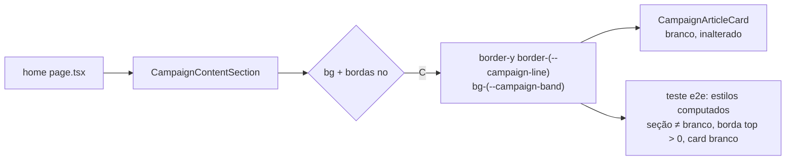

# Impl: Separar visualmente a seção "Acompanhe de perto" da prova social na home

Status: aprovado
Atualizado em: 2026-08-18
Issue: #33
Intenção: docs/plans/separacao-visual-secao-conteudos-home.md
Appetite restante: herdado (~0,5 dia de eng — mudança de uma linha + teste)

## Leitura da intenção

- **Outcome:** a fronteira entre a faixa de prova social (branca) e a seção "Acompanhe de perto" fica visível de imediato, desktop e mobile; cards brancos continuam destacados; nada além da superfície muda.
- **O que NÃO negociar:** nenhum redesenho da seção (cards/carrossel/links/textos); hero e outras seções intactos; nenhuma cor nova; fail-closed inalterado (sem posts visíveis a seção continua sumindo — o teste e2e de contiguidade Prova→Problema não pode quebrar).
- **O que reavaliar:** a intenção recomenda "banda de fundo própria (A)" como meio de separação, mas o rascunho UI aprovado no gate (`separacao-visual-secao-conteudos-home-ui-draft.html`, Cena 1/3 recomendadas) mostra **banda + hairlines juntas** (`border-y border-zinc-300 bg-zinc-100`) — que é a opção C da própria intenção. O wireframe aprovado (`docs/campanha/wireframe-solla-1313.html`, seção 7) também desenha zona de cor própria com `border-top/bottom: 1px solid var(--line)`. O rascunho é o contrato visual do gate: recomendo **C**, não A.

## Abordagem recomendada

**Opções consideradas:**

- **A — banda de fundo própria, sem hairlines** (`bg-(--campaign-band)`): separa, mas a borda entre o branco da prova e a banda cinza é só contraste de tom; o desenho aprovado (wireframe seção 7 + draft Cena 1) inclui hairline.
- **B — hairlines mantendo fundo branco** (draft Cena 2, alternativa): mínimo, fiel ao wireframe no borda mas não na zona de cor; na home toda branca lê menos de longe (é o fallback da própria intenção).
- **C — banda + hairlines juntas** (draft Cena 1/3 recomendadas): o hairline em cima cria a fronteira exata Prova→Conteúdos; o hairline embaixo separa da faixa de prova social e a zona de cor dá o ritmo branco→banda→escuro previsto no wireframe.

**Recomendação:** **C** — é literalmente o que o rascunho aprovado mostra e o que o wireframe seção 7 especifica; A e B são subconjuntos que lêem menos na home branca.
**Rejeitadas:** A e B como solução única (draft as marca como alternativa; a recomendada é banda + hairline). Qualquer redesenho de cards/tipografia/paleta — fora de escopo pelo anti-goal da intenção.

### Componentes / mudanças

- **`CampaignContentSection`** (`src/components/CampaignContentSection.tsx`): trocar a classe do `<section>` de `bg-white` para `border-y border-(--campaign-line) bg-(--campaign-band)`. É a única mudança de runtime. Tokens existentes (`--campaign-band: #ebe9e9`, `--campaign-line: rgb(0 0 0 / 12%)` em `styles.css:179-180`); `border-(--campaign-line)` reusa o padrão já usado em `CampaignArticleCard.tsx:24`.
- **Migration:** nenhuma (superfície pura, sem schema).
- **Access / Consent:** nenhum.
- **UI:** Impeccable B — encaixe de token em componente existente, sem shape novo. Contrastes conferidos sobre `#ebe9e9`: eyebrow `--pt-red` ≈ 4,9:1, copy `--campaign-muted` ≈ 4,5:1, título preto — ok. Cards já são `bg-white` + `border-(--campaign-line)` + `shadow-sm` e saltam na banda. O placeholder de capa (`bg-(--campaign-band)`) funde com a banda quando não há capa — estado de fallback de posts sem imagem (fora do escopo; produção usa capas reais).

### Dados → forma (se aplicável)

- Não aplicável — nenhum dado novo; a leitura da intenção ("Vou apresentar dados? Não") se mantém.

## Fases verificáveis

1. **Tracer** — mudança de classe no `<section>`; `pnpm exec tsc --noEmit` + lint.
2. **UI/teste** — asserções de estilo computado no teste e2e existente da seção (`tests/e2e/frontend.e2e.spec.ts`, describe serial "Campaign home content section"): dentro do teste full-state, após os checks do bento em desktop (1280px), conferir via `getComputedStyle` que (a) `contents` ≠ `rgb(255, 255, 255)` e ≠ `proof` (faixa de prova social), (b) `border-top-width` > 0 e `border-top-color` não transparente, (c) card `a[href^="/artigo/"]` dentro da seção é `rgb(255, 255, 255)` — cards saltam na banda. Sem screenshot diff (o repo não usa regressão visual).
3. **Gates** — `pnpm gate:fast` (ou ao menos tsc + lint + unit), depois `pnpm test:e2e` no describe afetado (serial, DB de teste do worktree), `pnpm build`, `pnpm format:check`, `knip`, `check:cycles`.

## Rabbit holes / Não escopo (engenharia)

- "Aproveita e muda o placeholder de capa para `--campaign-surface`/tom mais escuro para saltar na banda": melhora cosmética fora do aceite, e o placeholder é fallback (capa real vem do media). Deixar como está; registrar como débito se notado no /simplify.
- "Banda só no desktop, hairline no mobile" ou vice-versa: o draft trata mobile e desktop iguais; variantes não pedidas.
- Mexer na classe do card, no carrossel ou em `page.tsx`: explícito fora de escopo.

## Riscos e mitigação

- **Contiguidade Prova→Problema com seção oculta:** o teste existente (`frontend.e2e.spec.ts:524-528`) ainda valida gap ≤ 1px quando a seção some; a mudança não afeta o retorno `null` fail-closed (o `<section>` nem renderiza). Sem risco.
- **`--campaign-band` compartilhado com "Nossa caminhada" e placeholder de capa:** seções não adjacentes (flags fica abaixo do problema escuro); a intenção já mapeou e aceitou o ritmo.
- **Borda dupla no mobile carrossel:** dots/leitura usam `--campaign-muted`/`--pt-red`, visíveis sobre a banda; nada a ajustar.

## Aceite de engenharia

- [x] Aceite de produto da intenção ainda coberto (fronteira visível, nada além muda, fail-closed intacto)
- [x] Invariantes AGENTS/engineering-standards (sem schema/access/LGPD; identifiers em inglês; copy pt-BR intacta)
- [x] Testes previstos: asserções de estilo computado no e2e full-state existente (desktop; o trecho mobile do mesmo teste segue cobrindo o carrossel na banda)
